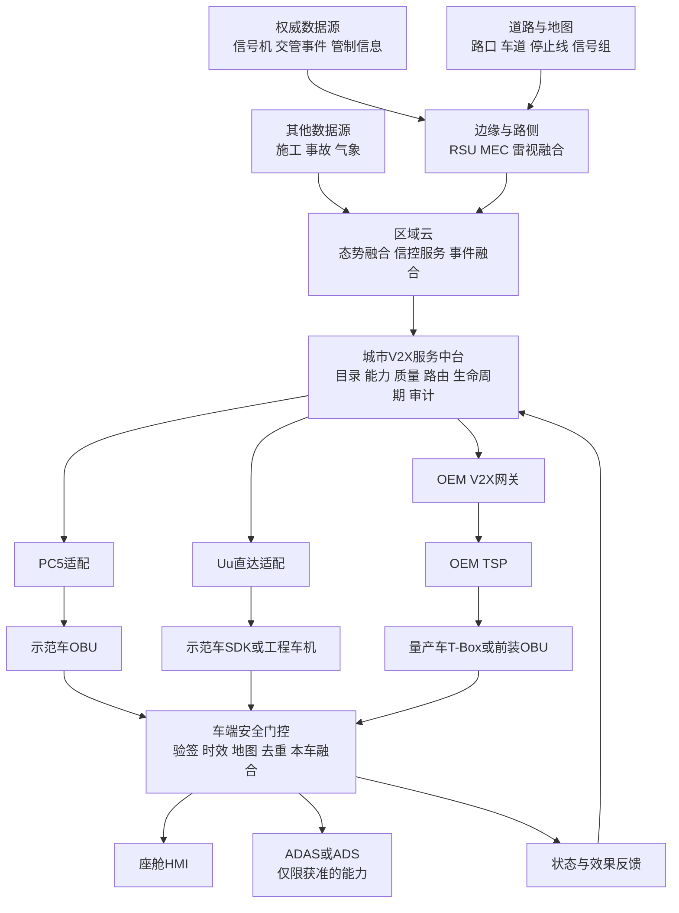
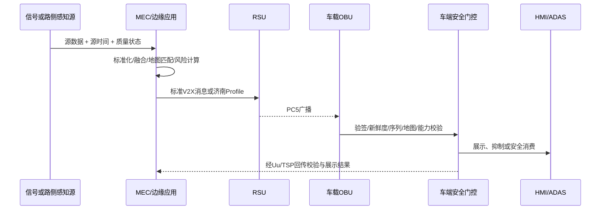
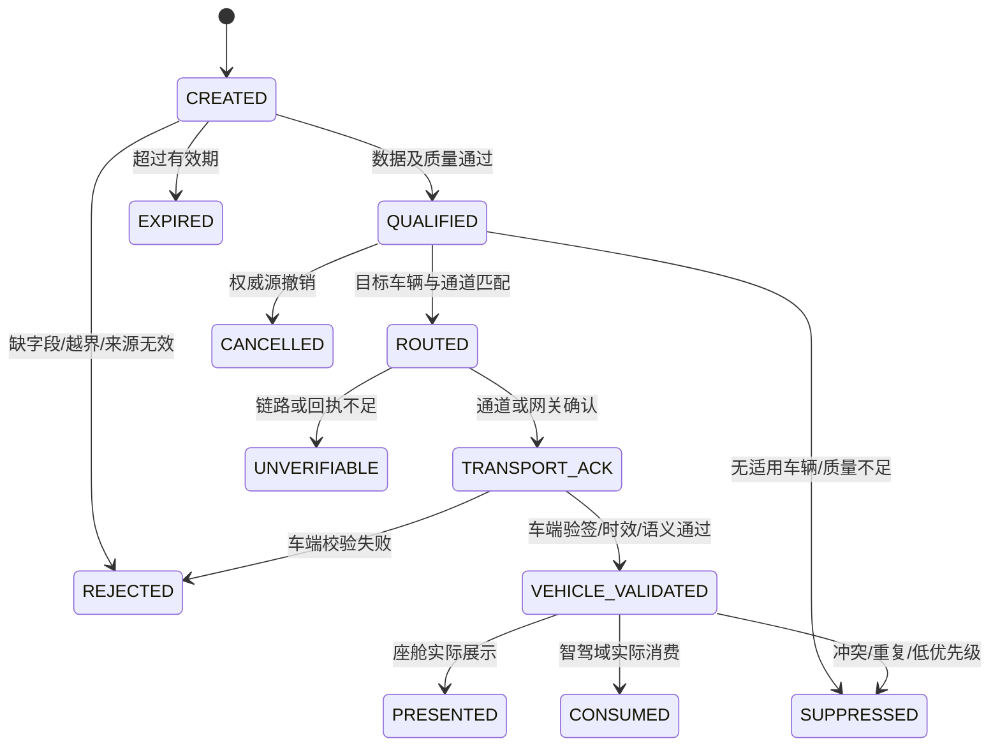

# 济南车路云数据上车总体方案

> 文档版本：V1.0 评审稿  
> 基准日期：2026年9月14日  
> 适用对象：主管部门、交管部门、项目建设运营单位、主机厂、OEM TSP、车端及路侧供应商  
> 方案范围：面向智能网联测试或示范车辆，以及后续量产车型的数据上车、车端消费、反馈与运营闭环  
> 安全边界：一期不包含未经车型安全论证的转向、制动或动力执行器控制

## 0. 先说结论

本项目不应为信号灯、绿波、拥堵、弱势交通参与者和异常停车分别建设孤立的“上车通道”，也不应为示范车和量产车重复建设两套平台。

推荐建设“一套城市级V2X服务底座 + 两类车辆接入Profile + PC5、Uu、OEM TSP多通道路由”：

1. 城市侧统一治理数据源、路口和车道编码、时间与坐标、服务模型、事件ID、版本、质量、有效期、路由、回执和审计。
2. 智能网联测试或示范车采用PC5与Uu双接入，可使用后装OBU和工程车机，目标是尽快形成真实道路数据与测试证据。
3. 量产车以“城市服务平台—OEM V2X网关—OEM TSP—原生T-Box/OBU—座舱或智驾域”为生产主链路；城市平台不直接接入量产车CAN总线，更不绕过OEM控制车辆执行器。
4. 所有场景先按“信息S0—建议S1—预警S2—协同控制输入S3”分级。先完成信息和预警闭环，再以车型级功能安全、SOTIF、网络安全、数据安全、准入及发布评审为门槛推进S3。
5. 验收不能停在“接口通了”“HTTP 200”“MQTT PUBACK”或“消息发出”。最终必须证明：**数据正确 → 路车匹配正确 → 成功送达 → 车端校验通过 → 实际展示或被智驾消费 → 失效及时退出 → 全程可追溯**。

### 0.1 一期建议范围

| 对象 | 一期建议 | 暂不进入一期的内容 |
|---|---|---|
| 示范车 | 六类场景全部完成S0/S1/S2验证；PC5与Uu双链路；支持录制、回放和问题定位 | 城市云直接控制制动、转向或动力 |
| 量产车 | 优先落地信号灯基础服务、GLOSA、一般拥堵、异常停车信息；按车型评审逐步开放闯红灯、队尾和VRU风险预警 | 未完成车型安全论证、DV/PV、准入和发布签字的S3输入 |
| 城市平台 | 建成服务目录、车辆能力画像、质量门禁、多通道路由、回执、审计和运营监控 | 仅建设展示大屏而没有车端闭环 |

### 0.2 推荐优先级

| 优先级 | 场景 | 原因 |
|---|---|---|
| P1 | 信号灯基础服务、上车提示、GLOSA、一般拥堵 | 数据链路较清楚，用户价值直接，适合先验证MAP—SPAT—车辆匹配和HMI闭环 |
| P2 | 闯红灯风险、队尾风险、异常停车 | 安全价值高，但需要车型、道路、网络和阈值联合标定 |
| P3 | 超视距VRU碰撞风险 | 价值高且风险最高，对感知真值、时钟、坐标、端到端时延和误报漏报要求最严 |

---

## 1. 为什么要做：JTBD定义

### 1.1 驾驶人JTBD

当我接近路口、拥堵队尾或视野盲区时，我希望在仍有安全处置时间的前提下，准确理解“前方将发生什么、与我是否相关、我应该采取什么动作”，从而安全、平稳地驾驶，而不是被迟到、重复、方向错误或无法执行的提示干扰。

成功标准：可信、及时、相关、易懂、低打扰、可取消、不可核验时明确退出。

### 1.2 主机厂JTBD

当城市交通数据进入车型产品时，我希望数据来源、性能、责任、失效模式和版本都可验证，并由车端保留最终安全裁决权，从而能够把服务纳入车型研发、发布、OTA、售后和召回体系，而不是引入不可控的外部安全责任。

成功标准：来源可证、接口稳定、性能可测、本车融合与仲裁、可灰度、可回滚、可取证。

### 1.3 城市运营方JTBD

当交管、路侧和云端产生权威数据后，我希望只向适用车辆发送合格服务，并能证明车辆收到、校验、展示、消费或抑制的真实状态，从而持续改善质量，而不是只统计“平台发送量”。

成功标准：服务可配置、目标可匹配、全链路可追溯、异常有责任人、效果可度量。

### 1.4 交管部门JTBD

当信号、事件和管制信息对外发布时，我希望权威性、发布时间、适用范围、撤销机制和审计证据不被第三方平台篡改或误读，从而维持交通管理权威与事故取证能力。

### 1.5 项目建设方JTBD

当接入新OEM、新车型或新场景时，我希望复用统一服务目录、车辆能力画像、消息信封和测试包，从而降低重复开发、联调和运维成本。

---

## 2. 建设范围与明确边界

### 2.1 本方案包含

- 交管信号、路侧感知、道路事件、地图、网络和必要车辆状态的接入与治理。
- 数据标准化、时空融合、质量判定、服务生成、目标匹配、多通道分发、回执和审计。
- 智能网联测试或示范车辆的PC5、Uu及工程终端接入。
- 量产车型的OEM TSP、T-Box、前装OBU、原生座舱和智驾域接入。
- 信号灯基础服务、信号灯上车提示、GLOSA、闯红灯风险、前方拥堵或队尾、超视距VRU碰撞风险、异常停车或异常车辆。
- 车端HMI、城市运营平台、异常降级、联合测试和量产发布门禁。

### 2.2 本方案不默认包含

- 城市平台直接控制量产车辆转向、制动或动力执行器。
- 以手机App作为碰撞类安全预警的唯一链路。
- 在未完成MAP—SPAT绑定、时间质量和车型能力核验时输出伪精确倒计时或车道级建议。
- 将既有项目文档、设备安装、平台截图或接口连通等同于现网能力和生产验收。
- 将全量原始CAN、原始视频、点云或连续实名轨迹无差别上传至城市平台。

### 2.3 四级服务安全分层

| 等级 | 定位 | 典型场景 | 允许输出 | 必须通过的门禁 |
|---|---|---|---|---|
| S0 信息 | 环境事实或弱实时信息 | 普通信号状态、一般拥堵 | 卡片、导航图层、轻语音 | 来源、方向、时效和空间范围合格 |
| S1 建议 | 效率或舒适建议 | GLOSA、绕行、车道建议 | 速度区间、平稳减速、绕行建议 | 不违反限速和交通规则，建议稳定且可达 |
| S2 预警 | 安全相关风险提示 | 闯红灯、队尾、VRU、异常停车 | 醒目视觉、声音或触觉 | 风险模型、误报漏报、低时延、取消和降级通过 |
| S3 协同控制输入 | 进入ADAS或ADS决策链 | C-AEB、C-ACC等 | 结构化增强感知或决策输入 | 车型级功能安全、SOTIF、网络安全、准入和发布签字 |

---

## 3. 标准、政策与工程基线

### 3.1 采用原则

1. 强制性国家标准和现行法律法规优先。
2. 其次采用现行推荐性国家标准、行业标准。
3. 再以T/CSAE团体标准和“济南项目Profile”补齐工程细节。
4. 标准名称一致不代表系统可直接互通。项目仍须冻结版本、字段可选性、单位、枚举、坐标、时间、道路编码、扩展字段、错误码、安全机制和兼容周期。
5. 标准状态以2026年9月14日为基准；在项目招采、合同或SOP冻结时须再次核对实施状态。

### 3.2 重点依据及对方案的影响

| 主题 | 主要依据 | 对本项目的直接影响 | 基准日状态 |
|---|---|---|---|
| 国家试点 | 工信部等五部门车路云一体化试点通知、工作问答及试点名单 [S1][S2][S3] | 按车、路、云、网、图、安统筹；支持中心云、区域云、边缘云分级；济南纳入首批试点 | 现行政策 |
| 应用集 | GB/T 44286.1—2024、GB/T 44286.2—2024 [S6][S7] | 场景名称、参与方、触发和交互尽量与合作式ITS应用集对齐 | 现行 |
| 交管接口 | GB/T 46998—2025、GA/T 1743—2020 [S5][S12] | 冻结交管侧信号、管控和车路协同信息接口；明确权威源与发布状态 | GB/T 46998—2025已于2026年7月1日实施 |
| 路侧设备 | GB/T 44417—2024、YD/T 3755—2024 [S8][S10] | RSU/路侧协同设备能力、直连通信和测试要求 | 现行 |
| 车载终端 | GB/T 45315—2025、YD/T 3756—2024 [S9][S11] | OBU、LTE-V2X直连车载交互能力及试验要求 | 现行 |
| 消息与云 | T/CSAE 53、157、295系列及车路云指南 [S4] | MAP、SPAT、RSI、RSM、SSM及车云、路云服务采用统一项目Profile | 团体标准和工程基线 |
| 身份安全 | GB/T 45112—2024 [S13] | PC5证书、签名、轮换、吊销和生命周期 | 现行 |
| 整车安全 | GB 44495—2024、GB 44496—2024、GB 44497—2024 [S14] | 量产阶段纳入整车网络安全、软件升级和自动驾驶数据记录 | 2026年1月已实施 |
| 近期量产要求 | GB/T 47325—2026、GB 47955—2026、GB 44721—2026 [S17][S18][S19] | 提前纳入OTA、组合驾驶辅助及L3/L4设计和验证，但按各自实施日期管理 | 已发布，部分尚未实施 |
| 汽车数据 | 汽车数据安全管理若干规定、GB/T 44464—2024 [S15][S16] | 最小必要、车内处理、脱敏、重要数据和用户权益 | 现行 |
| 测绘地理信息 | 智能网联汽车测绘地理信息安全相关通知 [S20] | 道路拓扑、坐标、影像、点云和高精地图处理须明确资质与责任主体 | 现行要求 |

> 注意：上述标准用于总体架构和立项基线。正式ICD必须形成“标准条款—项目字段—系统模块—测试用例”追踪矩阵，不能只在文档中列名称。

---

## 4. 总体方案架构

### 4.1 分层架构



### 4.2 中心云、区域云、边缘云职责

| 层级 | 建议职责 | 不应承担 |
|---|---|---|
| 边缘云或MEC | 路口/路段目标跟踪、局部地图匹配、低时延融合、局部风险计算、失联后的有限降级服务 | 长周期全市数据治理、跨域运营规则 |
| 区域云 | 区域交通态势、信号服务、事件融合、路车匹配、服务编排、区域SLA | 直接绕过OEM控制量产车 |
| 中心云 | 数据目录、服务目录、跨区域订阅、模型与规则治理、长期运营分析、安全监测 | 替代边缘实时能力或把所有原始感知数据集中上传 |

### 4.3 城市V2X服务中台必须具备

- 合作方、OEM、供应商和租户管理。
- 车辆能力画像与车型—场景—能力矩阵。
- 服务目录、版本、覆盖范围、安全等级和最低能力要求。
- 数据源目录、权威级、质量规则、隔离和恢复。
- 路口、道路、车道、停止线、信号组和地图版本管理。
- 地理围栏、路线走廊和目标车辆匹配。
- PC5、Uu、OEM TSP多通道路由、主备策略和双通道去重。
- 消息生命周期、回执、事件修订、撤销、过期和审计。
- 证书、密钥、配额、限流、灰度、回滚和远程配置。
- 服务质量、事件链路、车辆反馈、异常工单和效果分析。

---

## 5. 两类车辆的接入方案

### 5.1 方案对比

| 项目 | 智能网联测试或示范车 | 后续量产车 |
|---|---|---|
| 目标 | 快速形成真实数据、算法和链路证据 | 形成可SOP、可运维、可OTA、可追责的产品能力 |
| 主链路 | RSU—PC5—OBU与城市云—Uu双接入 | 城市云—OEM V2X网关—TSP—T-Box为主；前装OBU车型增加PC5 |
| 终端 | 后装OBU、工程车机、独立测试屏 | 定型T-Box或OBU、HSM、安全网关、原生座舱或智驾域 |
| HMI | 工程界面，可显示诊断字段并录屏 | 原生仪表、HUD、中控、导航、语音；满足车型一致性与驾驶分心要求 |
| 身份 | 测试租户、白名单、工程证书 | 生产身份、工厂注入、证书轮换和吊销 |
| 发布 | 场景版本和工程软件快速迭代 | 需求定版、定点、DV/PV、生产一致性、准入、OTA、售后、召回 |
| 安全边界 | 先S0/S1/S2，验证PC5与Uu性能 | S0/S1可优先量产，S2按车型准出，S3单独立项 |
| 主要验收 | 数据、地图、覆盖、时延、去重、降级 | 车型适配、HMI、证书、OTA、准入、运营和召回闭环 |

### 5.2 PC5直连链路



适用：VRU、路口碰撞、近场异常停车、SPAT/MAP等高时效局部场景。  
约束：必须具备OBU、RSU覆盖、地图一致、时钟质量和证书互认；PC5广播本身不能证明车辆已展示。

### 5.3 Uu直达示范车链路

城市V2X服务中台通过蜂窝网络向测试车SDK或工程车机推送服务。适用于信号、GLOSA、一般拥堵、广域道路事件等，部署快、易灰度，但须承认公网时延和覆盖不确定性。

推荐流程：

1. 车辆注册能力与测试租户。
2. 车辆按当前位置、路线走廊和服务类型订阅。
3. 平台完成目标匹配和质量门禁后，通过MQTT、WebSocket或受控HTTP回调推送。
4. 车端验签、判时效、地图匹配和去重。
5. 车端回传接收、校验、展示、抑制、消费和错误原因。

### 5.4 OEM TSP量产链路

```mermaid
sequenceDiagram
    participant CITY as 城市V2X服务中台
    participant GW as OEM V2X网关
    participant TSP as OEM TSP
    participant BOX as T-Box/前装OBU
    participant AGENT as 车端服务代理
    participant HMI as 座舱/ADAS
    CITY->>GW: 服务目录、能力协商、订阅与事件
    GW->>GW: OEM安全、车型和版本策略
    GW->>TSP: 车型适配后的消息
    TSP->>BOX: 生产通道下发
    BOX->>AGENT: 车内安全网关转发
    AGENT->>AGENT: 验签/时效/地图/去重/本车融合
    AGENT->>HMI: 展示或获准的算法输入
    HMI-->>AGENT: 展示/消费/用户动作
    AGENT-->>CITY: 分层回执与reasonCode
```

量产原则：

- 城市平台对接OEM的V2X网关或TSP，不直接逐车连接车辆控制总线。
- OEM负责车型适配、车内网关、HMI、ADAS/ADS仲裁、生产证书、软件发布、售后和召回。
- 城市和OEM共同维护服务Profile、SLA、版本兼容、故障联系人和事故取证机制。
- 前装PC5车型可增加近场链路，但PC5和Uu必须共用`eventId + revision`，车端只能展示一次。

### 5.5 通道路由决策

| 通道 | 适用 | 优势 | 主要约束 | 方案定位 |
|---|---|---|---|---|
| PC5 | VRU、路口碰撞、近场异常停车、SPAT/MAP | 本地广播、低时延、弱运营商依赖 | OBU/RSU覆盖、地图与证书一致 | 安全敏感近场主链 |
| Uu直达车端 | 信号、GLOSA、拥堵、广域事件 | 覆盖广、服务易升级 | 公网抖动、弱覆盖、后台保活 | 示范车广域主链 |
| OEM TSP | 原生导航、仪表、HUD、批量车型 | 进入OEM产品和运维体系 | 多一跳、OEM接口与发布周期不同 | 量产首选边界 |
| 手机或投屏 | 存量车、演示、一般提醒 | 上线快、改造低 | 定位、保活、HMI和安全域能力有限 | 过渡或辅助通道 |

---

## 6. 数据如何流转：端到端业务闭环

### 6.1 八步主链路

1. **源数据产生**：信号控制机、交管事件源、路侧感知和地图系统产生带`sourceTime`、`sourceId`和状态质量的数据。
2. **协议适配**：适配信号机、RSU、感知和事件系统的厂商协议。
3. **标准化与质量门禁**：统一单位、枚举、坐标、时间、道路和车道编码；拒绝缺字段、越界、矛盾和过期数据。
4. **边缘或云端融合**：目标跟踪、去重、路车匹配、队尾或冲突计算；尽量在边缘侧消减视频、点云和连续轨迹。
5. **服务生成**：形成环境事实、建议或风险，附空间范围、质量、置信度、有效期和建议动作。
6. **能力匹配与路由**：根据车型、软件、地图、通道、HMI和安全等级选择目标车辆和消息粒度。
7. **车端安全门控**：验签、判时效、地图匹配、去重、本车传感器融合和HMI/ADAS仲裁。
8. **反馈与运营**：回传收到、校验、展示、抑制、消费、过期、错误和用户动作，形成质量与效果闭环。

### 6.2 正常与异常状态



| 状态 | 能证明 | 不能证明 |
|---|---|---|
| `TRANSPORT_ACK` | 消息到达传输对端或中间网关 | 车端通过校验、驾驶人看到 |
| `VEHICLE_VALIDATED` | 车端通过验签、时效和基本语义校验 | 已展示或已进入智驾算法 |
| `PRESENTED` | 座舱实际触发展示或语音 | 驾驶人一定采取了动作 |
| `CONSUMED` | 智驾域已接收并纳入本地决策流程 | 执行器已经动作 |
| `SUPPRESSED` | 因重复、低质量、能力或优先级被抑制 | 不能简单算作发送失败 |
| `UNVERIFIABLE` | 当前证据不足以确认最终状态 | 不允许伪装为成功 |

### 6.3 双通道冲突规则

- PC5与Uu/TSP使用相同的`eventId`、`revision`和服务语义。
- 车端先按事件ID去重，再比较权威源、新鲜度、版本和质量。
- 同一事件修订只接受更高`revision`；撤销消息必须能终止旧事件。
- 安全消息过期后禁止重放；断网恢复只能补传日志、回执和允许补传的非实时数据。
- 无法确定哪条消息可信时，降级或抑制，不做静默猜测。

---

## 7. 项目前置条件

| 前置项 | 必须满足 | 项目证据 |
|---|---|---|
| 权威数据源 | 明确灯态、相位、配时、故障、管制、事故、施工等每类数据的权威源与发布责任人 | 来源清单、授权文件、责任签字 |
| 路口数字模型 | 建立路口、进口道、车道、连接关系、停止线和信号组的MAP—SPAT关联 | 路口对账表、地图版本、抽检报告 |
| 时间与定位 | 统一UTC、时间质量和误差口径；明确道路级与车道级定位适用范围 | NTP/PTP基线、定位质量报告 |
| 基础设施 | 实测5G、PC5、RSU、MEC覆盖、容量、盲区和故障切换 | 分路线P50/P95/P99报告、覆盖图 |
| 平台能力 | 服务目录、能力管理、质量门禁、路由、回执、审计和运行监控可用 | 环境、账号、接口、配置和日志 |
| 地图与测绘 | 空间坐标、影像、点云和道路拓扑处理满足资质及安全要求 | 资质、流程和审查材料 |
| 数据与安全 | 完成分类分级、个人信息、重要数据、证书和密钥方案 | 数据目录、风险评估、证书Profile |
| 联合测试 | 提供沙箱、仿真、错误注入、回放、样车、场地和开放道路条件 | DVP&R、样本、真值设备、准出标准 |

门禁规则：任一场景缺少权威数据、道路/车道映射、时间质量、车型能力或合法授权时，系统必须返回“无法核验”或“服务暂不可用”及原因，不得用缓存、固定默认值或预测值伪装实时数据。

依赖变更规则：交管、信号机、RSU、MEC、地图、运营商和OEM等第三方材料或环境须按联合基线提供。延期、字段变化、版本不兼容或权限不足，应形成影响评估和变更单，由对应责任方确认范围、工期和验收影响。

---

## 8. 车企必须提供什么

### 8.1 OEM输入清单

| 类别 | OEM必须提供 | 双方共同形成的交付物 |
|---|---|---|
| 产品边界 | 车型、年款、配置、SOP、投放区域、ODD、每个场景是信息/建议/预警/智驾输入 | 车型—场景—能力矩阵 |
| 硬件资源 | T-Box、OBU、PC5/Uu、eSIM/APN、GNSS/IMU、HSM、天线、算力、存储、网关 | BOM基线和资源预算 |
| 车端软件 | BSP、协议栈、安全栈、地图匹配、融合、HMI、诊断、OTA和回滚 | SDK/服务代理方案和版本兼容矩阵 |
| 车辆信号 | Vehicle API或DBC语义、单位、枚举、刷新率、有效位、超时和质量位 | 标准车辆状态映射表 |
| TSP接口 | 鉴权、环境、限流、路由、订阅、回执、容量、监控、错误码、联系人 | ICD、沙箱、联调账号和SLA |
| HMI规则 | 仪表、HUD、导航、中控、语音、触觉能力；优先级、冲突和驾驶分心约束 | 场景HMI规范和抑制规则 |
| 身份安全 | VIN与设备映射责任、密钥注入、证书申请/轮换/吊销、异常终端处置 | 跨域信任和证书生命周期方案 |
| 地图定位 | 地图供应商、版本、车道级能力、定位精度和质量字段 | 编码映射和版本对账机制 |
| 测试发布 | 样车、台架、SIL/HIL、场地、司机、缺陷、OTA窗口、发布和回滚签字人 | DVP&R、准出和发布签字表 |
| 运营售后 | 7×24联系人、投诉、事故取证、漏洞修复、召回和服务退役 | 运行手册、应急预案和联合复盘机制 |

### 8.2 最小开工包

以下五项未齐，不建议进入实车开发：

1. 目标车型、年款、软件版本和首批道路范围。
2. 车型—场景—能力矩阵。
3. OEM TSP或车端SDK沙箱及鉴权材料。
4. 车辆标准语义信号表，不要求直接提供全量原始DBC。
5. HMI优先级、抑制、退出和测试责任人。

### 8.3 联合对接六阶段

| 阶段 | 关键工作 | 准出物 |
|---|---|---|
| 1. 需求与责任冻结 | 场景等级、车型范围、数据权属、HMI、最终安全责任 | 需求基线、RACI、范围清单 |
| 2. Profile与ICD冻结 | 标准版本、字段、单位、坐标、时间、道路编码、证书、错误码 | 项目Profile、ICD、JSON样例、兼容规则 |
| 3. 云云联调 | 城市平台与OEM TSP完成能力、订阅、事件、回执和异常测试 | 联调报告、问题清单、性能基线 |
| 4. 工程车联调 | HMI、端到端时间线、双通道去重、断链和版本回滚 | 实车日志、录屏、回放包 |
| 5. 分级测试 | 仿真、SIL/HIL、封闭场地、开放道路 | DVP&R、真值对比、门禁签字 |
| 6. 量产发布 | DV/PV、生产一致性、证书注入、OTA、售后和召回 | SOP发布包、运行与应急机制 |

---

## 9. 接口与数据模型

### 9.1 接口分为管理面和数据面

管理面：

- 合作方注册：租户、回调地址、证书、配额、权限。
- 车辆能力注册：车型、年款、软件、通道、消息集、地图、HMI、最大频率。
- 服务目录查询：服务编码、版本、覆盖、安全等级、最低能力、状态。
- 订阅管理：位置、路线走廊、行政区、服务类型和有效期。
- 证书管理：申请、注入、轮换、吊销、CRL和异常终端。
- 配置与软件报告：频控、优先级、灰度、降级、回滚、安装结果。

数据面：

- PC5：标准消息集及冻结后的济南Profile。
- 城市云—OEM TSP：建议采用mTLS + OAuth 2.0或双方认可的等效机制，支持事件推送、批量回执、限流和重放保护。
- 示范车Uu：MQTT、WebSocket或受控HTTP长连接，具体由终端和网络环境决定。
- 日志与审计：通过独立非实时通道批量上传，不与安全实时消息争用资源。

### 9.2 统一下行消息信封

以下是项目Profile示例，不等同于国家标准原文：

```json
{
  "schemaVersion": "1.0",
  "serviceCode": "V2X.VRU.COLLISION_WARNING",
  "messageId": "msg-uuid",
  "eventId": "event-stable-id",
  "revision": 3,
  "eventStatus": "ACTIVE",
  "source": {
    "sourceOrg": "authorized-org",
    "sourceDevice": "rsu-or-platform-id",
    "observedOrPredicted": "OBSERVED"
  },
  "time": {
    "sourceTime": "2026-09-14T08:30:00.120Z",
    "generatedTime": "2026-09-14T08:30:00.168Z",
    "expiresAt": "2026-09-14T08:30:00.668Z",
    "timeQuality": "SYNCED"
  },
  "spatial": {
    "intersectionId": "JN-INT-0001",
    "roadId": "JN-RD-0001",
    "laneId": "JN-LN-0003",
    "direction": "NORTHBOUND",
    "mapVersion": "jn-map-2026.09"
  },
  "quality": {
    "priority": "P0",
    "severity": "HIGH",
    "confidence": 0.93,
    "qualityFlags": ["POSITION_VALID", "TIME_VALID"]
  },
  "payload": {},
  "recommendation": {
    "action": "DECELERATE_AND_OBSERVE"
  },
  "security": {
    "certificateRef": "cert-ref",
    "signature": "detached-or-envelope-signature",
    "traceId": "trace-id"
  }
}
```

### 9.3 车端回执示例

```json
{
  "eventId": "event-stable-id",
  "revision": 3,
  "vehiclePseudonym": "rotating-service-id",
  "state": "PRESENTED",
  "eventTime": "2026-09-14T08:30:00.410Z",
  "channel": "PC5",
  "softwareVersion": "vehicle-service-agent-2.4.0",
  "mapVersion": "oem-map-2026Q3",
  "reasonCode": "OK",
  "traceId": "trace-id"
}
```

### 9.4 车辆最小上行数据

- 可轮换的车辆或终端服务标识、车型能力、软件和地图版本。
- 源时间、位置、定位质量、速度、航向、加速度，以及场景确需的制动、转向灯、挡位等标准语义状态。
- 当前道路、车道、路线走廊或行驶方向，按场景最小化采集。
- PC5/Uu网络质量、时钟同步和车端服务健康状态。
- 接收、校验、展示、抑制、消费、过期、用户动作和错误原因。

隐私原则：VIN与终端实名映射原则上保留在OEM侧；城市平台使用可轮换服务标识。OEM网关将原始车身信号转换为经审批的标准语义字段，城市平台不直接索取全量CAN或DBC。

### 9.5 版本与兼容策略

- `schemaVersion`采用主版本和次版本；破坏兼容时升级主版本。
- 城市平台和OEM均维护“当前版本 + 至少一个兼容旧版本”的窗口，具体周期在SLA中冻结。
- 可选字段必须声明默认行为；安全关键字段缺失时拒绝，不做隐式默认。
- 枚举只能追加不能复用；未知枚举按“不支持/不可核验”处理。
- 事件更新通过`eventId + revision`，撤销必须明确`eventStatus=CANCELLED`。

---

## 10. 六类重点场景方案

### 10.1 场景总览

| 场景 | 安全等级建议 | 首选链路 | 车端主要呈现 | 一期重点证据 |
|---|---|---|---|---|
| 信号灯基础服务及上车提示 | S0 | PC5或Uu/TSP | 自车方向灯态、距离、时间区间 | MAP—SPAT绑定、方向和时效 |
| 绿波车速引导GLOSA | S1 | Uu/TSP，PC5增强 | 合法可达速度区间或平稳减速 | 建议合法、稳定、可达、不诱导抢灯 |
| 闯红灯风险预警RLVW | S2 | PC5优先，Uu备份 | 高优先级减速停车提示 | 触发/取消、误报漏报、停车距离影响 |
| 前方拥堵或队尾预警 | S0或S2 | Uu/TSP；近场PC5增强 | 导航拥堵信息或提前减速预警 | 队尾位置、路线相关、一般信息和风险分层 |
| 超视距VRU碰撞风险 | S2 | MEC+PC5优先，Uu备份 | 方向性视觉 + 声音/触觉 | 感知真值、冲突预测、端到端时延、幽灵目标 |
| 异常停车或异常车辆 | S1或S2 | PC5/Uu/TSP | 车道、距离、减速或观察建议 | 正常排队区分、车道准确、撤销和多源去重 |

### 10.2 信号灯基础服务与上车提示

**需要先拆清四个概念：**

1. 信号基础数据服务：MAP + SPAT + 质量 + 有效期。
2. 信号灯上车提示：车端如何消费基础服务并展示与自车相关的灯态。
3. GLOSA：基于信号窗口、限速、距离和排队生成速度建议。
4. 闯红灯风险：结合自车状态预测是否可能在红灯窗口越过停止线。

这四者共用同一数据源和路口模型，但服务逻辑、HMI和验收口径不同。

| 项目 | 方案 |
|---|---|
| 核心输入 | 路口拓扑、进口道、车道连接、停止线、信号组、当前灯态、最早/最晚结束时间、控制模式、时间质量、自车位置/方向/车道 |
| 触发 | 车辆进入服务地理围栏，且能唯一匹配进口道、车道、方向和信号组；数据未过期 |
| 下行 | 目标路口/信号组、灯态、距停止线、时间区间、控制模式、置信度、有效期、地图版本 |
| HMI | 仪表或HUD只显示自车方向灯态和距离；仅在时间质量满足时显示倒计时；自适应信号显示区间或不显示时间 |
| 退出 | SPAT过期、闪光/故障、MAP版本不一致、车道无法匹配时停止倒计时和GLOSA，并显示服务暂不可用 |
| 验收 | 灯态/相位一致、MAP—SPAT绑定、路车匹配、时间误差、过期抑制、错误方向零展示 |

### 10.3 绿波车速引导GLOSA

| 项目 | 方案 |
|---|---|
| JTBD | 驾驶人希望用合法、平稳的速度通过目标路口，或提前知道当前周期无解 |
| 核心输入 | MAP、SPAT、自车位置/速度/方向、道路限速、目标信号组、排队长度及消散预测、可选路线走廊 |
| 计算 | 同时满足道路限速、舒适加减速度、信号窗口、剩余距离和排队消散；区分实测时间与预测时间 |
| 下行 | 建议速度下限/上限、适用距离、目标信号组、计算时间、有效期、预测质量和无解原因 |
| HMI | 显示速度区间和一个主动作；无合法可达区间时提示平稳减速或等待下一周期 |
| 退出 | 信号时间不确定、排队预测质量不足、自车偏离路线、建议超限或不舒适时取消 |
| 零容忍 | 不得给出超限速度，不得诱导加速抢灯，不得在数据过期后继续显示 |

### 10.4 闯红灯风险预警RLVW

| 项目 | 方案 |
|---|---|
| JTBD | 当车辆可能在红灯窗口越过停止线时，提前给出明确且可行动的停车提示 |
| 核心输入 | 停止线、信号灯态及变化窗口、自车位置/速度/加速度/制动、道路附着和车型制动能力安全抽象 |
| 触发 | 预计越线时刻与红灯或即将转红窗口重叠，且达到联合标定风险阈值和质量门槛 |
| 下行 | 风险等级、目标停止线、灯态窗口、建议动作、有效期、计算置信度 |
| HMI | P0视觉+声音；主动作“减速停车”；与本车FCW/AEB等更高风险告警仲裁 |
| 退出 | 有效制动、车辆停车、灯态变化、安全越线、数据过期或匹配失败时立即取消 |
| 验收 | 触发和取消时机、误报漏报、数据延迟对停车距离影响、多告警冲突 |

### 10.5 前方拥堵与队尾预警

一般拥堵信息解决效率问题，队尾碰撞风险解决安全问题，两者不能用同一优先级和验收指标。

| 项目 | 方案 |
|---|---|
| 核心输入 | 车道级流量、平均速度、队尾位置、拥堵长度/趋势、事故/施工、自车路线/位置/速度/车道 |
| 触发 | 自车路线将进入拥堵影响区；队尾风险另需结合相对位置、速度和可见性达到标定阈值 |
| 下行 | 影响道路/车道、队尾位置、距离、拥堵等级、平均速度、趋势、建议动作、TTL |
| HMI | 一般拥堵进入导航或P2卡片；队尾风险升级为P0/P1声音和醒目视觉，主动作“提前减速” |
| 退出 | 改道、离开影响区、队尾消散、事件撤销或过期时清除 |
| 验收 | 队尾位置误差、路线相关、重复抑制、事件演化、道路级数据不得伪装为车道级 |

### 10.6 超视距弱势交通参与者碰撞风险

| 项目 | 方案 |
|---|---|
| JTBD | 在遮挡或超出车载传感器视距时，让相关方向车辆提前注意行人或非机动车冲突 |
| 核心输入 | RSM/SSM结构化目标、MAP、目标位置/速度/航向/轨迹、自车轨迹、遮挡关系、冲突点、感知质量 |
| 触发 | 自车与目标预测轨迹存在时空冲突，并达到项目标定的TTC、距离和置信度门槛 |
| 下行 | 匿名目标ID/类型、位置运动、预测轨迹、冲突方向、风险等级、置信度、TTL |
| HMI | 只向相关车道和方向车辆告警；方向性图形+声音或触觉；低置信度仅提示“注意盲区” |
| 退出 | 目标消失、轨迹不再冲突、车辆离开范围、感知质量下降或消息过期时立即取消 |
| 安全边界 | 进入制动链前必须由本车传感器确认并通过OEM安全仲裁；城市数据不能单独触发量产车制动 |
| 验收 | 目标识别/跟踪、坐标与时钟、轨迹预测、端到端时延、误报漏报、遮挡场景、幽灵目标抑制 |

### 10.7 异常停车与异常车辆预警

| 项目 | 方案 |
|---|---|
| 场景范围 | 故障停车、事故停车、异常低速、逆行、急刹等；必须与正常排队、合法临停区分 |
| 核心输入 | 路侧目标轨迹、车辆BSM或状态、停车位置/持续时间、车道占用、双闪或故障抽象、事故/施工事件 |
| 触发 | 目标在非预期位置达到标定的停留或异常运动条件，并影响自车路线 |
| 下行 | 位置、道路/车道、方向、异常类型、持续时间、距离、来源、置信度、建议动作 |
| HMI | 显示异常车辆车道和距离，给出减速、注意观察或安全变道建议，不直接命令变道 |
| 退出 | 目标恢复、权威源撤销、车辆离开路线或数据过期时取消；多源冲突时降级为“注意前方” |
| 验收 | 正常排队区分、车道准确、事件撤销、假目标、多源去重、来源追溯 |

### 10.8 场景阈值原则

TTC、距离、停车持续时间、告警提前量、置信度、抑制窗口和HMI强度均不是可直接照搬的行业通用常数。必须由城市、交管、数据源单位、OEM和测试机构结合道路、车型、ODD、网络和HMI联合标定，并在DVP&R中留下数据、样本和签字证据。

---

## 11. 车端如何展示和交互

### 11.1 HMI优先级

| 优先级 | 场景 | 展示 | 交互原则 |
|---|---|---|---|
| P0紧急预警 | VRU冲突、队尾碰撞、闯红灯风险 | HUD或仪表醒目视觉 + 声音/触觉 | 驾驶中无需操作；风险解除立即取消；避免同一事件重复轰炸 |
| P1驾驶建议 | 异常停车、道路危险、GLOSA | 简短卡片、仪表/导航，可配语音 | 一屏一个主动作；建议必须合法、可达、可退出 |
| P2环境信息 | 普通信号状态、一般拥堵 | 轻量卡片或导航图层 | 弱打扰、自动消失、不遮挡本车高优先级告警 |

### 11.2 展示规则

- 实时值、预测值和未知值必须区分。
- 自适应信号不能输出伪精确倒计时。
- 服务不可用、地图不匹配、网络降级和数据过期不能静默；应停止展示或给出简洁状态。
- 同一事件经PC5和Uu到达只展示一次。
- 车端必须能说明“为什么未展示”：重复、方向不符、地图不符、低置信度、过期、证书失败或更高优先级告警占用。
- 平台保留完整概率和证据，驾驶人界面只展示可行动信息，不堆叠算法参数。

### 11.3 车端最小页面状态

每个场景至少具备：

1. 正常服务状态。
2. 预警或建议状态。
3. 数据过期状态。
4. 地图或方向无法匹配状态。
5. 网络降级状态。
6. 服务被更高优先级抑制状态。
7. 风险解除或事件撤销状态。

---

## 12. 城市运营平台如何展示

| 页面 | 必须展示 | 主要操作 | 异常出口 |
|---|---|---|---|
| 服务全景 | 道路、路口、RSU、MEC、5G覆盖、在线车辆、服务状态 | 按区域/OEM/车型/场景过滤 | 进入故障链路和工单 |
| 服务目录 | 服务版本、覆盖、能力门槛、安全等级、启停和灰度 | 发布、暂停、回滚、查看影响车辆 | 版本不兼容时阻止发布 |
| 数据质量 | 灯态、地图、感知、时钟、新鲜度、完整性、冲突 | 隔离来源、降级服务、生成工单 | 无法核验时停止安全输出 |
| 车辆接入 | OEM、车型、证书、软件、地图、订阅和限流 | 审核能力、轮换/吊销证书、调整配额 | 不支持的车型拒绝订阅 |
| 事件追踪 | 源设备、MEC、城市云、TSP、车辆的全时间线和状态 | 查看证据、回执、原因码和版本 | 定位到责任节点并派单 |
| 异常处置 | 断链、过期、验签失败、地图不一致、误报漏报 | 暂停、隔离、回滚、升级、关闭 | 记录审批人和恢复证据 |
| 运营分析 | 合格率、有效送达率、展示率、消费率、抑制率、SLA和效果 | 日/周/月报、OEM和道路对比 | 技术指标与效果指标分开 |

事件详情最小字段：`sourceTime`、`generatedTime`、各节点接收时间、`expiresAt`、`sourceId`、`eventId`、`revision`、道路/车道/方向、通道、车型和软件版本、最终状态、`reasonCode`、证据与工单。

---

## 13. 安全、数据与责任边界

### 13.1 网络和身份安全

- PC5采用C-V2X证书、消息签名、轮换和吊销；Uu/TSP采用双向认证、应用授权、时间戳或nonce和防重放。
- 量产密钥保存在HSM或安全元件，完成工厂注入、EOL检测和生命周期审计。
- 所有安全类消息在车端执行验签、新鲜度、序列、地图和能力校验。
- 验签失败或时钟异常时丢弃安全消息并记录诊断。
- 系统过载时优先VRU、队尾和闯红灯等安全场景，再保障异常停车、拥堵和GLOSA。

### 13.2 数据与地理信息

- 按最小必要、车内处理、默认不收集和精度适用原则设计；车辆轨迹涉及敏感个人信息时落实告知、同意/合法性基础、退出、保存和删除。
- 原始视频、点云和连续轨迹尽量在RSU/MEC侧处理，只向上提供匿名化结构化目标或事件。
- 重要数据依法境内存储并开展风险评估。
- 城市平台、OEM、地图和设备供应商签署数据处理责任矩阵。
- 道路拓扑、坐标、影像、点云及地图更新须确认测绘活动和地理信息安全责任，由具备相应资质的主体承担。

### 13.3 关键异常与降级

| 异常 | 车端或平台动作 |
|---|---|
| SPAT过期、矛盾、闪光或故障 | 停止倒计时和GLOSA；显示服务暂不可用；不跨相位外推 |
| MAP与车载地图版本不一致 | 禁用车道级引导，可降级为道路级一般信息 |
| PC5中断 | Uu仍新鲜时切换并去重，否则依赖本车感知并退出云服务 |
| Uu中断 | 保留PC5和本地ADAS，不重放过期云消息 |
| 双通道冲突 | 按权威、新鲜度、版本和质量选择；无法判断时降级或抑制 |
| VRU低置信度 | 仅提示注意盲区，不输出精确TTC或制动建议 |
| 验签失败或时钟漂移 | 丢弃安全消息，记录诊断，触发证书或时钟告警 |
| 城市云不可用 | MEC维持获准的有限服务；TSP和车辆明确显示降级，不静默失效 |

### 13.4 建议RACI

| 事项 | A最终负责 | R执行 | C协商 | I知会 |
|---|---|---|---|---|
| 信号及交通事件权威性 | 交管部门 | 城市运营方/授权源 | 信号与路侧供应商 | OEM |
| 服务生成与城市平台运行 | 城市运营方 | 项目建设运营团队 | 交管、数据源、OEM | 主管部门 |
| PC5覆盖与维护 | 城市运营方 | 路侧/通信供应商 | 交管、建设方 | OEM |
| OEM TSP与量产车型接入 | OEM | TSP和车端团队 | 城市运营方 | 交管部门 |
| 车端HMI和安全仲裁 | OEM | 车型项目和车端团队 | 城市运营方 | 交管部门 |
| 证书跨域和异常终端 | 双方约定的信任运营主体 | 城市与OEM安全团队 | 设备/通信供应商 | 主管部门 |
| 数据合规和用户权益 | 实际数据处理主体 | 城市与OEM合规团队 | 供应商和法律顾问 | 主管部门 |
| 联合测试与准出 | 阶段评审委员会 | 联合测试负责人 | 城市、交管、OEM、供应商 | 项目管理方 |
| 事故取证与复盘 | 法定主管及责任主体 | 城市与OEM联合响应团队 | 网络、数据源、设备方 | 项目管理方 |

> RACI只是项目建议。涉及法定个人信息处理者、重要数据、测绘活动、交通控制权和事故责任时，必须结合实际数据流、合同和法定职责重新确认。

---

## 14. 测试、验收和运行指标

### 14.1 指标必须分层

| 层级 | 关键指标 |
|---|---|
| 数据源 | 准确、完整、新鲜、连续、故障状态、来源可追溯 |
| 时空一致 | UTC同步、坐标、路口/车道编码、MAP—SPAT绑定、地图版本 |
| 通信 | P50/P95/P99时延、抖动、丢包、乱序、重复、主备切换、覆盖 |
| 场景功能 | 触发、误报、漏报、迟报、风险等级、建议合法、取消及时 |
| 车端HMI | 实际展示、抑制、优先级、多告警冲突、驾驶分心、服务退出 |
| 智驾消费 | 输入有效性、本车确认、仲裁、安全降级、数据记录 |
| 安全合规 | 证书、防重放、渗透、数据最小化、保存删除、OTA灰度回滚 |
| 运营恢复 | 监控、告警、工单、责任人、恢复时间、复盘、召回或退役 |

### 14.2 核心计算口径

- 合格消息数：通过城市侧完整性、时效、空间、来源和质量门禁并进入车型路由的消息数。
- 有效送达率 = `VEHICLE_VALIDATED / 合格消息数`。
- 实际展示率 = `PRESENTED / VEHICLE_VALIDATED`。
- 规则抑制率 = `SUPPRESSED / VEHICLE_VALIDATED`，并按原因码拆分。
- 车端展示时延 = `presentedTime - sourceTime`，统计P50、P95和P99。
- 智驾消费率只对获准进入智驾域的车型和场景计算。
- 通行效率、冲突风险下降和驾驶负荷属于效果指标，必须与技术正确性和安全准出分开，不能互相替代。

每项性能结论必须同时记录道路/路口、车型和软件、网络制式与信号质量、时间段、车速和系统负载、样本量、真值设备及异常剔除规则。

### 14.3 分级测试门禁

| 门禁 | 测试内容 | 准出条件 |
|---|---|---|
| G0 文档与责任 | 场景、数据、Profile、RACI、合规和安全边界 | 各责任方签字，无未分配关键责任 |
| G1 数据源与仿真 | 重放、边界值、缺失、过期、冲突和错误注入 | 质量规则和所有异常出口可复现 |
| G2 云云与SIL/HIL | 城市云、TSP、车端代理、证书、负载、去重和回执 | 状态闭环，性能达到阶段目标 |
| G3 封闭场地 | 真实车辆、信号、遮挡、VRU、停车、拥堵和断链 | 误报漏报、时延、HMI和降级通过 |
| G4 开放道路示范 | 限定ODD/路线连续运行、运维和事件响应 | 稳定性与安全评审签字，无未关闭严重缺陷 |
| G5 量产发布 | DV/PV、生产一致性、OTA、售后、召回和安全档案 | OEM车型发布委员会及相关责任方准出 |

### 14.4 零容忍项

以下任一发生，对应门禁直接判定不通过：

- 过期安全消息仍在车端展示或消费。
- 信号灯方向、进口道、车道或信号组匹配错误。
- GLOSA给出超过法定或道路限速的速度。
- 同一P0事件因PC5和Uu重复告警。
- 验签失败数据进入HMI或智驾域。
- 城市云绕过OEM安全机制直接控制量产车执行器。
- 发布前仍存在未关闭的严重或高危网络安全漏洞，且无有权责任人批准的例外和残余风险记录。

---

## 15. 分阶段建设路线

| 阶段 | 主要工作 | 退出条件 |
|---|---|---|
| P0 标准与数据基线 | 冻结六类场景、数据权属、质量规则、车辆能力、ICD、Profile、地图编码、沙箱和回放数据 | 无交管授权、地图映射或OEM能力表，不进入实车开发 |
| P1 示范车MVP | PC5+Uu完成信号、GLOSA、拥堵、VRU、异常停车和闯红灯S0/S1/S2闭环 | 仿真、场地和道路证据齐全；不介入执行器控制 |
| P2 OEM工程车原生接入 | 建设OEM网关，实现能力注册、订阅、原生HMI、回执、证书、灰度和OTA | 工程车端到端和异常测试通过 |
| P3 量产SOP | 前装硬件、HSM、工厂注入、功能安全、SOTIF、网数安全、DV/PV、生产一致性和准入 | OEM及相关责任方签字准出 |
| P4 规模运营 | 多OEM、多车型、多运营商、跨区身份、SLA、事件响应、漏洞修复、结算和退役 | 形成持续运营和审计机制 |

扩展规则：上一阶段的数据质量、覆盖、降级、安全和责任边界未签字，不扩车、不扩场景。工期、车辆数、路口数和SLA应在完成济南现状基线后估算，不在总体方案中虚构固定数字。

---

## 16. 当前风险与待核验项

| 风险 | 当前需要核验 | 未核验前的处理 |
|---|---|---|
| 信号真实性 | 信号机品牌、上游协议、相位编码、自适应控制、时间精度和故障状态 | 只做离线联调，不承诺倒计时和GLOSA |
| 道路数字化 | 路口、车道、停止线、信号组编码及车载地图差异 | 建立版本对账；不一致时降级 |
| 网络与覆盖 | PC5/Uu沿线P50/P95/P99、盲区、负载和切换 | 不以“有5G/已装RSU”代替性能证据 |
| OEM能力 | 目标车型、年款、TSP、HMI、PC5和OTA能力 | 先完成车型—场景—能力矩阵 |
| 城市—OEM接口 | 尚无一套强制适用于所有OEM的开放接口 | 冻结济南Profile、版本和兼容策略 |
| 数据与测绘 | 轨迹、影像、点云、地图和事故数据跨主体 | 完成数据处理和测绘责任矩阵 |
| 告警误用 | 普通灯态被称为预警，低置信目标被输出为精确风险 | 分开事实、算法、HMI等级和质量门禁 |
| 验收口径 | ACK被错误当成业务成功 | 分离校验、展示、消费、抑制和异常状态 |
| 量产责任 | 城市数据直接进入控制扩大安全和召回责任 | 一期只做信息/建议/预警；S3单独车型立项 |

### 16.1 济南现状必须补做的基线调查

1. 路口和信号机清单：品牌、型号、版本、上游协议、控制模式、状态时间精度。
2. RSU/MEC清单：位置、版本、消息集、证书、安全能力、覆盖和故障率。
3. 地图清单：路口、车道、停止线、信号组编码和更新责任。
4. 城市平台清单：现有数据源、接口、消息队列、时钟、审计、运行环境和SLA。
5. 网络清单：运营商、APN、5G/4G、PC5覆盖、沿线性能和盲区。
6. 车型清单：OEM、车型、年款、软件、TSP、T-Box、OBU、HMI、地图和OTA能力。
7. 数据与合规清单：权威源、授权、个人信息、重要数据、测绘、保存和删除。

在完成上述调查前，本方案中的架构和流程可以评审，但不能声称现网已经具备量产服务能力。

---

## 17. 本轮评审需要确定的十个决策

- [ ] 一期是否明确只做S0/S1/S2，不进入量产车辆执行器控制。
- [ ] 目标OEM、车型、年款、软件版本、SOP和首批道路是否明确。
- [ ] 信号、交通事件、地图和路侧感知的权威源及负责人是否签字。
- [ ] PC5、Uu和OEM TSP的主备关系及故障责任是否明确。
- [ ] 是否同意“一个服务底座、一个服务目录、一个事件ID体系、两类车辆Profile”。
- [ ] 是否同意拆分信号基础服务、上车提示、GLOSA和闯红灯风险。
- [ ] 风险阈值、HMI、有效期和退出是否由城市、OEM和测试机构联合标定。
- [ ] 是否按ACK、车端校验、实际展示、智驾消费、抑制和异常分状态验收。
- [ ] 用户权益、数据最小化、保存删除、重要数据和测绘责任是否闭环。
- [ ] 仿真、SIL/HIL、封闭场地、开放道路和量产发布是否设置独立门禁与签字人。

---

## 18. 后续应形成的工程交付物

总体方案确认后，建议依次产出：

1. 《济南V2X服务目录与安全分级表》。
2. 《城市平台—OEM TSP—车端接口控制文件ICD》及OpenAPI/AsyncAPI定义。
3. 《六类场景逐字段数据字典》及正确、错误、过期、撤销JSON样例。
4. 《路口MAP—SPAT—车载地图编码映射规范》。
5. 《车型—场景—能力矩阵》和OEM接入申请表。
6. 《车端HMI与多告警优先级规范》。
7. 《端到端DVP&R与准出门禁》。
8. 《证书、密钥、跨域信任与异常终端处置方案》。
9. 《数据分类分级、用户权益与测绘责任矩阵》。
10. 《运行监控、事件响应、事故取证、OTA回滚和服务退役手册》。

---

## 附录A 车辆能力画像建议字段

| 字段组 | 建议内容 |
|---|---|
| 身份与版本 | `partnerId`、`vehiclePseudonym`、model、modelYear、trim、softwareVersion、mapVersion |
| 通信 | PC5、Uu、OEM TSP、eSIM/APN、频段、最大频率、网络质量字段 |
| 消息 | 消息集版本、MAP/SPAT/RSI/RSM/SSM、扩展Profile |
| 定位 | GNSS/IMU、精度等级、车道级匹配、时间同步、质量位 |
| HMI | 仪表、HUD、中控、导航、语音、触觉、P0/P1/P2支持 |
| 智驾 | 自动化等级、可接收信息/建议/预警/S3输入、ODD、本车融合和仲裁 |
| 安全 | HSM、证书域、加密套件、轮换、安全启动、日志和数据记录 |
| 运维 | OTA、灰度、回滚、诊断、远程配置、售后和召回 |

## 附录B 场景最小字段集

| 服务 | 最小字段 |
|---|---|
| 信号基础 | MAP路口/车道连接、SPAT信号组/灯态/时间范围/控制模式、质量、有效期 |
| GLOSA | 目标信号组、速度上下限、适用距离、限速、排队依据、预测质量、TTL |
| 闯红灯风险 | 停止线、风险等级、越线预测窗口、建议动作、数据质量、TTL |
| 拥堵队尾 | 道路/车道、队尾位置/距离、长度、平均速度、趋势、等级、TTL |
| VRU风险 | 匿名目标ID、类型、位置/速度/航向、轨迹、冲突点/方向、风险、置信度、TTL |
| 异常停车 | 位置、道路/车道、方向、异常类型、持续时间、来源、置信度、建议、TTL |
| 统一回执 | `eventId`、`revision`、received/validated/presented/consumed/suppressed/expired、reasonCode、time |

## 附录C 主要依据与来源

- [S1 工信部等五部门《关于开展智能网联汽车“车路云一体化”应用试点工作的通知》](https://www.miit.gov.cn/zwgk/zcwj/wjfb/tz/art/2024/art_b236a25edf9f4a8f9b60dbcda924753b.html)
- [S2 工业和信息化部《智能网联汽车“车路云一体化”应用试点工作问答》](https://www.miit.gov.cn/zwgk/zcjd/art/2024/art_71c4a67da373403cbd0cf853a6ad10b2.html)
- [S3 首批试点城市名单](https://www.gov.cn/zhengce/zhengceku/202407/P020240801513847464337.pdf)
- [S4 《车路云一体化系统建设与应用指南》](https://mgr-api.china-icv.cn/profile/upload/2025/02/27/9b7e5d8e-a815-4b72-bcd6-0ed6e7cf68e9.pdf)
- [S5 GB/T 46998—2025 道路交通管理车路协同系统信息交互接口规范](https://std.samr.gov.cn/gb/search/gbDetailed?id=473EBB99D791455EE06397BE0A0ABB9A)
- [S6 GB/T 44286.1—2024 合作式智能运输系统应用集 第1部分](https://std.samr.gov.cn/gb/search/gbDetailed?id=nFojQwfWTWA%3D&mode=p)
- [S7 GB/T 44286.2—2024 合作式智能运输系统应用集 第2部分：车辆协同驾驶应用集](https://std.samr.gov.cn/gb/search/gbDetailed?id=208E903AB72979F3E06397BE0A0AB2B9)
- [S8 GB/T 44417—2024 车路协同系统智能路侧协同控制设备技术要求和测试方法](https://std.samr.gov.cn/gb/search/gbDetailed?id=208E903AB66A79F3E06397BE0A0AB2B9)
- [S9 GB/T 45315—2025 基于LTE-V2X直连通信的车载信息交互系统技术要求及试验方法](https://std.samr.gov.cn/gb/search/gbDetailed?id=2FF37940EB79D753E06397BE0A0A413F)
- [S10 YD/T 3755—2024 支持直连通信的路侧设备技术要求](https://std.samr.gov.cn/hb/search/stdHBDetailed?id=17C0C9DC10B4F07FE06397BE0A0AB070)
- [S11 YD/T 3756—2024 支持直连通信的车载终端设备技术要求](https://std.samr.gov.cn/hb/search/stdHBDetailed?id=17C0C9DC10B5F07FE06397BE0A0AB070)
- [S12 GA/T 1743—2020 道路交通信号控制机信息发布接口规范](https://std.samr.gov.cn/hb/search/stdHBDetailed?id=B62CEA48F6BF3753E05397BE0A0A1046)
- [S13 GB/T 45112—2024 LTE-V2X安全证书管理系统技术要求](https://std.samr.gov.cn/gb/search/gbDetailed?id=2AD0270638E8091BE06397BE0A0A2D62)
- [S14 工业和信息化部：三项智能网联汽车强制性国家标准正式发布](https://www.miit.gov.cn/xwdt/gxdt/sjdt/art/2024/art_9fa0f052fe7d4a4683e366eb1afff952.html)
- [S15 《汽车数据安全管理若干规定（试行）》](https://www.cac.gov.cn/2021-08/20/c_1631049984897667.htm)
- [S16 GB/T 44464—2024 汽车数据通用要求](https://std.samr.gov.cn/gb/search/gbDetailed?id=208E903AB5FB79F3E06397BE0A0AB2B9)
- [S17 GB/T 47325—2026 车联网在线升级安全技术要求与测试方法](https://std.samr.gov.cn/gb/search/gbDetailed?id=4E64ADE730CA8554E06397BE0A0AB633)
- [S18 工业和信息化部：GB 47955—2026 组合驾驶辅助系统安全要求](https://www.miit.gov.cn/jgsj/zbys/qcgy/art/2026/art_7bcb480b0db5432f8542157a9fc12841.html)
- [S19 工业和信息化部：GB 44721—2026 自动驾驶系统安全要求](https://www.miit.gov.cn/xwfb/gxdt/sjdt/art/2026/art_16d1319a933d4ffd8501e60dc4d88491.html)
- [S20 智能网联汽车测绘地理信息安全管理相关通知](https://one.sipac.gov.cn/frzrk/ndaservplat/Apps/psp/index.php?s=%2FHome%2FPolicySearch%2Fpolicydetail%2Fid%2F29c004c7c9bbe7aae31a7c16afde157c%2Fquery_value1%2F%E6%94%BF%E7%AD%96%E5%9B%BE%E8%A7%A3%2Forderway%2Fi%2Fi%2F3)
