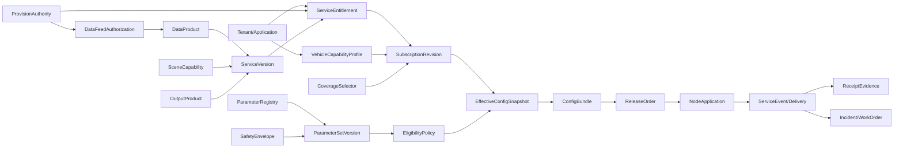

# 济南车路云数据上车服务平台端对比评估与功能深化方案

> 文档版本：V0.2 评审稿  
> 基准日期：2026-09-15  
> 文档定位：在《平台端整体规划设计方案 V0.1》基础上的对比评估、产品决策收敛与功能结构深化稿  
> 对比对象：[Claude Artifact《数据上车服务平台·订阅与配置规划设计》V2.3](https://claude.ai/artifact/HoZ9Vup28fN3TDCsfVFLuh)  
> 本轮边界：平台端整体规划、服务应用订阅、参数与策略配置、变更发布、运行证据和运营闭环；不进入像素级UI、移动端或代码实现  
> 评审提醒：本文中的数量、周期、阈值、抽样率、容量和保留期若未注明正式依据，均不得直接成为合同、SLA或验收值。

---

## 0. 结论先行

### 0.1 总体结论

按“能否作为平台总体规划和后续PRD基线”评价，而不是按篇幅或功能点数量评价：

- Claude V2.3：**83.0/100**。优势是产品经理流程完整、功能颗粒细、OEM旅程和追溯意识强；主要扣分来自部分设计初值被过早固化、状态族混用、量产车位置数据模式风险及若干架构结论过度绝对化。
- 原 V0.1：**88.5/100**。优势是标准适用边界、城市/OEM责任、三级订阅、分离状态机、运行证据与安全退出更稳；主要不足是需求池、故事地图、参数注册、仿真评估和逐功能追溯仍不够深。
- 本 V0.2：目标是形成**约94分的融合基线**。不是把两份文档简单拼接，而是保留V0.1的治理底座，吸收Claude V2.3的产品化表达，再修正其高风险假设。

### 0.2 这次吸收、修正和暂缓什么

| 处置 | 内容 | 结论 |
|---|---|---|
| 直接吸收 | OEM端到端旅程、需求池、故事地图、外部数据提供门、订阅调试器、需求—功能—页面—验收追溯 | 进入V0.2结构 |
| 深化吸收 | 参数策略、配置传播、核心功能规格、运营埋点 | 改造成可分权、可版本化、可验证的领域模型后进入 |
| 必须修正 | 单一订阅状态、路口唯一订阅单元、全域原子回滚、质量变化永不触发变更单、固定等保三级、固定百分比/周期/容量 | 不按原表述进入基线 |
| 高风险研究 | 区域云接收量产车实时位置并直接计算预警的Mode B | 仅列Build-P2研究项；需独立合法性、安全、架构和车型准出论证 |
| 暂缓建设 | 计费套餐、价格、对账开票 | Build-P0仅预留计量和权益对象；运营及授权模式确定后再产品化 |

### 0.3 产品经理流程顺序

本稿严格按下列顺序推进，未完成前一门禁，不用页面数量替代产品决策：

```text
证据与问题定义
  → 用户/JTBD与旅程
  → 需求池与优先级
  → 产品定位、边界与关键决策
  → 领域对象与独立状态机
  → 用户故事地图与版本切片
  → 功能结构与业务规则
  → 页面信息架构与交互闭环
  → 指标、验收、路线图与开放问题
```

---

## 1. 阶段一：证据、问题与评估口径

### 1.1 已核验证据

| 证据 | 当前可确认内容 | 使用边界 |
|---|---|---|
| Claude V2.3 Artifact | 文档标识V2X-PSC-01，版本V2.3，包含30章、17个子系统、63个模块、254个功能点的自述，以及OEM旅程、需求池、故事地图、订阅/配置/算法/页面/验收设计 | 本轮读取并评价其文本内容；“254个功能点”不等于254个无重复、可验收需求；未把Artifact作为法规或标准依据 |
| 本项目V0.1 | 已覆盖政策标准、JTBD、服务契约、三层订阅、配置与发布、P01—P26页面、接口、证据、安全、路线图和验收 | 作为总体规划底座，不视为已完成用户访谈、ICD冻结或量产联合验证 |
| [五部门试点通知](https://www.miit.gov.cn/zwgk/zcwj/wjfb/tz/art/2024/art_b236a25edf9f4a8f9b60dbcda924753b.html) | 试点期2024—2026年，要求城市级平台、统一架构/标准、业务互通、安全可靠、测试评价与安全保障 | 说明建设方向，不直接给出每项接口字段、延时、频率或SLA |
| [GB/T 46998-2025](https://openstd.samr.gov.cn/bzgk/std/newGbInfo?hcno=8AC19B84E9030BC51753C4674AF07ED1&refer=outter) | 《道路交通管理车路协同系统信息交互接口规范》已于2026-07-01实施，规范交通控制和信息服务平台与V2X应用服务平台间信息交互 | 是平台互联依据之一，不替代济南Project Profile、ICD、Schema、原因码和兼容矩阵 |
| [汽车数据安全管理若干规定（试行）](https://www.cac.gov.cn/2021-08/20/c_1631049984897667.htm) | 车辆行踪轨迹属于敏感个人信息；汽车数据处理涵盖收集、存储、使用、加工、传输、提供和公开 | “无VIN”“随机会话”“不落盘”不能自动等同于匿名化或免除处理义务 |
| [公共数据资源授权运营实施规范（试行）](https://zfxxgk.ndrc.gov.cn/web/iteminfo.jsp?id=20474) | 要求授权方案/协议明确数据范围、产品服务、期限、安全、评价、退出和各方权利义务；产品和服务价格按国家有关价格政策执行 | 平台记录并执行已签认的法律/管理决定，不代替实施机构、数据持有单位或合规负责人判断合法性 |
| [车路云一体化系统建设与应用指南](https://mgr-api.china-icv.cn/profile/upload/2025/02/27/9b7e5d8e-a815-4b72-bcd6-0ed6e7cf68e9.pdf) | 给出三级云、典型场景、性能类别和安全建设参考 | 应结合场景类别、测量点和项目Profile采用；指南不能替代正式定级、ICD或项目实测 |

### 1.2 仍需补证的事实

- 🔵 待确认：济南本项目的数据运营主体、公共数据授权对象、对OEM提供服务的法律关系及可收费边界。
- 🔵 待确认：首批OEM、车型、服务、道路范围、通道和车端最高可提供回执等级。
- 🔵 待确认：交管、信控、路侧感知、地图、云平台现有接口及数据质量现状。
- 🔵 待确认：网络安全等级保护的实际定级、重要数据识别结论、个人信息保护影响评估范围。
- 🔵 待确认：GB/T 46998-2025、T/CSAE等标准在济南Project Profile中采用的具体版本、子集和扩展。
- 🔵 待确认：控制、区域、边缘云的现网部署、责任主体、时间同步、证书和运维能力。

### 1.3 评分方法

评分判断“问题—对象—规则—状态—责任—异常—证据—验收”是否闭环。功能点数量、页数和图表数量不单独得分。每个维度按其权重折算为总分。

| 维度 | 权重 | Claude V2.3 | 原V0.1 | 主要判断 |
|---|---:|---:|---:|---|
| 问题、JTBD与产品流程 | 10 | 9.2 | 8.4 | Claude有九阶段OEM旅程、需求池、MoSCoW和故事地图；V0.1有JTBD与Outcome，但需求证据和故事地图待展开 |
| 政策标准准确性及适用边界 | 12 | 9.0 | 10.8 | Claude的外部提供门和ICD冻结较强，但固定等保等级和若干参考初值越界；V0.1严格区分规范、项目设计和实测冻结值 |
| 产品定位、范围与责任边界 | 10 | 8.5 | 9.4 | V0.1对HMI、ADAS/ADS、OTA、VIN以及测试车/量产车边界更完整 |
| 领域对象与状态一致性 | 12 | 8.4 | 11.2 | Claude将申请、测试、发布、运行和PURGED混入一条订阅状态；V0.1已分离多个状态族 |
| 订阅与配置产品完整度 | 15 | 14.0 | 13.1 | Claude的订阅调试器、算法参数和功能规格更深；V0.1的三层订阅、上下游分离和继承更稳 |
| 量产车工程可行性 | 12 | 9.1 | 10.9 | V0.1默认由OEM域内逐车匹配；Claude Mode B仍需独立论证位置数据、车型安全与规模化责任 |
| 功能结构、IA与需求追溯 | 11 | 10.3 | 8.5 | Claude在逐功能规则和追溯上领先；V0.1有页面字段/动作/状态/出口，但功能级追溯不足 |
| 安全、隐私与运行治理 | 8 | 6.3 | 7.4 | Claude的固定等保三级、Mode B规则冲突和全域回滚会扩大风险；V0.1默认拒绝与精确停服更稳 |
| 指标、验收与证据闭环 | 6 | 5.2 | 5.4 | Claude埋点更细；V0.1的R0—R6、无法核验和安全退出指标更通用 |
| 优先级、依赖与实施真实性 | 4 | 3.0 | 3.4 | Claude依赖顺序清楚但固定周期/数量/容量偏早；V0.1采用门禁退出条件但需求级依赖仍需深化 |
| **总分** | **100** | **83.0** | **88.5** | 两者互补，融合后才能兼顾可实施细度与量产安全边界 |

### 1.4 关键对比判断

| 主题 | Claude V2.3 | 原V0.1 | V0.2裁决 |
|---|---|---|---|
| 产品经理过程 | 完整、顺序清楚 | 总体方案完整，但旅程和故事地图偏轻 | 采用Claude顺序，保留V0.1门禁思维 |
| 外部数据提供权 | R-00作为开通硬门槛 | 上下游授权分离 | 合并为ProvisionAuthority＋DataFeedAuthorization＋ServiceEntitlement三对象 |
| 订阅最小单元 | 服务×路口×能力×环境；事件按网格 | 区域/道路/走廊/路口/方向/车道/围栏 | 统一改为类型化CoverageSelector，按服务声明允许类型 |
| 场景定义 | 场景主要是资格条件 | 服务、数据产品、接口分离 | 再拆Service、SceneCapability、EligibilityPolicy、OutputProduct，不作单一定义 |
| 订阅状态 | 一条长状态链 | 申请、实例、会话分开 | 保留独立状态族，PURGED归数据生命周期 |
| 参数配置 | D/W/P三类，较细 | 十个配置域和六层继承 | 建Parameter Registry＋Safety Envelope＋Policy＋Effective Snapshot |
| 质量变化 | 自动重算资格，不生成变更单 | 质量门禁与配置变更分开 | 瞬时质量自动裁决；持久政策/阈值/契约变化必须版本化变更 |
| 多区域发布 | 倾向全有或全无 | 支持节点状态和精确停服 | 原子性作用域可配：节点/区域/批次/全局；全局仅在一致性必需时采用 |
| 缩容/撤销 | 尽量避开高峰 | 精确停服 | 授权撤销和安全停服立即执行；普通缩容进入维护窗 |
| 量产车位置 | Mode B由平台计算预警 | 默认不上传城市逐车实时位置 | Mode A为默认；Mode B仅P2独立安全与合规试验 |
| 等保等级 | 固定三级 | 待正式定级 | 不预设；设计可预留高等级控制能力，验收以正式定级为准 |
| 北极星指标 | 周有效展示路口会话 | 有效车端服务达成率＋安全退出 | 保留通用达成率；展示路口会话作为SPAT子指标 |
| 计费 | 套餐与计费进入规划 | 运营准备 | P0只做计量、权益和对账证据，定价待授权与运营模式确认 |

### 1.5 P0必须纠正项

1. **不得把指南的三级及以上能力目标写成项目已完成正式定级。** 可按高等级安全能力预建设，但应记录正式定级对象、结果、依据、边界和测评状态；未完成正式程序时显示“待确认”。
2. **拆分状态机。** 申请批准、沙箱通过、生产发布、节点生效、服务健康和日志删除是不同事实，不能用一个`subscription.status`承载。
3. **重构空间范围。** 路口、路段、走廊、车道、移动事件和围栏都要成为一等类型；不把事件服务强制展开成路口列表。
4. **Mode B降级为研究项。** 精确位置与短时会话仍可能可关联；必须独立Endpoint、Schema、安全域、授权、影响评估、最短TTL、禁止持久化验证和车辆功能准出。
5. **分离普通回执和车辆状态入口。** 基线回执拒收VIN/轨迹/精确位置；获批Mode B使用完全独立的状态入口，不能共享一个“既拒绝位置又依赖位置”的契约。
6. **撤销固定工程数值。** 1%抽样、5分钟传播、10个工作日、固定覆盖率/准确率/容量等进入“待验证参数台账”，只有来源、测量边界、测试证据、责任人和签认齐全后才能固化。
7. **取消默认全域原子回滚。** 原子性必须与服务语义和风险半径匹配；跨区一致性用兼容窗口、双版本和精确停服解决。
8. **修正质量变更规则。** 数据实时波动不发变更单；质量规则、权威源、门槛或契约被持久修改时必须走Change Request。
9. **取消“SPAT始终不低于2Hz”等通用硬编码。** 指南中的频率/时延值须按应用类别解释，并在ServiceDeliveryProfile中分开定义源更新、平台输出、网络送达和车端消费的测量点与统计口径。
10. **取消“安全预警只能在边缘云”等绝对部署结论。** 通过ComputePlacementProfile按数据位置、端到端时延预算、覆盖、容灾、安全等级和实测能力决定；低时延安全服务通常边缘优先，区域云不满足预算时必须抑制或降级。
11. **平台不自动作出合法性判断。** ProvisionAuthority保存实施机构、运营机构、数据持有单位及合规负责人的已签认决定，规则引擎只执行该决定。
12. **“公平提供”不等于给所有OEM相同原始数据。** 应表述为在同等授权、用途、能力和服务条件下非歧视性提供，并按最小必要原则裁剪字段、精度和证据。

---

## 2. 阶段二：用户、JTBD与端到端旅程

### 2.1 核心Job

> 当城市需要把交通数据能力规模化提供给多家OEM和不同车辆产品时，城市服务运营方希望用一套可证明合法来源、可验证车型能力、可执行订阅契约和可回滚配置，把正确的数据在正确时空交付给正确的消费方；OEM希望用稳定、兼容、可测试的城市服务完成车型集成，同时保留对车端HMI、算法和发布的最终控制，并能共同证明实际交付结果。

### 2.2 角色与需求层次

| 角色 | 功能性Job | 情绪/社会性Job | 主要失败风险 |
|---|---|---|---|
| 城市服务产品经理 | 定义可复用、可运营的服务产品 | 能向主管部门解释价值和边界 | 把数据流当服务，无法准确定价、运营或退役 |
| 数据授权/合规负责人 | 证明每项输入和外部提供都有合法范围 | 不为技术默认承担未授权责任 | 授权对象、目的、范围或期限不匹配 |
| OEM产品/接入负责人 | 快速判断某车型是否值得且能够接入 | 不被反复变化的城市接口拖累 | 标准、Schema、地图或语义不兼容 |
| OEM网络安全/车型安全负责人 | 确保城市能力不绕过OEM安全和发布流程 | 能证明没有把城市提示变成远程车辆控制 | 位置数据、证书、OTA、HMI或ADS责任越界 |
| 配置策略运营员 | 让正确策略只在获批对象上生效 | 敢改、能解释、可撤回 | 参数来源不清、范围过大、无回滚 |
| 审批/发布管理员 | 基于差异、风险和证据作决定 | 不被“同意按钮”替代专业判断 | 自审自发、部分生效被显示为成功 |
| 运行值班/SRE | 快速定位无数据、迟到、重复、漂移与降级 | 能在事故窗口内找到责任对象 | 监控只有“接口200”，无业务证据 |
| 审计/监管人员 | 还原某次交付实际用了什么 | 可区分事实、推断和无法核验 | 日志被覆盖，网关ACK被当作上车成功 |

### 2.3 OEM端到端旅程

| 阶段 | OEM要完成的进展 | 平台关键触点 | 通过条件 | 异常出口 |
|---|---|---|---|---|
| J1 发现 | 找到适合车型和城市的服务 | 服务目录、服务对比、覆盖地图 | 理解价值、边界、能力和成本口径 | 不可申请时展示原因与恢复条件 |
| J2 评估 | 判断数据、质量、版本和车型可行性 | 服务详情、依赖图、兼容矩阵 | 依赖源可用且能力差距明确 | 建立差距项，不允许口头跳过 |
| J3 建立主体 | 注册OEM、应用、环境、联系人 | 租户、协议、应用与环境 | 主体、用途和责任链可审计 | 协议/资质不足退回补件 |
| J4 声明能力 | 提交车型、软件、地图、通信、HMI、反馈能力 | VehicleCapabilityProfile | OEM确认版本，平台完成兼容预检 | 缺失能力转整改/降级服务 |
| J5 获得权益 | 确认允许使用哪些服务、范围和期限 | Entitlement | 来源授权和外部提供条件均满足 | 授权不明时默认拒绝 |
| J6 组合订阅 | 选择服务、场景、车型、范围、通道、反馈 | 订阅向导、CoverageSelector | 生成可读契约和机器策略快照 | 冲突项定位到规则、责任人和下一动作 |
| J7 验证 | 完成Schema、语义、异常、容量和回执测试 | 沙箱、回放、符合性测试 | DVP&R规定的准出用例通过 | 失败转缺陷并保留复测入口 |
| J8 审批发布 | 确认差异、风险、灰度和回滚 | 变更、审批、发布拓扑 | 签名包在获批作用域生效且无未处置漂移 | 自动暂停、精确回滚或工单 |
| J9 运行证明 | 看见投递、车端校验/展示/消费与抑制 | 运行全景、链路追踪、订阅调试器 | 达到契约要求的最高证据等级 | 明确“无法核验”，不推断成功 |
| J10 变更退出 | 续期、扩缩容、迁移、暂停、撤销和退役 | Revision、影响分析、退出清单 | 新旧版本有序切换，权限收口、证据留存 | 紧急撤权立即停发；普通迁移可恢复 |

### 2.4 关键问题陈述

- 城市运营方缺少一套把“数据来源权—服务产品—消费权益—车型能力—运行策略—交付证据”串成单一事实链的平台，因此无法安全规模化服务多家OEM。
- OEM缺少一个可在申请前判断覆盖、兼容、质量、接口、反馈和准出成本的入口，因此接入高度依赖线下协调和反复联调。
- 配置人员缺少参数来源、安全包络、有效值解析、影响仿真和可控发布，因此“参数可编辑”并不等于“生产可治理”。
- 运行人员缺少跨数据源、策略、节点、OEM网关和车端回执的证据链，因此“消息已发”经常被错误解释为“服务已上车并生效”。

---

## 3. 阶段三：需求池、优先级与产品决策

### 3.1 优先级方法

本阶段不因首批OEM样本少而使用带虚假精度的RICE。采用四步法：

1. 硬门槛：法律授权、安全退出、责任边界和可审计性；
2. 依赖顺序：先对象/版本/状态，再工作流，再运行数据；
3. JTBD价值：是否缩短接入、降低错误开通、提高可证明达成；
4. 交付风险：跨部门依赖、数据成熟度、OEM改造量和验收可行性。

### 3.2 需求池

| ID | 需求 | 优先级 | 依赖/说明 |
|---|---|---|---|
| RQ-GOV-01 | 建立标准、Project Profile、决策和待确认台账 | P0 | 所有功能的语义基线 |
| RQ-AUTH-01 | 每个DataProduct记录来源、用途、范围、期限、外部提供条件和撤销影响 | P0 | 无有效授权默认拒绝 |
| RQ-CAT-01 | 服务产品、版本、场景能力、输出产品和依赖图分离 | P0 | 依赖领域模型 |
| RQ-CAT-02 | 服务版本不可变、可比较、可弃用、可迁移和退役 | P0 | 影响订阅与ICD |
| RQ-CAT-03 | 每项服务建立ServiceDeliveryProfile和ComputePlacementProfile | P0 | 冻结链路、测量点、频率/时延口径和计算位置 |
| RQ-PAR-01 | OEM租户、应用、环境、协议、端点和联系人版本化 | P0 | 主体准入 |
| RQ-CAP-01 | 车型能力画像由OEM声明确认并进入兼容预检 | P0 | 不存逐VIN白名单为默认 |
| RQ-ENT-01 | Entitlement与Subscription分离，权益失效可精确影响下游 | P0 | 依赖授权和协议 |
| RQ-SUB-01 | 支持L1权益、L2车型产品订阅、L3运行兴趣/会话 | P0 | 独立状态机 |
| RQ-SUB-02 | 支持类型化CoverageSelector和空间版本校验 | P0 | 依赖空间模型 |
| RQ-SUB-03 | 自动预检输出规则、事实证据、责任人、修复动作和复检结果 | P0 | 不能只返回布尔值 |
| RQ-SUB-04 | 生产语义变化创建不可变Revision，支持续期、暂停、撤销和终止 | P0 | 依赖变更流程 |
| RQ-PARAM-01 | 建立参数注册表、类型/单位、默认、包络、作用域、所有者和测试依据 | P0 | 配置治理核心 |
| RQ-POL-01 | 建立策略版本和EffectiveConfig解析、冲突解释及来源追踪 | P0 | 不采用最后写入覆盖 |
| RQ-EVAL-01 | 支持Schema、语义、空间、权限、容量、回放和异常仿真 | P0 | 生产准出门禁 |
| RQ-CHG-01 | 按变更风险分级审批，编辑、审批、发布职责分离 | P0 | 高风险四眼原则 |
| RQ-REL-01 | 支持影子、灰度、分批、暂停、精确回滚、恢复和紧急停服 | P0 | 原子作用域可配置 |
| RQ-NODE-01 | 节点分别回报期望、下载、验证、运行版本和哈希 | P0 | 配置漂移证据 |
| RQ-ICD-01 | Project Profile、OpenAPI/AsyncAPI、Schema和兼容矩阵必须冻结 | P0 | 联调前置 |
| RQ-TRACE-01 | event/revision/trace贯通数据、策略、节点、通道和回执 | P0 | 不推断不存在的深层证据 |
| RQ-QUAL-01 | 数据质量实时影响服务资格、降级和精确停服 | P0 | 质量策略变化另走变更 |
| RQ-OPS-01 | 告警、事件、工单、恢复验证和RCA闭环 | P0 | 无证据不得关闭 |
| RQ-SEC-01 | RBAC＋ABAC、租户隔离、凭证引用、审计和数据生命周期 | P0 | 定级结论待正式确认 |
| RQ-MET-01 | 建立达成漏斗、无法核验、安全退出及接入效率指标 | P0 | 指标先定义测量边界 |
| RQ-DBG-01 | 提供授权/订阅/质量/访问/连接五层订阅调试器 | P1 | 可在P0先提供人工串查 |
| RQ-EXP-01 | 参数实验、对照、回放评分和自动失效 | P1 | 不允许绕过安全包络 |
| RQ-XREG-01 | 跨区域兼容窗口、双版本和精确协同 | P1 | 不默认全市原子发布 |
| RQ-METER-01 | 按服务/区域/OEM/证据等级形成可对账计量 | P1 | 不等于已获准收费 |
| RQ-BILL-01 | 套餐、价格、账单和结算 | P2 | 等运营主体、授权与收费机制确认 |
| RQ-MODEB-01 | 区域云量产车状态计算预警试验 | P2研究 | 必须独立合规、安全、架构和车型准出 |
| RQ-AI-01 | AI生成配置建议和异常归因建议 | P2 | 仅辅助；生产决策必须人审并留证 |

### 3.3 产品决策

| 决策ID | 推荐决策 | 状态 | 反向触发条件 |
|---|---|---|---|
| PD-01 | 平台是城市级服务产品控制面与运营证据面，不是消息转发后台 | 建议确认 | 项目范围被正式缩减为单接口工程 |
| PD-02 | 控制面统一、数据面分布；实时数据路径不逐条同步依赖中心云 | 建议确认 | 现网架构与实测证明另有更安全方案 |
| PD-03 | Service、SceneCapability、EligibilityPolicy、OutputProduct分离 | 建议确认 | 评审确认全部场景长期只有单一输出与单一资格模型 |
| PD-04 | DataFeedAuthorization、ServiceEntitlement、Subscription分离 | 建议确认 | 法律和运营模型正式证明三者完全同构 |
| PD-05 | 量产默认主体为OEM/TSP应用＋车型能力组，不维护城市逐VIN订阅 | 建议确认 | 获得必要、合法且可规模运营的逐车方案 |
| PD-06 | 订阅分L1权益、L2车型产品策略、L3运行兴趣/会话 | 建议确认 | 领域评审证明无需生命周期分层 |
| PD-07 | 空间范围采用类型化CoverageSelector | 建议确认 | 无 |
| PD-08 | 参数由Registry、SafetyEnvelope、ParameterSet、Policy和EffectiveSnapshot治理 | 建议确认 | 无 |
| PD-09 | 已批准生产配置不可原地覆盖，变更、发布、节点和运行状态分离 | 建议确认 | 无 |
| PD-10 | 原子发布范围按风险选择节点/区域/批次/全局，不默认全局 | 建议确认 | 服务语义证明必须全局同时切换 |
| PD-11 | Mode A（OEM域内逐车匹配）为量产默认；Mode B只作P2研究 | 建议确认 | 独立论证和联合准出全部通过 |
| PD-12 | R0—R6是项目证据等级，不是法规/国家标准分级 | 建议确认 | 后续正式标准采用同名同义分级 |
| PD-13 | 任何无法达到契约证据等级的会话显示“无法核验”，不显示成功 | 建议确认 | 无 |
| PD-14 | Build-P0只建设计量准备，不承诺计费产品 | 建议确认 | 运营、授权和价格机制正式确认 |
| PD-15 | S3车辆控制/执行不进入普通订阅配置平台 | 建议确认 | 另立车型准入及功能安全项目 |
| PD-16 | 指南性能值按应用类别参考，最终由ServiceDeliveryProfile、DVP&R和实测签认冻结 | 建议确认 | 正式强制标准或签认合同已给出同一口径 |

---

## 4. 阶段四：领域模型与独立状态机

### 4.1 领域模型总览



### 4.2 核心对象字典

| 对象组 | 对象 | 解决的问题 | 关键不变量 |
|---|---|---|---|
| 治理 | StandardBaseline、ProjectProfile、DecisionRecord | 采用什么规则、谁决定、何时变更 | 版本化；未决项不可伪装成既定结论 |
| 授权 | ProvisionAuthority | 城市主体是否有权向指定对象、按指定目的提供指定数据/服务 | 授权范围、对象、目的、期限、文件和撤销必须可证明 |
| 上游 | DataFeedAuthorization、DataProduct、QualityPolicy | 平台是否可获取并加工原料数据 | 上游订阅不自动产生下游外部提供权 |
| 服务 | ServiceProduct、ServiceVersion、SceneCapability、OutputProduct、ServiceDependency、ServiceDeliveryProfile、ComputePlacementProfile | 卖/提供的是什么，在哪些场景可用，输出是什么，在哪计算和如何测量交付 | 服务版本发布后不可改；场景资格、输出契约、部署和测量口径分离 |
| 合作方 | Tenant、Agreement、ApplicationClient、Environment | 谁以什么身份、用途和环境接入 | 开发/测试/预生产/生产隔离 |
| 车辆能力 | VehicleCapabilityProfile | 哪类车型真正具备地图、通信、HMI、算法、反馈和安全能力 | 由OEM确认；平台不可代填“兼容” |
| 权益 | ServiceEntitlement | 某消费方是否获准使用服务 | 权益不是运行订阅，也不是节点已生效 |
| 订阅 | SubscriptionRequest、SubscriptionRevision、SubscriptionInstance、RuntimeInterestSession | 申请、获批策略、已部署实例和运行兴趣 | 四类事实分别建模；生产修改产生新Revision |
| 空间 | CoverageSelector、SpatialModelVersion、MappingCalibration | 作用于何种时空对象、使用哪个地图版本 | 支持多类型；选择器和解析结果都留版本 |
| 参数 | ParameterDefinition、SafetyEnvelope、ParameterSetVersion、ParameterBinding | 字段的类型、单位、范围、来源、作用域和所有权 | 下层不得放宽硬约束；值与定义分离 |
| 策略 | EligibilityPolicy、RoutingPolicy、FeedbackProfile、DegradePolicy | 何时可用、发给谁、如何反馈、何时降级 | 每次运行可追溯到策略版本 |
| 评估 | EvaluationSuite、EvaluationRun、ExperimentCohort | 变更是否通过回放、异常和容量验证 | 试验不得绕过安全包络；结果可复现 |
| 变更 | ChangeRequest、ApprovalCase、RiskAssessment | 为什么改、影响谁、谁批准 | 编辑/最终审批/生产发布职责分离 |
| 发布 | EffectiveConfigSnapshot、ConfigBundle、ReleaseOrder、ReleaseCohort、NodeApplication | 期望配置如何下沉并证明实际生效 | 内容、发布过程和节点状态分离；包签名且不可变 |
| 运行 | ServiceEvent、DeliveryAttempt、ReceiptEvidence、QualityAssessment | 实际发生、投递、收到和使用到哪一步 | 最高证据等级以事实为准；不推断缺失层级 |
| 运维 | ServiceHealth、Incident、WorkOrder、RecoveryEvidence、RCA | 异常如何识别、处置和恢复 | 没有恢复验证不能关单 |
| 计量 | UsageFact、ReconciliationBatch、BillingReadiness | 如何形成可对账用量 | 用量事实不等于收费权或价格 |
| 生命周期 | RetentionPolicy、LegalHold、PurgeJob | 证据保存、冻结和删除 | 删除状态不污染订阅业务状态 |

### 4.3 CoverageSelector类型模型

```text
CoverageSelector
├── REGION / ADMIN_AREA / GEO_FENCE
├── ROAD / ROAD_SECTION / CORRIDOR
├── INTERSECTION / APPROACH / MOVEMENT / SIGNAL_GROUP
├── LANE / STOP_LINE / CONFLICT_ZONE
├── GRID_TILE / EVENT_RADIUS / DYNAMIC_EVENT_AREA
└── ROUTE_REFERENCE / ODD_REFERENCE
```

规则：

- 每个ServiceVersion声明允许的Selector类型、必选方向性、空间版本和最大组合复杂度；
- GLOSA可使用走廊＋路口＋Movement，异常停车可使用路段/车道/动态事件区，VRU风险可使用ConflictZone/EventRadius；
- 平台可以为执行效率生成路口、路段或网格索引，但索引是派生物，不能反向替代业务契约；
- 空间对象更新必须生成SpatialModelVersion，并列出受影响订阅、策略和节点；
- 无法可靠完成车载地图与城市空间映射时，状态为`MAPPING_UNVERIFIED`，禁止伪造兼容。

### 4.4 独立状态族

| 状态族 | 建议状态 | 不得混入的事实 |
|---|---|---|
| ProvisionAuthority | DRAFT → REVIEWING → VALID / RESTRICTED / REJECTED → EXPIRING → REVOKED / EXPIRED | 服务运行、订阅部署 |
| ServiceVersion | DRAFT → VALIDATING → IN_REVIEW → PUBLISHED → DEPRECATED → RETIRED | 节点是否生效 |
| VehicleCapabilityProfile | DRAFT → OEM_CONFIRMED → VERIFIED → ACTIVE → SUPERSEDED / EXPIRED / REVOKED | 某次订阅是否批准 |
| Entitlement | REQUESTED → REVIEWING → GRANTED → SUSPENDED → EXPIRED / REVOKED / TERMINATED | 沙箱测试和节点发布 |
| SubscriptionRequest | DRAFT → VALIDATING → SUBMITTED → REVIEWING → RETURNED / APPROVED / REJECTED / WITHDRAWN | 运行健康和日志删除 |
| SubscriptionInstance | PROVISIONING → SANDBOX_TESTING → READY_FOR_GRAY → GRAY_ACTIVE → ACTIVE → SUSPENDED → EXPIRED / REVOKED / TERMINATED | 单车在线或某事件投递 |
| RuntimeInterestSession | INITIALIZED → MATCHED → DELIVERING → DEGRADED → CLOSED / TIMED_OUT | 长期权益 |
| ParameterSetVersion | DRAFT → VALIDATING → IN_REVIEW → APPROVED → SUPERSEDED / RETIRED | 发布是否到节点 |
| ChangeRequest | OPEN → IMPACTING → TESTING → IN_APPROVAL → APPROVED / RETURNED / REJECTED → IMPLEMENTED / CANCELLED | 节点下载与运行 |
| ReleaseOrder | PLANNED → SCHEDULED → SHADOW → CANARY → ROLLING_OUT → ACTIVE / PARTIALLY_APPLIED / FAILED / PAUSED → ROLLED_BACK / SUPERSEDED | 配置内容是否获批 |
| NodeApplication | PENDING → DOWNLOADED → VERIFIED → APPLIED / REJECTED / EXPIRED / UNREACHABLE | 全局服务是否健康 |
| ServiceHealth | UNKNOWN → HEALTHY / DEGRADED / PAUSED / FAILED → RECOVERING → HEALTHY | 订阅审批状态 |
| DeliveryEvidence | GENERATED → ELIGIBLE → DISPATCHED → GATEWAY_ACK → VEHICLE_VALIDATED → DISPLAYED / CONSUMED / SUPPRESSED / UNVERIFIABLE / EXPIRED | 不用单一SUCCESS覆盖多层证据 |
| DataLifecycle | RETAINING → EXPIRING → LEGAL_HOLD / ELIGIBLE_FOR_PURGE → PURGING → PURGED / PURGE_FAILED | `PURGED`绝不作为Subscription状态 |

### 4.5 状态联动而非状态合并

- Entitlement被撤销：阻断新增SubscriptionRequest，受影响SubscriptionInstance进入`SUSPENDED/REVOKED`，生成精确ReleaseOrder撤销作用域；历史证据按RetentionPolicy处理。
- ConfigVersion已批准但节点未应用：配置保持`APPROVED`，ReleaseOrder为`PARTIALLY_APPLIED`，节点分别记录失败；服务按影响范围进入`DEGRADED/PAUSED`。
- OEM网关ACK但无车端证据：DeliveryEvidence最高只到`GATEWAY_ACK`；看板不得显示“已上车”或“已展示”。
- 数据质量瞬时下降：QualityAssessment触发运行资格重算和降级，不修改QualityPolicy；若要改变门槛或来源，必须新建ChangeRequest。

---

## 5. 阶段五：用户故事地图与版本切片

### 5.1 Backbone与任务

| 用户活动Backbone | 用户步骤 | 关键任务 |
|---|---|---|
| A 评估能否使用 | 发现服务 → 判断价值 → 检查覆盖/依赖/能力 | 比较版本、查看服务边界、下载Profile、查看当前质量、登记差距 |
| B 建立合法且可用的关系 | 注册主体 → 声明能力 → 获得权益 | 协议/用途确认、能力画像、端点/证书、数据提供权检查、权益审批 |
| C 设计并证明订阅 | 选择服务/范围/通道 → 配置策略 → 预检 → 沙箱验证 | CoverageSelector、反馈Profile、参数来源、冲突修复、异常注入、测试报告 |
| D 安全发布并运行 | 审批 → 影子/灰度 → 节点生效 → 运行观测 | 看差异/风险/回滚、签名发布、漂移检测、质量门禁、事件追踪、应急停服 |
| E 证明价值并有序退出 | 对账效果 → 变更/续期 → 暂停/撤销 → 迁移/退役 | 达成漏斗、无法核验、UsageFact、影响清单、权限收口、证据保留 |

### 5.2 Release Slice

| 切片 | A 评估能否使用 | B 建立关系 | C 设计并证明 | D 发布并运行 | E 价值与退出 |
|---|---|---|---|---|---|
| Build-P0 最小可运营闭环 | 服务目录、详情、版本、覆盖、依赖 | 租户/应用/环境、授权门、能力画像、权益 | 三层订阅、类型化范围、参数注册、预检、沙箱、准出 | 分权审批、签名包、灰度/暂停/回滚、节点回执、R0—R6追踪 | 基础漏斗、工单、续期/暂停/撤销/终止、审计 |
| Build-P1 多OEM规模运营 | 自助兼容评估、差距看板 | 批量能力版本、协议/证书临期联动 | 订阅调试器、有效配置浏览、实验/回放、跨区兼容 | 多区域发布拓扑、自动漂移修复建议、质量影响图 | UsageFact对账、服务成本与SLA分析、版本迁移编排 |
| Build-P2 生态与研究 | 生态服务发现、认证能力市场 | 跨城市身份/权益互认 | AI辅助配置建议、Mode B隔离研究 | 跨城市协同和高级弹性策略 | 经批准的计费产品、生态结算、预测性运营 |

### 5.3 Walking Skeleton

首个可演示闭环不以“页面全做完”为目标，应选择一个已获授权且数据成熟的服务，贯通：

```text
创建ServiceVersion
→ 绑定DataFeedAuthorization和QualityPolicy
→ OEM建立Application与VehicleCapabilityProfile
→ 获得Entitlement
→ 创建SubscriptionRequest并通过预检
→ 沙箱验证
→ 生成ParameterSet/EffectiveConfig/ConfigBundle
→ 审批、灰度和节点回执
→ 产生事件、网关回执和无法核验分支
→ 暂停、恢复、续期或终止
→ 导出完整审计证据
```

🔶 假设：首个Walking Skeleton优先选择信号灯基础服务或信号灯上车提示，因为数据、语义和结果观察通常比VRU碰撞风险更易形成闭环。最终选择须以济南现网数据成熟度和OEM联合意愿为准。

---

## 6. 阶段六：深化后的功能结构

### 6.1 L0功能架构

```text
L0-A 治理与服务产品面
L0-B 合作方、能力与订阅面
L0-C 参数、策略与变更控制面
L0-D 接口、沙箱与准出验证面
L0-E 发布、运行、证据与运营面
L0-F 安全、审计与平台支撑面
```

以下功能树强调领域责任和闭环，不以“必须达到某个功能点数量”为目标。每个L2模块后续都应拆成用户故事和验收用例。

### 6.2 L0-A 治理与服务产品面

| L1领域 | L2模块 | L3关键功能 | 优先级 |
|---|---|---|---|
| A01 标准与决策治理 | 标准台账、Project Profile、决策日志、假设/待确认 | 标准版本状态；适用接口；条款到需求映射；变更影响；决策人/期限/反向触发 | P0 |
| A02 数据提供权与合规 | 授权文件、处理角色、用途范围、外部提供、撤销影响 | 授权对象校验；目的/字段/区域/期限匹配；法律审查结论；撤销模拟；默认拒绝 | P0 |
| A03 数据产品 | 来源接入、标准化、质量策略、血缘、备源 | DataProduct版本；源授权；字段血缘；质量标签；备源切换；受影响服务图 | P0 |
| A04 服务产品 | 服务目录、产品工作室、版本、依赖、生命周期 | 契约12要素；服务Diff；兼容窗；发布/弃用/退役；受影响订阅迁移 | P0 |
| A05 场景、输出与部署 | SceneCapability、EligibilityPolicy、OutputProduct、Delivery/Compute Profile | 场景资格；输出Schema；治理等级；适用ODD；禁用用途；计算位置；链路与测量点 | P0 |
| A06 空间产品 | SpatialModel、CoverageSelector、映射校准 | 多类型空间对象；方向/车道/Movement；MAP-SPAT校验；城市/车载地图映射 | P0 |

### 6.3 L0-B 合作方、能力与订阅面

| L1领域 | L2模块 | L3关键功能 | 优先级 |
|---|---|---|---|
| B01 合作方主体 | OEM/TSP租户、协议、联系人、环境 | 准入补件；协议版本；用途；联合值班；冻结/恢复；租户隔离 | P0 |
| B02 应用与接入身份 | ApplicationClient、环境、Endpoint、证书、Scope | 开发/测试/预生产/生产隔离；mTLS/OAuth；证书轮换；白名单；配额 | P0 |
| B03 车型能力 | 车型组、软件、地图、通信、HMI、算法、反馈能力 | OEM声明；版本确认；兼容评分；差距项；过期/撤销；受影响订阅 | P0 |
| B04 服务权益 | Entitlement申请、授予、范围、期限、配额 | 与ProvisionAuthority联动；服务/区域/用途限制；暂停/撤销；精确影响 | P0 |
| B05 订阅申请 | 分步向导、自动预检、合同摘要、审批 | 服务/车型/范围/通道/反馈选择；规则证据；补正；撤回；会签 | P0 |
| B06 订阅实例与Revision | 生效策略、版本变更、续期、暂停、终止、迁移 | 不可变Revision；新旧切换；临期；批量影响；退出清单 | P0 |
| B07 运行兴趣/会话 | 路线/围栏/动态兴趣、匹配、过期、关闭 | 测试车短会话；OEM边缘兴趣；PC5区域广播语义；最小化标识 | P0/P1 |
| B08 订阅调试器 | 授权、订阅、质量、访问、连接五层诊断 | 输入OEM/应用/服务/范围/时间；逐层证据；根因；责任人；修复动作 | P1 |

### 6.4 L0-C 参数、策略与变更控制面

| L1领域 | L2模块 | L3关键功能 | 优先级 |
|---|---|---|---|
| C01 参数注册表 | 定义、类型、单位、默认、范围、所有者、计算位置 | 参数搜索；版本；依赖；示例；测试方法；风险等级；可否下层收紧 | P0 |
| C02 安全包络 | 法规/项目硬约束、服务边界、车型声明边界 | 硬上限/下限；不可覆盖规则；豁免禁用；越界阻断；证据链接 | P0 |
| C03 参数集与绑定 | ParameterSetVersion、作用域、继承、临时覆盖 | 服务/区域/OEM/车型/订阅绑定；继承来源；时效；自动恢复 | P0 |
| C04 策略工作区 | Eligibility、Routing、Feedback、Degrade策略 | 规则编排；条件组；优先级；冲突检测；自然语言解释；版本Diff | P0 |
| C05 有效配置浏览器 | EffectiveConfigSnapshot、来源链、冲突与受影响对象 | 输入服务/区域/OEM/车型/时间；解析最终值；说明为什么；导出快照 | P0 |
| C06 仿真与评估 | 回放、异常注入、影子计算、评分、实验 | 基准数据集；预期结果；误发/漏发；容量；对照组；自动失效 | P0/P1 |
| C07 变更中心 | ChangeRequest、影响分析、风险分类、测试、回滚 | 字段/空间/对象Diff；爆炸半径；证据清单；维护窗；撤回/补证 | P0 |
| C08 审批中心 | 动态会签、职责分离、超时、委托、紧急审批 | 按风险路由；编辑人自审阻断；意见/条件；过期重审；完整审计 | P0 |

### 6.5 L0-D 接口、沙箱与准出验证面

| L1领域 | L2模块 | L3关键功能 | 优先级 |
|---|---|---|---|
| D01 Project Profile/ICD | 标准子集、Schema、枚举、原因码、时空语义 | OpenAPI/AsyncAPI；Schema Registry；错误码；幂等/撤销；版本冻结 | P0 |
| D02 兼容矩阵 | 城市服务、OEM、车型、软件、地图、通道版本 | 支持窗口；升级影响；不兼容原因；迁移目标；责任人 | P0 |
| D03 开发者门户 | 文档、样例、SDK参考、变更日志、订阅测试工具 | 环境隔离；样例校验；文档版本；废弃通知；接入工单 | P1 |
| D04 沙箱与回放 | 合成数据、经授权历史回放、场景脚本、异常注入 | 默认合成；授权回放隔离；时钟控制；更新/撤销；回执模拟 | P0 |
| D05 符合性/容量准出 | Schema、语义、安全、性能、异常、恢复测试 | DVP&R用例；自动报告；缺陷关联；复测；报告有效期；生产门禁 | P0 |
| D06 接入通道 | Uu-A、PC5、Uu-B/Uu-T、主备、配额与去重 | 连通性；证书；Topic/API；限流；背压；重复/乱序；回落 | P0 |

### 6.6 L0-E 发布、运行、证据与运营面

| L1领域 | L2模块 | L3关键功能 | 优先级 |
|---|---|---|---|
| E01 配置编译与签名 | EffectiveSnapshot、ConfigBundle、Manifest、密钥引用 | 确定性编译；哈希；签名；依赖版本；有效期；最后良好配置 | P0 |
| E02 发布编排 | 影子、灰度、批次、晋级、暂停、回滚、恢复 | 原子作用域；观察窗；阈值引用；批次Diff；自动暂停；恢复审批 | P0 |
| E03 发布拓扑与漂移 | 区域/边缘节点、期望/下载/验证/运行版本 | 拓扑矩阵；哈希对账；部分生效；不可达；漂移修复；兼容窗口 | P0 |
| E04 紧急停服 | Kill Switch、授权撤销、安全事件、精确作用域 | 服务/区域/OEM/车型/通道级停发；双人复核；事后补审；恢复门禁 | P0 |
| E05 运行资格与质量 | 实时质量、授权、证书、空间、能力、策略门禁 | Eligibility原因码；UNKNOWN；降级；切备源；精确影响；恢复观察 | P0 |
| E06 服务运行全景 | 服务×区域×OEM×车型×通道×节点矩阵 | 健康聚合；下钻；无法核验；订阅临期；证书到期；容量热点 | P0 |
| E07 事件链路追踪 | eventId/revision/traceId、版本、每跳时间线 | 来源—生成—路由—网关—车辆证据；更新/撤销；多通道去重 | P0 |
| E08 回执与对账 | R0—R6、FeedbackProfile、抽样/聚合、差异 | 证据等级；原因码；迟到/重复；抽样设计；双方日账；争议导出 | P0 |
| E09 告警事件工单 | 告警、Incident、WorkOrder、恢复验证、RCA | 认领；SLA；升级；协同；恢复测试；知识库；不可无证据关单 | P0 |
| E10 效果与计量 | 达成漏斗、技术指标、交通效果、UsageFact | 按服务/区域/OEM分析；证据分层；不可核验；对账；成本归集 | P0/P1 |

### 6.7 L0-F 安全、审计与平台支撑面

| L1领域 | L2模块 | L3关键功能 | 优先级 |
|---|---|---|---|
| F01 身份与权限 | RBAC、ABAC、租户、作用域、职责分离 | 最小权限；资源/环境/数据级别策略；临时授权；访问复核 | P0 |
| F02 凭证与信任 | CA/信任锚、mTLS、PC5证书状态、KMS/HSM引用 | 证书轮换；吊销；时间同步；防重放；私钥不进配置和日志 | P0 |
| F03 审计与证据 | 访问、审批、配置、发布、紧急操作和导出日志 | 防篡改；链路关联；审计失败告警；证据包；监管只读视图 | P0 |
| F04 数据治理 | 分类分级、最小化、保留、Legal Hold、删除 | 字段级策略；用途限制；导出水印；到期清理；删除失败工单 | P0 |
| F05 通知与协同 | 待办、临期、告警、联合值班、升级 | 渠道偏好；抑制/合并；送达记录；替班；升级链 | P0/P1 |
| F06 平台配置 | 字典、组织、时间、地图基线、环境、特性开关 | 版本化；四眼审批；环境隔离；禁止把业务参数塞入系统设置 | P0 |

---

## 7. 阶段七：参数、策略与配置的专项深化

### 7.1 四类受控信息

| 类型 | 含义 | 城市平台权限 |
|---|---|---|
| G Guardrail | 法规、授权、项目和安全硬约束 | 只能由有权角色按正式变更修改；下层不可放宽 |
| D Data/Algorithm | 数据质量、融合、识别、预测、事件生成参数 | 按计算位置和所有者管理，可测试、审批、灰度 |
| P Policy/Dispatch | 资格、时空匹配、路由、反馈、降级和停服策略 | 平台执行，但必须受G和车型能力约束 |
| O OEM Declared Constraint | 车型软件、地图、HMI、算法消费、车端安全边界 | OEM声明、平台只读引用；平台不能远程改车辆策略 |

运行时质量、证书和节点状态属于事实`RuntimeGateFact`，不是可由运营员随意编辑的第五类参数。

### 7.2 ParameterDefinition最小字段

| 字段 | 说明 |
|---|---|
| paramId/name/description | 稳定标识、名称与人类可读语义 |
| service/scene/output | 适用服务、场景能力和输出产品 |
| category/computeLocation | G/D/P/O类别；中心/区域/边缘/OEM/车端计算位置 |
| owner/decisionRight | 参数所有者、提议方、审批方、发布方 |
| dataType/unit/precision | 类型、单位、精度、枚举或Schema |
| default/recommendedRange | 服务默认和建议范围；必须标注依据级别 |
| hardMin/hardMax | 安全包络；无正式依据时不得伪造 |
| canTighten/canRelax | 下层能否收紧、能否放宽以及附加审批 |
| scopeDimensions | 区域、道路、路口、车型、订阅、通道、时间等可绑定维度 |
| inheritance/precedence | 继承来源、优先级、冲突规则 |
| mutability/effectiveBoundary | 运行中能否变、在消息/信号周期/批次/时间窗何时生效 |
| riskClass/approvalRoute | C0—C3变更等级和动态审批路由 |
| validationMethod/evidence | Schema、仿真、回放、封闭场、道路测试、生产观察等 |
| fallback/rollback | 失败安全值、撤销方式和最后良好版本 |
| provenance/status/version | 标准/协议/实测/设计初值来源，以及生命周期状态 |
| deliveryProfile/placement | 适用链路、计算位置、频率/时延测量点、窗口、分位数和回落方式 |

### 7.3 有效配置解析

```text
L0 Guardrail / ProvisionAuthority / SafetyEnvelope
  > L1 ServiceVersion defaults
  > L2 DataSource / Region / Spatial profile
  > L3 OEM Agreement / VehicleCapabilityProfile
  > L4 SubscriptionRevision
  > L5 approved experiment or release-cohort override
  > RuntimeGateFact final eligibility decision
```

解析规则：

- “更具体”只有在不越过L0安全包络时才覆盖“更一般”；
- 冲突不是最后写入者获胜，必须产出`ConflictFinding`并阻断或要求有权裁决；
- EffectiveConfigSnapshot包含每个最终值、来源层级、规则版本、时间、作用域和哈希；
- 区域/边缘节点按签名快照本地执行，不能在每条消息上同步查询中心配置；
- 临时覆盖必须自动失效并回到明确的恢复版本；
- 私钥、Token等仅使用Secret Reference，不进入配置包。

### 7.4 变更分类与执行规则

| 类别 | 示例 | 审批/验证 | 生效原则 |
|---|---|---|---|
| C0 紧急安全/撤权 | 授权撤销、证书泄漏、严重误报、数据污染 | 双人紧急复核；可先停后补审；完整事后复盘 | 立即精确停服，不等待低峰窗口 |
| C1 安全相关参数 | VRU资格、预测置信、降级、撤销策略 | 多方会签、异常回放、封闭/道路测试、灰度 | 按获批安全边界和观察窗生效 |
| C2 业务范围/通道 | 扩缩区域、OEM、车型、主备通道 | 影响、容量、重复/乱序和回滚验证 | 普通缩容走维护窗；紧急撤权除外 |
| C3 非安全元数据 | 目录文案、标签、报表维度 | 轻量审批和审计 | 不得借C3修改运行语义 |

### 7.5 发布原子性

`atomicityScope`应支持：`NODE`、`REGION`、`RELEASE_COHORT`、`GLOBAL`。

- 默认选取能保证服务语义且爆炸半径最小的作用域；
- 仅当跨区域同一会话会因版本差异产生安全或语义矛盾时，才使用GLOBAL；
- 跨区切换优先采用兼容窗口、双读/双版本、版本路由和精确暂停；
- PARTIALLY_APPLIED必须列出成功、失败、未知节点以及每个范围的安全处置；
- 回滚通过新ReleaseOrder引用历史良好配置，不删除失败版本。

### 7.6 首批服务的参数域

| 服务 | 城市侧D/P参数域 | OEM只读能力/约束O | 关键阻断G |
|---|---|---|---|
| 信号灯基础服务 | 信号源、MAP-SPAT映射、相位语义、实测/预测、时间质量、TTL、更新/撤销 | 消息版本、地图、方向匹配、HMI能力 | 无提供权、时间过期、信号组未知、映射冲突 |
| GLOSA | 绿灯窗口质量、算法版本、道路规则、建议范围、适用Movement、失败安全 | 车速/位置本地输入、舒适性、安全、HMI/算法消费 | 建议越过安全包络、概率被表述为确定、质量不合格 |
| 信号灯上车提示 | 触发空间、方向/车道、状态变化、优先级、频控、撤销 | 本车关注路口、分心约束、车端去重/仲裁 | 本车方向未知、重复/过期、权威冲突未处理 |
| 前方拥堵/队尾 | 道路方向、队尾估计、严重度、融合、持续/解除、TTL | 路线相关、导航/智驾融合、展示等级 | 一般拥堵升格为碰撞预警、方向未知、解除未传播 |
| 异常停车 | 事件类别、车道/方向、持续、置信、多源核验、撤销 | 本车路径/车道相关、HMI、去重 | 单源低置信升格、位置不可核验、撤销缺失 |
| VRU碰撞风险 | 冲突区/时刻、轨迹质量、遮挡关系、模型/地图版本、置信、最短有效期 | 本车轨迹本地融合、风险仲裁、HMI/算法接口、失败安全 | 时间不同步、目标/轨迹不稳定、模型不兼容、输出无必要原始个人数据 |

---

## 8. 阶段八：核心功能规格

### 8.1 功能规格模板

每个核心功能进入PRD时必须具备：`用户/触发`、`前置条件`、`主流程`、`业务规则`、`异常出口`、`状态变化`、`输出/事件`、`权限`、`埋点`、`验收证据`，并带需求ID和页面ID。

### 8.2 核心功能闭环矩阵

| 功能ID | 触发与前置 | 主流程/规则 | 异常出口 | 输出与验收证据 |
|---|---|---|---|---|
| FN-AUTH-01 数据提供门 | 服务拟发布或权益拟授予；已有授权材料 | 校验主体、对象、目的、字段、区域、期限、接收方、再提供条件；形成快照 | 不明/不匹配默认拒绝；转合规补证 | ProvisionAuthority版本、结论、证据、责任人、撤销影响清单 |
| FN-CAT-01 服务产品发布 | DataProduct、Scene、Output、Quality、ICD齐备 | 创建不可变ServiceVersion；校验依赖、兼容和退役计划；审批发布 | 依赖未知或无授权则阻断 | 服务契约、版本Diff、依赖图、测试与审批记录 |
| FN-CAP-01 车型能力画像 | OEM应用已准入；车型资料可提供 | OEM声明→平台规则校验→OEM确认→联合验证；版本变化列影响 | 缺失能力返回差距项；不得管理员强改为兼容 | 已确认Profile、兼容结论、差距、关联订阅 |
| FN-ENT-01 服务权益 | OEM申请指定服务/区域/用途 | 联动提供权、协议、资质、配额和期限；有权人审批 | 限制性授权可收窄；无权则拒绝 | Entitlement范围/期限/状态及下游影响 |
| FN-SUB-01 订阅申请与预检 | 有有效Entitlement和CapabilityProfile | 选择服务、版本、车型、Coverage、通道、反馈、期限；逐步预检；生成双摘要 | 每个阻断项显示规则、事实、责任和修复入口 | Request快照、预检报告、人类合同摘要、机器策略摘要 |
| FN-SUB-02 Revision/续期/终止 | 已有实例发生语义变化、临期或退出 | 复制现行Revision→Diff→重检→批准→新旧有序切换；退出收口权限 | 新版失败则旧版在有效期内继续；紧急撤权立即停发 | 新旧Revision、影响、切换、撤权和证据留存记录 |
| FN-PARAM-01 参数注册 | 新服务/算法或新参数提出 | 定义类型、单位、所有者、范围、包络、测试、作用域和生效边界；审批版本 | 无来源或无测试方法不得生产可配置 | ParameterDefinition和SafetyEnvelope版本 |
| FN-POL-01 有效配置解析 | 用户选择服务/范围/OEM/车型/时间 | 按继承和冲突规则计算最终值；展示每个值为何生效 | 冲突/未知/越界阻断，转Change或Mapping任务 | EffectiveConfigSnapshot、来源链、冲突报告和哈希 |
| FN-EVAL-01 回放与准出 | 订阅/配置拟进入生产 | 执行Schema、语义、空间、异常、容量、降级/恢复用例；对比预期 | 失败关联缺陷和复测；报告过期需重测 | 可复现EvaluationRun、数据集/版本、结果和签认 |
| FN-CHG-01 变更与审批 | 任一生产语义、范围、阈值或依赖拟变化 | 识别C0—C3；生成Diff、爆炸半径、证据、计划和回滚；动态会签 | 自审自发阻断；证据不足退回；可撤回 | ChangeRequest、RiskAssessment、ApprovalCase |
| FN-REL-01 灰度发布 | Change获批且配置包已签名 | 影子→Canary→观察→逐批晋级；持续校验质量、错误、漂移和证据 | 达阈值自动暂停；精确回滚；部分生效不可报成功 | ReleaseOrder、批次指标、NodeApplication和回滚证据 |
| FN-STOP-01 紧急停服/恢复 | 授权撤销、安全事件或严重运行异常 | 选择最小作用域→影响预览→双人确认→停发；恢复需根因关闭和验证 | 中心不可用时由授权的区域预案执行并补审 | 停服命令、操作者、时间、范围、节点回执、恢复证据 |
| FN-ICD-01 Profile与兼容 | 新OEM/版本联调或标准变化 | 冻结标准子集、Schema、枚举、原因码、时空和安全规则；维护矩阵 | 不兼容生成迁移计划，不口头豁免 | 可签认Profile、Schema测试、兼容结论 |
| FN-TRACE-01 订阅调试与链路追踪 | 无数据、迟到、重复、错误展示或争议 | 按授权→订阅→质量→访问→连接定位；再沿event/trace时间线下钻 | 缺少深层回执标`UNVERIFIABLE`；生成工单 | 每层事实、根因/未知、责任人、证据包 |
| FN-OPS-01 质量影响与工单 | Quality或节点状态越过门槛 | 计算受影响服务/订阅/范围→降级/停服→派单→恢复验证 | 权威源未知或证据不足保持UNKNOWN/PAUSED | 影响图、Incident、WorkOrder、RecoveryEvidence、RCA |

### 8.3 验收规则示例

以FN-SUB-01为例：

```gherkin
场景：数据提供权缺失时禁止提交生产订阅
  假如 OEM应用、车型能力和端点均已配置
  并且 所选服务依赖的数据产品没有有效的对外提供授权
  当 用户执行订阅预检
  那么 申请状态应为 PRECHECK_FAILED
  并且 平台展示规则编码、缺失授权对象、影响服务和责任方
  并且 提供“发起合规补证”入口
  并且 不得通过管理员手工勾选将申请直接置为 APPROVED
```

```gherkin
场景：节点部分生效不得显示发布成功
  假如 一个发布单包含三个区域节点
  并且 两个节点运行目标哈希，一个节点不可达
  当 发布观察窗结束
  那么 ReleaseOrder应为 PARTIALLY_APPLIED
  并且 平台分别显示成功、不可达和未知影响范围
  并且 服务健康应按安全策略进入 DEGRADED 或 PAUSED
  并且 “发布成功”操作和文案均不可出现
```

---

## 9. 阶段九：信息架构与页面闭环

### 9.1 导航结构

```text
工作台
治理与授权
  标准与决策 / Project Profile / 数据提供权 / 合规与撤销影响
服务产品
  服务目录 / 产品工作室 / 服务版本 / 数据产品与依赖 / 场景与输出 / 空间模型
合作方与能力
  OEM/TSP / 协议 / 应用与环境 / 车型能力 / 端点与证书
权益与订阅
  服务权益 / 订阅申请 / 自动预检 / 订阅审批 / 生效订阅 / 运行兴趣会话 / 订阅调试器
参数与策略
  参数注册表 / 安全包络 / 参数集 / 策略工作区 / 有效配置浏览器 / 仿真评估
变更与发布
  变更中心 / 审批中心 / 发布计划 / 发布拓扑与漂移 / 紧急停服与恢复
开发与验证
  ICD与Schema / 兼容矩阵 / 沙箱与回放 / 符合性测试 / 容量测试 / 开发者门户
运行与运营
  服务全景 / 数据质量与资格 / 事件链路 / 回执对账 / 告警事件工单 / 效果与计量
安全与平台
  身份权限 / 凭证信任 / 审计证据 / 数据生命周期 / 通知值班 / 系统设置
```

### 9.2 页面清单与闭环

| 页面ID | 页面 | 核心用户任务 | 主操作 | 必须呈现的状态/证据 | 异常出口 |
|---|---|---|---|---|---|
| PG01 | 我的工作台 | 处理需要我决策或处置的事项 | 审批、派单、暂停、回滚 | 待办、临期、异常、漂移、无法核验 | 直接下钻具体对象和责任人 |
| PG02 | 标准与决策台账 | 确认规则来源和未决事项 | 新建版本、影响评估、指派 | 现行/即将实施/待确认/已废止 | 变更触发受影响需求和ICD任务 |
| PG03 | 数据提供权详情 | 证明能否向某对象提供某数据/服务 | 送审、限制、撤销、续期 | 对象/目的/字段/区域/期限/证据 | 补证、默认拒绝、撤销影响 |
| PG04 | 服务产品工作室 | 定义和发布服务版本 | 校验、送审、发布、弃用 | 契约、依赖、质量、场景、输出、兼容 | 缺依赖转数据/ICD/授权任务 |
| PG05 | 服务依赖图 | 看清数据、算法、地图和接口依赖 | 影响分析、切备源 | 每条依赖的版本、健康和责任 | 一键生成受影响清单/工单 |
| PG06 | 场景与输出工作室 | 定义资格和输出契约 | 建Scene/Policy/Output版本 | 治理等级、ODD、Schema、禁用用途 | 语义冲突转决策评审 |
| PG07 | 空间模型与校准 | 配置可验证的时空范围 | 编辑草稿、校验、发布 | Selector类型、版本、覆盖、不确定区 | 映射冲突转校准任务 |
| PG08 | OEM/应用/环境 | 建立合作和接入主体 | 准入、冻结、连接测试 | 协议、用途、环境、端点、证书 | 补件、接入工单、冻结影响 |
| PG09 | 车型能力画像 | 声明并验证车型兼容性 | 新建版本、OEM确认、比较 | 软件/地图/通信/HMI/算法/回执 | 差距项和受影响订阅 |
| PG10 | 服务权益 | 管理可用服务范围 | 授予、收窄、暂停、撤销 | 来源授权、用途、区域、期限、配额 | 精确阻断并生成下游影响 |
| PG11 | 订阅申请向导 | 生成可执行服务契约 | 预检、保存、提交、撤回 | 步骤完成度、阻断规则、双摘要 | 每个错误给修复入口 |
| PG12 | 订阅预检/调试器 | 解释为何不能申请或为何无数据 | 运行诊断、复检、派单 | 授权/订阅/质量/访问/连接逐层事实 | UNKNOWN明确责任人和补证动作 |
| PG13 | 订阅审批 | 依据完整快照作准入决定 | 批准、退回、拒绝、会签 | 差异、风险、测试、未决项 | 自审阻断、材料不足退回 |
| PG14 | 生效订阅详情 | 管理Revision、实例、运行和退出 | 变更、续期、暂停、终止 | 申请/实例/发布/运行状态分栏 | 回滚、工单、迁移和收口 |
| PG15 | 参数注册表 | 找到参数定义、边界和责任 | 新建定义、送审、废弃 | 类型、单位、包络、所有者、依据 | 无依据/测试方法时禁止生产 |
| PG16 | 策略工作区 | 编排资格、路由、反馈和降级 | 校验、仿真、送审 | 规则树、来源、冲突、作用域 | 冲突解析和回退到草稿 |
| PG17 | 有效配置浏览器 | 回答某对象最终用什么值及原因 | 查询、对比、导出快照 | 最终值、来源链、哈希、时间 | UNKNOWN/冲突转变更或校准 |
| PG18 | 回放与评估 | 证明策略在正常和异常条件下有效 | 运行、对比、复测、签认 | 数据集/版本、预期、实测、缺陷 | 失败转缺陷，不可跳过门禁 |
| PG19 | 变更中心 | 说明为什么改、影响谁、如何退 | 影响分析、补证、送审、撤回 | Diff、爆炸半径、风险、测试、回滚 | 无回滚目标禁止送审 |
| PG20 | 审批中心 | 按风险完成职责分离决策 | 批准、条件批准、退回、拒绝 | 动态会签、意见、证据、期限 | 超时升级、委托记录、过期重审 |
| PG21 | 发布拓扑与漂移 | 观察配置在每个节点的真实状态 | 影子、灰度、晋级、暂停、回滚 | 期望/下载/验证/运行哈希 | 部分生效、不可达和精确处置 |
| PG22 | 紧急停服与恢复 | 用最小范围安全止损并可恢复 | 预览影响、双人确认、执行、恢复 | 原因、范围、节点回执、恢复证据 | 中心失联区域预案/事后补审 |
| PG23 | ICD与兼容矩阵 | 冻结接口并判断版本可用性 | 发布Profile、运行测试、建迁移 | Schema、原因码、兼容窗、受影响对象 | 不兼容转迁移，禁止口头豁免 |
| PG24 | 服务运行全景 | 从服务到区域/OEM/车型/通道看健康 | 下钻、暂停、派单 | HEALTHY/DEGRADED/PAUSED/UNKNOWN | 跳转质量、节点或追踪 |
| PG25 | 数据质量与资格 | 解释哪些数据/服务当前可用 | 隔离、切备、暂停、恢复观察 | 新鲜度、完整性、地图、置信、影响 | 精确列受影响服务/订阅 |
| PG26 | 事件链路追踪 | 还原一次事件到车端的最高证据 | 搜索、对比、导出证据 | event/revision/trace、配置、每跳时间 | 无深层回执明确无法核验 |
| PG27 | 回执与对账 | 与OEM核对投递、校验、展示或消费 | 发起批次、比对、关闭差异 | R0—R6、抽样/聚合、差异原因 | 差异转争议单/工单 |
| PG28 | 事件/工单/RCA | 闭环异常处置和恢复 | 认领、升级、验证、关闭 | 影响、责任、时限、处置和恢复证据 | 无责任人/证据不得关闭 |
| PG29 | 效果与计量 | 判断服务是否真正达成且可对账 | 筛选、对比、导出 | 技术漏斗、交通效果、UsageFact分开 | 无基线/证据显示无法比较 |
| PG30 | 权限审计与数据生命周期 | 管理谁能做什么及证据何时删除 | 授权、复核、Legal Hold、删除 | 权限范围、审计完整性、保留状态 | 审计/删除失败触发安全工单 |

### 9.3 页面设计共性规则

- 每页必须有主任务、主要动作、状态、异常原因、责任人、下一动作和返回路径；不能只有列表与按钮。
- `UNKNOWN/UNVERIFIABLE`是一等状态，不得用空白、0或成功颜色替代。
- 申请状态、发布状态、节点状态、服务健康和证据等级使用不同组件和标签体系。
- 高风险动作先展示影响预览和恢复条件；确认弹窗不能替代业务审批。
- 页面读取同一领域对象和revision，不在多个页面复制独立状态。
- OEM工作区只展示其获权数据；城市内部审批和其他OEM信息不因前端隐藏而忽略后端隔离。

---

## 10. 阶段十：指标、追溯、验收与路线图

### 10.1 北极星指标与护栏

**北极星指标：有效车端服务达成率**

> 在授权有效、质量合格、时空适用且车型能力匹配的服务会话中，于契约SLA内达到要求证据等级的会话数 ÷ 合格适用会话数。

按服务声明目标证据：信息类可要求`VEHICLE_VALIDATED`或`DISPLAYED`，算法消费类可要求`CONSUMED`。SPAT“周有效展示路口会话”保留为子指标，不能代表全部事件与算法服务。

配对护栏：

- 安全退出可证明率；
- 错误授权进入生产数（目标为零）；
- 未审批配置进入生产数（目标为零）；
- 部分生效误报成功数（目标为零）；
- 无法核验率及原因分布；
- 错误强提示、过期投递、撤销未传播、跨租户泄漏事件；
- 城市策略绕过OEM进入量产车执行器事件（目标为零）。

### 10.2 服务漏斗

```text
来源获权且可用
→ 数据质量合格
→ 服务事件生成
→ 场景/车型/时空/订阅匹配
→ 策略允许并分发
→ OEM网关确认
→ 车端校验
→ 实际展示或算法消费
→ 正确抑制/撤销
```

每一层必须同时记录分母、分子、未达原因、未知数和最高证据来源。

### 10.3 数值参数冻结流程

任何性能、质量、周期、比例、容量、抽样和保留期必须经过：

```text
参数提出
→ 来源标注（法规/标准/协议/设计初值）
→ 测量边界定义
→ 现网基线或联合测试
→ 风险与成本评估
→ 责任方签认
→ 写入Project Profile/SLA/DVP&R
→ 版本化变更
```

因此，本稿不直接承诺“1%抽样”“5分钟生效”“10个工作日开通”“固定准确率/覆盖率”“固定20租户/3000路口”等数值。

### 10.4 需求追溯样例

| 需求 | 领域/功能 | 页面 | 验收证据 |
|---|---|---|---|
| RQ-AUTH-01 | A02 / FN-AUTH-01 | PG03、PG10 | 无有效提供权的申请被阻断，并给出证据和补证入口 |
| RQ-CAP-01 | B03 / FN-CAP-01 | PG09、PG11 | 能力缺失不可人工改为兼容；版本变化列出影响 |
| RQ-SUB-02 | A06、B05 | PG07、PG11 | 路段/走廊/Movement/事件区可按服务规则选择并校验版本 |
| RQ-PARAM-01 | C01、C02 / FN-PARAM-01 | PG15 | 每个生产参数有类型、单位、包络、所有者、依据和测试 |
| RQ-POL-01 | C04、C05 / FN-POL-01 | PG16、PG17 | 可解释最终值来源；冲突和越界不会静默覆盖 |
| RQ-REL-01 | E02—E04 / FN-REL-01 | PG19—PG22 | 支持影子、灰度、自动暂停、精确回滚和恢复证据 |
| RQ-NODE-01 | E03 | PG21 | 节点期望/下载/验证/运行版本与哈希可独立对账 |
| RQ-TRACE-01 | E07、E08 / FN-TRACE-01 | PG26、PG27 | 网关ACK无车端证据时只显示R3/对应级别，不显示上车成功 |
| RQ-QUAL-01 | E05 / FN-OPS-01 | PG25、PG28 | 质量异常精确影响服务/订阅并可验证恢复 |
| RQ-SEC-01 | F01—F04 | PG30 | 自审自发、越权、审计失败和到期未删均有阻断/告警证据 |

### 10.5 阶段门禁

| 门禁 | 要回答的问题 | 退出证据 |
|---|---|---|
| G0 事实与权责 | 谁提供、谁运营、谁授权、谁承担什么责任 | 主体、授权、RACI、首批范围和待确认责任人 |
| G1 问题与用户 | 是否证明确有接入、配置、发布和证据痛点 | 角色访谈、现状旅程、问题证据、Outcome优先级 |
| G2 产品基线 | 服务、场景、输出、权益、订阅和边界是否一致 | 产品决策、对象词典、服务模板和反例评审 |
| G3 领域与状态 | 能否唯一表达申请、部署、运行和删除事实 | 对象关系、状态机、不变量、原因码 |
| G4 功能与交互 | 每个核心Job是否有主流程、异常出口和证据 | 故事地图、功能树、核心规格、页面闭环 |
| G5 ICD与准出 | 双方是否能按同一语义开发和测试 | Profile、Schema、兼容矩阵、DVP&R、测试报告 |
| G6 生产发布 | 错误配置能否被阻止，部分生效能否识别 | 分权审批、签名包、灰度、节点回执、回滚演练 |
| G7 运行证据 | 能否证明到达哪一层并解释失败 | R0—R6追踪、订阅调试器、对账和无法核验 |
| G8 安全合规 | 数据、权限、证书、停服和保留是否受控 | 正式定级/评估、授权门、攻防/故障测试、审计 |
| G9 量产准入 | 是否通过OEM车型、网络安全、发布和售后流程 | OEM签认、量产DVP&R、灰度结果、恢复和退役方案 |

### 10.6 路线图

| 里程碑 | 主要产出 | 退出条件 |
|---|---|---|
| M0 证据与决策基线 | 现状调研、角色访谈、授权链、标准台账、首批范围 | G0、G1通过；关键待确认有责任人和期限 |
| M1 产品/领域基线 | 服务模板、需求池、决策日志、对象和状态机 | G2、G3通过；无关键语义冲突 |
| M2 功能/交互基线 | 故事地图、功能树、核心规格、IA和低保真原型 | G4通过；所有P0 Job有异常出口和验收 |
| M3 ICD与沙箱 | Profile、Schema、样例、回放、准出用例 | G5通过；接口可签认、异常用例可复现 |
| M4 Walking Skeleton | 首个服务端到端控制面与数据面闭环 | 授权—订阅—配置—发布—证据—退出演练通过 |
| M5 P0试运行 | 获批范围内的测试/示范或量产Profile试运行 | G6—G8通过；严重风险关闭 |
| M6 量产准出 | OEM车型联合验证和生产灰度 | G9通过；责任、监测、停服和售后机制签认 |
| M7 多OEM规模运营 | P1调试器、跨区、计量、迁移和自动化运营 | 多租户隔离、容量、兼容和运营SLA实测冻结 |

不按固定周数承诺。排期应在M0完成后，依据数据源改造、ICD差距、OEM投入、测试道路和安全评估形成。

---

## 11. 风险与开放问题

### 11.1 风险清单

| 风险 | 早期信号 | 产品控制 | Owner类型 |
|---|---|---|---|
| 授权链未完成却开始外部联调 | 只有技术接口，没有授权对象/用途 | Provision Gate默认拒绝；合成沙箱替代生产数据 | 数据/法务 |
| 功能点堆叠但领域重复 | 同一状态、字段在多模块独立维护 | 领域Owner、对象单一事实源、状态族审查 | 产品/架构 |
| 量产车位置模式越界 | 以“无VIN/不落盘”宣称匿名 | Mode B单列P2；独立评估、Schema和安全域 | OEM安全/合规 |
| 参数初值变成合同指标 | 设计建议直接进入验收表 | 参数冻结流程和依据级别强制字段 | 产品/测试 |
| 全域发布扩大故障半径 | 单节点失败触发全市回滚 | atomicityScope、兼容窗口、精确停服 | 架构/SRE |
| 质量变化与配置变化混淆 | 运营员为恢复服务直接放宽门槛 | RuntimeFact与PolicyVersion分离 | 数据/安全 |
| 网关ACK被包装为上车成功 | 看板只有“成功率” | 分层证据、无法核验、审计抽检 | 产品/运营 |
| 城市参数侵入车端安全 | 出现城市远程改HMI/ADAS阈值入口 | OEM约束只读；转OEM OTA/车型发布 | OEM产品/安全 |
| 计费先于运营合法性 | 套餐上线但无收费主体/授权 | P0只做UsageFact；商业规则单独门禁 | 运营/法务 |

### 11.2 必须在M0/M1确认的问题

1. 济南平台的法定/合同运营主体和对外服务主体是谁？
2. 交管、信控、地图、路侧感知等公共数据由谁授权，能否加工并向哪些OEM/TSP提供？
3. 首批服务、道路、OEM、车型、通道、环境和最高反馈证据是什么？
4. 每项服务的计算位置、时延测量点、权威时钟和失败安全策略是什么？
5. Project Profile采用哪些标准版本、消息子集、Schema、原因码和空间编码？
6. OEM能否按车型能力组管理，不向城市提供逐VIN和实时位置？
7. PC5证书信任、云端mTLS、密钥托管和吊销状态分别由谁负责？
8. 正式网络安全定级、重要数据识别和个人信息保护影响评估的对象与结论是什么？
9. 数据质量、服务SLA、回执抽样、容量和保留期如何测量并由谁签认？
10. 紧急停服、恢复、授权撤销、S2发布和事故窗口取证分别由谁批准与执行？

---

## 12. 本轮输出评价与下一步

### 12.1 本稿相对V0.1的实质增量

- 增加统一评分、逐项取舍和P0纠偏，避免“另一份更长所以更好”的误判；
- 补齐OEM十阶段旅程、需求池、优先级和用户故事地图；
- 将服务、场景资格、输出、权益、订阅和运行会话拆成清晰对象；
- 将空间范围升级为类型化CoverageSelector；
- 将参数配置深化为Registry、SafetyEnvelope、ParameterSet、Policy和EffectiveSnapshot；
- 将发布原子性改为风险可配，补齐紧急撤权、兼容窗口和部分生效；
- 形成六大L0、三十余个L1领域/模块的责任化功能树；
- 新增15项核心功能规格、30个页面闭环和需求追溯样例；
- 用门禁退出条件替代未经验证的固定周期和容量承诺。

### 12.2 自评

| 项目 | 分数 | 仍需补强 |
|---|---:|---|
| 问题/JTBD/旅程 | 4.7/5 | 需要真实角色访谈验证 |
| 政策与责任边界 | 4.7/5 | 需要济南项目授权、合同和定级材料 |
| 领域与状态模型 | 4.8/5 | 需要架构/数据/OEM联合评审 |
| 订阅与配置深度 | 4.8/5 | 参数值和场景规则需DVP&R冻结 |
| 功能结构与交互 | 4.7/5 | 下一步需页面线框和字段字典 |
| 指标与验收 | 4.6/5 | 需现网基线、测量边界和双方签认 |
| **综合** | **约94/100** | 当前是规划/PRD输入基线，不等于系统已实现或量产准出 |

### 12.3 推荐的下一份交付物

评审本稿并确认PD-01—PD-16后，按顺序输出：

1. 《M0调研与证据采集计划》：角色访谈提纲、资料清单、现状旅程和决策会；
2. 《服务产品/订阅/配置领域模型与字段字典V0.1》；
3. 《P0用户故事＋Gherkin验收＋需求追溯矩阵》；
4. 《平台端低保真页面原型与页面规格》；
5. 《济南Project Profile/ICD与DVP&R联合基线》；
6. 只有上述基线通过后，再进入高保真原型、技术设计和开发拆分。

---

## 附录A：本稿使用的事实/假设标识

- **已核验依据**：公开正式法规、政策、国家标准状态或经项目责任方签认的文件；
- **项目设计**：为解决本项目问题提出的产品/架构建议，不宣称为标准原文；
- **🔶 假设**：为推进方案暂时采用，必须用访谈、数据或测试验证；
- **🔵 待确认**：会改变范围、责任、接口、计划或验收的决策；
- **无法核验**：缺少所需数据、接口、回执、权限或有效证据，不得用推断补齐。

## 附录B：版本关系

- V0.1继续作为总体规划完整底稿；
- V0.2是对比评估与功能深化稿，若与V0.1冲突，以本稿“P0必须纠正项”和PD-01—PD-16的评审结论为准；
- V0.2尚未替代正式项目需求规格、ICD、DVP&R、数据授权文件、网络安全定级结论或OEM车型准出材料。
