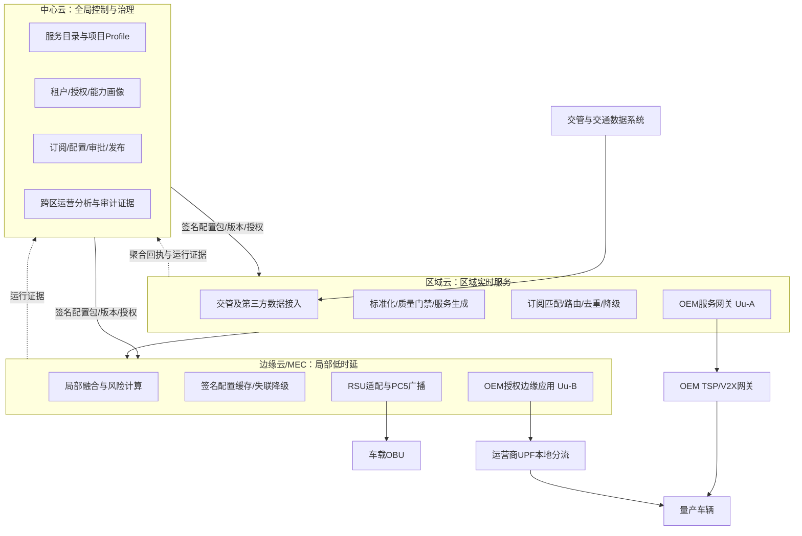
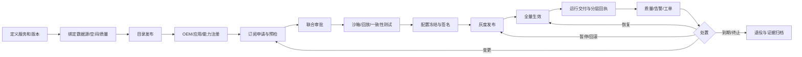
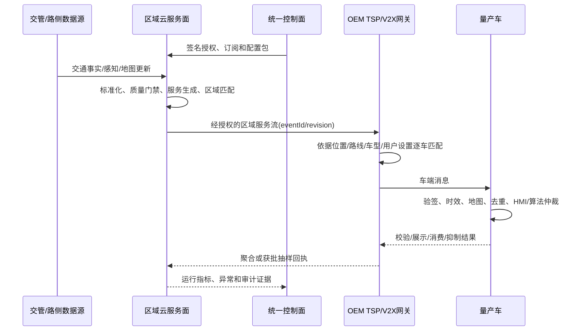

# 济南车路云数据上车服务平台端整体规划设计方案

> 版本：V0.1 评审稿  
> 日期：2026-09-15  
> 文档定位：平台端产品总体规划与概念设计，不替代项目立项批复、数据授权协议、接口控制文档（ICD）、安全评估、测试规范或OEM车型准出文件。  
> 本轮范围：服务产品化、订阅准入、配置治理、审批发布、运行证据与运营闭环；暂不进入像素级UI、移动端或代码实现。

---

## 0. 先给结论：平台应该建设成什么

本项目不应只建设一套“服务列表＋开关配置＋发送统计”的后台。建议将平台定义为：

> **数据上车服务的统一控制面、运营面和证据面。**

平台把信号灯、绿波车速引导、信号灯上车提示、前方拥堵、超视距弱势交通参与者碰撞风险、异常停车等数据能力，包装成可被OEM或示范车辆**申请、授权、配置、验证、发布、运行、暂停、回滚、续期和退役**的版本化服务产品。

平台的完成标准不是“接口返回成功”或“消息已经发出”，而是能够回答并留证：

1. 谁有权订阅什么服务；
2. 哪些车型、软件、地图和HMI能力可以使用；
3. 哪个服务版本、配置快照和空间模型被批准并实际生效；
4. 某条数据为什么被投递、抑制、降级、撤销或判为无法核验；
5. OEM网关、车辆通信终端、车端校验、实际展示或算法消费分别到了哪一级；
6. 出现质量、安全或合规问题时，能否精确停服、回滚、派单和复盘。

一句话边界：

> 城市平台负责把“经过授权、版本明确、质量合格、时空相关的数据上车服务”安全交付至OEM或车端信任边界，并提供可核验的运行证据；OEM负责具体量产车辆的选择、车内分发、HMI呈现、ADAS/ADS仲裁、车型发布、OTA和售后责任。

### 0.1 本方案的五个关键产品决策

| 决策 | 方案选择 | 不采用的做法 |
|---|---|---|
| 管理对象 | 版本化“服务产品＋服务契约” | 只管理原始数据表、Topic或API |
| 量产订阅主体 | OEM/TSP应用和车型能力组 | 城市侧默认维护逐VIN订阅名单 |
| 平台架构 | 控制面统一，数据面在区域云/边缘云分布执行 | 让管理平台成为每条低时延消息的必经跳点 |
| 生产配置 | 不可变版本、联合审批、灰度、可回滚、全审计 | 在线覆盖现行参数或直接改车端策略 |
| 成功证据 | 传输、车端校验、展示、消费、抑制分层统计 | 把HTTP 200、MQ ACK等同于车端使用成功 |

### 0.2 评审时优先拍板的七件事

1. 济南数据上车服务的业务主管单位、数据提供单位、授权单位、运营单位分别是谁；
2. 首批OEM、车型、软件/地图版本和量产接入通道；
3. 首批服务目录及其信息、建议、预警、安全控制边界；
4. 城市—OEM的项目Profile、ICD、测试用例和回执粒度；
5. 生产审批链、紧急停服权限和恢复条件；
6. 首批道路、路口、走廊和数据质量基线；
7. 现网实测后才能冻结的SLA、容量、灰度和运营目标。

### 0.3 本次需求覆盖索引

| 需求 | 对应章节 |
|---|---|
| 整体定位、第一性原理与范围 | 第0、2、4章 |
| 政策、标准和车路云建设依据 | 第3章、附录A |
| 智能网联测试车与量产车方案 | 第4.4、7.3、10.2、14.6—14.7节 |
| 信号灯、GLOSA、拥堵、VRU、异常停车场景 | 第6.3、11.2节 |
| 数据交互链路与三级云架构 | 第7、14章 |
| 服务应用订阅 | 第8—10章 |
| 配置、审批、灰度、回滚 | 第11—12章 |
| 平台功能、页面、状态、交互与展示 | 第13章 |
| 前置条件、OEM提供项和对接步骤 | 第9.1、14章 |
| 回执、运行监控和效果展示 | 第15、17章 |
| 安全、权限、数据与责任边界 | 第16、20章 |
| 建设优先级、验收、风险与待确认 | 第18—21章 |

---

## 1. 文档约定与不确定性标识

- **规范要求**：有法律、政策、国家/行业标准或正式项目文件依据，应落实到需求、接口或验收。
- **项目设计**：本方案基于第一性原理与量产工程经验给出的推荐设计，不宣称是标准原文。
- **🔶 假设**：为使方案可推进而采用的工作假设，必须通过调研、联调或评审验证。
- **🔵 待确认**：会影响范围、责任、接口、工期或验收的未决事项。
- 文中S0—S3是**项目内部服务治理分级建议**，不是国家标准术语；Build-P0—P2是建设优先级，二者不可混用。
- 文中Uu-A、Uu-B、Uu-T是**济南项目内部链路命名建议**，需要在项目架构和ICD中定义，不应写成国家或行业统一术语。

---

## 2. 背景、问题与第一性原理

### 2.1 项目背景

五部门“车路云一体化”应用试点要求建设城市级服务管理平台/云控基础平台，推动架构相同、标准统一、业务互通和安全可靠，并明确城市级试点、安全保障、标准测试评价与运营主体等建设方向。[济南已列入首批应用试点城市](https://www.miit.gov.cn/cms_files/filemanager/1226211233/attach/20246/30dec6679c284b3c811518af25bb645c.pdf)。因此，数据上车不能继续按“一个场景、一个项目、一个OEM、一次性接口”建设，而要形成可规模复制的城市级服务能力。

### 2.2 当前真正要解决的问题

| 表象问题 | 本质问题 |
|---|---|
| 每家OEM都要重新联调 | 缺少稳定的服务产品模型、能力模型和项目Profile |
| 平台能发数据但不知道车端是否使用 | 缺少分层回执、证据等级和统一事件追踪 |
| 配置很多但不敢改 | 缺少版本、影响分析、审批、灰度、回滚和职责分离 |
| 同一场景在测试车和量产车上做两套 | 缺少“同一底座、不同接入与安全Profile”的产品架构 |
| 数据质量问题发现晚、责任不清 | 缺少数据源责任、质量门禁、精确停服和工单闭环 |
| 城市想做逐车精准服务又担心合规 | 没有区分OEM侧匹配、伪名会话与精确路径例外模式 |
| 标准很多但仍无法直接联调 | 把框架性标准误当成字段、错误码和流程已经冻结的ICD |

### 2.3 第一性原理

1. **服务不等于消息。** 一个可运营服务至少由权威数据、场景语义、质量门槛、适用对象、时空范围、交付通道、反馈约定和责任共同构成。
2. **订阅不等于勾选Topic。** 订阅是一份可审批、可执行、可终止的服务契约，必须明确主体、目的、版本、车型、范围、通道、质量、反馈、期限和责任。
3. **配置不等于参数表。** 生产配置必须版本化、可校验、可比较、可审批、可灰度、可回滚；已生效版本不得原地覆盖。
4. **正确性先于覆盖率。** 对安全相关服务，错误车道、错误方向、过期、错配、重复告警比“没有收到”更危险。
5. **默认拒绝，显式降级。** 权限、能力、地图、时间、质量、签名或回执无法核验时，不得静默猜测或沿用危险默认值。
6. **控制面统一，数据面分布。** 平台统一管理目录、授权、订阅和配置；低时延服务在区域云/边缘云执行。控制面故障不应立即打断已经批准且仍在有效期内的安全运行配置。
7. **城市和OEM决策权分离。** 城市负责数据权威性、服务语义、覆盖和质量边界；OEM负责车辆选择、车内分发、HMI、功能安全及最终量产准出。
8. **最小必要车辆数据。** 量产默认由OEM在其域内完成逐车相关性匹配，城市不默认持有VIN与连续精确轨迹。
9. **成功必须分证据等级。** 数据产生、路由、网关接收、车端接收、车端校验、实际展示和算法消费不能合并为一个状态。
10. **所有高风险变化都要限制爆炸半径。** 变更必须能预览影响对象、限定灰度范围、自动暂停和快速回滚。

---

## 3. 政策与标准基线

### 3.1 采用原则

本平台采用“法律法规/政策—国家和行业标准—建设指南—济南项目Profile/ICD—OEM车型规范”的五层约束。上层解决合法性和统一边界，项目Profile解决版本、字段、枚举、性能、错误码、时空编码、测试与运维细节。任何单一标准都不等于可直接量产联调。

### 3.2 关键依据与对本平台的落点

| 层级 | 依据 | 当前状态与适用边界 | 对平台设计的落点 |
|---|---|---|---|
| 试点政策 | [五部门关于开展智能网联汽车“车路云一体化”应用试点工作的通知](https://www.miit.gov.cn/zwgk/zcwj/wjfb/tz/art/2024/art_b236a25edf9f4a8f9b60dbcda924753b.html) | 试点期2024—2026年；强调城市级平台、统一架构/标准、业务互通、安全保障、测试评价和运营主体 | 建设城市级服务目录、统一接入、标准化测试、安全运营和多主体协同能力 |
| 试点解释 | [智能网联汽车“车路云一体化”应用试点工作问答](https://www.miit.gov.cn/jgsj/zbys/gzdt/art/2024/art_42f3b1e3a35a46c2be22c931bb404a86.html) | 明确此前碎片化问题，要求城市规模化、车路云网图安全协同，并在实践中完善标准体系 | 不能把试点示例值直接写成量产SLA；必须有项目Profile与实测冻结机制 |
| 建设指南 | [《车路云一体化系统建设与应用指南》](https://mgr-api.china-icv.cn/profile/upload/2025/02/27/9b7e5d8e-a815-4b72-bcd6-0ed6e7cf68e9.pdf) | 指导三级云、平台能力、场景和建设边界；指南中的“应当”和“建议/探索”应区分 | 中心云负责治理与汇聚，区域云负责区域服务和第三方交互，边缘云负责局部低时延；不新设第四级云 |
| 交通管理接口 | [GB/T 46998-2025《道路交通管理车路协同系统信息交互接口规范》](https://openstd.samr.gov.cn/bzgk/std/newGbInfo?hcno=8AC19B84E9030BC51753C4674AF07ED1&refer=outter) | 2025-12-31发布，2026-07-01实施，现行；归口为全国道路交通管理标准化技术委员会 | 重点落实交通管理系统与车路协同/应用服务平台之间的交互边界；不能据此声称城市区域云与所有OEM已经具备统一字段级接口 |
| 交通信息服务 | [GA/T 2151-2024《道路交通车路协同信息服务通用技术要求》](https://std.samr.gov.cn/hb/search/stdHBDetailed?id=29ABD5EFA3EC9CE1E06397BE0A0A2756) | 2024-07-04发布，2025-01-01实施，现行 | 用于服务通用要求、交通信息来源与质量边界映射，具体消息和流程仍需项目Profile |
| 汽车数据 | [《汽车数据安全管理若干规定（试行）》](https://www.cac.gov.cn/2021-08/20/c_1631049984897667.htm) | 自2021-10-01施行；车辆行踪轨迹属于敏感个人信息，倡导车内处理、默认不收集、精度范围适用与脱敏 | 量产默认OEM侧逐车匹配；反馈分层、聚合、最小化；精确轨迹模式必须具备目的、授权、期限和删除规则 |
| 网络数据 | [《网络数据安全管理条例》](https://www.cac.gov.cn/2024-09/30/c_1729384452307680.htm) | 国务院令第790号，自2025-01-01施行；适用于网络数据处理及其安全管理 | 对外提供、委托或共同处理时明确目的、方式、范围和安全义务；订阅启用前校验合同、角色、数据级别、接收方和期限 |
| 公共数据 | [《公共数据资源授权运营实施规范（试行）》](https://www.ndrc.gov.cn/xxgk/zcfb/ghxwj/202501/t20250116_1395726.html) | 发改数据规〔2025〕27号，规范公共数据资源授权运营 | 平台必须管理数据权属/授权链、用途、产品、协议、期限和运营主体，不能以“免费试点”替代授权 |
| 济南本地 | [《济南市公共数据授权运营办法》](https://www.jinan.gov.cn/api-gateway/jpaas-jpolicy-web-server/front/info/detail?iid=111435_7325) | 济南市政府令第286号，自2023-12-01施行 | 对公共数据授权、加工、安全、监督和产品服务进行本地化落地；运营单位与协议需正式确认 |
| 车辆网络安全 | [GB 44495-2024《汽车整车信息安全技术要求》](https://openstd.samr.gov.cn/bzgk/std/std_list?p.p1=0&p.p2=GB+44495&p.p90=circulation_date&p.p91=desc) | 强制性国家标准，自2026-01-01实施 | 城市接口不能绕过OEM网络安全管理体系；证书、身份、接口防护和安全事件应可审计 |
| 车辆软件升级 | [GB 44496-2024《汽车软件升级通用技术要求》](https://openstd.samr.gov.cn/bzgk/std/newGbInfo?hcno=8BC0D8B44DD4E71F9557BADE5175565A) | 强制性国家标准，自2026-01-01实施 | 城市服务开通应尽量通过服务/城市白名单和受控远程配置实现，但城市平台不得代替OEM OTA及车型发布流程 |
| 自动驾驶记录 | [GB 44497-2024《智能网联汽车 自动驾驶数据记录系统》](https://std.samr.gov.cn/gb/search/gbDetailed?id=208DEC46F6B547EEE06397BE0A0AA4A0) | 强制性国家标准，自2026-01-01实施；适用具备相应自动驾驶功能的车辆 | 平台证据与车辆法定/车型记录边界分开，不把城市回执平台等同于车载自动驾驶数据记录系统 |
| PC5信任 | [GB/T 45112-2024《基于LTE的车联网无线通信技术 安全证书管理系统技术要求》](https://openstd.samr.gov.cn/bzgk/std/newGbInfo?hcno=FB30FC033090F346D1B53E892DCD23BB) | 2025-04-01实施，现行 | PC5证书体系和云云mTLS/OAuth体系分别设计；纳入申请、签发、轮换、吊销、隔离和审计 |

### 3.3 标准适用边界的四条红线

1. 不把“参考建设指标”直接写成本项目承诺值；延迟、可用性、容量、覆盖与灰度阈值须经现网和OEM联合实测冻结。
2. 不把国家/行业标准名称当作可直接开发的ICD；济南必须形成明确的项目Profile、OpenAPI/AsyncAPI、Schema、原因码和版本兼容矩阵。
3. 不把区域云、中心云、OEM云统称为“中台”而模糊责任；低时延路径、数据权属和运营主体必须逐项明确。
4. 不把测试车可行的逐车直连方案直接平移至量产车；量产须进入OEM网络安全、车辆发布、软件升级和售后体系。

---

## 4. 产品定位、范围与边界

### 4.1 产品目标

建设一套面向城市运营方、数据权威部门、OEM/TSP、测试车辆和运维审计人员的数据上车服务平台，使同一服务能够跨区域、跨OEM和跨车型受控复用。

目标闭环：

**服务定义 → 数据源/质量绑定 → 目录发布 → OEM/应用/车型注册 → 订阅申请 → 自动预检 → 联合审批 → 沙箱验证 → 配置冻结 → 灰度发布 → 运行交付 → 分层回执 → 质量/异常处置 → 续期/变更/暂停/退役**

### 4.2 平台负责

- 服务目录、服务版本、适用场景、能力门槛和数据契约；
- 租户、应用、环境、端点、证书、配额与授权；
- OEM车型/软件/地图/通信/HMI能力画像；
- 服务授权订阅、车型部署订阅及获批的运行会话订阅；
- 数据源、空间覆盖、质量门禁、路由、频控、有效期、降级、反馈和隐私策略；
- 配置版本、差异、自动校验、审批、灰度、暂停、回滚和退役；
- 运行质量、分层回执、事件追踪、告警、工单、复盘和审计；
- 沙箱、样例、回放、错误注入、一致性和容量测试入口。

### 4.3 平台不负责

- 不替代公安交管信号控制、事件管理和交通执法系统；
- 不替代OEM TSP、车端服务框架、HMI、ADAS/ADS仲裁、车辆OTA和售后系统；
- 不直接访问量产车CAN，不向量产车执行器下发控制命令；
- 不默认汇聚全量原始视频、点云、VIN、DBC、车内信号或连续精确轨迹；
- 不把预测值包装成未经标识的交通管理事实；
- 不在本阶段决定商业计费模式，也不凭空承诺固定SLA、建设周期或灰度比例；
- 不包含移动端改造、车机像素级交互稿或平台代码开发。

### 4.4 测试/示范车辆与量产车辆

| 维度 | 测试/示范车辆 | 量产车辆 |
|---|---|---|
| 身份 | 可使用项目车辆ID或可轮换伪名 | 默认由OEM管理VIN及实名映射 |
| 接入 | PC5、测试SDK、项目直连或OEM TSP | 以OEM TSP的Uu-A为主，PC5增强；Uu-B按条件试点 |
| 订阅 | 可建立短周期逐车/路线/围栏会话 | 以OEM应用＋车型能力组＋区域/服务订阅为主 |
| 回执 | 可逐事件、逐车辆详细追踪 | 默认聚合回执，按授权抽样或诊断 |
| 配置 | 允许工程参数快速迭代，但仍需版本和审计 | 必须进入OEM车型、网络安全、发布和售后流程 |
| HMI/控制 | 可在限定测试方案下验证 | OEM拥有最终HMI与功能安全决策权 |

两类车辆共用服务目录、语义、版本、质量、配置、发布和证据底座，但采用不同的接入、隐私、审批和准出Profile，不建设两套互不兼容的平台。

---

## 5. JTBD：平台为谁完成什么进展

> 🔶 假设：以下Jobs来自当前项目材料和行业工程经验，须通过交管、城市运营、OEM产品、OEM技术安全、值班运维和审计人员访谈校准。

### 5.1 角色与核心Jobs

| 角色 | 核心功能性Job | 主要痛点 | 期望结果 |
|---|---|---|---|
| 交管/数据权威部门 | 对外提供可信交通事实，并控制发布、修订和撤销 | 权威数据被误读、预测冒充事实、责任不清 | 来源、版本、适用范围、修订和撤销可追溯 |
| 城市服务产品负责人 | 将数据源包装为可跨OEM复用的服务产品 | 每接一家OEM都重复做接口和规则 | 一套目录、一套Profile、多车型受控复用 |
| OEM接入负责人 | 判断服务是否适合目标车型并完成接入 | 服务边界、性能、责任和测试要求不透明 | 可发现、可比较、可申请、可测试、可退出 |
| OEM技术/安全负责人 | 将服务安全接入TSP与车辆 | 字段、地图、时效、证书和异常行为不确定 | 冻结契约、能力门槛、降级、回滚和证据 |
| 配置运营人员 | 让正确策略在正确对象上生效 | 不知道参数来源、冲突、影响车辆和实际版本 | 可继承、可验证、可比较、可追溯的配置 |
| 发布审批人 | 判断一次变更能否进入生产 | 看不到差异、爆炸半径、证据和剩余风险 | 有证据的审批、灰度准出和可验证回滚 |
| 运维值班人员 | 快速发现并控制不可信服务 | 故障横跨数据源、平台、网络、TSP和车端 | 精确停服、责任派单、恢复验证和复盘 |
| 审计/监管人员 | 争议后还原实际发生了什么 | 配置被覆盖、日志缺失、ACK被当作成功 | 不可覆盖的版本、配置快照、时间线和回执 |

### 5.2 社会性与情绪性Jobs

- 社会性Job：让城市和OEM都能被视为专业、可信、对边界负责的服务提供者，而非向对方输出不可解释的黑盒。
- 情绪性Job：让负责人确信“出了问题能停、能解释、能找到责任节点、能恢复”，避免在未知影响范围内承担风险。

### 5.3 核心Job Statement

> 当城市需要把交通数据能力规模化提供给多家OEM和多类车辆时，我希望能以统一服务契约完成准入、配置、验证和发布，并持续获得足够的运行证据，以便在不越过交管与OEM安全责任边界的前提下，提高数据真正上车并被正确使用的比例。

### 5.4 成功结果（Outcome Statements）

- 缩短从OEM提出接入需求到首个生产订阅生效的时间；
- 提高订阅预检一次通过率，减少人工往返；
- 降低错误车型、错误区域、错误地图版本或无授权订阅进入生产的概率；
- 缩短从发现异常到精确暂停/回滚安全状态的时间；
- 提高可证明的车端校验、展示或消费比例；
- 降低无法核验、重复告警、过期消息和错误时空匹配占比；
- 缩短争议事件的取证时间，确保可还原实际版本和责任节点。

---

## 6. 服务产品模型与首批场景

### 6.1 服务产品的最小契约

每个服务版本至少包含：

1. 服务编码、名称、版本、所有者、状态；
2. 业务目标、目标用户、允许用途和明确禁用用途；
3. 事实/预测/建议/预警属性和项目治理等级；
4. 权威数据源、派生过程、质量等级与责任人；
5. 输入、输出、Schema、枚举、错误码和兼容策略；
6. 空间模型、地图版本、覆盖、方向/车道适用规则；
7. 时间语义、有效期、更新、撤销、乱序与过期处理；
8. 支持通道、优先级、主备、限流、去重和降级；
9. 车型/软件/地图/通信/HMI最低能力；
10. 反馈等级、采样、聚合、保留和可核验证据；
11. 安全、隐私、授权、审计、协议和SLA边界；
12. 沙箱样例、测试用例、准入条件、变更和退役策略。

### 6.2 项目服务治理分级

| 分级 | 定义 | 典型平台控制 | 量产边界 |
|---|---|---|---|
| S0 信息 | 不要求驾驶人立即响应的一般信息 | 来源、时空匹配、有效期、订阅和审计 | OEM决定是否展示及展示形式 |
| S1 建议 | 影响驾驶建议但不直接形成安全控制 | 增加质量门槛、车型/HMI确认、灰度和回执 | 建议值不得冒充法定控制指令 |
| S2 安全预警/获准算法输入 | 可能触发及时安全响应或进入获准算法 | 联合安全评审、强质量/时效门禁、自动暂停、严格准出 | OEM保留最终校验、融合、HMI/算法仲裁；不可单源直接驱动执行器 |
| S3 控制/执行 | 可能直接影响车辆纵横向执行 | 不纳入普通订阅配置流程，单独立项 | 必须满足具体车型的功能安全、预期功能安全、网络安全、准入与发布要求 |

### 6.3 首批服务矩阵

> 下表分级为规划建议，不是法规结论。最终分级、阈值、ODD和HMI由城市与OEM联合安全评审冻结。

| 服务 | 建议阶段 | 建议治理等级 | 关键输入 | 上车输出 | 主要降级/退出 |
|---|---|---:|---|---|---|
| 信号灯基础服务 | Build-P0 | S0/S1 | 信号机状态、SPAT、MAP/路口拓扑、时间质量 | 当前相位、剩余时间/区间、方向或车道关联、质量标识 | MAP-SPAT不一致或时间无效时，不输出车道级结果；可降为路口级状态或无法核验 |
| 绿波车速引导（GLOSA） | Build-P0 | S1 | SPAT/MAP、速度限制、车辆方向/位置、预测质量 | 建议速度区间、适用车道/方向、有效期和置信度 | 预测质量不足、临近停止线或状态跳变时撤销建议；不得暗示必然绿灯通过 |
| 信号灯上车提示 | Build-P0 | S0/S1 | SPAT/MAP、车端方向/车道匹配 | 红绿灯状态、变化提示、适用范围 | 无法确认本车道/方向时不显示确定性提示 |
| 前方拥堵预警 | Build-P0 | S1，队尾风险可升S2 | 交通状态、事件、速度/排队估计、道路拓扑 | 拥堵区间、趋势、队尾/影响范围、有效期 | 无法确认位置或事件已过期时抑制；一般拥堵与队尾碰撞风险分开 |
| 异常停车预警 | Build-P0信息、Build-P1安全 | S1/S2 | 路侧感知、事件源、地图、车道与方向 | 障碍/停车位置、占用车道、方向、置信度、持续状态 | 单源置信不足时降为待核验信息；消失或被修订时发送撤销/更新 |
| 超视距弱势交通参与者碰撞风险预警 | Build-P1 | S2 | 路侧感知、轨迹融合、遮挡/冲突关系、时间同步、地图 | 风险对象类别、冲突区域/时间、置信度、有效期 | 身份/轨迹/时间质量不足则抑制或降级，不向OEM输出未经授权的原始人脸/视频 |

### 6.4 服务、数据产品和接口不能混为一谈

- **DataSource**：信号机、事件系统、路侧感知、地图等原始来源；
- **DataProduct**：完成标准化、质量标注、空间绑定后的可复用数据产品；
- **ServiceDefinition/Version**：面向车辆Job的服务语义与契约；
- **Endpoint/Topic/API**：服务的具体交付技术方式；
- **Subscription**：某消费者在特定条件下使用某服务版本的授权与执行策略。

### 6.5 服务生命周期

服务定义、服务版本和服务部署的状态必须分开，避免“版本已经发布”被误解为“当前道路服务正常”：

```text
ServiceDefinition：PLANNED → OPEN → DEPRECATED → RETIRED

ServiceVersion：DRAFT → REVIEWING → APPROVED → PUBLISHED
                → DEPRECATED → RETIRED

ServiceDeployment：PROVISIONING → AVAILABLE → DEGRADED
                   → PAUSED / UNAVAILABLE → RESTORING → AVAILABLE
```

- PUBLISHED表示语义与契约可被引用，不代表所有区域部署都AVAILABLE；
- DEPRECATED版本禁止新增订阅，但允许在兼容窗口内迁移存量订阅；
- PAUSED保留部署和证据但停止新事件输出，UNAVAILABLE表示当前不能提供服务；
- RETIRED前必须完成受影响订阅迁移、授权/凭证收口和证据归档。

---

## 7. 总体业务与技术架构

### 7.1 一套逻辑平台、三级云分布部署、四个平面



四个平面：

- **控制面**：目录、能力、授权、订阅、配置、审批和发布；
- **数据面**：接入、质量判定、服务生成、时空匹配、路由和投递；
- **证据与运维面**：回执、追踪、指标、告警、工单和复盘；
- **信任与安全面**：身份、证书、密钥、权限、隔离、审计和数据治理。

### 7.2 三级云职责

| 层级 | 主要责任 | 明确限制 |
|---|---|---|
| 中心云 | 全局服务目录、项目Profile、租户、授权、能力、订阅策略、全局发布、跨区协调、汇聚分析、长期治理 | 通常不作为每条低时延消息的同步必经节点；不集中上传所有原始视频、点云和实名轨迹 |
| 区域云 | 区域数据接入、态势融合、质量门禁、服务生成、区域匹配、Uu-A对OEM输出、区域事件追踪 | 不绕过OEM访问量产车CAN或执行器；车辆反馈不直接反写信号控制系统 |
| 边缘云/MEC | 局部融合、近场风险计算、PC5广播、Uu-B边缘投递、本地失联降级 | 不自行修改未审批规则；不承担全市租户、商业和长期治理 |

控制面发布签名、带版本和有效期的配置包。中心控制面短时不可用时，区域/边缘节点可按已批准的“最后已知良好配置”有限运行；配置失效、证书失效或证据不足时按服务等级降级或停服。

### 7.3 通道与订阅语义

| 通道 | 工程定义 | 平台管理对象 | 责任边界 |
|---|---|---|---|
| PC5 | 边缘/MEC—RSU—OBU广播 | 服务区域、RSU/覆盖、消息Profile、频率、优先级、证书和状态；不是逐车网络订阅 | 城市负责广播内容与覆盖；车辆负责验签、时效、地图匹配、去重和最终使用 |
| Uu-A | 区域云—OEM V2X网关/TSP—车端代理 | OEM应用对区域服务流的B2B订阅、端点、配额和反馈 | OEM在其域内完成逐车选择；城市默认不掌握VIN和全量实时位置 |
| Uu-B | 边缘服务面—OEM授权边缘应用—运营商UPF—车辆 | OEM边缘应用、局部主题、短会话、网络切片/路由和回执 | 仅在OEM、运营商与运维条件具备时启用，不视为默认链路 |
| Uu-T | 城市/区域平台—测试车SDK或工程车机 | 伪名车辆、路线/围栏、测试环境和详细追踪 | 仅用于示范/测试，不代表量产架构 |

### 7.4 管理面不可成为实时单点

- 已生效服务的运行依赖区域/边缘本地配置缓存，不依赖运营人员浏览器会话；
- 期望配置、节点已安装配置、当前运行配置和漂移状态分开记录；
- 紧急停服指令采用独立高优先级控制通道，带签名、作用域、有效期和回执；
- 数据面不可在控制面失联后无限期沿用安全关键配置；各治理等级的最大离线运行时间由DVP&R冻结；
- 恢复连接不等于自动恢复S2服务，须验证数据、配置、证书与恢复审批条件。

---

## 8. 核心领域对象与单一事实源

### 8.1 领域对象

| 对象 | 含义 | 关键约束 |
|---|---|---|
| Tenant/Partner | 交管、运营方、OEM、数据方、供应商等组织 | 租户隔离、协议、资质、联系人和权限边界 |
| DataAuthorization | 数据提供、授权、加工、产品化和对外服务的批准依据 | 记录授权单位、范围、用途、期限、禁止项和撤回条件 |
| ServiceAgreement | 城市服务方与OEM/合作方的服务及数据处理约定 | 关联SLA、数据角色、责任、反馈、保留和终止规则 |
| ApplicationClient | OEM应用、测试客户端、环境、端点、证书、配额 | 开发/测试/预生产/生产分离 |
| VehicleCapabilityProfile | OEM、车型、年款、配置、软件、地图、通信、HMI、消费和安全能力 | 表示“能不能使用”，版本化且需OEM确认 |
| DataSource | 信号、事件、感知、地图等来源 | 权威等级、质量、覆盖、责任人和授权链 |
| DataFeedSubscription | 平台从交管或第三方获取某数据产品的受控订阅 | 与对车辆服务订阅分离，受来源授权、用途和质量约束 |
| DataProduct | 标准化、质量标注、空间绑定后的数据产品 | 与原始源和派生规则建立血缘 |
| ServiceDefinition | 稳定的服务产品标识 | 一个定义可有多个版本 |
| ServiceVersion | 冻结的语义、Schema、质量、能力和安全规则 | 发布后不可原地修改 |
| ServiceDeployment | 某版本在环境、区域、边缘集群的部署实例 | 分开记录发布状态和运行可用性 |
| SpatialModelVersion | 区域、道路、走廊、路口、方向、车道、停止线和信号组版本 | 与服务版本、数据源、车载地图形成兼容矩阵 |
| EntitlementGrant | 某组织获准使用的服务、区域、环境、等级和期限 | 表示“可不可以使用” |
| SubscriptionPolicy | 消费者希望使用的服务、车型、范围、时段、通道和反馈策略 | 表示“希望如何使用” |
| SubscriptionRevision | 订阅策略的不可变修订版 | 生产修改必须产生新Revision |
| RuntimeSession | 短生命周期的车辆、OEM边缘应用或走廊会话 | 表示“当前是否相关” |
| ConfigBundle | 某次发布引用的全部版本、哈希和生效条件 | 是运行与取证基线，不包含私钥 |
| ReleaseOrder | 配置包向环境、区域、OEM或车群灰度的过程 | 关联审批、指标、暂停和回滚 |
| ServiceEvent | 某次交通事实、建议或风险事件 | eventId＋revision处理更新和撤销 |
| DeliveryEvidence | 路由、网关、车辆校验、展示、消费、抑制等证据 | ACK不得替代更深层业务证据 |
| Incident/WorkOrder | 异常、责任、处置、恢复和复盘 | 无责任人、无恢复证据不得关闭 |
| AuditRecord | 操作、审批、访问和证据记录 | 防篡改、可检索、按分类分级保存 |

### 8.2 核心关系

```text
可投递对象
= 已发布且当前可用的服务部署
∩ 有效的数据授权和服务授权
∩ 有效订阅范围
∩ 车型/软件/地图能力兼容
∩ 当前时空相关性
∩ 数据质量门禁
∩ Schema与空间版本兼容
∩ 通道与证书可用
∩ 合规和用户授权条件
```

任一条件不满足，平台都应生成明确的抑制、拒绝、过期、撤销或“无法核验”原因，不得静默丢弃。

### 8.3 标识与版本不变量

- serviceCode稳定，serviceVersion不可变；
- subscriptionId稳定，每次修改生成subscriptionRevision；
- eventId跨PC5、Uu-A、Uu-B保持语义一致，messageId表示一次通道传输；
- 同一eventId的revision严格递增，并明确ACTIVE、UPDATED、CANCELLED；
- 每条投递证据至少关联serviceVersion、subscriptionRevision、configBundleHash、spatialModelVersion和traceId；
- 发布状态与运行状态分开：版本可为PUBLISHED，当前运行仍可为DEGRADED或PAUSED。

---

## 9. 整体业务闭环



### 9.1 前置门槛

进入订阅前必须满足：

1. 服务版本已批准且在目标环境可申请；
2. 数据权威性、授权、覆盖、血缘和质量基线可核验；
3. OEM租户、协议、应用Client、端点、证书和联系人有效；
4. 目标车型能力画像已由OEM确认；
5. 项目Profile、ICD、地图编码、版本兼容和原因码已冻结；
6. 数据用途、反馈粒度、保留/删除规则和责任边界已确认；
7. 沙箱与联合测试环境可用；
8. 生产审批人与紧急联系人已经配置。

### 9.2 标准主流程

1. OEM在服务目录查看服务价值、覆盖、能力门槛、质量、SLA边界和测试要求；
2. 选择服务版本并声明用途：信息、建议、预警或获准算法输入；
3. 选择应用、环境、车型能力组、区域/道路/走廊/路口、时间和ODD；
4. 配置Uu-A、PC5、Uu-B或Uu-T的主备、限流、去重与回落；
5. 配置TTL、质量门槛、降级、撤销、反馈、聚合、采样、保留和脱敏；
6. 平台执行权限、资质、能力、地图、质量、容量、证书、SLA、隐私、冲突和风险预检；
7. 按治理等级触发数据源、城市运营、交管、OEM产品、安全和发布会签；
8. 完成沙箱、Schema、异常注入、回放、性能和一致性测试；
9. 生成不可变配置包，按区域、OEM、车型、软件、通道和时间窗灰度；
10. 达到准出条件后全量生效；异常时精确暂停、撤销或回滚；
11. 订阅到期前续期，需求变化创建新Revision；终止后停止匹配新事件但保留审计证据。

---

## 10. 订阅产品设计

### 10.0 先区分上游数据订阅与下游车辆服务订阅

| 方向 | 产品对象 | 谁向谁申请 | 解决的问题 |
|---|---|---|---|
| 上游数据订阅 | DataFeedSubscription | 城市服务运营方依据授权，向交管或第三方数据提供方申请/绑定数据流 | 平台是否有权、按什么范围和质量获得原料数据 |
| 下游服务订阅 | EntitlementGrant＋SubscriptionPolicy | OEM/TSP或测试应用向城市服务方申请服务 | 消费方是否有权、哪些车型、区域和通道可以使用加工后的上车服务 |
| 运行时匹配 | RuntimeSession | 区域/边缘/OEM依据已批准策略自动执行 | 当前事件与当前车辆/走廊是否相关 |

上游原始数据授权不能自动转化为对OEM提供服务的授权；下游OEM订阅也不能绕过数据源授权和质量门禁。平台应把两端对象关联起来，使每个服务事件可追溯到数据授权、数据源、服务版本和消费授权。

### 10.1 三层订阅模型

平台必须把“企业获准使用”“某车型产品准备使用”“此时此地车辆是否需要”分为三层，否则会把长期授权、量产配置和实时会话混成一个不可治理的开关。

| 层级 | 回答的问题 | 主要对象 | 生命周期 |
|---|---|---|---|
| L1 服务授权订阅 | 某OEM/应用可不可以使用某服务 | OEM租户、ApplicationClient、服务版本范围、区域、用途、期限、配额、SLA | 月/年级，合同与授权驱动 |
| L2 产品部署订阅 | 哪些车型产品准备如何使用 | 车型、年款、配置、软件、地图、HMI、通道、灰度车群、反馈Profile | 车型版本/发布周期驱动 |
| L3 运行会话订阅 | 当前时空下哪些对象真正相关 | 道路/走廊/路口/方向/围栏、短会话、动态兴趣 | 秒/分/行程级，运行态驱动 |

执行方式：

- Uu-A量产链路：城市向OEM提供经授权的区域/主题服务流，OEM依据车辆位置、路线和用户设置完成逐车选择；
- PC5链路：区域广播，车辆本地完成相关性判断，不建立城市逐车网络订阅；
- Uu-T示范链路：在明确授权下，以可轮换标识建立短生命周期的路线/围栏会话；
- Uu-B链路：由OEM授权边缘应用执行局部会话匹配，仅在运营商和OEM工程条件具备时启用。

### 10.2 订阅类型

| 类型 | 适用对象 | 默认隐私模式 | 建议阶段 |
|---|---|---|---|
| OEM服务订阅 | OEM/TSP应用 | 城市输出区域服务流，OEM域内逐车匹配 | Build-P0量产主模式 |
| 车型产品订阅 | OEM车型/软件/地图能力组 | 城市仅保存能力标签与发布车群引用 | Build-P0 |
| 测试车会话订阅 | 示范车、工程车、封闭测试车辆 | 轮换伪名＋短时路线/围栏，按任务授权 | Build-P0 |
| PC5广播发布 | RSU覆盖区域内具备能力的车辆 | 城市不掌握车辆身份与位置 | Build-P0 |
| OEM边缘会话订阅 | OEM部署于MEC的应用 | 位置和身份在约定边界内最小化处理 | Build-P1试点 |

### 10.3 订阅最小字段

| 字段组 | 最小内容 |
|---|---|
| 主体 | subscriptionId、consumerOrgId、applicationClientId、环境、负责人和紧急联系人 |
| 目的与授权 | 使用目的、业务功能、允许/禁用用途、EntitlementGrant、协议、法律/授权依据 |
| 服务 | serviceCode、版本约束、治理等级、依赖服务及兼容窗口 |
| 能力 | capabilityProfileId、车型/软件/地图/通信/HMI/消费能力选择器 |
| 时空 | 行政区、道路、走廊、路口集合、方向/车道、ODD、schedule、validFrom/validTo |
| 通道 | channelPolicy、主备、端点、Topic/API、QoS、配额、限流、去重与回落 |
| 质量与安全 | 质量门槛、TTL上限、置信度、地图一致性、降级、撤销和停服规则 |
| 反馈 | feedbackProfile、聚合维度、采样规则、异常快速回传、保留与删除 |
| 隐私 | privacyMode、数据项、精度、用途、接收方、保存位置/期限和脱敏规则 |
| 治理 | revision、状态、测试证据、审批记录、生效时间、续期和终止条件 |

### 10.4 订阅申请向导

| 步骤 | 用户操作 | 平台即时反馈 | 不能继续时的出口 |
|---|---|---|---|
| 1 选择服务 | 选择服务与兼容版本 | 显示价值、覆盖、治理等级、最低能力、质量和当前可用性 | 服务停用或数据源不可核验时，禁止申请并指向责任人 |
| 2 声明用途 | 选择信息/建议/预警/算法输入，填写业务说明 | 自动带出审批链、反馈和测试要求 | 用途超出授权范围时，转授权申请或终止 |
| 3 选择应用/车型 | 选择Client和能力Profile | 输出兼容、部分兼容、不兼容及缺失能力 | 不兼容时返回能力补充或新Profile申请 |
| 4 配置范围 | 选择区域、道路、走廊、路口、方向、时间和ODD | 地图可视化覆盖、数据可用性、版本冲突 | 空间版本不一致时转映射校准任务 |
| 5 配置通道 | 选择主备通道、端点、配额、限流和回落 | 连接、证书、容量和重复风险预检 | 端点/证书失败时转接入配置或工单 |
| 6 配置质量与反馈 | 选择门槛、TTL、降级、撤销、反馈、聚合和保留 | 显示上限/下限、来源和合规提示 | 不得放宽硬约束；需变更上层契约时发起Change Request |
| 7 自动预检 | 查看权限、能力、地图、质量、容量、安全和冲突结果 | 每项给出通过/警告/阻断、证据、责任人和下一动作 | 阻断项修复后重新校验，不允许仅勾选“忽略” |
| 8 提交审批 | 确认完整差异和影响范围 | 生成不可变申请快照与审批链 | 材料不足可撤回或退回补充 |

### 10.5 自动预检规则

预检不是简单必填校验，至少覆盖：

- 组织资质、合同、授权用途、区域、环境和有效期；
- 服务状态、版本兼容、依赖服务、废弃窗口和数据源可用性；
- 车型、软件、地图、通信、HMI和允许消费等级；
- 空间编码、路口/方向/车道映射、MAP-SPAT绑定和版本一致性；
- 端点、证书、签名算法、权限Scope、限流和峰值容量；
- TTL、质量门槛、频控、优先级、降级和服务治理等级；
- 主备通道可能导致的重复、乱序、冲突和回执关联；
- 反馈字段、精度、采样、聚合、保留期、接收方和隐私模式；
- 与现有订阅、配置、灰度发布、停服范围和时间窗的冲突。

每个结果必须呈现：规则编码、结果、事实证据、影响范围、可否自动修复、责任方、下一动作和复检时间。

### 10.6 订阅状态机

订阅申请、订阅实例、运行会话必须分开：

```text
申请：DRAFT → VALIDATING → SUBMITTED → REVIEWING
                   ↘ PRECHECK_FAILED
REVIEWING → RETURNED / APPROVED / REJECTED / WITHDRAWN

实例：PROVISIONING → SANDBOX_TESTING → READY_FOR_GRAY
      → GRAY_ACTIVE → ACTIVE → SUSPENDED
      → EXPIRED / REVOKED / TERMINATED

会话：INITIALIZED → MATCHED → DELIVERING → DEGRADED → CLOSED
```

业务含义：

- APPROVED只表示订阅获得准入，不代表配置已部署、车辆在线或服务已生效；
- ACTIVE订阅不等于每辆车均在线；车辆离线也不使长期订阅自动失效；
- SUSPENDED保留授权和历史，但停止新事件匹配；恢复须具备故障关闭、恢复测试和有权审批；
- EXPIRED由期限触发，REVOKED由授权方撤回，TERMINATED由双方结束服务，三者原因和后续动作不同。

### 10.7 订阅变更、续期与终止

- 生产订阅任何语义性修改都创建新Revision，旧Revision持续运行到新版本正式切换；
- 续期必须重新核验授权、协议、服务版本、证书、车型能力和未关闭风险；
- 终止后立即停止新事件匹配，撤销必要凭证/Scope，保留按规则要求的审计证据；
- 服务版本退役前，平台列出所有受影响订阅、OEM、车型和迁移状态；
- 数据源授权被撤回时，按影响范围暂停相应服务部署，不能只隐藏目录入口。

---

## 11. 配置产品设计

### 11.1 配置域与责任边界

| 配置域 | 典型字段 | 主要决策方 |
|---|---|---|
| 服务语义 | 服务版本、消息Schema、枚举、事件更新/撤销、依赖 | 城市与OEM冻结Profile，城市维护 |
| 数据源与质量 | 权威源、备源、完整性、新鲜度、时间质量、置信度、质量等级 | 数据提供方＋城市服务方 |
| 空间与覆盖 | 区域、道路、走廊、路口、方向、车道、停止线、信号组、地图版本 | 城市提供，OEM确认车载地图兼容 |
| 车型能力 | 车型、软件、地图、通信、HMI、算法消费和安全等级 | OEM提供并确认 |
| 触发与算法 | 场景阈值、模型版本、过滤、事件合并与撤销 | 城市与OEM按安全等级共同确认 |
| 交付与路由 | PC5/Uu-A/Uu-B/Uu-T、主备、频控、优先级、TTL、配额、去重 | 双方联合，平台执行 |
| HMI语义 | 信息/建议/预警类别、语义、最小展示约束、撤销含义 | 城市给出服务语义；OEM决定实际HMI与仲裁 |
| 反馈与证据 | 回执等级、聚合维度、采样、异常追踪、保留 | 双方联合并完成合规评估 |
| 安全与合规 | 授权、证书、Scope、隐私模式、数据保留、跨域策略 | 安全/合规责任人 |
| 运营与降级 | 告警、自动暂停、应急停服、恢复、主备源、服务降级 | 服务负责人＋SRE＋安全审批人 |

平台绝不提供“直接在线修改量产车HMI、安全阈值、ADAS/ADS策略或车辆执行器”的城市侧入口。若变更影响车端软件/功能，转入OEM的软件升级和车型准出流程。

### 11.2 首批场景的配置模板

> 下列均为“配置字段类别”，不是固定参数值。具体阈值、距离、时长、频率和置信度须按道路、数据质量、车型能力和联合测试结果冻结。

| 服务 | 城市侧关键配置 | OEM/车端关键配置 | 平台必须阻断的情况 |
|---|---|---|---|
| 信号灯基础服务 | 信号源、路口/方向/车道/信号组映射、相位枚举、时间质量、预测/实测标识、TTL、更新/撤销 | 支持的消息版本、地图映射、目标方向判定、HMI能力 | 数据源无权发布、MAP-SPAT冲突、信号组未知、时间过期却输出确定状态 |
| GLOSA | 算法/模型版本、绿灯窗口质量、道路限速/建议范围、适用车道/方向、失效和撤销规则 | 车辆速度/位置本地输入、舒适性与安全约束、展示或语音策略 | 建议越过法规/项目硬约束、把概率预测表述为必然结果、质量不足仍给确定速度 |
| 信号灯上车提示 | 触发区域、方向/车道匹配、状态变化规则、优先级、频控、TTL | 车端关注路口判定、驾驶分心约束、同类功能去重 | 未确认本车通行方向、过期、重复或与本车权威感知冲突仍强提示 |
| 前方拥堵/队尾风险 | 道路区间、方向、严重度、队尾估计、数据源融合、持续/解除、TTL | 路线相关性、展示等级、导航/智驾信息融合 | 一般拥堵被误标为碰撞风险、方向未知、事件已解除仍投递 |
| 异常停车 | 对象/事件类型、所在车道、方向、持续性、置信度、多源核验、更新/撤销 | 本车路径/车道相关性、信息或预警HMI、去重 | 单源低置信结果未经标识升为S2、位置或方向无法核验、撤销未传播 |
| VRU碰撞风险 | 对象类别、冲突区域/时刻、轨迹质量、遮挡关系、模型版本、置信度、最短有效期、隐私输出 | 本车轨迹本地融合、风险仲裁、HMI/算法接口、失败安全状态 | 时间不同步、轨迹/对象不稳定、模型/地图不兼容、输出原始人脸/无必要视频 |

城市平台维护服务语义、允许范围和安全上限；OEM维护车端本地输入、HMI和算法仲裁。双方共同确认场景阈值、地图映射、反馈和准出，但平台不会远程覆盖OEM量产车的安全策略。

### 11.3 配置继承层级

```text
L0 法规、授权、项目及安全硬约束（不可下层放宽）
  ↓
L1 服务版本默认值
  ↓
L2 区域/道路/路口/数据源Profile
  ↓
L3 OEM协议与车型能力Profile
  ↓
L4 订阅Revision
  ↓
L5 灰度批次或获批临时覆盖
  ↓
运行时数据质量、安全和证书门禁（最终裁决）
```

规则：

- 下层可在允许范围内细化或收紧，不得未经审批放宽L0硬约束；
- 每个字段展示当前值、允许范围、来源层级、修改人、审批单、版本和生效时间；
- 冲突不是“最后写入者获胜”，必须由规则引擎阻断或明确决策；
- 临时覆盖必须有作用域、原因、审批、开始/结束时间和自动恢复点；
- 密钥、Token和私钥不进入配置包，仅保存引用，由KMS/HSM或等效设施管理。

### 11.4 配置工作台

配置工作台应采用“左侧配置树＋中部表单/地图＋右侧来源和影响解释＋底部验证结果”的结构，核心能力包括：

- 从服务模板、OEM模板或现行订阅复制为新草稿；
- 显示继承值与本层覆盖值，禁止把继承值误当成本层配置；
- 在地图上预览区域、道路、路口、方向和车道影响范围；
- 同时比较“现行版本—草稿版本—建议修复版本”；
- 实时显示影响的服务、OEM、车型、节点、通道和预计会话范围；
- 一键执行Schema、语义、空间、容量、权限、安全、冲突和回滚可行性校验；
- 导出可审阅的配置差异，不以原始JSON替代产品审阅；
- 保存草稿、送审、撤回、复制、废弃，不能直接“保存并生产生效”。

### 11.5 配置、发布与节点状态机

三类状态分别表示“内容是否获批”“一次发布进展如何”“节点是否真正应用”，不可合并成一个启停字段：

```text
ConfigVersion：DRAFT → VALIDATING → IN_REVIEW → APPROVED
               → SUPERSEDED / RETIRED

ReleaseOrder：PLANNED → SCHEDULED → SHADOW → CANARY → ROLLING_OUT
              → ACTIVE / PARTIALLY_APPLIED / FAILED / PAUSED
              → ROLLED_BACK / SUPERSEDED

NodeApplication：PENDING → DOWNLOADED → VERIFIED
                 → APPLIED / REJECTED / EXPIRED / UNREACHABLE
```

- APPROVED只说明配置内容获准被发布，不说明任何节点已经生效；
- PARTIALLY_APPLIED不得显示为“发布成功”，必须列出成功、失败、未确认节点及安全处置；
- 被ACTIVE发布引用的ConfigVersion不可原地编辑，任何变化都生成新版本；
- 回滚通过新建一个引用历史良好ConfigVersion的ReleaseOrder实现，不能删除失败版本；
- 节点上报期望版本、已下载版本、已验证版本、当前运行版本与哈希，用于漂移检测；
- 配置内容可以APPROVED，但某区域节点仍可能REJECTED或UNREACHABLE，服务运行状态因此进入DEGRADED或PAUSED。

### 11.6 不可变发布清单

每次生产发布至少固化：

```text
releaseManifest
├── serviceVersion
├── schemaVersion
├── algorithmVersion
├── spatialModelVersion
├── qualityPolicyVersion
├── routingPolicyVersion
├── capabilityProfileVersion
├── certificateProfileVersion
├── subscriptionRevision
├── configHashes
├── targetScope / effectiveTime / expiryTime
├── testEvidence / approvers
└── rollbackTarget
```

---

## 12. 审批、灰度、发布与回滚

### 12.1 基于风险的审批矩阵

| 变更类型 | 最小审批角色 | 额外门禁 |
|---|---|---|
| S0目录文案、非生产元数据 | 服务负责人 | 四眼原则可按组织制度配置 |
| S0生产或S1服务 | 服务负责人＋运营/发布负责人＋OEM产品确认 | 兼容测试、影响分析、灰度计划 |
| S2服务、质量门槛、TTL、空间映射、算法版本 | 数据源责任人＋城市安全负责人＋OEM安全负责人＋联合测试负责人＋发布负责人 | SIL/HIL或等效验证、异常注入、封闭/道路验证、自动暂停、明确回滚 |
| 权限扩大、精确轨迹、保留期延长、跨域提供 | 数据与合规负责人＋安全负责人＋业务授权人 | 目的必要性、授权/合同、数据影响评估 |
| 紧急停服 | 经授权值班人可单人触发 | 强制填写原因、自动建事件、事后双人复核；恢复不得单人完成 |
| S3控制或执行 | 不进入普通配置审批 | 单独车型项目、准入、功能安全/SOTIF/网络安全和发布体系 |

职责分离原则：高风险配置的编辑人不能同时成为最终生产审批人；审批人必须看到差异、影响对象、测试证据、未关闭风险和回滚路径。

### 12.2 灰度发布

灰度可按以下维度组合：

- 环境：沙箱、集成测试、预生产、生产；
- 空间：区域、道路、走廊、路口、方向、边缘集群；
- 服务：serviceCode、版本、数据源或算法版本；
- 消费方：OEM、ApplicationClient、车型能力组、软件/地图版本；
- 通道：PC5、Uu-A、Uu-B、Uu-T；
- 时间：起止时间、运营时段、观察窗口；
- 风险：治理等级、已知问题标签、受控测试人群。

灰度比例不写死，应同时考虑有效车辆/会话样本、有效事件量、连续运行时间、区域代表性、质量和异常率。S2服务可以按规则自动暂停，但原则上不自动晋级；晋级由联合审批完成。

### 12.3 发布前影响预览

发布确认页必须回答：

- 影响哪些服务、区域、路口、OEM、车型、软件、地图、节点和通道；
- 哪些对象新增、移除、参数变化或从可用转为降级；
- 与当前生产配置相比哪些字段变化，变化来自哪一层；
- 预计配置传播范围、不能确认的节点及最大风险；
- 观察指标、暂停阈值、责任人、值班窗口和回滚目标；
- 数据源、证书、容量、地图和OEM端点是否均已通过预检。

### 12.4 自动暂停与精确停服

应急开关至少支持：服务、版本、区域/路口、数据源、OEM、车型能力组、通道和发布批次八个维度，禁止只有“全平台停服”。典型触发包括：

- 权威源不可用、数据新鲜度/完整性跌破硬门槛；
- MAP-SPAT绑定错误、时间同步异常、错误方向/车道；
- 验签失败、证书吊销、跨租户泄漏或异常访问；
- 过期安全消息仍被投递、双通道重复告警；
- 灰度核心指标越界或OEM报告安全相关异常。

自动动作必须记录规则、证据、作用域、执行节点、结果和人工接管人。

### 12.5 回滚与恢复

- 回滚目标必须在发布前验证为可用的历史良好配置；
- 回滚也产生新的ReleaseOrder、签名、时间线和节点回执；
- 数据源或证书问题未解决时，不得通过回滚配置“恢复正常”；
- 服务恢复至少验证数据质量、配置一致性、证书、通道、异常用例和OEM侧准备状态；
- S2恢复需要双人/多方复核，不能因网络自动重连而恢复输出。

---

## 13. 平台信息架构与功能模块

### 13.1 三个角色化工作区

一套平台根据角色呈现三个工作区，共享同一领域对象与审计链：

1. **城市服务运营工作区**：目录、数据源、覆盖、订阅、配置、发布、质量、事件和工单；
2. **OEM/合作方接入工作区**：服务发现、申请、车型能力、应用端点、沙箱、测试、回执和运行报告；
3. **安全审批与审计工作区**：待办、差异、影响、风险、审批、紧急操作、证据与权限。

### 13.2 导航结构

```text
工作台
服务中心
  服务目录 / 服务版本 / 数据源与质量 / 覆盖与空间模型
合作方与能力
  OEM租户 / 应用与环境 / 车型能力 / 端点与证书
订阅中心
  订阅申请 / 订阅审批 / 生效订阅 / 续期与退订
配置与发布
  配置模板 / 配置工作台 / 变更中心 / 审批中心 / 灰度发布与回滚
运行运营
  服务全景 / 事件追踪 / 数据质量 / 告警事件 / 工单 / 效果分析
开发与验证
  开发者文档 / 沙箱 / 样例与回放 / 一致性测试 / 容量测试
安全与治理
  权限 / 授权与协议 / 审计 / 字典与项目Profile / 系统设置
```

### 13.3 页面级规划

| 编号/页面 | 核心字段或组件 | 主操作 | 必须展示的状态 | 异常出口 |
|---|---|---|---|---|
| P01 工作台 | 我的待办、临期订阅、异常服务、灰度、配置漂移、严重事件、证书到期 | 审批、暂停、回滚、派单 | 正常/降级/暂停/无法核验 | 直接下钻责任对象，不用用户二次搜索 |
| P02 服务目录 | 服务编码、价值、等级、版本、覆盖、通道、最低能力、质量、可申请状态 | 查看、比较、发起申请 | 可申请/限申请/停用/退役中 | 不兼容时列缺失能力和责任方 |
| P03 服务详情 | 契约12要素、输入输出、权威源、TTL、ODD、反馈、SLA、测试 | 订阅、下载Profile、查看样例 | 版本/部署/运行状态分开 | 数据源不可核验时禁止申请 |
| P04 服务版本 | 版本列表、差异、兼容窗、依赖、测试、受影响订阅 | 建版本、送审、发布、废弃 | 草稿/审核/可用/弃用/退役 | 已发布版本不可原地覆盖 |
| P05 数据源与质量 | 来源、数据授权/Feed订阅、覆盖、质量规则、血缘、责任人、最近异常 | 申请/续期Feed、绑定服务、隔离、切换备源 | 待授权/正常/临期/降级/隔离/不可核验 | 授权无效时阻断服务；异常时暂停受影响部署并建工单 |
| P06 覆盖与空间模型 | 区域/道路/路口/方向/车道、版本、MAP-SPAT、地图兼容 | 编辑草稿、校验、发布 | 草稿/已验证/生效/冲突 | 版本冲突转映射校准任务 |
| P07 OEM/合作方 | 主体、资质、协议、授权、联系人、环境、SLA | 开通、冻结、续签 | 待审核/有效/临期/冻结 | 协议失效时冻结新增和变更 |
| P08 应用与环境 | Client、用途、环境、端点、Scope、配额 | 新建、连接测试、切换环境 | 开发/测试/预生产/生产 | 端点异常转接入工单 |
| P09 车型能力画像 | 车型/年款/配置、软件、地图、PC5/Uu、HMI、算法消费、安全能力 | 新建版本、确认、比较 | 草稿/已确认/停用/过期 | 缺失能力不得人工伪造成兼容 |
| P10 订阅申请向导 | 服务、用途、应用、车型、范围、通道、质量、反馈、期限 | 预检、提交、撤回 | 草稿/阻断/可提交 | 每个阻断项给证据和下一动作 |
| P11 订阅审批 | 申请快照、差异、影响、测试、风险、会签人 | 批准、退回、拒绝、升级会签 | 待办/处理中/超时/完成 | 自审阻断；材料不足退回而非口头处理 |
| P12 订阅列表 | OEM、服务、车型、区域、版本、期限、健康、漂移 | 查看、续期、暂停、终止 | 申请状态与实例状态分开 | 临期、测试失败、漂移快捷入口 |
| P13 订阅详情主工作台 | 概览、授权、范围、能力、通道、配置、测试、发布、运行、变更、审计 | 变更、续期、暂停、终止、回滚、建工单 | 单一事实页面 | 所有异常回到具体对象、责任人和证据 |
| P14 配置模板 | 服务/OEM/区域模板、继承层级、适用版本 | 新建、复制、送审 | 草稿/已批准/弃用 | 冲突模板禁止引用 |
| P15 配置工作台 | 配置树、地图、字段来源、允许范围、版本差异、影响预览 | 校验、保存草稿、送审 | 期望/安装/运行版本与漂移 | 冲突阻断、回草稿、查看旧版本 |
| P16 变更与差异 | 变更原因、字段Diff、对象影响、风险、测试、回滚 | 补证、送审、撤回 | 开放/审批中/完成/失败 | 失败版本冻结并发起复盘 |
| P17 审批中心 | 待审事项、风险等级、差异、证据、未决问题 | 批准、退回、拒绝、会签 | 角色/时限/结论 | 不允许只给“同意”而无证据链 |
| P18 灰度发布与回滚 | 批次、作用域、时间窗、观察指标、暂停阈值、节点、回滚目标 | 影子、灰度、暂停、晋级、回滚 | 部署中/部分生效/生效/失败/回滚 | 部分生效不得显示成功 |
| P19 端点、通道与配额 | Endpoint、Topic/API、证书、心跳、限流、错误、主备 | 测试、隔离、切换、轮换 | 健康/降级/失联/吊销 | 停止新投递并派单 |
| P20 服务运行全景 | 服务×区域×OEM×车型×通道×节点的运行矩阵 | 下钻、暂停、建工单 | 可用/降级/暂停/无法核验 | 下钻质量、追踪或事件 |
| P21 事件链路追踪 | eventId/revision/traceId、时间线、版本、配置、节点、reasonCode | 搜索、对比、导出证据 | 各回执等级/抑制/过期/无法核验 | 无深层回执时不得显示成功 |
| P22 数据质量 | 来源、时间、地图、完整性、置信度、质量等级、服务影响 | 隔离源、切备源、暂停服务 | 合格/降级/不合格/未知 | 精确列出受影响服务和订阅 |
| P23 告警、事件与工单 | 严重度、影响、责任、下一动作、期限、恢复证据 | 认领、升级、处置、关闭 | 新建/处理中/待验证/关闭 | 无责任人或恢复证据不得关闭 |
| P24 沙箱与联合测试 | 样例、Mock源、回放、异常注入、Schema、回执、容量 | 运行测试、生成报告、复测 | 未运行/失败/通过/过期 | 失败返回缺陷项，不能跳过生产门禁 |
| P25 运营与效果 | 合格、匹配、投递、校验、展示、消费、抑制、不可核验漏斗 | 筛选、对比、导出 | 技术闭环与交通效果分开 | 无OEM证据时明确“无法核验” |
| P26 权限、协议与审计 | RBAC/ABAC、授权协议、访问、审批、配置和紧急操作日志 | 授权、撤销、审计导出 | 有效/临期/撤销/异常 | 审计写入失败触发安全告警 |

### 13.4 五个关键页面的产品骨架

#### P03 服务详情

- 顶部：名称、编码、治理等级、版本、可申请范围、运行健康；
- 价值与边界：解决的Job、允许用途、禁用用途、责任声明；
- 契约：输入输出、Schema、时间/空间语义、更新/撤销；
- 能力和通道：最低车型能力、支持通道、兼容版本；
- 质量与SLA：权威源、门槛、当前覆盖、降级；
- 接入：Profile、样例、测试用例、变更记录；
- 固定主操作：发起订阅；若不可申请，原位置展示原因和恢复条件。

#### P10 订阅申请向导

- 顶部持续显示申请对象和完成度；
- 每一步即时兼容性检查，不等提交后批量报错；
- 对S2用途、精确位置、车端算法消费等高风险选择立即增加审批和测试要求；
- 提交前生成“人类可读合同摘要＋机器执行策略摘要＋影响清单”。

#### P13 订阅详情

这是订阅生命周期的单一事实页面，采用：

- 顶部：申请状态、实例状态、服务运行状态、临期/异常；
- 主体页签：概览、授权、能力、时空范围、通道、配置、测试、发布、运行、变更、审计；
- 右侧上下文动作：续期、变更、暂停、终止、回滚、工单；
- 所有页签引用相同subscriptionId/revision，不复制出多份状态。

#### P15 配置工作台

- 所有字段显示“值＋来源＋允许范围＋影响＋审批要求”；
- 支持继承值、覆盖值和被阻断值的视觉区分；
- 地图配置必须同时显示空间版本、数据覆盖和不确定区域；
- 风险参数不提供无审计的批量修改；
- 送审前必须通过规则校验，并选择回滚目标。

#### P21 事件链路追踪

- 从原始来源时间到车端最高可证明状态的完整时间线；
- 显示每一跳的输入/输出版本、节点、时间、原因码和证据；
- 同一eventId不同revision并列，明确更新/撤销；
- PC5和Uu多通道去重关系可视化；
- 若只到OEM网关，不推断车辆已经收到或展示。

---

## 14. 接口、前置条件与联合对接

### 14.1 城市侧必须先准备

| 类别 | 必须交付 |
|---|---|
| 权责 | 主管单位、数据提供方、授权单位、运营方、服务提供方和安全责任方RACI |
| 服务 | 首批目录、服务编码、治理等级、允许/禁用用途、责任边界、版本策略 |
| 数据 | 权威源、授权链、字段、质量基线、血缘、备源、覆盖和故障联系人 |
| 时空 | 坐标/时间基准、路网/路口/方向/车道/信号组编码、地图版本及更新机制 |
| 契约 | 项目Profile、Schema、API/Topic、错误码、幂等、更新/撤销、兼容策略 |
| 基础设施 | 区域/边缘节点、RSU覆盖、网络边界、DMZ、证书和监控能力 |
| 运营 | 订阅审批、变更、灰度、停服、恢复、工单、SLA和联合值班机制 |
| 测试 | 沙箱数据、回放、异常注入、性能环境、真值设备、DVP&R和准出标准 |

### 14.2 OEM必须提供

| 类别 | OEM输入 | 平台用途 |
|---|---|---|
| 主体与协议 | 法人主体、TSP/V2X服务方、联系人、紧急值班、合同/数据处理角色 | 租户、授权、审批和事件协同 |
| 应用与环境 | Client、开发/测试/预生产/生产环境、端点、网络白名单、限流 | 接入配置与隔离 |
| 车型能力 | 车型/年款/配置、车端软件、地图、定位、PC5/Uu、消息集、HMI、ADAS/ADS消费能力 | 兼容性预检和车型分组 |
| 安全能力 | 证书/密钥体系、验签、防重放、时间同步、远程配置/OTA、回滚和安全监控 | 安全准入和发布门禁 |
| 车端策略 | 城市/服务白名单、地图匹配、TTL、去重、冲突、HMI、用户设置和失败安全状态 | 冻结双方责任接口，不由城市直接修改 |
| 反馈能力 | R0—R6支持等级、聚合维度、抽样、诊断追踪、reasonCode和保留期 | 可核验闭环和隐私配置 |
| 测试与准出 | 仿真/HIL/实车能力、软件版本、车群映射、灰度/全量准出、售后和召回流程 | 联合测试、发布与运营 |
| 容量与SLA | 峰值吞吐、连接、延迟边界、重试、维护窗、故障升级 | 联合容量模型和SLA |

量产车群的VIN映射由OEM管理。城市平台保存OEM提供的能力组和灰度车群引用，不默认保存VIN清单。

### 14.3 接口分组

| 接口组 | 典型能力 | 建议技术形式 |
|---|---|---|
| 服务目录 | 查询服务、版本、覆盖、等级、最低能力和状态 | HTTPS/OpenAPI |
| 租户/能力注册 | OEM、应用、车型、软件、地图、通道和HMI能力 | HTTPS/OpenAPI＋审批 |
| 授权与订阅 | 草稿、预检、提交、审批、暂停、续期、撤销和终止 | HTTPS/OpenAPI＋工作流事件 |
| 配置与发布 | 差异、校验、审批、灰度、节点回执、暂停和回滚 | HTTPS/OpenAPI＋签名配置分发 |
| 服务事件流 | 区域向边缘、OEM TSP或测试车发布事件 | 项目冻结的MQTT、消息队列、WebSocket或其他异步协议 |
| 回执与反馈 | 聚合回执、抽样回执、诊断追踪和原因码 | 异步流/批量API |
| 健康与事件 | 端点、证书、数据源、服务健康、告警和工单 | API＋事件总线 |
| 审计与证据 | 发布清单、操作、事件时间线和证据导出 | 受控API/导出 |

### 14.4 项目Profile必须冻结的内容

- 采用的标准及具体版本、消息子集和扩展规则；
- 服务编码、场景分类、治理等级和允许用途；
- 字段名、类型、单位、精度、必填、枚举和未知值处理；
- 时间源、时区、时间戳、时钟质量、TTL和过期规则；
- 坐标系、空间编码、道路/路口/方向/车道/停止线/信号组映射；
- API/Topic、QoS、最大报文、频控、限流、重试、幂等和顺序；
- eventId、messageId、revision、traceId、更新、撤销和去重规则；
- 签名、证书、认证、授权Scope、防重放和密钥轮换；
- 数据质量等级、置信度、来源、血缘、降级与无法核验规则；
- 回执等级、聚合/采样、reasonCode、诊断追踪和证据期限；
- 主备、断链、积压、过期消息、版本不兼容和恢复策略；
- 测试用例、测量边界、性能指标、准入和退役流程。

### 14.5 联合对接六阶段

| 阶段 | 核心活动 | 完成证据 |
|---|---|---|
| 1 商务/权责准入 | 明确主体、用途、数据角色、协议、责任和联系人 | 有效授权/协议、RACI、服务申请范围 |
| 2 能力与Profile冻结 | 能力画像、接口、地图、证书、回执和SLA边界 | 双方签认Profile、兼容矩阵、DVP&R |
| 3 沙箱接入 | 证书、端点、Schema、样例、Mock、错误处理 | 自动测试报告和缺陷清单 |
| 4 集成与回放 | 真实/脱敏数据、乱序、重复、更新、撤销、故障注入、容量 | 联调报告、证据链、风险关闭 |
| 5 预生产与道路验证 | 目标软件/地图/节点、限定ODD、真值对比、运维演练 | 预生产验收、停服/回滚演练、准出签字 |
| 6 生产灰度与运营 | 小范围发布、观察、晋级、SLA、事件协同、续期/退役 | Release Manifest、运行报告、联合复盘 |

### 14.6 量产Uu-A数据交互链路



### 14.7 测试车与PC5链路差异

- 测试车直连允许详细追踪，但必须绑定测试任务、伪名、期限和删除规则；
- PC5是广播，城市可证明“事件生成—RSU路由/发送—设备健康”，若无车端回执则不能声称车辆已接收或展示；
- 多通道同发时统一eventId/revision，车辆依据权威、新鲜度、质量和版本去重；无法判断则抑制，不重复告警；
- 安全实时消息断链恢复后不得补发已经过期的内容，只可补传日志和获准的非实时事件。

---

## 15. 回执、追踪与“真正上车”证据

### 15.1 回执等级

| 等级 | 名称 | 能证明什么 |
|---|---|---|
| R0 | PRODUCED | 服务事件已生成 |
| R1 | ROUTED | 平台完成目标和通道路由 |
| R2 | GATEWAY_ACCEPTED | RSU网关或OEM TSP接受 |
| R3 | VEHICLE_RECEIVED | 车辆通信终端收到 |
| R4 | VEHICLE_VALIDATED | 车端验签、时效、版本与基本语义通过 |
| R5 | PRESENTED | 座舱实际触发展示、语音或触觉 |
| R6 | CONSUMED | 获准的车载算法纳入本地决策流程 |
| RX | SUPPRESSED/EXPIRED/REJECTED/UNVERIFIABLE | 明确抑制、过期、拒绝或证据不足 |

HTTP 200、MQTT PUBACK、消息队列ACK或OEM网关确认最多只证明R2。没有更深层证据时，页面必须显示“无法核验”，不能推断车辆已展示或驾驶人已响应。

### 15.2 反馈Profile

| Profile | 内容 | 适用 |
|---|---|---|
| F0 | 无逐车回执，仅节点/RSU健康与发送统计 | 纯PC5广播 |
| F1 | 按服务、区域、OEM、车型能力组、软件版本和时间桶聚合 | 量产默认 |
| F2 | 按获批比例/规则抽样事件回执 | 质量抽检、灰度验证 |
| F3 | 逐事件、短时伪名详细追踪 | 测试、故障诊断或安全事件，需目的与期限 |

抽样比例、时间桶、保存期不在总体方案中写死；根据服务等级、样本量、OEM能力、隐私评估和合同冻结。

### 15.3 运行消息状态

```text
CREATED → QUALIFIED → MATCHED → ROUTED → TRANSPORT_ACK
→ VEHICLE_RECEIVED → VEHICLE_VALIDATED
→ PRESENTED / CONSUMED / SUPPRESSED

异常终态：REJECTED / CANCELLED / EXPIRED / UNVERIFIABLE
```

UNVERIFIABLE不是成功，也不能自动归为服务失败；它表示当前证据不能证明更深结果，需单独度量并逐步降低。

### 15.4 全链路追踪最小信息

eventId、revision、traceId、serviceVersion、subscriptionRevision、configBundleHash、sourceId、spatialModelVersion、区域/边缘/OEM/通道、各节点时间戳、最高可证明状态、reasonCode、原始证据引用和访问权限。

---

## 16. 安全、隐私、权限与合规设计

### 16.1 数据最小化模式

| 模式 | 城市侧掌握信息 | 默认使用 |
|---|---|---|
| M1 PC5广播 | 不掌握车辆身份和位置 | PC5默认 |
| M2 OEM侧匹配 | 城市输出区域服务流，OEM掌握车辆和路线 | 量产Uu-A默认 |
| M3 伪名会话 | 轮换标识＋短时围栏/走廊/方向 | 示范车或获批诊断 |
| M4 精确路径匹配 | 获批的精确位置/路线，严格TTL和用途限制 | 仅确有必要的例外场景 |

每次从M1/M2提升到M3/M4，都需说明必要性、替代方案、字段、精度、接收方、授权、保存期和退出机制。

### 16.2 权限模型

采用RBAC＋ABAC：角色权限之外，同时校验租户、环境、服务、区域、数据等级、治理等级和操作风险。

建议角色：数据源管理员、服务产品经理、OEM接入工程师、车型能力管理员、配置编辑人、生产审批人、发布管理员、运行值班员、安全管理员、合规管理员、审计员、OEM租户管理员和只读监管用户。

关键约束：

- 测试与生产环境隔离，生产权限按时限和Scope授予；
- 编辑、最终审批、发布和审计不能集中在同一普通账号；
- 高风险数据导出、权限扩大、证书吊销和生产恢复采用双人或多方复核；
- 紧急停服可使用破窗权限，但强制留因、建事件、通知和事后审查；
- 所有拒绝结果返回最小必要原因，避免向无权用户泄露敏感拓扑或证书信息。

### 16.3 安全域与接口防护

- 划分交通管理交换区、OEM/互联网接入区、业务区、数据区、运维区和边缘区；
- OEM、车辆及互联网侧不得直连公安交通控制网络；
- 跨区经协议代理、字段白名单、内容校验、恶意流量检测、限流和审计；
- 云云接口采用双向认证、传输加密、最小Scope、时间戳/Nonce、防重放和幂等；
- PC5证书与云云mTLS/OAuth凭证分开管理；支持申请、签发、轮换、吊销、隔离和到期提醒；
- 私钥进入HSM/KMS或等效设施，不出现在配置、日志、工单和导出文件；
- 实际等保定级、密码应用、关基属性和测评要求须由正式定级与主管评审确定，不在本方案写死。

### 16.4 数据治理

- 服务目录绑定数据分类分级、来源、授权单位、用途、可见范围、共享条件和责任人；
- 若纳入济南公共数据授权运营，按适用制度落实场景申请、授权协议、原始公共数据不出约定域、数据产品审查、期限终止和操作留痕；是否属于公共治理共享或市场化授权运营须先由主管单位确认；
- 原始公共数据、派生数据产品、服务事件和运营指标分别管理；
- 预测结果必须标明模型/算法版本、置信度和“预测”属性，不冒充交管事实；
- 高精地图、道路拓扑、位置与轨迹按实际流向落实测绘、数据和个人信息责任；
- 保存期按数据分类、授权协议、合同和法规冻结，不统一“永久保存”；
- 用户/车辆相关数据须支持查询、更正、删除或停止处理的协同流程，具体责任方由双方协议明确。

### 16.5 非功能性要求与测量口径

| 维度 | 规划要求 | 验证证据 |
|---|---|---|
| 性能 | 每个服务和通道定义端到端时间预算，不混用云内、网络、网关和车端时延 | 带负载、道路、网络、车型、软件、地图、样本量和真值说明的P50/P95/P99报告 |
| 可用性 | 数据源、区域、边缘、OEM网关、证书和配置分别监控；服务状态由依赖关系计算 | 故障注入、主备切换、降级、停服和恢复演练 |
| 韧性 | 控制面失联时按有效的最后良好配置有限运行；过期或不可信配置安全退出 | 中心失联、配置过期、网络分区、队列拥塞测试 |
| 扩展性 | 支持多区域、多OEM、多车型、多版本、多通道，不以逐车扇出作为Uu-A默认容量模型 | 峰值、扩容、热点区域和大规模订阅压测 |
| 一致性 | 服务、配置、空间、证书和订阅期望/安装/运行版本均可对账 | 节点哈希回执、漂移检测和修复记录 |
| 可观测性 | 每个事件可关联数据血缘、配置、节点时间和最高证据等级 | 全链路追踪抽检、异常根因定位演练 |
| 可维护性 | Profile、策略和适配器版本化；新增OEM不复制核心业务逻辑 | 新OEM/新服务接入演练和变更影响报告 |
| 安全合规 | 最小权限、租户隔离、凭证生命周期、数据最小化和审计 | 安全测试、越权/重放、密钥轮换和合规检查 |

时间至少分段测量：

```text
sourceTime → regionalIngestTime
regionalIngestTime → qualifiedTime
qualifiedTime → gatewayAcceptedTime
gatewayAcceptedTime → vehicleValidatedTime
vehicleValidatedTime → presented/consumedTime
sourceTime → presented/consumedTime
```

容量模型至少考虑：数据源数量×单源频率×服务放大系数×区域复制数×OEM订阅数×峰值修正系数。PC5广播容量不随车辆数线性放大；Uu-A优先输出区域服务流，避免城市平台对量产车逐车扇出。

性能与容量指标分三类：指南/标准参考值、架构建议初值、现网实测冻结值。只有第三类在明确测量边界和双方签认后进入SLA与验收。

---

## 17. 运营指标、看板与服务管理

### 17.1 北极星指标与安全配对指标

建议采用产品北极星：

> **有效车端服务达成率**＝在授权有效、质量合格且时空适用的服务会话中，于约定SLA内达到该订阅契约要求的最高证据等级（R4车端校验、R5实际展示或R6算法消费）的会话数 ÷ 合格适用会话数。

同时设置不可被北极星抵消的安全配对指标：

> **安全退出可证明率**＝所有应被抑制、过期、拒绝、撤销或降级的处理实例中，实际按规则安全退出并返回正确reasonCode和证据的实例数 ÷ 应安全退出实例数。

不能把“正确抑制”混入有效服务达成率，否则可能通过多抑制来虚高产品价值；也不能只看达成率而忽略错误上车风险。

量产Uu-A模式下，城市通常不知道逐车真实位置，分母不能由城市凭“区域内车辆估计数”推断，应由OEM按照双方定义聚合提供。若OEM只能返回R2，平台只能报告网关交付率，不能计算或命名为车端服务达成率；纯F0的PC5广播也不具备逐车北极星计算条件。

### 17.2 服务漏斗

```text
数据源事件
→ 质量合格
→ 服务生成
→ 与订阅/能力/时空匹配
→ 成功路由
→ OEM/RSU接受
→ 车辆接收
→ 车辆校验
→ 展示/消费/正确抑制
```

任何漏斗层级都保留“未知/无法核验”，不能把未知自动并入成功或失败。

### 17.3 指标体系

| 类别 | 指标 |
|---|---|
| 接入效率 | 新OEM接入周期、首个订阅激活周期、预检一次通过率、联调缺陷关闭周期 |
| 数据质量 | 权威源可用、完整性、新鲜度、时间质量、地图一致性、合格率、降级时长 |
| 订阅运营 | 活跃/临期/暂停/退订、授权覆盖、能力兼容、配置漂移、未迁移旧版本 |
| 交付闭环 | 匹配率、路由率、R2—R6各级比率、抑制/过期/拒绝/不可核验原因分布 |
| 发布质量 | 校验通过、灰度成功、部分生效、自动暂停、回滚、恢复验证和配置传播 |
| 运维 | 告警发现、认领、定位、恢复、复盘时长；逾期工单和重复事件 |
| 安全合规 | 越权、跨租户、证书异常、重放、敏感数据访问、审计完整性和授权临期 |
| 交通效果 | 停车次数、通行效率、风险事件等场景指标，须有对照组、样本和归因设计 |

所有目标值在济南现网基线、OEM联调和试点样本形成后冻结。交通效果不能只凭技术投递量推断因果。

### 17.4 零容忍护栏

- 无有效授权或能力不匹配的订阅进入ACTIVE；
- 未审批配置进入生产或编辑人自审自发；
- 跨租户数据、凭证或配置泄漏；
- 过期、验签失败、错误方向/车道的安全信息进入展示或消费；
- PC5与Uu对同一事件重复告警且车端无法去重；
- 把R2网关ACK统计为R5展示或R6消费；
- 城市配置绕过OEM进入量产车执行器；
- 日志不能还原事件所用服务、地图、算法、订阅和配置版本；
- 应急停服、回滚或恢复流程不可验证。

### 17.5 运营机制

- 日常：服务健康、数据质量、端点/证书、临期订阅和配置漂移巡检；
- 周期：OEM/区域/服务漏斗复盘、版本迁移、问题趋势和容量预测；
- 变更：风险评审、发布值守、观察窗口、结论和复盘；
- 事件：统一分级、责任认领、联合群组/电话树、止损、恢复、根因和改进项；
- 退役：提前通知、替代版本、迁移追踪、停止新订阅、撤销授权、证据归档。

---

## 18. 建设优先级与路线图

### 18.1 优先级方法

本项目不建议只用普通RICE分数决定建设顺序。采用五因素评审：

1. 用户/业务进展价值；
2. 法规、安全与责任必要性；
3. 跨服务、跨OEM复用度；
4. 对后续能力的依赖程度；
5. 技术/组织不确定性与可验证性。

其中安全、授权、不可回滚、跨租户和错误上车风险拥有“一票否决”，不能因使用频次低被排到后期。

### 18.2 Build-P0：最小可运营闭环

- 服务目录、服务详情、版本、数据源质量和空间覆盖；
- OEM租户、应用环境、端点、证书和车型能力画像；
- L1服务授权、L2车型产品订阅、测试车短会话和PC5发布配置；
- 订阅申请、自动预检、联合审批、沙箱和一致性测试；
- 配置继承、版本、差异、影响、审批、灰度、暂停和回滚；
- Uu-A量产主链路、示范车Uu-T，PC5按区域广播纳管；
- 运行全景、事件追踪、分层回执、数据质量、告警、工单和审计；
- 应急停服与恢复验证；
- 首批支持信号灯基础、GLOSA、信号提示、一般拥堵和异常停车信息类场景；
- S2可进入沙箱/封闭验证，未经准出不得开放生产订阅。

审批、灰度、回滚、证据和审计属于Build-P0，不是“以后再补”的后台功能。

### 18.3 Build-P1：多OEM规模化与S2运营

- 多OEM、多车型、多软件/地图版本批量治理；
- L3运行会话和OEM侧位置匹配协同；
- PC5与Uu-A双通道主备、去重和降级；
- 聚合回执、获批抽样、异常快速回传和诊断追踪；
- 质量分级、地图一致性和按能力降级；
- 队尾风险、VRU、异常停车等S2服务的严格准出；
- 自动异常检测、精确暂停、自动暂停灰度、SLA升级和联合复盘；
- OEM、区域、车型、版本和场景维度的运营分析。

### 18.4 Build-P2：生态化与跨域扩展

- Uu-B运营商MEC试点及多运营商编排；
- 跨区域服务目录、身份互认和配置协同；
- 自助开发者门户、认证测试、标准测试数据集；
- 经批准后的服务计量、成本、结算和商业运营；
- 预测性容量/质量分析与AI配置建议；AI只能提出建议，不能自行批准安全策略；
- 服务退网、兼容窗口、召回协同和长期证据管理。

S3不自动进入Build-P2，必须按具体车型和功能单独立项。

### 18.5 不按固定周数承诺的阶段里程碑

| 里程碑 | 核心交付 | 退出条件 |
|---|---|---|
| M0 决策基线 | 权责、首批OEM/服务/道路、范围、标准清单、风险 | G0通过，关键🔵待确认有负责人和期限 |
| M1 产品/契约基线 | 领域模型、IA、服务模板、Profile/ICD草案、状态机、原型 | 多方评审通过且无关键语义冲突 |
| M2 控制面闭环 | 目录、租户、能力、订阅、配置、审批、发布、审计 | 端到端业务演练通过 |
| M3 数据面与沙箱 | 数据接入、质量、路由、回执、追踪、异常测试 | 标准/异常/容量用例通过 |
| M4 OEM预生产 | OEM端点、车型、地图、证书、HMI、回执和运维联调 | 双方DVP&R与预生产门禁通过 |
| M5 道路灰度 | 限定ODD、车群/区域、观察、暂停/回滚演练 | 风险关闭、稳定样本和联合签字 |
| M6 生产运营 | 全量范围、SLA、值班、续期、版本迁移和复盘 | 持续运营指标达标且护栏无违规 |

---

## 19. 验收门禁

| 门禁 | 核心问题 | 必备证据 |
|---|---|---|
| G0 权责与合规 | 数据和服务是否有权提供，谁承担什么责任 | 权威数据源、授权协议、数据角色、RACI、治理等级 |
| G1 对象与Profile | 业务语义能否唯一、可版本化地实现 | 服务、能力、授权、订阅、Schema、空间、原因码和版本模型 |
| G2 控制面 | 是否能阻止错误订阅和未审批配置进入生产 | 自动预检、分权审批、不可变版本、灰度、停服、回滚 |
| G3 数据面 | 更新、撤销、过期、乱序、重复和双通道能否正确处理 | 自动化用例、回放、异常注入和事件链路证据 |
| G4 权限安全 | 身份、凭证、跨域和租户能否被保护 | 越权测试、凭证轮换/吊销、防重放、审计和跨区验证 |
| G5 性能韧性 | 高峰、故障和控制面失联时是否安全 | 测量边界、P50/P95/P99、背压、切换、配置过期、RTO/RPO实测 |
| G6 场景闭环 | 服务是否正确匹配并有车端退出/降级 | 真值、车型、HMI/消费、抑制、回执和无法核验证据 |
| G7 道路试点 | 限定ODD能否持续安全运营 | 连续运行、问题关闭、值班、暂停和回滚演练 |
| G8 OEM量产 | 是否进入真实车型工程和发布体系 | DV/PV或OEM等效流程、生产一致性、证书注入、OTA、售后和准出 |
| G9 规模运营 | 多OEM/区域下是否仍可治理 | SLA、容量、事件协同、审计、续期、迁移和退役记录 |

任何一项零容忍护栏失败，均不能以“整体通过率较高”抵消。

---

## 20. 组织角色与RACI

> 🔵 待确认：以下为建议角色，不代表济南现有组织任命。

| 工作项 | 交管/数据权威 | 城市运营主体 | 平台产品/研发 | OEM/TSP | 运营商/RSU方 | 安全合规 | 测试认证 |
|---|---|---|---|---|---|---|---|
| 数据源权威与发布边界 | A/R | C | C | I | I | C | I |
| 服务定义与治理分级 | A | R | R | C | C | C | C |
| OEM准入与授权 | C | A/R | C | R | I | C | I |
| 车型能力与HMI/消费 | I | C | C | A/R | I | C | C |
| 项目Profile/ICD | C | A | R | R | C | C | C |
| 订阅与配置审批 | C/A按等级 | A/R | R | R/C | C | A/C按风险 | C |
| 数据面运行 | C | A | R | C/R | C/R | C | I |
| 灰度与量产准出 | C | A | R | A/R | C | C/A按风险 | R |
| 事件处置与恢复 | C | A/R | R | R | R | C | C |
| 审计与监管 | A/C | R | C | C | C | A/R | I |

A＝最终负责，R＝执行负责，C＝协商参与，I＝知会。一个事项可以有多个R，但最终A必须唯一；涉及OEM车型安全时，城市A不能替代OEM的车型A。

---

## 21. 关键风险、待确认项与决策日志

### 21.1 风险清单

| 风险 | 影响 | 早期信号 | 缓解措施 |
|---|---|---|---|
| 数据权属/授权不清 | 服务无法合法对外、验收争议 | 只谈接口不谈授权单位和用途 | G0前冻结数据角色与协议，平台建立授权对象 |
| 把指南指标当承诺 | 无法验收或成本失控 | 方案出现固定延迟/可用率但无测量边界 | 分“参考、建议初值、实测冻结”三类管理 |
| 测试车方案平移量产 | 越过OEM安全和隐私边界 | 城市侧要求VIN/连续轨迹、直接改车端 | 量产默认OEM侧匹配，车型/发布责任归OEM |
| 服务、数据、Topic混淆 | 版本与责任不可追踪 | 一个Topic对应多个不兼容含义 | 强制ServiceVersion和项目Profile |
| ACK被当成成功 | 运营效果虚高、事故后无法解释 | 只统计HTTP/MQ成功率 | R0—R6分层，未知进入UNVERIFIABLE |
| 配置覆盖和自审自发 | 安全变化不可追溯 | 生产参数可直接保存生效 | 不可变版本、职责分离、影响和回滚门禁 |
| 多通道重复/冲突 | 重复告警或错误决策 | PC5/Uu各自生成不同事件ID | 统一eventId/revision和车端去重契约 |
| 地图/方向/信号组错配 | 错误信号或预警上车 | MAP-SPAT版本漂移、人工映射无复核 | 空间版本、自动校验、真值和降级 |
| 中心控制面成实时单点 | 平台维护导致服务中断 | 每条消息同步查询中心数据库 | 签名配置下沉、最后良好配置、过期降级 |
| 责任跨主体无人认领 | 故障恢复慢 | 工单无唯一A和恢复证据 | 联合RACI、值班电话树、工单升级与复盘 |

### 21.2 🔵 必须确认的问题

1. 济南项目中业务主管、交管数据权威、公共数据授权、平台运营和服务提供主体分别是谁？
2. 信号相位、交通事件、感知、道路拓扑/地图各数据源的发布权、质量责任和备源是什么？
3. 首批接入OEM、TSP、车型、软件、地图、HMI及其支持的回执等级是什么？
4. 首批量产链路是否以Uu-A为主；PC5覆盖与Uu-B试点范围分别是什么？
5. 首批道路、路口、走廊和服务目录是什么？哪些只做信息，哪些进入S2验证？
6. 城市与OEM采用哪些标准版本和消息子集？项目Profile/ICD由谁牵头签认？
7. 订阅授权、配置、S2发布、紧急停服和恢复分别由谁审批？
8. 城市侧允许获得的车辆反馈最深到R几？聚合、抽样和诊断模式如何授权？
9. 网络分区、部署节点、等保定级、密码与证书体系的正式要求是什么？
10. 各链路现网基线、容量、时延、可用性、RTO/RPO和数据质量是多少？
11. 数据、回执、日志和证据的保存、删除、导出与跨域规则是什么？
12. 是否需要计量/计费；如需要，依据何种批准的运营模式和价格机制？

### 21.3 方案级决策日志

| 编号 | 当前决策 | 状态 | 重新打开条件 |
|---|---|---|---|
| D01 | 平台定位为控制面、运营面和证据面，不作为所有实时消息的同步必经点 | 建议确认 | 总体技术架构正式调整 |
| D02 | 量产默认订阅主体为OEM/TSP应用和车型能力组 | 建议确认 | 获得合规、必要且可运营的城市逐车方案 |
| D03 | 订阅分L1授权、L2产品部署、L3运行会话 | 建议确认 | 领域模型评审发现无法分层 |
| D04 | 生产配置不可变、需审批/灰度/回滚，发布状态与运行状态分开 | 建议确认 | 无 |
| D05 | R0—R6分层证据，ACK不等于展示/消费 | 建议确认 | OEM可提供新的可验证证据模型 |
| D06 | Build-P0即包含安全治理、审计和应急停服 | 建议确认 | 仅可调整实现深度，不可删除闭环 |
| D07 | S3不纳入普通订阅配置平台 | 建议确认 | 单独车型/准入项目正式立项 |

---

## 22. 下一阶段交付物

总体规划确认后，建议按以下顺序深化，避免直接画页面导致对象和状态返工：

1. 《数据上车服务领域模型与业务字典》；
2. 《首批服务目录及服务契约模板》；
3. 《订阅/配置/审批/发布状态机与业务规则》；
4. 《平台信息架构与P01—P26页面PRD》；
5. 《济南项目Profile与城市—OEM接口控制文档ICD》；
6. 《安全、数据合规与权限矩阵》；
7. 《DVP&R联合验证、灰度、停服与回滚方案》；
8. 平台端高保真交互原型；
9. 经评审后再进入技术详细设计、开发拆分和排期。

### 22.1 本方案评审通过标准

- 产品定位、平台边界和量产/OEM责任无冲突；
- 三层订阅模型和核心领域对象获得认可；
- 服务、订阅、配置、发布和运行状态分离；
- P01—P26覆盖主要角色、主操作、状态和异常出口；
- Build-P0形成可申请、可配置、可验证、可发布、可运行、可暂停、可回滚和可审计的最小闭环；
- 关键假设和待确认项均有明确负责人、验证方式和截止节点；
- 标准依据与项目设计的边界清楚，没有把建议值冒充强制指标。

### 22.2 自评

| 维度 | 自评 | 说明 |
|---|---:|---|
| 问题与JTBD | 4.5/5 | 已覆盖关键角色、Jobs、痛点和结果；仍需真实访谈校准 |
| 产品闭环 | 4.7/5 | 已覆盖目录、订阅、配置、审批、发布、证据、异常和退役 |
| 量产边界 | 4.7/5 | 明确OEM侧匹配、HMI/ADAS/OTA责任和车辆数据最小化 |
| 标准政策 | 4.4/5 | 已基于截至2026-09-15的公开正式来源；项目合同/本地批复仍需补充 |
| 页面可执行性 | 4.4/5 | 已到页面职责、字段、操作、状态和异常出口；尚未产出逐页交互规则与原型 |
| 可验收性 | 4.6/5 | 已形成G0—G9、证据等级和零容忍护栏；目标值需实测冻结 |

---

## 附录A：补充标准与兼容性跟踪

以下标准建议进入项目标准台账并持续做版本影响评估：

- [GB/T 47002-2025《道路交通管控设施信息交互接口规范》](https://openstd.samr.gov.cn/bzgk/std/newGbInfo?hcno=1014027A36162B83DB615D9630AF3330&refer=outter)：用于信号机等交通管控设施上游接入边界；
- [GB/T 46999-2025《道路交通管控设施数字身份及认证通用规范》](https://openstd.samr.gov.cn/bzgk/std/std_list?p.p1=0&p.p2=GBT4699&p.p90=circulation_date&p.p91=desc)：用于设施身份、证书状态、轮换和认证审计；
- [GB/T 47001-2025《智能网联汽车数字身份及认证通用规范》](https://openstd.samr.gov.cn/bzgk/std/newGbInfo?hcno=A67B9AB2C58C7A1B32DF48FC63B92E80)：用于车辆数字身份相关设计，但量产消息标识不直接使用VIN；
- [GB/T 20134-2025《道路交通信息采集 事件信息集》](https://openstd.samr.gov.cn/bzgk/std/std_list?p.p1=0&p.p2=GBT2013&p.p90=circulation_date&p.p91=desc)：用于上游交通事件字典，不能与面向车辆的V2X服务场景混为一谈；
- [GB/T 44286.1-2024《合作式智能运输系统应用集 第1部分：车辆辅助驾驶应用集》](https://openstd.samr.gov.cn/bzgk/std/newGbInfo?hcno=088F7E349F58929F39D98A9C05F9FA22)及[第2部分：车辆协同驾驶应用集](https://openstd.samr.gov.cn/bzgk/std/newGbInfo?hcno=D11DF0C1D3E0695FE5D043A0EE9E3AFE)：用于场景分类和验收参考，不是报文ICD；
- [GB/T 45315-2025《基于LTE-V2X直连通信的车载信息交互系统技术要求及试验方法》](https://openstd.samr.gov.cn/bzgk/std/newGbInfo?hcno=DA93D8B41BB17EC99CA5BEE63EBAC504)：用于PC5车载终端能力和测试；
- [YD/T 4777-2024《基于移动互联网的车路协同应用场景及技术要求》](https://std.samr.gov.cn/hb/search/stdHBDetailed?id=2001448F0D0C32F5E06397BE0A0AAD9C)：用于蜂窝Uu场景参考，仍需双方冻结指标边界；
- T/CSAE 53、T/CSAE 157及相关系列可作为应用层消息、车云/路云数据参考，但属于团体标准，必须在项目Profile中固定版本和子集。

截至本方案基准日，国家标准计划“车路协同信息交互技术要求”相关分部分仍应按制修订状态跟踪；未正式实施的计划项目只能做前瞻兼容，不能写入现行验收依据。

## 附录B：关键术语

| 术语 | 本方案含义 |
|---|---|
| 数据上车服务 | 把交通事实、预测、建议或预警按契约安全交付到OEM/车辆并形成证据的完整服务，不只是传输数据 |
| 服务契约 | 服务用途、版本、语义、质量、能力、范围、通道、反馈、安全和责任的机器可执行约定 |
| 能力画像 | 表示某车型/软件/地图/HMI/通信具备哪些安全使用能力的版本化对象 |
| 授权Entitlement | 主体是否有权使用某服务、区域、环境和等级 |
| 订阅Subscription | 在授权和能力范围内，消费者希望以何种条件使用服务的版本化策略 |
| 配置包ConfigBundle | 某次运行引用的服务、算法、空间、质量、路由、能力和订阅等版本哈希集合 |
| 无法核验 | 当前证据不足以证明结果，既不伪装成成功，也不直接推断为失败 |
| 最后已知良好配置 | 已通过审批和验证、仍在有效期内、可供失联时有限运行或回滚的签名配置 |
| Project Profile | 在选定标准之上冻结济南项目实际采用的版本、消息子集、字段、枚举、性能、安全和兼容规则 |
| ICD | 接口控制文档，明确接口、协议、字段、时空基准、状态、错误码和联调责任 |
| ODD | 设计运行条件，描述服务/车辆被批准运行的道路、环境、时间和能力边界 |
| DVP&R | 设计验证计划与报告，记录测试对象、方法、条件、判据、结果和准出证据 |
| MAP/SPAT | 路口拓扑/几何与信号相位及时序消息；两者必须完成方向、车道和信号组一致性绑定 |
| TSP | OEM车联网服务平台，是城市服务进入量产车辆的主要OEM信任边界之一 |
| R0—R6 | 本项目分层回执证据等级，从事件产生到车端实际展示/算法消费，不是国家标准分级 |

## 附录C：文档来源说明

本方案优先采用政府部门、全国标准信息公共服务平台、公安标准化平台及行业联盟公开文件。截至2026-09-15，标准状态仍可能后续修订，进入开发基线前需再次核验，并在项目标准台账记录标准编号、版本、实施日期、适用接口、责任人和变更影响。
