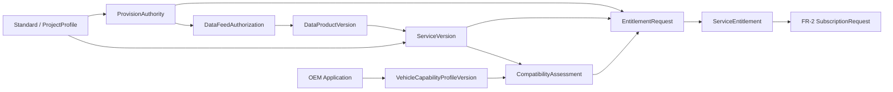

# 济南车路云数据上车服务平台端FR-1功能详细规格

> 文档版本：V0.4评审稿  
> 编制日期：2026-09-15  
> 评审范围：FR-1——服务产品、数据提供权、车型能力、Service Entitlement  
> 上位文档：V0.1整体规划、V0.2功能深化、V0.3功能合理性审查  
> 文档定位：平台端功能评审与详细PRD输入，不替代数据授权文件、法律意见、项目批复、合同、ICD、DVP&R或OEM量产准出文件。

---

**阅读导航：** 本稿按用户要求将16项功能规格前置；正文依次说明评审结论、JTBD与政策标准、领域模型、状态、权限、异常补偿、故事、页面、接口、指标和开发门禁。

## 前置主表：16项L3功能详细规格

### F01｜SP-01 标准与Project Profile基线

| 规格项 | 内容 |
|---|---|
| 用户价值 | 让服务、车型能力和测试使用同一套已冻结规则，并明确哪些是外部标准事实、哪些是项目决定 |
| Actor | Profile治理人员；复核人为项目产品/技术/安全有权角色 |
| 优先级/页面 | P0-G；PG02标准与决策台账 |
| 触发 | 新标准发布/实施/替代/废止；项目决定采用某子集；服务或OEM提出Profile变更 |
| 前置 | 有可核验来源；建立标准Owner和项目决策Owner；具备访问证据的权限 |
| 输入 | 标准编号/名称、发布机构、发布日期、生效日期、状态、原文链接/文件哈希、适用条款、项目采用范围、偏差/扩展、决定人和期限 |
| 主流程 | 登记来源→复核元数据→建立条款到需求映射→生成影响分析→评审采用/不采用/部分采用→冻结ProjectProfileVersion |
| 核心规则 | 外部标准状态与项目采用状态分离；“查不到”记为UNKNOWN；标准名称不能代替ICD；已冻结Profile不可覆盖 |
| 异常出口 | 来源无法访问→`UNVERIFIABLE`并派核验任务；标准冲突→创建DecisionRecord；即将实施→建立生效前迁移门禁 |
| 输出/事件 | StandardRecord、ProjectProfileVersion、DecisionRecord、ImpactSnapshot；`ProjectProfileFrozen/Superseded` |
| 审计/验收 | 可从任一规则追到条款和项目决定；旧Profile引用对象完整可查；未知状态不会显示为“现行” |

### F02｜SP-02 创建并送审数据提供权

| 规格项 | 内容 |
|---|---|
| 用户价值 | 把线下授权结论转化为平台可执行、可审计的范围，而不是只上传附件 |
| Actor | 数据授权/合规经办人创建；有权签认人审批；审计只读 |
| 优先级/页面 | P0-G；PG03数据提供权详情 |
| 触发 | 数据产品拟用于对外服务；新增接收方/用途/字段/区域；授权续期或重签 |
| 前置 | 提供、运营、决定、接收主体已登记；数据分类和用途字典存在；实际签认责任已确认 |
| 输入 | ProvisionAuthority第3.2节全部必填字段及EvidenceDocumentRef |
| 主流程 | 建草稿→选择主体和结构化范围→上传/关联证据→规则完整性检查→预览可覆盖服务→提交→分权复核→记录决定 |
| 核心规则 | 平台只记录有权人的决定；创建人与最终签认人分离；自由文本不能替代结构化范围；附件更新必须新Revision |
| 异常出口 | 主体不明、期限缺失、外部提供条件不明→禁止提交并给补证Owner；文件失效/哈希变化→旧决定不自动继承 |
| 输出/事件 | ProvisionAuthority Revision、ApprovalCase、AuthorityDecisionSnapshot；`ProvisionAuthorityEffective/Rejected` |
| 审计/验收 | 审批时能看到结构化范围、附件哈希、差异、未知项和下游预估；无签认人不得EFFECTIVE |

### F03｜SP-03 数据提供权匹配与默认阻断

| 规格项 | 内容 |
|---|---|
| 用户价值 | 在服务发布或权益审批前，用同一规则回答本次提供是否真的落在授权交集内 |
| Actor | 系统执行；数据授权/合规负责人处理例外和补证 |
| 优先级/页面 | P0-G；PG03、PG04、PG10嵌入式门禁结果 |
| 触发 | ServiceVersion送审；ServiceOfferingVersion上架；EntitlementRequest预检/审批；授权或范围变化 |
| 前置 | 存在候选ProvisionAuthority；本次主体、接收方、目的、服务/字段、区域、环境和时间均已明确 |
| 输入 | 候选授权Revision＋本次请求上下文＋规则版本＋评估时点 |
| 主流程 | 解析请求→逐维匹配→计算允许交集→识别条件/未知→生成AuthorityEvaluation→放行或阻断 |
| 核心规则 | 逐维采用交集而非并集；空值不解释为“全部”；INCONCLUSIVE默认阻断；条件必须可写入服务/权益契约 |
| 异常出口 | 多份授权冲突→不自动择优；空间版本无法映射→MAPPING_UNVERIFIED；时间源异常→评估INCONCLUSIVE |
| 输出/事件 | AuthorityEvaluation：ALLOW/ALLOW_WITH_CONDITIONS/DENY/INCONCLUSIVE，包含reasonCode、fact、evidence、owner、nextAction |
| 审计/验收 | 同一输入和规则版本得到确定性结果；每个拒绝/未知项都有修复入口；人工不能直接把DENY改为ALLOW |

### F04｜SP-04 授权收窄、撤销与影响收口

| 规格项 | 内容 |
|---|---|
| 用户价值 | 授权变化时只停止真正受影响的服务，同时保证没有越权遗漏 |
| Actor | 有权撤权/变更人；数据授权/合规复核；运行保障执行下游停发 |
| 优先级/页面 | P0-G；PG03影响页签，联动FR-4紧急停服页 |
| 触发 | 授权方撤销、收窄、暂停或到期；证据被认定失效 |
| 前置 | 目标Authority Revision已锁定；操作者具备相应范围权限；依赖图可查询 |
| 输入 | 变更类型、原因码、生效时点、收窄维度、新范围、证据、是否紧急、通知对象 |
| 主流程 | 选择对象→计算新旧Diff→生成影响快照→复核最小范围→执行决定→发出撤权事件→跟踪下游收口→归档结果 |
| 核心规则 | 紧急撤权按决定时点立即触发；普通范围调整按已批准窗口；历史Revision和证据保留；恢复必须建立新依据，不回写旧撤销 |
| 异常出口 | 依赖图不完整→影响标UNKNOWN并采用失败安全策略；部分下游未确认→保持OPEN并升级工单；中心不可用→交FR-4预案 |
| 输出/事件 | ImpactSnapshot、RevocationRecord；`AuthorityScopeNarrowed/AuthorityRevoked/DownstreamClosureIncomplete` |
| 审计/验收 | 影响清单至少覆盖DataProduct、ServiceVersion、ServiceOffering、ServiceEntitlement及FR-2/FR-4对象；不允许仅隐藏目录入口 |

### F05｜SP-05 创建并发布DataProductVersion

| 规格项 | 内容 |
|---|---|
| 用户价值 | 把原始接口加工成来源、语义、质量和授权均可追溯的可复用数据产品 |
| Actor | 数据产品经理；数据工程/接口人员补充技术证据；合规和质量Owner复核 |
| 优先级/页面 | P0-C；PG05数据产品与依赖 |
| 触发 | 首次接入权威源；Schema/语义/加工逻辑/地图版本发生兼容性变化；备源引入 |
| 前置 | DataFeedAuthorization有效；来源主体、接口、Schema和数据分类已登记 |
| 输入 | 第3.3节字段、样例、映射规则、算法版本、血缘、授权Ref、QualityPolicyRef、备源Ref |
| 主流程 | 建版本→绑定来源授权→定义字段/语义/时空→登记加工血缘→绑定质量策略→Schema/语义/授权校验→评审发布 |
| 核心规则 | 上游获取权不等于下游提供权；发布版本不可改；备源独立校验授权；原始、派生和指标产品分开 |
| 异常出口 | 来源授权临期→可保存草稿但不得发布；血缘断点→阻断；字段分类未知→转数据治理任务 |
| 输出/事件 | DataProductVersion、LineageGraph、ValidationReport；`DataProductVersionPublished/Invalidated` |
| 审计/验收 | 任一输出字段能追到来源、处理、授权和Schema；修改发布版本会被拒绝并引导新建版本 |

### F06｜SP-06 配置QualityPolicy与备源策略

| 规格项 | 内容 |
|---|---|
| 用户价值 | 明确什么质量足以支撑哪类服务，以及质量不足时应抑制、降级还是切备 |
| Actor | 数据质量Owner创建；服务产品、算法、安全、SRE共同评审 |
| 优先级/页面 | P0-C；PG05质量策略页签 |
| 触发 | 新DataProduct；服务质量要求变化；权威源或备源变化；事故复盘要求调整 |
| 前置 | 质量维度、测量位置、Owner和测试方法已定义；阈值有来源或明确待确认 |
| 输入 | 新鲜度、完整性、一致性、时间同步、空间映射、置信度、窗口、阈值、unknownHandling、degradeAction、fallbackRef |
| 主流程 | 选数据产品→定义质量维度→绑定测量方法→设置门禁/降级→校验备源→回放→审批→生成不可变版本 |
| 核心规则 | QualityPolicy与QualityAssessment分离；无依据不虚构阈值；UNKNOWN单独处理；切备源不得绕过授权和语义兼容 |
| 异常出口 | 测量能力缺失→策略不可生产；备源授权失效→自动从候选移除；策略冲突→转DecisionRecord |
| 输出/事件 | QualityPolicyVersion、EvaluationRun、FallbackPlan；`QualityPolicyApproved/Superseded` |
| 审计/验收 | 每一质量规则有单位、窗口、数据源、阈值依据、失败动作和Owner；实时异常不会改写策略版本 |

### F07｜SP-07 创建ServiceProduct与不可变ServiceVersion

| 规格项 | 内容 |
|---|---|
| 用户价值 | 让城市和OEM对“这项服务到底是什么”形成一个稳定、可测试的契约 |
| Actor | 服务产品经理；数据、算法、接口、安全、运营联合评审 |
| 优先级/页面 | P0-C；PG04服务产品工作室 |
| 触发 | 新服务立项；语义/输出/质量/能力/部署发生不兼容变化；创建兼容升级版本 |
| 前置 | ServiceProduct编码可用；ProjectProfile、DataProduct、授权关系和Owner存在 |
| 输入 | 第3.4节13项最小契约、变更说明、替代/兼容关系、DVP&R引用 |
| 主流程 | 建产品或新版本→填完整契约→绑定依赖→规则校验→生成版本Diff→跨职能评审→发布/退回 |
| 核心规则 | ServiceProduct稳定、ServiceVersion不可变；Service≠Scene≠Output≠Topic；治理等级不得被页面文案弱化；禁用用途必填 |
| 异常出口 | 授权INCONCLUSIVE、依赖未发布、无输出撤销语义、无最低能力或无DVP&R→阻断发布并定位责任人 |
| 输出/事件 | ServiceProduct、ServiceVersion、ContractSnapshot、ReviewCase；`ServiceVersionPublished` |
| 审计/验收 | 发布前13项100%具备明确值或有权决定；发布后任一字段编辑被拒绝并引导新版本 |

### F08｜SP-08 配置场景、输出、能力要求与依赖

| 规格项 | 内容 |
|---|---|
| 用户价值 | 把服务的可用条件、输出语义、车型门槛和依赖拆成可组合、可版本化的规则 |
| Actor | 服务产品经理主责；算法、接口、OEM联合验证人员协作 |
| 优先级/页面 | P0-C；PG04产品工作室的场景/输出/能力/依赖页签 |
| 触发 | 创建ServiceVersion；新增场景；输出Schema或最低能力变化 |
| 前置 | 相关DataProduct、ProjectProfile和字典版本已存在 |
| 输入 | SceneCapabilityVersion、EligibilityPolicyRef、OutputProductVersion、CapabilityRequirementProfileVersion、ServiceDependency、Compute/Delivery/Feedback Profile |
| 主流程 | 分别创建/选择子对象→建立依赖关系→检查循环/冲突/版本兼容→预览不同车型与区域适用性→随ServiceVersion送审 |
| 核心规则 | 子对象各自有Owner和版本；依赖必须声明必须/可选/备选；能力门槛不能直接写进OEM画像；输出更新/撤销规则必填 |
| 异常出口 | 循环依赖、原因码冲突、Selector不支持、计算位置与时延目标不一致→阻断并生成差距项 |
| 输出/事件 | DependencyGraph、CapabilityRequirementProfileVersion、ContractValidationReport |
| 审计/验收 | 可分别回答“什么场景”“输出什么”“车型需具备什么”“依赖谁”；任一依赖UNKNOWN不会被计作通过 |

### F09｜SP-09 服务弃用、迁移与退役

| 规格项 | 内容 |
|---|---|
| 用户价值 | 在升级服务时给OEM明确兼容窗口，并在退役前完成存量收口 |
| Actor | 服务产品经理发起；运营、OEM协同、安全/合规按风险审批 |
| 优先级/页面 | P0-C；PG04生命周期页签、PG05影响图 |
| 触发 | 新版本替代、标准/授权变化、质量无法满足、服务停止运营 |
| 前置 | 已选择替代版本或说明无替代；影响图可计算；通知和退出策略存在 |
| 输入 | 目标版本、生命周期动作、停止新申请时点、迁移截止、兼容窗口、例外对象、退出清单 |
| 主流程 | 生成影响→发起弃用→通知并跟踪迁移→处理例外→执行退役前检查→退役→归档证据 |
| 核心规则 | DEPRECATED与RETIRED分开；默认弃用后停止新权益申请；有活跃依赖不得静默退役；旧版本事实长期可审计 |
| 异常出口 | 无替代版本→建立终止计划；OEM未迁移→升级工单/审批例外；授权先撤销→进入紧急收口而非等待迁移窗 |
| 输出/事件 | MigrationPlan、ImpactSnapshot、RetirementChecklist；`ServiceVersionDeprecated/Retired` |
| 审计/验收 | 退役前每个存量ServiceEntitlement及订阅都有迁移、终止或有权例外结论 |

### F10｜SP-10 ServiceBundle依赖与兼容组合

| 规格项 | 内容 |
|---|---|
| 用户价值 | 让OEM一次理解和申请相关服务组合，同时准确知道哪些组件不可用 |
| Actor | 服务产品经理；权益和兼容规则Owner复核 |
| 优先级/页面 | P1-S；PG04 Bundle页签 |
| 触发 | 多个服务具备共同覆盖、共同测试或版本依赖，单独管理造成重复工作 |
| 前置 | 每个组件ServiceOfferingVersion已独立发布；依赖/冲突规则明确 |
| 输入 | Bundle编码/版本、组件版本范围、required/optional、fulfillmentMode、共同范围、共同测试、迁移策略 |
| 主流程 | 选组件→校验版本与覆盖→定义原子/允许部分履约→预览车型差距→发布BundleVersion |
| 核心规则 | Bundle不是价格套餐；组件独立保留授权和证据；部分履约必须逐项披露缺失及影响 |
| 异常出口 | 必选组件无有效Offering→阻断；组件版本冲突→生成GapFinding；组件退役→Bundle置受影响并启动新版本 |
| 输出/事件 | ServiceBundleVersion、BundleCompatibilityReport；`ServiceBundlePublished/Affected` |
| 审计/验收 | 原子模式缺一必选组件不得申请；部分模式返回明确可用/不可用组件，不显示笼统“已开通” |

### F11｜SP-11 ServiceOfferingVersion上架、暂停与下架（新增）

| 规格项 | 内容 |
|---|---|
| 用户价值 | 在不改变ServiceVersion语义的情况下，精确控制某服务当前向哪类OEM、区域、用途和环境开放申请 |
| Actor | 服务运营主体创建；服务产品、数据授权/合规和安全按治理等级会签 |
| 优先级/页面 | P0-C；FR1-P05 Service Offering页签/列表 |
| 触发 | ServiceVersion拟开放申请；开放对象、区域、用途、通道、时段或配额变化；授权/依赖临期或失效 |
| 前置 | ServiceVersion已APPROVED/PUBLISHED；ProvisionAuthority、服务能力要求、协议模板和支持边界可核验 |
| 输入 | 第3.4.1节字段、目录可见性、申请资格、开放时间、所需审批和下架策略 |
| 主流程 | 选择ServiceVersion→配置开放范围→校验ProvisionAuthority交集→配置能力/协议/期限门槛→影响预览→审批→上架 |
| 核心规则 | Offering不修改服务契约且不承载价格；目录可见、可申请和最终获权分开；范围变化创建新OfferingVersion |
| 异常出口 | 提供权不足→阻断；依赖临期→允许草稿但禁止上架；紧急暂停→停止新申请并计算存量影响，不直接删除ServiceEntitlement |
| 输出/事件 | ServiceOfferingVersion、AuthorityEvaluation、ImpactSnapshot；`ServiceOfferingPublished/Suspended/Retired` |
| 审计/验收 | OEM目录只出现对其可见的Offering；同一ServiceVersion可按不同用途/区域建立不同Offering且证据可追溯 |

### F12｜PC-06 创建VehicleCapabilityProfileVersion草稿

| 规格项 | 内容 |
|---|---|
| 用户价值 | 让OEM用稳定能力组表达一批车型真正具备的服务接收和车内处理能力 |
| Actor | OEM车型能力管理员；OEM内部技术/产品角色协作 |
| 优先级/页面 | P0-C；PG09车型能力画像 |
| 触发 | 新车型/年款/配置组接入；影响能力的软件、地图、终端、HMI或反馈发生变化 |
| 前置 | OEM主体、ApplicationClient和环境已准入；车型能力字段模板来自ProjectProfile |
| 输入 | 第3.5节字段、证据Ref、适用范围、有效期、变更说明 |
| 主流程 | 选择/新建能力组→填写或受控导入→字段校验→与上一版本Diff→保存草稿→提交OEM确认 |
| 核心规则 | 量产默认按车型能力组，不默认维护VIN主档；声明事实与服务兼容结论分开；平台不能代填未知值 |
| 异常出口 | 导入字段未知→保留UNKNOWN并列补充责任；能力组范围重叠→阻断或要求明确优先级；敏感数据超范围→拒收 |
| 输出/事件 | VehicleCapabilityProfileVersion(DRAFT/SUBMITTED)、ValidationReport |
| 审计/验收 | 每个字段显示来源、提交人和时间；缺失项不会自动继承为“支持”；同一车辆范围冲突可被识别 |

### F13｜PC-07 OEM确认、变更和失效能力版本

| 规格项 | 内容 |
|---|---|
| 用户价值 | 明确哪些能力事实由OEM正式负责，并确保后续变化不会静默影响既有结论 |
| Actor | OEM有权确认人；城市联合验证人员无修改权 |
| 优先级/页面 | P0-G；PG09版本确认页签 |
| 触发 | 草稿提交确认；证据补充；能力版本变更、到期、撤回或被新版本替代 |
| 前置 | 必填字段和声明完成；确认人权限、委托和有效期可核验 |
| 输入 | 版本快照、确认结论、适用范围、证据、有效期、限制条件、电子签认信息 |
| 主流程 | 查看Diff/未知→确认或退回→固化OEM_CONFIRMED版本→触发兼容评估；变更时新建版本并计算影响 |
| 核心规则 | 确认人与城市审批分开；确认不等于兼容通过；已确认版本不可编辑；委托和临时权限留痕 |
| 异常出口 | 确认权限失效→阻断；证据到期→版本标临期/过期并触发复检；OEM撤回→精确计算权益/订阅影响 |
| 输出/事件 | ConfirmedCapabilitySnapshot；`CapabilityProfileConfirmed/Superseded/Expired/Withdrawn` |
| 审计/验收 | 城市角色无法修改OEM确认字段；新旧版本、原因、确认人与影响对象均可追溯 |

### F14｜PC-08 服务—车型兼容性评估与差距闭环

| 规格项 | 内容 |
|---|---|
| 用户价值 | 在申请权益前准确说明车型能否使用某服务，以及缺什么、谁负责、如何复检 |
| Actor | 系统规则评估；联合验证人员复核；OEM/服务Owner分别关闭差距 |
| 优先级/页面 | P0-C；PG09兼容矩阵/评估详情 |
| 触发 | OEM确认能力版本；ServiceVersion/ProjectProfile/要求Profile变化；用户主动复检 |
| 前置 | ServiceVersion已发布或处于可验证状态；CapabilityRequirementProfileVersion和OEM能力版本可用 |
| 输入 | 服务要求版本、车型能力版本、ProjectProfileVersion、规则版本、证据、评估时点 |
| 主流程 | 逐项比较→生成PASS/FAIL/UNKNOWN→汇总结论→创建GapFinding→指派Owner/动作→补证→复检 |
| 核心规则 | UNKNOWN不计PASS；平台不得人工勾选兼容；规则变更使旧结果STALE；信息展示和算法消费分别评估 |
| 异常出口 | 规则冲突→INCONCLUSIVE并转Profile决策；证据无法访问→UNKNOWN；地图映射未验证→专门Gap |
| 输出/事件 | CompatibilityAssessment、GapFinding；`CompatibilityPassed/Failed/Inconclusive/Stale` |
| 审计/验收 | 每个结论显示要求、OEM事实、证据、规则、责任人和下一动作；相同版本组合结果可复现 |

### F15｜ES-01 申请Service Entitlement

| 规格项 | 内容 |
|---|---|
| 用户价值 | 让OEM在已知服务和能力边界内，申请一个明确、最小、可执行的使用范围 |
| Actor | OEM服务接入负责人；内部授权代理需有有效委托 |
| 优先级/页面 | P0-C；PG10服务权益 |
| 触发 | OEM拟使用ServiceOffering；既有权益续期或扩大范围 |
| 前置 | 主体、ApplicationClient、环境、协议有效；存在可申请Offering；Capability Profile已确认 |
| 输入 | 服务/版本范围、应用/环境、用途、Coverage、车型能力组、通道、配额、期限、证据目标和说明 |
| 主流程 | 选择Offering→带出允许范围→选择应用/能力/区域→运行授权与兼容预检→查看申请摘要→提交快照 |
| 核心规则 | 请求不得大于Offering、ProvisionAuthority、协议和兼容结论交集；扩大范围必须新Request/Revision；Entitlement不是Subscription |
| 异常出口 | 无有效授权→跳转补证但不能提交；部分能力不兼容→收窄申请或终止；重复申请→显示已有对象并要求续期/变更 |
| 输出/事件 | EntitlementRequest Revision、PrecheckSnapshot；`EntitlementRequested/NeedsCorrection` |
| 审计/验收 | 提交前同时展示人类可读摘要和机器可执行范围；阻断项均有reasonCode、Owner和下一动作 |

### F16｜ES-02 审批、条件授予、收窄、暂停和撤销Service Entitlement

| 规格项 | 内容 |
|---|---|
| 用户价值 | 在完整证据基础上授予不超过必要范围的权益，并能在条件变化后精确收口 |
| Actor | 服务权益审批人；合规/安全按风险会签；OEM确认附加条件 |
| 优先级/页面 | P0-G；PG10审批和影响页签 |
| 触发 | EntitlementRequest提交；补证完成；授权/协议/能力/服务版本变化；主动暂停或撤销 |
| 前置 | AuthorityEvaluation、CompatibilityAssessment、协议、Offering和申请快照有效且版本固定 |
| 输入 | 审批结论、允许范围、期限、配额、机器条件、人工条件、原因码、复核人、下游动作策略 |
| 主流程 | 校验证据新鲜度→比较申请/可授予范围→批准/条件批准/退回/拒绝→申请人接受条件→生成ServiceEntitlement Revision→激活或计划生效 |
| 核心规则 | 编辑人与最终审批人分离；条件批准必须机器可执行或明确人工门禁；ServiceEntitlement有效范围不得大于交集；撤销不删除历史证据 |
| 异常出口 | 审批期间依赖变化→旧预检STALE并退回复检；部分范围可授予→必须显式条件批准，不能静默裁剪；下游收口不完整→保持事件OPEN |
| 输出/事件 | ServiceEntitlement、EntitlementRevision、EntitlementCondition、ApprovalCase、ImpactSnapshot；`EntitlementGranted/Restricted/Suspended/Revoked/Expired` |
| 审计/验收 | 每项授予维度可追到申请、授权、Offering、能力结论和审批；FR-2只能引用ACTIVE且ENABLED的有效Revision |

---

## 0. 评审结论与本轮要拍板的事项

### 0.1 一句话结论

FR-1应建立一条可证明的准入链：**城市是否有权提供 → 原料数据是否有权获取和加工 → 服务版本到底提供什么 → OEM车型是否具备能力 → 某OEM应用是否获得服务权益**。五个问题必须由不同对象、不同责任人和不同证据回答，不能用一个“已授权/已开通”状态代替。

### 0.2 本轮完成标准

本稿评审通过，不代表功能已经开发，而代表以下产品定义可以作为后续详细设计基线：

1. FR-1的对象边界、唯一事实源和不变量被确认；
2. `ProvisionAuthority`、`DataFeedAuthorization`、`ServiceVersion`、`VehicleCapabilityProfileVersion`、`ServiceEntitlement`不再混为一个授权状态；
3. SP-01—SP-11、PC-06—PC-08、ES-01—ES-02均具备Actor、前置、输入、主流程、规则、异常出口、状态、输出和验收证据；
4. 无法核验、授权不匹配、能力不确定时默认不允许进入生产订阅；
5. 页面、逻辑接口、事件、权限、指标和验收用例能够互相追溯；
6. FR-1的输出能无歧义地交给FR-2订阅申请与实例化流程。

### 0.3 建议确认的产品决策

| 决策ID | 建议结论 | 不确认的后果 |
|---|---|---|
| FR1-D01 | 数据提供权、上游数据获取/加工授权、下游服务权益分别建模 | 无法回答平台为何有权获取、加工和向谁提供 |
| FR1-D02 | `ServiceProduct`保持稳定业务身份，`ServiceVersion`发布后不可原地修改 | 订阅、测试、事故证据无法还原当时语义 |
| FR1-D03 | 车型能力由OEM声明并确认，平台只做规则校验和联合验证 | 城市平台越权替OEM作出量产兼容承诺 |
| FR1-D04 | `ServiceEntitlement`只回答“有权使用”，不表示订阅已配置、已发布或已上车 | 一个“已开通”状态会掩盖后续失败 |
| FR1-D05 | 任一必要授权维度为`UNKNOWN/UNVERIFIABLE`时，生产门禁默认阻断 | 缺材料会被误当成已满足 |
| FR1-D06 | `ServiceBundle`作为依赖/兼容组合进入P1-S，不在P0建设价格套餐 | 在运营主体和收费机制未定前过早固化商业模式 |
| FR1-D07 | S1先选一个已获授权、数据成熟的信号灯基础服务跑通 | 无首个纵向样板，功能仍会横向铺开 |
| FR1-D08 | 在V0.3基础上新增P0功能`SP-11 ServiceOfferingVersion` | 内部服务契约会直接暴露为可申请商品，授权和运营开放边界无法独立变化 |

🔵 **待确认：** FR1-D01—D08尚未获得济南项目实际业务、数据、法务、OEM和安全责任人的正式签认。

---

## 1. 问题、角色与JTBD

### 1.1 问题陈述

当前方案已具备服务、授权、能力和权益概念，但如果直接按菜单建设，仍可能出现四类不可接受结果：

- 有数据接口，却无法证明平台是否有权加工并向目标OEM提供；
- 服务名称相同，但不同版本的输入、输出、质量、场景和禁用用途不一致；
- OEM填写了车型资料，却被平台误表述为已完成量产兼容或准出；
- Entitlement获批后，被误认为订阅已经生效、节点已经发布或车辆已经使用。

本轮没有用户访谈记录、现状工单统计、办理时长基线或真实授权材料样本。以下JTBD属于基于方案文本和行业职责的**🔶待验证假设**，不能替代M0访谈证据。

### 1.2 关键Persona与核心Job

| Persona | 触发情境 | 核心功能Job | 社会/情绪Job | 最怕发生 |
|---|---|---|---|---|
| 数据授权/合规负责人 | 某类交通数据拟加工或向OEM提供 | 证明谁基于什么依据，可向谁、为哪种目的、在什么范围和期限内提供 | 面对审计时能清晰解释且不替无权主体背书 | 材料缺失仍被系统视为有效授权 |
| 服务产品经理 | 新建或升级信号灯、GLOSA、拥堵等服务 | 把数据、场景、输出、质量、部署和证据要求固化成不可变服务版本 | 对OEM和内部团队给出一致、可兑现的产品承诺 | 一个服务编码下悄悄改变语义 |
| OEM车型能力管理员 | 新车型/软件版本准备接入城市服务 | 用OEM可负责的事实声明通信、地图、HMI、算法和反馈能力 | 保持车型责任边界，不被城市平台代替作出量产结论 | 能力缺失被人工改成“兼容” |
| 联合验证人员 | 新服务版本或车型能力版本拟进入使用范围 | 用同一Project Profile运行规则化兼容评估并定位差距 | 让双方对失败原因和责任归属有共同事实 | `UNKNOWN`被算作通过，口头豁免无留痕 |
| 服务权益审批人 | OEM应用申请使用某服务 | 在提供权、协议、能力和用途均满足时，授予最小必要范围的可执行权益 | 能快速决策，同时不造成过度授权 | Entitlement范围大于上游授权或平台能力 |
| 审计/安全人员 | 发生撤权、争议、检查或事故 | 还原当时的依据、版本、决策人、影响对象和执行结果 | 能证明系统未越权、未篡改、未隐瞒未知 | 历史版本被覆盖或操作无证据 |

### 1.3 JTBD结构化结论

#### 功能性Jobs

- 在服务发布和权益授予前，完成可重复、可解释的授权匹配；
- 把同名业务能力固化成可追溯、可迁移的服务版本；
- 让OEM用版本化事实声明车型能力，并看见差距和下一动作；
- 只在授权、服务、能力和协议的交集内生成Entitlement；
- 当授权收窄、撤销、到期或依赖变化时，精确定位受影响对象并触发后续停发。

#### 主要Pains

- 授权材料是附件或线下文件，范围无法被系统计算；
- 上游数据获取权被误认为等同于下游对OEM提供权；
- 服务、数据产品、Topic、场景和输出对象混用；
- 车型能力由多个团队提供，软件、地图、HMI和反馈版本不同步；
- 审批只看申请表，不看依赖版本和撤销影响；
- 授权变化后只隐藏目录入口，没有处理存量权益和订阅。

#### 期望Gains

- 审批人看到的是“规则＋事实＋证据＋未知＋影响”，而不只是附件；
- OEM能在申请前知道缺什么能力、由谁补、补完后如何复检；
- 任一ServiceVersion可一键追溯到数据产品、授权、质量和Project Profile；
- 撤权不会扩大停服范围，也不会遗漏真正受影响的应用和服务；
- FR-2可以直接消费有效Entitlement和兼容结论，不再重复人工判断。

### 1.4 截至2026-09-15的政策与标准状态核验

本表只采用政府部门或全国标准信息公共服务平台公开页面。标准正文适用条款仍须由项目标准/Profile责任人获取合法文本后逐条映射；本稿不能用标准标题替代条文核验。

| 依据 | 截止本稿状态 | 对FR-1的产品落点 |
|---|---|---|
| [五部门试点工作通知](https://ythxxfb.miit.gov.cn/ythzxfwpt/hlwmh/tzgg/xzxk/clsczr/art/2024/art_0fc5e3e8d8bd42a4a5c788b09999c44b.html)；[五部门试点城市名单通知及附件](https://www.miit.gov.cn/zwgk/zcwj/wjfb/tz/art/2024/art_7b42963f0fde4af496dfcc9c224be54c.html) | 试点期2024—2026年；名单附件第13项为济南 | SP-01记录试点期和项目采用状态；ServiceVersion、Capability和DVP&R引用统一架构/标准、业务互通、安全可靠和测试评价要求。试点期结束后的延续政策不得预判 |
| [公共数据资源授权运营实施规范（试行）](https://www.nda.gov.cn/sjj/xxgk/zc/xzgfxwj/0120/20250120175648588490013_pc.html) | 2025-03-01施行，有效期5年 | ProvisionAuthority结构化记录数据范围、产品/服务清单、期限、权利义务、安全、评价、变更和退出；实施方案、运营机构、协议及合法性由有权主体决定 |
| [济南市公共数据授权运营办法](https://www.jinan.gov.cn/api-gateway/jpaas-jpolicy-web-server/front/info/detail?iid=111435_7325) | 济南市政府令第286号，2023-12-01施行；本次核验官方页面仍提供文本且未见废止标记 | 区分数据提供单位、授权单位和运营单位；公共数据产品对外服务必须受授权范围、平台环境和安全制度约束 |
| [汽车数据安全管理若干规定（试行）](https://www.cac.gov.cn/2021-08/20/c_1631049984897667.htm) | 2021-10-01施行 | PC-06/07不得把车辆轨迹、音视频、生物识别等敏感信息当作普通能力附件；按车内处理、默认不收集、精度范围适用、脱敏等原则设计反馈与证据 |
| [网络数据安全管理条例](https://www.cac.gov.cn/2024-09/30/c_1729384452307680.htm) | 国务院令第790号，2025-01-01施行 | 授权、访问控制、认证、加密、备份、事件处置、委托/共同处理关系和主体责任应落入数据产品、权益和安全门禁 |
| [GB/T 46998-2025 道路交通管理车路协同系统信息交互接口规范](https://std.samr.gov.cn/gb/search/gbDetailed?id=473EBB99D791455EE06397BE0A0ABB9A) | 推荐性国家标准，2026-07-01实施，当前现行 | SP-01、ServiceVersion、Project Profile和PC-08应登记其适用范围、接口语义及与项目ICD的映射 |
| [GB/T 44286.1-2024 合作式智能运输系统应用集 第1部分：车辆辅助驾驶应用集](https://std.samr.gov.cn/gb/search/gbDetailed?id=nFojQwfWTWA%3D&mode=p) | 推荐性国家标准，2025-03-01实施，当前现行 | 信号灯、绿波、拥堵、VRU、异常停车等辅助驾驶类服务的场景分类、基本性能和数据交互参考；具体适用项仍由 Project Profile 冻结 |
| [GB/T 44286.2-2024 合作式智能运输系统应用集 第2部分：车辆协同驾驶应用集](https://std.samr.gov.cn/gb/search/gbDetailed?id=208E903AB72979F3E06397BE0A0AB2B9) | 推荐性国家标准，2025-03-01实施，当前现行 | 车辆协同驾驶典型应用的分类、定义、场景、基本性能和数据交互参考，适用于场景开发与验证；不能泛化为所有告警场景或通用车云接口 |
| [GB/T 44417-2024 车路协同系统智能路侧协同控制设备技术要求和测试方法](https://std.samr.gov.cn/gb/search/gbDetailed?id=208E903AB66A79F3E06397BE0A0AB2B9) | 推荐性国家标准，2025-03-01实施，当前现行 | 智能路侧协同控制设备技术要求与测试输入；不能作为通用数据源质量或端到端联合验证依据，设备符合也不自动推出服务达成 |
| [GA/T 2151-2024 道路交通车路协同信息服务通用技术要求](https://std.samr.gov.cn/hb/search/stdHBDetailed?id=29ABD5EFA3EC9CE1E06397BE0A0A2756) | 推荐性公共安全行业标准，2025-01-01实施，当前现行 | 道路交通车路协同信息服务通用要求的 Profile 输入，不直接替代项目服务契约、接口或量产准出 |
| [GA/T 1743-2020 道路交通信号控制机信息发布接口规范](https://std.samr.gov.cn/hb/search/stdHBDetailed?id=B62CEA48F6BF3753E05397BE0A0A1046) | 推荐性公共安全行业标准，2021-03-01实施，当前现行 | 信号控制机面向车联网的信息发布通信、格式和内容输入；仍需项目冻结 Movement/车道映射、时效和失效语义 |
| [GB/T 45315-2025 基于LTE-V2X直连通信的车载信息交互系统技术要求及试验方法](https://std.samr.gov.cn/gb/search/gbDetailed?id=2FF37940EB79D753E06397BE0A0A413F) | 推荐性国家标准，2025-02-28实施，当前现行 | PC-06—08在PC5直连车载能力及试验结论中引用；不适用于替代Uu-A、Uu-B或Uu-T业务接口 Profile |
| [GB/T 44721-2024 智能网联汽车 自动驾驶系统通用技术要求](https://std.samr.gov.cn/search/stdPage?q=44721) | 推荐性国家标准，2024-09-29实施，当前现行 | 当服务用于自动驾驶系统而非单纯信息提示时，能力、ODD、安全与准出要求需进入车型能力及DVP&R |
| [GB 47955-2026 智能网联汽车 组合驾驶辅助系统安全要求](https://std.samr.gov.cn/gb/search/gbDetailed?id=aXiuG5lN6q4%3D&mode=p) | 强制性国家标准，已发布但2027-01-01才实施 | SP-01标记UPCOMING并设迁移评估日期；当前不得标成现行，但涉及组合辅助功能的ServiceVersion应提前评估差距 |
| [GB 44721-2026 智能网联汽车 自动驾驶系统安全要求](https://std.samr.gov.cn/search/stdPage?q=44721) | 强制性国家标准，已发布但2027-07-01才实施 | 自动驾驶用途的ServiceOffering和Capability Requirement建立待实施门禁、兼容评估和迁移任务 |
| [《面向车路协同的车云通信安全技术要求》等报批公示](https://www.miit.gov.cn/jgsj/kjs/jscx/bzgf/art/2026/art_56f2261a5280491ba61b4d3551073602.html) | 2026-08-11报批公示，公示期已于2026-09-10结束；本次未核验到正式标准号和实施公告 | 仅作为StandardRecord的“报批/待发布跟踪项”，不能作为现行强制门禁；待正式发布后重新触发影响分析 |

产品化原则：法规、行政决定和强制标准形成Guardrail；推荐性标准是否采用、采用哪些条款及项目扩展，由ProjectProfileVersion冻结；团体指南和产业共识只能标为参考来源，不能冒充强制规范。

---

## 2. 范围、边界与端到端准入链

### 2.1 本轮范围

| 范围 | 包含 | 不包含 |
|---|---|---|
| 标准与项目基线 | 标准台账、适用性、Project Profile、决策和影响 | 编写完整ICD、标准原文版权内容 |
| 数据提供权 | 决定记录、结构化范围、匹配、收窄/撤销影响 | 平台自动作出合法性结论、代替主管/法务签批 |
| 数据产品 | 版本、来源授权、Schema、血缘、质量策略、备源 | 实时数据接入开发和算法加工实现 |
| 服务产品 | 产品、版本、场景、输出、依赖、生命周期 | 参数策略详细设计、灰度发布实现 |
| 车型能力 | OEM声明、确认、联合验证、差距和过期 | OEM车内软件开发、HMI设计、量产发布签字 |
| 服务权益 | 申请、审批、条件、收窄、暂停和撤销 | 订阅向导、运行实例、节点发布和车端回执 |
| 服务组合 | 依赖与兼容Bundle的产品定义 | 价格、折扣、账单、开票和结算 |

### 2.2 五段事实链



### 2.3 三类“授权”不可合并

| 对象 | 回答的问题 | 决定主体 | 不能推出 |
|---|---|---|---|
| `DataFeedAuthorization` | 平台是否可以从某提供方获取并按指定目的加工某些原料数据 | 数据提供方及项目有权主体 | 平台可以向任意OEM提供派生服务 |
| `ProvisionAuthority` | 指定城市/运营主体是否可以向指定接收对象提供指定数据或服务 | 项目实际有权授权/签认主体 | OEM车型具备使用能力、订阅已生效 |
| `ServiceEntitlement` | 指定OEM应用是否获准在限定条件下使用指定服务 | 项目实际服务权益审批主体 | 配置已生成、节点已发布、车辆已展示 |

### 2.4 责任边界

- 平台负责记录、验证结构完整性、执行已签认规则、计算交集、阻断未知并留存证据；
- 平台不负责凭算法推断法律关系，不以“系统校验通过”替代主管、数据持有方、法务、安全或OEM正式签认；
- OEM负责车型能力声明、车型版本确认、车内分发/HMI/算法/量产准出；
- 城市服务产品经理不得修改OEM已确认的能力事实，只能提出差距或发起复检；
- 历史决定、服务版本和能力版本均不可原地覆盖，只能新增版本或追加撤销/失效事实。

---

## 3. 领域对象、唯一事实源与字段字典

### 3.1 核心对象与不变量

| 对象 | 唯一事实源/Owner | 核心不变量 | 被谁引用 |
|---|---|---|---|
| `StandardRecord` | 标准/Profile治理角色 | 外部发布状态与项目采用状态分开；保留来源和核验时间 | ProjectProfile、规则、ICD、测试 |
| `ProjectProfileVersion` | 项目Profile委员会/有权产品技术角色 | 已冻结版本不可覆盖；未决项显式存在 | ServiceVersion、Capability、兼容评估 |
| `ProvisionAuthority` | 数据授权/合规角色记录，有权主体签认 | 对象、目的、字段、区域、期限、接收方和再提供条件可计算 | ServiceVersion、Entitlement、停发影响 |
| `DataFeedAuthorization` | 上游数据关系Owner | 获取、加工、派生、保存和退出范围可追溯 | DataProductVersion |
| `DataProductVersion` | 数据产品Owner | 来源、Schema、血缘、授权和质量策略均版本化 | ServiceVersion |
| `QualityPolicyVersion` | 数据质量Owner | 策略和实时质量事实分离；阈值无依据时不得虚构 | DataProductVersion、运行资格 |
| `ServiceProduct` | 服务产品Owner | 稳定服务编码和业务身份 | ServiceVersion、目录 |
| `ServiceVersion` | 服务产品Owner，跨职能审批 | 发布后不可变；完整引用输入、输出、场景、质量、部署和证据 | Entitlement、Subscription、测试 |
| `ServiceOfferingVersion` | 服务运营主体 | 表达当前向谁、在哪、按什么用途和条件开放；不承载价格 | EntitlementRequest、服务目录 |
| `CapabilityRequirementProfileVersion` | 服务产品＋OEM联合规则Owner | 表达服务需求侧的机器可比较能力要求，不写入OEM声明 | CompatibilityAssessment |
| `SceneCapabilityVersion` | 服务产品/算法Owner | 场景资格与服务身份分离 | ServiceVersion |
| `OutputProductVersion` | 服务产品/接口Owner | 输出语义、Schema、TTL、更新/撤销和原因码版本化 | ServiceVersion、ICD |
| `VehicleCapabilityProfileVersion` | OEM能力管理员 | OEM声明事实不可由城市代改；必须有适用车型/软件范围和有效期 | CompatibilityAssessment、Subscription |
| `CompatibilityAssessment` | 联合验证Owner | 规则版本、事实、证据、结果和未知项不可缺 | EntitlementRequest、准出 |
| `EntitlementRequest` | OEM申请人 | 申请范围是快照；提交后修改产生新Revision | ApprovalCase |
| `ServiceEntitlement`、`EntitlementRevision`、`EntitlementCondition` | 服务权益审批角色 | 权益范围不得超出ProvisionAuthority、Offering、协议和能力交集 | FR-2 SubscriptionRequest |
| `ServiceBundleVersion` | 服务产品Owner | 表达依赖/兼容和部分可用策略，不表达价格 | EntitlementRequest，P1-S |
| `ImpactAssessmentSnapshot` | 系统生成、业务复核 | 计算时间、依赖版本、未知对象和爆炸半径固定留存 | 撤权、退役、过期和变更 |
| `EvidenceDocumentRef` | 证据提交方＋平台审计 | 保存来源、文号、哈希、签认人、有效期和访问权限，不在日志暴露敏感附件 | Authority、能力、审批、审计 |

### 3.2 ProvisionAuthority关键字段

| 字段组 | 必需字段 | 规则 |
|---|---|---|
| 标识 | authorityId、revision、title | ID稳定，修改范围必须新Revision |
| 主体 | providerEntity、operatorEntity、decisionEntity、permittedRecipientSelector | 实际主体待项目确认；不能只填自由文本名称 |
| 目的 | purposeCode、businessDescription、allowedUse、prohibitedUse | 权益用途必须是允许用途子集 |
| 数据/服务 | dataProductSelector、fieldSelector、serviceSelector、derivationAllowed | 字段为空不等于全部字段；必须声明范围语义 |
| 空间环境 | coverageSelector、environmentScope、crossDomainCondition | 生产、测试环境分别授权；空间版本需冻结 |
| 时间 | validFrom、validTo、reviewAt、revocationEffectiveAt | 所有判断使用明确时区和有效时点 |
| 外部提供 | externalProvisionAllowed、redistributionRule、recipientClass、aggregationRequirement | “可以加工”不能自动推导“可以外部提供” |
| 数据治理 | classification、precisionLimit、retentionRuleRef、exportRestriction | 具体分类和期限由有权规则确认 |
| 决定 | decisionOutcome、conditionSet、lifecycleStatus、verificationStatus | 决定结果、生命周期和可核验性分栏 |
| 证据 | basisType、documentRefs、signatory、signedAt、documentHash | 系统不把“上传附件”自动认定为有效 |
| 撤销 | revocable、revocationReasonCodes、exitObligation、downstreamActionPolicy | 撤销影响必须可计算并可执行 |

### 3.3 DataProductVersion关键字段

| 字段组 | 必需字段 | 规则 |
|---|---|---|
| 身份版本 | dataProductId、version、status、owner | 业务身份与版本分离 |
| 来源 | sourceSystem、authoritativeLevel、DataFeedAuthorizationRef | 无有效上游关系不得标记可生产使用 |
| 契约 | schemaRef、semanticProfileRef、fieldSet、unit/time/spatialSemantics | 字段、单位、时空语义必须可验证 |
| 血缘 | rawSourceRefs、processingStepRefs、algorithmVersion、mapVersion | 能追溯到原始源和派生处理 |
| 质量 | QualityPolicyVersionRef、fallbackSourceRefs、unknownHandling | 备源也需独立授权和质量规则 |
| 分类治理 | dataClass、personal/sensitiveFlag、precision、retentionRef | “不含VIN”不自动等于匿名 |
| 生命周期 | publishedAt、deprecatedAt、retiredAt、supersedes | 下游引用期间不可删除版本事实 |

### 3.4 ServiceVersion最小契约

每个服务版本至少冻结以下13项，缺少任一项不得发布：

1. 服务编码、版本、Owner和目标用户；
2. JTBD、信息/建议/预警治理等级和禁用用途；
3. 输入DataProductVersion及ProvisionAuthority关系；
4. SceneCapability和Eligibility规则版本；
5. OutputProduct、Schema、事件更新/撤销语义和原因码；
6. CoverageSelector允许类型、空间版本和方向性；
7. ComputePlacementProfile及端到端测量边界；
8. ServiceDeliveryProfile、通道、TTL、质量和降级规则；
9. 最低车型能力和兼容规则；
10. FeedbackProfile及最高可要求证据等级；
11. 安全、数据分类、保留和审计引用；
12. 依赖图、兼容窗、迁移和退役方案；
13. DVP&R用例集及发布门禁。

### 3.4.1 ServiceOfferingVersion关键字段

`ServiceVersion`回答“服务是什么”，`ServiceOfferingVersion`回答“当前向谁、在哪里、为哪种用途开放”，`ServiceEntitlement`回答“某应用最终获得什么权利”。三者不能省略中间层。

| 字段组 | 必需字段 | 规则 |
|---|---|---|
| 身份版本 | offeringId、version、status、owner | Offering版本不可静默覆盖 |
| 服务约束 | serviceVersionRange、profileRef、minimumCapabilityRequirementRef | 不允许引用已退役或不兼容服务版本 |
| 可见对象 | recipientClass、tenantSelector、catalogVisibility | 目录可见不等于可申请，可申请不等于获权 |
| 使用边界 | allowedPurpose、prohibitedUse、Coverage、environment、channelScope | 必须是ProvisionAuthority和服务契约的子集 |
| 时间数量 | availableFrom/To、quotaPolicy、rateLimit、supportWindow | 不在本对象记录价格、折扣或账单 |
| 服务水平 | deliveryProfileRef、qualityBoundary、evidenceTarget | 明确测量点和无法核验处理 |
| 依据 | provisionAuthorityRefs、agreementTemplateRef、approvalRef | 任一关键依据失效触发暂停新申请和影响评估 |

### 3.4.2 CapabilityRequirementProfileVersion关键字段

| 字段组 | 必需字段 | 规则 |
|---|---|---|
| 适用范围 | requirementProfileId、serviceVersionRef、governanceLevel | 信息提示、建议、预警、算法消费分别定义要求 |
| 通信 | Uu/PC5、消息Profile、安全协议、时间同步、更新/撤销处理 | “可以联网”不能代替消息和安全能力 |
| 地图空间 | 地图版本范围、坐标/道路模型、Movement/车道映射、精度 | 未验证映射应输出UNKNOWN或阻断Gap |
| HMI与算法 | 展示/语音/触觉要求、优先级、抑制、算法消费、仲裁和降级 | 平台只定义要求，不替OEM设计车内实现 |
| 反馈证据 | 最低可提供等级、抽样/聚合、诊断授权、原因码 | 不得要求超出ProvisionAuthority和数据最小化边界的反馈 |
| 规则 | hard/soft、比较算子、兼容范围、证据要求、有效期 | 所有结论由版本化规则计算，不接受手工“兼容” |

### 3.5 VehicleCapabilityProfileVersion关键字段

| 字段组 | 必需字段 | 规则 |
|---|---|---|
| 车型范围 | OEM、品牌、车型、年款、配置组、销售区域 | 量产默认按稳定能力组，不默认逐VIN建档 |
| 软件范围 | T-Box/网联终端、座舱、ADAS/ADS软件版本范围 | 任一影响能力的软件变化需评估是否新版本 |
| 通信 | Uu-A/Uu-B/PC5支持、协议/Profile、主备通道、时间同步 | “网络可连”不等于支持服务语义 |
| 地图空间 | 地图供应方、版本范围、坐标系、Movement/车道映射能力 | 映射无法核验时不得判兼容 |
| HMI | 显示、语音、触觉、优先级、抑制和驾驶员设置能力 | 城市平台不规定具体量产HMI实现 |
| 算法 | 是否允许作为算法输入、仲裁位置、安全降级能力 | 信息展示能力不能推导算法消费能力 |
| 安全 | 信任锚、验签、防重放、时间窗、证书策略 | 不保存量产私钥 |
| 反馈 | 可提供R3—R6中的哪些证据、抽样/聚合/诊断方式 | 未承诺的深层回执显示不可核验 |
| 证据有效性 | OEM确认人、确认时间、证据Ref、validFrom/validTo | OEM确认与联合验证结论分开 |

### 3.6 ServiceEntitlement关键字段

| 字段组 | 必需字段 | 规则 |
|---|---|---|
| 获权主体 | tenantId、applicationClientId、environment | 权益授予具体应用与环境，不只授予企业名称 |
| 服务 | serviceOfferingVersionId、serviceProductId、allowedVersionRange、bundleRef | 不默认覆盖未来不兼容大版本 |
| 用途 | purposeCode、allowedUse、prohibitedUse | 必须落在ProvisionAuthority和协议交集内 |
| 范围 | CoverageSelector、vehicleCapabilityProfileRefs、channelScope | Entitlement不是逐车实时兴趣 |
| 数量质量 | quota、rateLimit、SLA/qualityBoundary、evidenceTarget | SLA与证据目标必须有测量口径 |
| 时间 | validFrom、validTo、renewalReviewAt | 过期后不得新建/续期生产订阅 |
| 条件 | entitlementRevisionId、conditionRefs、conditionOwner | 条件拆为限制、激活前提和持续义务；机器条件必须进入FR-2预检 |
| 依据 | authorityEvaluationRef、agreementRef、compatibilityAssessmentRefs、approvalCaseRef | 所有依据固定到版本 |
| 状态 | grantLifecycleStatus、controlStatus、reasonCode | 生命周期与暂停控制分开 |

---

## 4. 状态模型与联动规则

### 4.1 状态维度分离

| 对象 | 生命周期状态 | 独立结果/控制维度 |
|---|---|---|
| StandardRecord | REGISTERED / EFFECTIVE / UPCOMING / WITHDRAWN / SUPERSEDED / UNKNOWN | `projectAdoptionStatus=DRAFT/PROPOSED/ADOPTED/NOT_ADOPTED/SUPERSEDED` |
| ProjectProfileVersion | DRAFT / IN_REVIEW / FROZEN / SUPERSEDED / RETIRED | `verificationStatus=VERIFIED/PARTIAL/UNVERIFIABLE` |
| AuthorityReviewCase | DRAFT / SUBMITTED / IN_REVIEW / RETURNED / APPROVED / REJECTED / WITHDRAWN | 审批过程不写入已生效授权对象 |
| ProvisionAuthorityVersion | PENDING_EFFECTIVE / ACTIVE / SUSPENDED / EXPIRING / EXPIRED / REVOKED / SUPERSEDED | `decisionOutcome=APPROVED/APPROVED_WITH_CONDITIONS`、`verificationStatus`和条件独立 |
| DataProductVersion | DRAFT / VALIDATING / IN_REVIEW / PUBLISHED / DEPRECATED / RETIRED / INVALIDATED | 实时质量由QualityAssessment表达 |
| QualityPolicyVersion | DRAFT / IN_REVIEW / APPROVED / SUPERSEDED / RETIRED | 不承载当前数据好坏 |
| ServiceVersion | DRAFT / VALIDATING / IN_REVIEW / APPROVED / PUBLISHED / DEPRECATED / RETIRED | `REJECTED/WITHDRAWN`为流程出口；`APPROVED`不等于已上架 |
| ServiceOfferingVersion | DRAFT / IN_REVIEW / PUBLISHED / SUSPENDED / DEPRECATED / RETIRED | `catalogVisibility`和申请资格结果独立 |
| VehicleCapabilityProfileVersion | DRAFT / SUBMITTED / OEM_CONFIRMED / SUPERSEDED / EXPIRED / WITHDRAWN | 联合验证由Qualification/Compatibility对象表达 |
| CompatibilityAssessment | `runStatus=QUEUED/RUNNING/COMPLETED/FAILED/CANCELLED` | `result=COMPATIBLE/CONDITIONAL/INCOMPATIBLE/INCONCLUSIVE`；`validity=CURRENT/STALE/EXPIRED/INVALIDATED` |
| EntitlementRequest | DRAFT / SUBMITTED / IN_REVIEW / NEEDS_INFO / APPROVED / CONDITIONALLY_APPROVED / REJECTED / WITHDRAWN / REQUEST_EXPIRED | 审批结果不代表ServiceEntitlement已激活 |
| ServiceEntitlement | PENDING_ACTIVATION / ACTIVE / EXPIRING / SUSPENDED / EXPIRED / REVOKED / TERMINATED / SUPERSEDED | `EntitlementCondition.fulfillment=PENDING/SATISFIED/BREACHED/EXPIRED/CANCELLED`独立 |
| ServiceBundleVersion | DRAFT / VALIDATING / PUBLISHED / DEPRECATED / RETIRED | `fulfillmentMode=ATOMIC/PARTIAL_ALLOWED` |

### 4.2 授权匹配结果不是生命周期状态

每次服务发布、权益审批和依赖变化均生成不可变`AuthorityEvaluation`：

| 结果 | 含义 | 生产门禁 |
|---|---|---|
| ALLOW | 所有必要维度有证据且匹配 | 可进入下一门禁 |
| ALLOW_WITH_CONDITIONS | 范围匹配，但附有可执行限制 | 仅在条件进入服务/权益契约后放行 |
| DENY | 至少一项明确不匹配 | 阻断 |
| INCONCLUSIVE | 材料、接口、权限或事实不足 | 默认阻断，并指向责任人和补证入口 |

### 4.3 关键联动矩阵

| 触发 | 系统必须执行 | 禁止行为 | 后续Owner |
|---|---|---|---|
| ProvisionAuthority临期 | 列出受影响DataProduct、ServiceVersion、ServiceOffering、ServiceEntitlement和FR-2对象；生成续期任务 | 只发通知不计算影响 | 数据授权/合规 |
| ProvisionAuthority收窄 | 重算交集；阻断新增超范围ServiceEntitlement；生成精确收口计划 | 直接修改历史EntitlementRevision且不留Revision | 合规＋权益审批 |
| ProvisionAuthority撤销 | 立即发布撤权事件；冻结新增；精确影响存量；进入FR-4停发编排 | 只把服务目录隐藏 | 有权撤权人＋运行保障 |
| DataFeedAuthorization失效 | 相关DataProduct进入受控不可用/待评估；重算服务可用性 | 自动切到未获权备源 | 数据产品Owner |
| DataProductVersion失效 | 标记依赖ServiceVersion受影响，阻断新权益，触发降级/停服评估 | 改写已发布ServiceVersion引用 | 服务产品Owner |
| ProjectProfile新版本冻结 | 将引用旧规则的CompatibilityAssessment置为STALE并计算复检范围 | 自动把旧结论升级为新Profile通过 | Profile Owner＋联合验证 |
| CapabilityProfile被新版本取代 | 旧版保留；按影响规则将兼容结论置STALE；列出ServiceEntitlement/订阅 | 直接删除旧版或城市代改OEM字段 | OEM＋联合验证 |
| ServiceVersion弃用 | 默认停止新申请，生成迁移窗口和替代版本 | 把DEPRECATED显示为RETIRED | 服务产品Owner |
| ServiceVersion退役 | 确认无未处置Offering、ServiceEntitlement/订阅或存在获批退出计划后执行 | 有活跃依赖时静默退役 | 服务产品＋运营 |
| Entitlement收窄/暂停/撤销 | 计算受影响SubscriptionRequest/Instance并交FR-2/FR-4处置 | 把权益撤销等同于历史证据删除 | 权益审批＋订阅运营 |

### 4.4 并发、重复和迟到规则

- 所有可变草稿使用`revision`或ETag进行乐观锁控制，过期页面保存必须返回差异而非覆盖；
- 相同幂等键的提交、审批、撤销只产生一次业务结果；
- 撤销生效后到达的旧审批回调、旧能力确认或旧授权文件不得恢复对象；
- 依赖发生变化后，旧评估结果保留为历史并标`STALE`，不得直接改写为失败或删除；
- 时间判断统一使用项目冻结时区和可信时间源，页面同时显示业务时区与原始时间戳。

---

## 5. 动作、角色与权限门禁

### 5.1 角色定义

| 角色 | 责任边界 |
|---|---|
| STD 标准/Profile管理员 | 维护标准来源、项目采用关系、待实施提醒；不批准数据提供权 |
| AUTH-O 授权经办人 | 结构化录入材料、补证和影响说明；不作最终合法性签认 |
| AUTH-A 有权授权/合规签认人 | 记录实际授权决定、条件、期限和撤销；具体主体由济南项目确认 |
| DP 数据产品经理/质量Owner | 维护数据源、DataProduct、血缘和QualityPolicy；不扩大外部提供范围 |
| SPM 服务产品经理 | 定义ServiceProduct/Version及生命周期；不代替OEM确认车型能力 |
| OPS 服务运营主体 | 管理ServiceOffering、目录开放、迁移和运行协同；不制定法律结论 |
| OEM-E OEM能力编辑人 | 录入能力草稿和证据；不能确认自己无权代表的车型结论 |
| OEM-A OEM能力确认人 | 代表OEM确认能力版本及限制；不修改城市服务要求 |
| TEST 联合验证负责人 | 复核兼容评估证据、差距和复检；不人工篡改机器结果 |
| ENT-R OEM权益申请人 | 提交用途、范围、期限和能力组申请；不能查看其他OEM数据 |
| ENT-A 服务权益审批人 | 批准、条件批准、退回、拒绝、暂停或撤销；不得越过ProvisionAuthority |
| SEC 安全/数据治理复核人 | 对高风险数据、用途、算法消费和跨域提供进行会签 |
| RUN 运行保障人员 | 执行FR-4停发和恢复；不改变授权决定或ServiceVersion |
| AUD 审计/监管只读角色 | 按授权范围查看证据、导出和完整性校验；默认无业务修改权 |

### 5.2 动作×角色×门禁矩阵

| 动作 | 发起/编辑 | 最终确认/批准 | 系统执行 | 强制门禁 |
|---|---|---|---|---|
| 登记外部标准 | STD | STD复核；项目采用由Profile Owner决定 | 来源状态提醒 | 外部状态与项目采用分离；来源不可核验时标UNKNOWN |
| 冻结Project Profile | STD/领域Owner | 项目有权Profile Owner；必要方会签 | 固化版本和影响 | 未决项、Breaking Change和迁移方案可见 |
| 创建数据提供权 | AUTH-O | AUTH-A；高风险由SEC会签 | 结构校验和版本固化 | 创建人与最终签认人分离；系统不作法律结论 |
| 收窄/撤销提供权 | AUTH-A | 普通变更按授权规则复核；C0按已预授权机制 | 影响计算、通知、停发请求 | 范围、生效时间、原因、证据和ImpactSnapshot必备 |
| 发布DataProductVersion | DP | 数据Owner；敏感/重要数据由SEC复核 | Schema/血缘/授权检查 | 来源授权、Schema、血缘、分类、质量Owner缺一阻断 |
| 批准QualityPolicy | DP/质量Owner | 服务Owner＋安全/测试按等级会签 | 版本化规则发布 | 阈值来源、测量点、UNKNOWN动作和恢复条件必备 |
| 发布ServiceVersion | SPM | 服务Owner；数据/授权/安全/测试动态会签 | 13项契约校验 | 编辑、最终审批、目录发布不得同一高风险账号包办 |
| 上下架Offering | OPS | SPM＋AUTH-A/SEC按风险会签 | 目录可见性和申请门禁 | Offering范围必须是ServiceVersion和ProvisionAuthority子集 |
| 发布/退役Bundle | SPM | 必选Offering Owner | 兼容校验 | 不得包含价格；逐Item表达可用性 |
| 编辑能力草稿 | OEM-E | OEM-A确认 | 格式、范围和冲突检查 | 城市角色不可修改OEM声明；默认不收VIN名单 |
| 运行兼容评估 | TEST/OEM-E/SPM | TEST复核证据 | 规则引擎生成结果 | 只能修正输入或规则，不能手改结果 |
| 提交权益申请 | ENT-R | OEM内部用途确认按项目规则 | 固化Request Revision | 只能选择对该OEM可见且可申请的Offering |
| 授予/收窄权益 | ENT-A | 唯一最终A；AUTH-A/SEC动态会签 | 计算交集并生成EntitlementRevision | 不允许静默裁剪；条件批准需申请人确认 |
| 暂停/撤销权益 | ENT-A/AUTH-A按事由 | 依权限策略 | 影响计算并向FR-2/FR-4发事件 | 不删除历史；只影响最小必要范围 |
| 查看/导出证据 | AUD及业务角色 | 敏感导出按分级审批 | 脱敏、水印、审计 | 租户、对象、环境、分类和目的均进入ABAC |

### 5.3 职责分离与Break-glass

- 权限作用域至少由`tenant＋subject/application＋environment＋service/offering＋dataClassification＋coverage＋governanceLevel＋actionRisk`共同决定；
- 高风险对象默认实施“提议—复核—批准—执行—审计”分离；同一自然人因组织规模需要兼任时，必须由正式SoD例外记录约束，而不是在代码中默认放开；
- C0撤权/安全停服可采用预授权Break-glass：强认证值班人先执行最小范围止损，系统立即通知第二复核人并强制事后复核；恢复不得由同一人单独完成；
- 任何Break-glass不得用于扩大数据提供权、授予新权益或人工改写兼容结果。

---

## 6. 主流程、异常补偿与跨FR交接

### 6.1 正常主流程

```text
1. 登记并核验StandardBaseline，冻结ProjectProfileVersion
2. 确认DataFeedAuthorization，创建DataProductVersion和QualityPolicyVersion
3. 创建ServiceProduct与不可变ServiceVersion
4. 绑定Scene、Output、Eligibility、Capability Requirement、依赖和DVP&R
5. 运行ProvisionAuthority匹配并发布ServiceOfferingVersion
6. OEM创建并确认VehicleCapabilityProfileVersion
7. 运行CompatibilityAssessment，关闭或接受GapFinding
8. OEM从Offering提交EntitlementRequest Revision
9. 系统计算Request、Offering、ProvisionAuthority、协议和兼容结论的交集
10. 有权角色批准、条件批准、退回或拒绝
11. 申请人确认受限Scope/条件，系统生成ServiceEntitlement及EntitlementRevision
12. 激活前提满足后ServiceEntitlement进入ACTIVE＋ENABLED
13. FR-2仅引用上述有效版本创建SubscriptionRequest
```

### 6.2 异常与补偿矩阵

| 异常 | 即时控制 | 补偿路径 | 关闭证据 |
|---|---|---|---|
| 提供权只覆盖申请一部分 | 不静默裁剪、不批准原申请 | 展示可授予交集；申请人接受后创建新Request Revision，或退回修改 | 原申请、新Revision、Scope Diff、确认和决定 |
| 授权材料缺失/不可核验 | AuthorityEvaluation=INCONCLUSIVE并阻断生产 | 指派补证Owner；材料核验后新建Evaluation | 缺项、证据Ref、核验人和时间 |
| 授权即将到期 | 生成临期影响和续期任务 | 新建AuthorityVersion；未续期到点自动阻断 | 续期决定或到期执行清单 |
| 授权紧急撤销 | 阻断新增并触发C0精确停发 | 收口Entitlement、Subscription、节点及访问Scope；跟踪不可达对象 | 决定、ImpactSnapshot、停发和节点回执 |
| 上游数据授权失效 | 禁止继续使用该来源 | 仅切换到已预批准且语义/质量兼容的备源，否则暂停Offering和运行服务 | 来源切换或暂停证据 |
| QualityPolicy无依据/过期 | 阻断新数据/服务发布 | 建测试和签认任务，不用临时默认阈值进生产 | 新策略、测量数据和审批 |
| 服务依赖发生Breaking Change | 旧ServiceVersion保持不变 | 创建新版本、兼容窗和迁移计划 | 新旧Diff、DVP&R和迁移状态 |
| ServiceVersion弃用 | 停止新Offering/权益引用 | 通知OEM、建立迁移Campaign和截止日 | 每个依赖对象的迁移/终止决定 |
| 有活跃依赖时申请退役 | 阻断退役 | 完成迁移，或取得有权强制终止决定 | 零未处置依赖或强制退出证据 |
| 能力证据到期 | 相关Assessment变STALE/EXPIRED | OEM补证并创建新能力版本，重新兼容评估 | 新证据、OEM确认和Assessment |
| OEM撤回能力版本 | 阻断新申请，下游进入影响评估 | 提交替代版本，重新确认/评估/准出 | 撤回原因和替代链 |
| Project Profile变化 | 旧Assessment变STALE | 按影响重跑；Breaking Change需新服务版本 | Profile Diff和评估结果 |
| 条件批准的激活前提未满足 | Entitlement=PENDING_ACTIVATION | 指派证据任务，满足后按规则复核 | Condition状态、证据和激活人/时间 |
| 持续义务被违反 | 按条件暂停或撤销 | 纠正、复核、恢复或正式撤销 | 违反事实、处置和恢复证据 |
| Entitlement收窄 | 新范围外不得继续新投递 | 新建EntitlementRevision并交FR-2/FR-4精确收口 | 新旧Diff和执行回执 |
| 审批过程中依赖变化 | 旧预检和审批输入置STALE | 返回影响分析和必要会签 | 失效原因、新快照和新决定 |
| 并发修改草稿 | 返回版本冲突，不覆盖 | 展示Diff，用户基于最新ETag重放修改 | 旧/新ETag和合并记录 |
| 迟到的旧审批/确认回调 | 丢弃业务变更但保留技术审计 | 提示已被更高Revision替代 | 幂等键、事件版本和忽略原因 |
| 影响图存在UNKNOWN | 高风险操作默认阻断或采用失败安全策略 | 转人工核查；补全依赖后重算 | 未知项Owner、结论和新ImpactSnapshot |

### 6.3 与后续FR的交接契约

| 输出方 | 交给 | 必须携带 | 不允许交付的状态 |
|---|---|---|---|
| FR-1 | FR-2订阅 | ACTIVE＋ENABLED的EntitlementRevision、Offering、ServiceVersion、Capability版本、CURRENT兼容评估、条件、覆盖和期限 | 过期/撤销/STALE/INCONCLUSIVE对象 |
| FR-1 | FR-3参数策略 | ServiceVersion、Eligibility、Quality、Safety/Capability Requirement引用 | 自由文本条件、未版本化规则 |
| FR-1 | FR-4发布运行 | 撤权/暂停/退役ImpactSnapshot、最小停发作用域、原因、生效时点 | “全部停掉”等不可计算范围 |
| FR-1 | FR-5证据运营 | 当时有效的授权、服务、能力、权益和评估版本哈希 | 被覆盖或只保留当前值的对象 |

---

## 7. 用户活动主干与版本切片

### 7.1 按Persona拆分活动主干

| Persona旅程 | 发现/准备 | 建立事实 | 做出决定 | 执行/交接 | 变化/退出 |
|---|---|---|---|---|---|
| 数据授权/合规 | 收到拟提供需求 | 结构化范围和证据 | 批准/条件批准/拒绝 | 发布有效Authority | 续期、收窄、撤销、影响收口 |
| 服务产品经理 | 识别用户Job和数据能力 | 建DataProduct/ServiceVersion | 完成跨职能评审 | 发布Offering | 兼容迁移、弃用、退役 |
| OEM能力管理员 | 选择拟接入Offering | 声明并确认车型能力 | 处理兼容差距 | 形成可用能力版本 | 软件/地图/车型变化后新版本 |
| OEM权益申请人 | 浏览对其可见Offering | 选择用途、范围和期限 | 提交/接受受限Scope | 获得ServiceEntitlement | 续期、收窄、终止 |
| 权益审批人 | 接收申请 | 查看交集、风险和未知 | 批准/条件批准/退回/拒绝 | 激活有效Revision | 暂停、撤销、到期收口 |
| 审计/安全 | 收到检查/风险触发 | 定位当时版本和证据 | 判断是否越权/缺证 | 导出证据包/处置要求 | 跟踪修复和关闭 |

不能把上述六条旅程合成一条“大用户故事地图”，否则会掩盖业务决策人、OEM责任和系统自动规则的边界。

### 7.2 建议版本切片

| 切片 | 边界 | 必须实现 | 暂不实现 | 验证目标 |
|---|---|---|---|---|
| FR1-S1 首个可信准入链 | 一个已获授权信号灯基础服务、一家OEM、一个应用、一个车型能力组、一个区域、Uu-A | SP-01—09、SP-11、PC-06—08、ES-01—02的基础变体；完整版本/状态/证据/退出 | Bundle、批量导入高级规则、多区域复用、自动续期 | 能否在默认拒绝前提下生成一个有效ServiceEntitlement并精确撤销 |
| FR1-S2 生产加固 | S1＋多软件/地图版本、备源、条件批准 | 复杂差距、持续义务、权限委托、并发与迟到、自动临期影响 | 跨城市互认和商业计费 | 能否稳定处理依赖变化和部分授权 |
| FR1-S3 多服务规模化 | 多个信号灯/V2X服务、多OEM、多区域 | ServiceBundle、Offering复用、批量迁移、兼容矩阵规模化 | 价格套餐、账单、生态市场 | 能否降低重复配置而不弱化逐项授权和证据 |
| FR1-S4 高治理等级 | VRU、算法消费/S2等高风险用途 | 更严格能力要求、DVP&R、安全会签、反馈最小化和准出 | 未签认的自动控制闭环 | 能否证明平台没有越过OEM和法定责任边界 |

S1不是“只做四张列表页”，而是把一个真实服务从依据、数据产品、服务版本、Offering、OEM能力、兼容评估到权益授予和撤销跑通。

### 7.3 P0/P1重分

| 类别 | 功能 |
|---|---|
| P0-G硬门禁 | SP-01、SP-02、SP-03、SP-04、PC-07、ES-02，以及所有权限/审计/默认阻断 |
| P0-C核心闭环 | SP-05、SP-06基础变体、SP-07、SP-08、SP-09基础退役门禁、SP-11、PC-06、PC-08、ES-01 |
| P1-S规模化 | SP-10、复杂Bundle、批量迁移、多区域复用、高级备源自动切换、兼容矩阵批处理 |
| P2-E探索 | 价格套餐、自动定价、账单结算、跨城市权益互认、未获批的自动控制用途 |

---

## 8. L4 User Story与Gherkin验收

以下故事按Mike Cohn格式表达用户价值，每个场景只保留一个When和一个Then。业务规则、接口和非功能约束仍引用本稿其他章节，不将单条Story写成大Epic。

### US-FR1-01 冻结可追溯的Project Profile

- **As a** 标准/Profile管理员
- **I want to** 把已核验标准及项目采用决定冻结为一个Profile版本
- **so that** 服务、OEM和测试团队使用同一规则基线

**Scenario：待实施标准不能冒充现行规则**

- **Given** 标准记录已发布但实施日期晚于当前评估时点，且项目尚未作提前采用决定
- **When** 我提交Project Profile冻结评审
- **Then** 平台把该标准标为`UPCOMING`并生成迁移评估项，不允许将其显示为当前强制门禁

### US-FR1-02 提交结构化数据提供权

- **As a** 数据授权经办人
- **I want to** 把主体、目的、字段、区域、期限和外部提供条件与签认文件一起送审
- **so that** 审批人可以对实际范围作出可执行决定

**Scenario：附件存在但关键范围缺失**

- **Given** 已上传授权附件但接收方范围和外部提供条件没有结构化值
- **When** 我提交ProvisionAuthority评审
- **Then** 平台保持草稿并返回缺项、责任人和补证入口，不创建有效授权

### US-FR1-03 默认阻断无法核验的授权匹配

- **As a** 权益审批人
- **I want to** 看到每个授权维度的规则、事实和证据
- **so that** 不会因为材料空白而错误放行

**Scenario：空间版本无法完成映射**

- **Given** 其他授权维度匹配但请求范围无法映射到授权冻结的空间版本
- **When** 系统运行AuthorityEvaluation
- **Then** 评估结果为`INCONCLUSIVE`并阻断生产权益，同时给出`MAPPING_UNVERIFIED`、Owner和复核入口

### US-FR1-04 精确撤销数据提供权

- **As a** 有权撤权负责人
- **I want to** 在执行前看到最小受影响范围并持续跟踪收口
- **so that** 未授权服务立即停止且不扩大影响

**Scenario：依赖图含未知对象**

- **Given** 撤权影响分析发现明确受影响对象，同时存在无法解析的下游依赖
- **When** 我执行已签认的紧急撤权决定
- **Then** 平台阻断明确范围并触发C0停发，把未知依赖单列为高优先级核查任务且保持事件未关闭

### US-FR1-05 发布可追溯DataProductVersion

- **As a** 数据产品经理
- **I want to** 发布绑定来源授权、Schema、血缘和质量策略的数据产品版本
- **so that** 服务输入的来源和处理过程可证明

**Scenario：备源没有独立授权**

- **Given** 主源满足发布要求但配置的备源缺少有效DataFeedAuthorization
- **When** 我提交DataProductVersion发布评审
- **Then** 平台阻断发布并定位备源授权缺口，不把备源视为可自动切换来源

### US-FR1-06 批准有依据的质量策略

- **As a** 数据质量Owner
- **I want to** 为每项门槛绑定单位、窗口、测量点、依据和失败动作
- **so that** 质量门禁可复现且不会凭经验漂移

**Scenario：阈值没有来源和测试方法**

- **Given** QualityPolicy草稿包含一个数值阈值但没有依据和测量方法
- **When** 我提交策略审批
- **Then** 平台拒绝进入生产有效状态并创建补充测试证据的任务

### US-FR1-07 发布不可变ServiceVersion

- **As a** 服务产品经理
- **I want to** 固化服务的输入、场景、输出、能力要求、质量、部署和证据契约
- **so that** OEM和运营团队可以针对同一版本开发和验收

**Scenario：缺少事件撤销语义**

- **Given** 服务输出定义了首次事件但没有更新/撤销规则和原因码
- **When** 我提交ServiceVersion发布评审
- **Then** 平台阻断发布并指向OutputProduct修复入口，不允许用Topic连通代替契约完整性

### US-FR1-08 校验服务组成和能力要求

- **As a** 联合验证负责人
- **I want to** 分别查看场景、输出、资格、能力要求和依赖版本
- **so that** 能定位不兼容来自哪里

**Scenario：计算位置和时延预算冲突**

- **Given** ServiceVersion声明边缘计算，但关联Delivery Profile的测量边界无法覆盖目标时延
- **When** 系统执行契约一致性校验
- **Then** 平台生成阻断性GapFinding并明确服务产品与架构Owner，不自动降低目标

### US-FR1-09 安全退役服务版本

- **As a** 服务产品经理
- **I want to** 在退役前确认所有Offering、权益和订阅已有迁移或终止结论
- **so that** 不会让存量使用方突然失去服务或继续引用失效版本

**Scenario：仍有未处置活跃权益**

- **Given** 退役检查发现一个ServiceEntitlement没有迁移、终止或有权例外结论
- **When** 我执行ServiceVersion退役
- **Then** 平台阻断动作并打开对应迁移任务和责任人，不改变当前服务状态

### US-FR1-10 组合服务的部分可用说明

- **As a** OEM服务接入负责人
- **I want to** 看见Bundle中每个必选/可选Offering的兼容和授权结果
- **so that** 不会把部分可用误认为整包已开通

**Scenario：一个可选组件不可用**

- **Given** Bundle允许部分履约且一个可选Offering不兼容，其余必选项全部通过
- **When** 我创建Bundle权益申请
- **Then** 平台只为可用项形成申请快照，并在确认前明确展示缺失组件和业务影响

### US-FR1-11 发布可申请Offering

- **As a** 服务运营人员
- **I want to** 为已发布ServiceVersion设置目标对象、用途、区域、环境和开放期限
- **so that** OEM目录只展示当前可以申请的供给项

**Scenario：Offering超出数据提供权**

- **Given** Offering草稿的区域或接收方范围大于有效ProvisionAuthority
- **When** 我提交Offering上架
- **Then** 平台阻断上架并展示可允许交集、越界维度和授权补证入口

### US-FR1-12 创建车型能力组草稿

- **As a** OEM能力编辑人
- **I want to** 按车型、软件、地图、通信、HMI和反馈版本声明稳定能力组
- **so that** 不需要向城市平台提交逐VIN主档也能完成兼容判断

**Scenario：导入字段无对应证据**

- **Given** 导入文件声明支持R5展示反馈但没有可核验证据Ref
- **When** 我保存并提交能力版本
- **Then** 平台保留该项为`UNKNOWN`并阻止OEM确认，同时列出补证责任和模板

### US-FR1-13 OEM确认不可变能力版本

- **As a** OEM有权能力确认人
- **I want to** 对完整快照、差异、限制和有效期作正式确认
- **so that** 城市平台不会替OEM作出量产能力承诺

**Scenario：城市管理员试图修改已确认能力**

- **Given** VehicleCapabilityProfileVersion已由OEM确认且内容哈希固定
- **When** 城市平台用户尝试编辑其中一个能力字段
- **Then** 平台拒绝修改并只提供创建差距或请求OEM新版本的入口

### US-FR1-14 生成可解释兼容结论

- **As a** 联合验证负责人
- **I want to** 用服务要求、车型事实、Profile和证据版本运行兼容评估
- **so that** 每个结论可复现且有明确整改动作

**Scenario：一个硬要求为UNKNOWN**

- **Given** 所有软要求满足，但一个硬性地图映射能力没有可核验证据
- **When** 系统完成CompatibilityAssessment
- **Then** 结果为`INCONCLUSIVE`且生成阻断性GapFinding，不提供人工改为COMPATIBLE的操作

### US-FR1-15 提交最小必要权益申请

- **As a** OEM权益申请人
- **I want to** 从Offering选择用途、应用、能力组、区域和期限并查看交集摘要
- **so that** 我只申请实际需要且可获准的范围

**Scenario：存在同范围有效权益**

- **Given** 相同应用、Offering、用途和覆盖已有有效ServiceEntitlement
- **When** 我提交新的EntitlementRequest
- **Then** 平台阻止不可见重复创建并引导我续期、扩围或新建Revision

### US-FR1-16 条件批准并精确激活权益

- **As a** 服务权益审批人
- **I want to** 把可授予交集和附加条件固化为EntitlementRevision
- **so that** FR-2只使用满足条件的最小权益范围

**Scenario：激活前提尚未满足**

- **Given** 申请获条件批准，但要求的OEM能力补证仍为PENDING
- **When** 系统生成ServiceEntitlement
- **Then** 权益保持`PENDING_ACTIVATION`并阻断FR-2生产订阅，直至条件有有效证据且完成复核

### 8.1 故事就绪度判断

| 检查 | 通过条件 |
|---|---|
| Independent | 单个故事交付明确用户价值，依赖用版本Ref声明而非隐含在同一故事中 |
| Negotiable | 需求描述结果和约束，不规定像素级UI或具体微服务拆分 |
| Valuable | 每条Story的`so that`能追到JTBD和风险 |
| Estimable | 角色、对象、规则、异常和证据已足以由产品/研发/测试联合估算 |
| Small | 单条Story只有一个主要状态变化或决策；若研发评估超过团队阈值继续按业务规则或数据变体拆分 |
| Testable | 每个场景只有一个When/Then，输入版本和预期状态可构造 |

🔵 **待确认：** 本项目Sprint长度、Story Point方法和团队可接受的最大故事规模尚未提供，因此本稿不虚构点数和开发天数。

---

## 9. 页面与交互规格

### 9.1 信息架构原则

- 页面围绕对象和用户任务组织，不按数据库表逐表建菜单；
- `ServiceProduct / ServiceVersion / ServiceOfferingVersion`同属服务产品工作区，但状态和责任分别展示；
- `VehicleCapabilityProfileVersion / CompatibilityAssessment / GapFinding`同属OEM能力工作区，禁止复制兼容状态；
- 阻断结果统一展示`规则编码＋预期要求＋实际事实＋证据状态＋Owner＋下一动作`；
- 所有详情页显式展示对象ID、Revision/Version、状态、内容哈希、Owner、更新时间和审计入口；
- `UNKNOWN/INCONCLUSIVE/STALE/UNVERIFIABLE`使用独立语义，不能以空白、0或成功色替代。

### 9.2 页面闭环清单

| 页面ID/名称 | 主要入口 | 核心字段/视图 | 主操作 | 状态与反馈 | 异常出口 |
|---|---|---|---|---|---|
| FR1-P01 标准与Profile台账 | 治理菜单、服务/兼容阻断卡 | 标准号、机构、外部状态、发布/实施日、来源、项目采用、条款映射、影响对象 | 登记、核验、比较、发起Profile变更 | EFFECTIVE/UPCOMING/WITHDRAWN/UNKNOWN与项目采用状态分栏 | 来源核验任务、DecisionRecord、迁移评估 |
| FR1-P02 数据提供权详情 | 治理菜单、服务/权益阻断、临期待办 | 主体、用途、数据/服务/字段、接收方、区域、环境、期限、条件、证据、撤销条款 | 新建、送审、补证、续期、收窄、撤销 | Review状态、Authority状态、Evaluation结果分栏 | 补证、影响中心、C0停发请求 |
| FR1-P03 数据产品工作台 | 服务产品、数据源目录、质量异常 | 来源、DataFeedAuthorization、Schema、血缘、分类、QualityPolicy、备源、引用服务 | 建版本、校验、送审、发布、弃用 | 定义状态与实时质量分栏 | 授权任务、Schema映射、质量整改、切备评估 |
| FR1-P04 服务产品工作台 | 服务目录、新建服务、迁移任务 | JTBD、等级、输入、场景、输出、Coverage、计算/交付、能力要求、证据、依赖、DVP&R | 建产品/版本、Diff、校验、送审、发布 | DRAFT/APPROVED/PUBLISHED等；13项完整度 | 跳转数据、授权、Profile、测试和差距 |
| FR1-P05 Service Offering | 对外目录管理、ServiceVersion详情 | 服务版本、可见对象、用途、区域、环境、通道、期限、配额、支持边界、授权引用 | 新建、上架、暂停、新版本、下架 | 可见/可申请/获权状态分别表达 | 授权补证、范围收窄、存量影响 |
| FR1-P06 生命周期与迁移 | 服务版本详情、弃用/退役待办 | 新旧版本、兼容窗、Offering、权益、订阅、OEM、迁移状态、未知依赖 | 弃用、创建迁移、提醒、例外审批、退役 | 迁移漏斗和零依赖门禁 | 强制退出决策、工单、退役阻断 |
| FR1-P07 Bundle工作台 | 服务目录、批量申请配置 | 必选/可选Offering、版本范围、共同Coverage、部分履约、逐项兼容 | 创建、校验、发布、弃用 | ATOMIC/PARTIAL_ALLOWED及逐项结果 | 换版本、拆分申请、修复Gap |
| FR1-P08 OEM车型能力 | OEM工作台、Offering详情 | 车型组、软硬件、地图、通信、HMI、算法、反馈、安全、证据、有效期、Diff | 导入、编辑、提交、确认、新版本、撤回 | Profile生命周期、证据完整度、临期 | 导入错误、证据补充、向OEM请求新版本 |
| FR1-P09 兼容评估与差距 | 能力/服务/权益申请 | 输入版本、规则版本、逐维要求/事实/证据、result、validity、Gap Owner | 运行、取消、指派、补证、复检 | runStatus/result/validity三栏 | Profile决策、联合测试、服务/能力改版 |
| FR1-P10 权益申请 | OEM目录、Offering详情、已有权益 | 应用/环境、Offering、用途、Coverage、能力组、期限、配额、证据目标、交集摘要 | 保存、预检、提交、撤回、接受受限范围 | Request状态和预检结果分栏 | 补证、收窄后新Revision、续期/变更已有权益 |
| FR1-P11 权益审批与详情 | 审批中心、权益列表、撤权影响 | 申请快照、可授予交集、授权/协议/兼容证据、条件、有效Revision、下游对象 | 批准、条件批准、退回、拒绝、暂停、撤销 | Request与ServiceEntitlement状态分栏 | 重新预检、条件任务、影响中心、FR-4停发 |
| FR1-P12 影响分析中心 | 所有高风险变更、临期任务 | 触发版本、新旧Diff、受影响Offering/权益/订阅/节点、未知依赖、Owner、处置状态 | 重算、冻结快照、导出、建迁移/停发任务 | 计算中/可执行/存在UNKNOWN/已收口 | 人工核查、升级、失败安全处置 |

### 9.3 四个关键页面的交互骨架

#### FR1-P02 数据提供权详情

```text
页头：Authority ID / Revision / 生命周期 / 决定结果 / 可核验性 / 有效期
摘要：可向谁 + 为何种目的 + 提供什么 + 在哪里 + 到何时
页签：范围｜条件｜证据｜AuthorityEvaluation｜下游影响｜审批｜审计
主操作：送审 / 补证 / 续期 / 收窄 / 撤销
高风险操作：先展示新旧Scope Diff、已知影响、UNKNOWN和执行时点
异常出口：发起补证、进入Impact Center、创建C0停发请求
```

#### FR1-P04 服务产品工作台

```text
左侧：13项服务契约步骤及完整度
中区：当前草稿内容、来源对象和版本
右侧：阻断、警告、建议；每项含Owner和修复入口
底部：与上一版本Diff、依赖图、授权覆盖、兼容样本、DVP&R状态
主操作：保存草稿 / 运行校验 / 生成Diff / 送审 / 发布
```

#### FR1-P09 兼容评估与差距

```text
比较头：ServiceVersion + RequirementProfile + VehicleCapabilityVersion + ProjectProfile
结果栏：运行状态 / 兼容结果 / 有效性 / 截止时间
逐维表：要求｜OEM声明｜证据｜规则｜结果｜Gap严重度｜Owner｜下一动作
主操作：运行评估 / 指派差距 / 补证 / 复检
禁止操作：直接将INCONCLUSIVE或INCOMPATIBLE改成COMPATIBLE
```

#### FR1-P11 权益审批与详情

```text
上区：申请摘要与可授予交集Diff
证据列：ProvisionAuthority / Offering / Agreement / Compatibility / Risk
条件区：Restriction / Activation Prerequisite / Ongoing Obligation
决定区：批准 / 条件批准 / 退回 / 拒绝；显示决定后实际Scope
生效后：EntitlementRevision、controlStatus、期限、FR-2对象和审计时间线
```

---

## 10. 逻辑接口、事件与原因码

本章定义产品契约，不预设微服务数量、数据库或具体URL。接口需在后续ICD中确定OpenAPI/AsyncAPI、鉴权、幂等、错误码和字段级数据分类。

### 10.1 逻辑API分组

| API组 | 核心操作 | 调用方 | 关键输入/输出 | 失败安全 |
|---|---|---|---|---|
| Standard/Profile | 登记、核验、冻结、比较、影响分析 | 标准治理、服务、OEM验证 | StandardRecord、ProjectProfileVersion、Diff | 状态未知不得返回EFFECTIVE |
| Provision Authority | 草稿、送审、决定、匹配、续期、收窄、撤销 | 合规、服务、权益、运行 | Authority Revision、Evaluation、ImpactSnapshot | INCONCLUSIVE默认拒绝生产放行 |
| Data Product | 建版本、校验、发布、依赖/血缘查询 | 数据产品、服务 | DataProductVersion、Policy、Lineage | 无上游授权/血缘不可PUBLISHED |
| Service Catalog | 建ServiceVersion、验证、审批、发布、弃用、退役 | 服务产品、OEM目录 | Contract、Diff、Dependency、DVP&R Ref | 发布版本不可PATCH覆盖 |
| Service Offering | 建版本、上架、资格查询、暂停、下架 | 运营、OEM权益 | Offering、可见性、申请资格、授权Ref | 目录结果不得等同获权结果 |
| Vehicle Capability | 草稿、导入校验、提交、OEM确认、新版本、撤回 | OEM、联合验证 | Capability Version、Evidence、Diff | 城市角色写操作拒绝 |
| Compatibility | 运行、查询结果、差距指派、复检 | OEM、服务、测试、权益 | 输入快照、result、validity、Gap | UNKNOWN硬要求不能转PASS |
| Entitlement | 草稿、预检、提交、审批、条件确认、激活、暂停、撤销 | OEM、权益审批、FR-2 | Request Revision、EntitlementRevision、Condition | 非ACTIVE＋ENABLED不得交FR-2生产使用 |
| Impact | 计算、冻结、查询处置、导出 | 授权、服务、能力、权益、运行 | 影响对象、未知依赖、建议动作 | UNKNOWN不得计为0影响 |

### 10.2 领域事件

| 事件 | 最小载荷 | 消费方 | 幂等/顺序要求 |
|---|---|---|---|
| `ProjectProfileFrozen` | profileVersionId、effectiveAt、contentHash、changedDimensions | 服务、兼容、ICD、测试 | versionId幂等；旧事件不能覆盖新冻结版本 |
| `ProvisionAuthorityEffective` | authorityId/revision、scopeHash、validity、conditionRefs | Offering、权益、审计 | 以revision有序 |
| `ProvisionAuthorityNarrowed/Revoked/Expired` | authorityId/revision、effectiveAt、reason、impactSnapshotId | FR-2、FR-4、Offering、权益 | 撤销事件优先于迟到批准事件 |
| `DataProductVersionPublished/Invalidated` | versionId、schemaHash、policyRefs、reason | ServiceVersion、运行资格 | 不可变版本；Invalidated不删除历史 |
| `ServiceVersionPublished/Deprecated/Retired` | serviceId/versionId、effectiveAt、replacementRef、impact | Offering、迁移、权益 | RETIRED前校验依赖门禁 |
| `ServiceOfferingPublished/Suspended/Retired` | offeringVersionId、scopeHash、reason、effectiveAt | OEM目录、权益 | 目录缓存按版本失效 |
| `CapabilityProfileConfirmed/Superseded/Expired/Withdrawn` | profileId/versionId、OEM signer、effectiveAt、hash | Compatibility、权益、FR-2 | 只有OEM有权事件源可确认 |
| `CompatibilityCompleted/Stale` | assessmentId、inputVersionRefs、result、validity、gapIds | Entitlement、测试、OEM | 任一输入变化生成STALE，不改旧result |
| `EntitlementRequested/Granted/Activated/Suspended/Revoked/Expired` | request/entitlement/revisionId、effectiveScopeHash、conditionRefs、reason | FR-2、FR-4、审计 | 以Revision和有效时点判定；撤销优先 |
| `ImpactClosureIncomplete/Completed` | impactSnapshotId、openItems、unknownCount、owner | 工作台、工单、审计 | 所有必处置项关闭后才Completed |

### 10.3 原因码最小集

| 领域 | 原因码示例 | 用户应看到的修复方向 |
|---|---|---|
| 授权 | AUTH_SUBJECT_MISMATCH、PURPOSE_OUT_OF_SCOPE、RECIPIENT_NOT_ALLOWED、FIELD_OUT_OF_SCOPE、AUTH_EXPIRED、AUTH_EVIDENCE_UNVERIFIABLE | 变更申请范围、补授权材料或终止 |
| 空间时间 | COVERAGE_OUT_OF_SCOPE、MAPPING_UNVERIFIED、INVALID_TIME_WINDOW、TRUSTED_TIME_UNAVAILABLE | 收窄区域、完成映射校准、修正时间 |
| 数据产品 | SOURCE_AUTH_MISSING、SCHEMA_UNVERIFIED、LINEAGE_INCOMPLETE、QUALITY_POLICY_MISSING、FALLBACK_NOT_AUTHORIZED | 补上游授权、Schema/血缘/策略或移除备源 |
| 服务 | CONTRACT_INCOMPLETE、DEPENDENCY_UNKNOWN、OUTPUT_REVOCATION_MISSING、NO_MIGRATION_PLAN、ACTIVE_DEPENDENCY_EXISTS | 回服务工作台补契约、依赖和迁移 |
| 能力 | OEM_CONFIRMATION_MISSING、EVIDENCE_EXPIRED、HARD_REQUIREMENT_UNKNOWN、MAP_PROFILE_INCOMPATIBLE、FEEDBACK_LEVEL_UNSUPPORTED | OEM补证/新版本、换服务或进入联合测试 |
| 权益 | OFFERING_NOT_AVAILABLE、DUPLICATE_ENTITLEMENT、SCOPE_REDUCED_CONFIRMATION_REQUIRED、ACTIVATION_CONDITION_PENDING、DEPENDENCY_STALE | 换Offering、续期/变更、确认收窄、完成条件、重新预检 |
| 权限并发 | FORBIDDEN_SCOPE、SOD_VIOLATION、ETAG_CONFLICT、STALE_CALLBACK、IDEMPOTENCY_REPLAY | 申请权限/复核、刷新比较、查询已有结果 |

---

## 11. 指标、埋点与非功能要求

### 11.1 指标体系

没有现状数据时不填造目标值。所有非零基线和时长/比例目标由M0现状盘点后签认；安全越权类指标直接设零容忍。

| 类型 | 指标 | 口径 | 当前/目标 |
|---|---|---|---|
| 主指标 | 首次可执行权益达成率 | 首次提交后，在约定办理SLA内生成ACTIVE＋ENABLED EntitlementRevision且无人工越权的申请数 ÷ 首次提交申请数 | 🔵基线/目标待测 |
| 效率 | 权益申请端到端周期 | 首次提交到ServiceEntitlement可用于FR-2的P50/P90时长；等待申请人补证时长单独报告 | 🔵待测 |
| 质量 | 一次预检通过率 | 首次Authority＋Compatibility＋Offering预检全部通过的申请数 ÷ 首次预检数 | 🔵待测，不以降低门槛换提升 |
| 质量 | 阻断可行动率 | 有reasonCode、事实、Owner和下一动作的阻断项 ÷ 全部阻断项 | 目标100% |
| 证据 | 版本证据完整率 | 可追溯到授权、数据产品、服务、Offering、能力、兼容和权益版本哈希的有效权益数 ÷ 有效权益数 | 目标100% |
| 安全 | 无有效提供权进入ACTIVE数 | Authority非ALLOW/ALLOW_WITH_CONDITIONS却生成ACTIVE权益的数量 | 目标0 |
| 安全 | 人工篡改兼容结论数 | 非规则/输入变化造成Assessment result被修改的数量 | 目标0 |
| 安全 | 越范围授权数 | Entitlement Scope超出Request/Offering/ProvisionAuthority/协议交集的数量 | 目标0 |
| 生命周期 | 撤权未收口对象数 | 到撤权时限仍未完成阻断且无已批准失败安全处置的对象数 | 目标0；具体时限待签 |
| 生命周期 | 退役未处置依赖数 | ServiceVersion退役时仍无迁移/终止/例外结论的依赖数 | 目标0 |
| 运营 | STALE兼容结论存量/时长 | 当前STALE Assessment数量及P90未处置时长 | 🔵目标待签 |
| 体验 | 重复申请拦截并正确导流率 | 被判重复后成功进入续期/变更/查看现有权益的次数 ÷ 重复尝试数 | 🔵待测 |

### 11.2 关键埋点

| 事件 | 属性 | 用途 |
|---|---|---|
| `authority_evaluation_completed` | result、reasonCodes、duration、inputVersionRefs、unknownCount | 分析授权阻断和规则性能 |
| `service_contract_validation_completed` | serviceVersionId、missingItems、blockingCount | 评估服务契约完整度 |
| `compatibility_assessment_completed` | result、validity、gapTypes、hardUnknownCount | 分析车型差距及复检 |
| `entitlement_precheck_completed` | applicant、offering、result、blockers、warnings | 申请漏斗和阻断原因 |
| `entitlement_decision_recorded` | decision、scopeReduced、conditionTypes、cycleTime | 审批质量和周期 |
| `impact_snapshot_generated` | triggerType、knownCount、unknownCount、duration | 撤权/退役影响质量 |
| `downstream_closure_completed` | impactId、elapsed、failedCount、unknownCount | 监控退出闭环 |

埋点不得记录私钥、Token、完整VIN列表、未经批准的精确轨迹或敏感授权附件正文。

### 11.3 非功能要求

| NFR ID | 要求 | 验证方式 |
|---|---|---|
| NFR-FR1-01 一致性 | 同一输入版本、评估时点和规则版本必须生成同一Authority/Compatibility结果和内容哈希 | 重放测试 |
| NFR-FR1-02 幂等 | 提交、审批、确认、撤销事件必须支持幂等键；重复请求返回同一业务结果 | 接口/事件重放 |
| NFR-FR1-03 并发 | 所有草稿写入必须校验ETag；冲突返回Diff，不得最后写入者静默覆盖 | 并发用例 |
| NFR-FR1-04 审计 | 创建、查看敏感证据、审批、导出、收窄、撤销和权限变化均留不可抵赖审计；审计写入失败触发安全告警/受控阻断 | 故障注入、日志完整性校验 |
| NFR-FR1-05 权限 | 服务端执行RBAC＋ABAC和租户隔离；前端隐藏不作为授权 | 越权、跨租户、对象级测试 |
| NFR-FR1-06 数据最小化 | 普通能力画像和回执入口不接收逐VIN主档或未授权精确轨迹；敏感附件分级访问 | Schema负面测试、DLP/访问检查 |
| NFR-FR1-07 时间 | 有效性判断使用可信时间源、明确时区并保留原始时间戳；时间不可用时进入INCONCLUSIVE | 时钟漂移/失联测试 |
| NFR-FR1-08 可用性 | Authority、Entitlement和撤权事实需要具备跨故障域的持久化、恢复和只读查询能力；具体RTO/RPO由架构及合同签认 | 灾备演练；🔵RTO/RPO待定 |
| NFR-FR1-09 性能 | 评估、影响分析、列表和导出分别定义数据规模与P95/P99目标；本稿不虚构固定秒数 | 基准和容量测试；🔵目标待定 |
| NFR-FR1-10 可解释性 | DENY/INCONCLUSIVE/INCOMPATIBLE必须返回规则、事实、证据状态、Owner和下一动作 | API契约和UI验收 |
| NFR-FR1-11 版本保留 | 已发布、已确认、已授权版本不可物理覆盖；删除按Retention/LegalHold执行 | 数据完整性和生命周期测试 |
| NFR-FR1-12 降级安全 | 规则、依赖、时间或影响不可核验时，生产授权门禁采用默认拒绝；不影响合法的历史只读查询 | 依赖故障测试 |

---

## 12. Definition of Ready与Definition of Done

### 12.1 单个L4 Story进入开发的DoR

- [ ] Actor、用户价值、主状态变化和单一When/Then已确认；
- [ ] 领域对象、字段Owner、唯一事实源和版本规则已确认；
- [ ] 正常流、至少一个业务异常、一个权限异常、一个并发/迟到异常已覆盖；
- [ ] 页面入口、主操作、成功反馈、阻断反馈和异常出口已定义；
- [ ] 逻辑API、事件、原因码、审计、埋点和数据分类已引用；
- [ ] 外部政策/标准状态已核验，项目采用条款和Profile版本已冻结；
- [ ] 依赖系统、数据、业务/合规/OEM Owner及联调方式已明确；
- [ ] 所有🔵问题要么关闭，要么有Owner、截止门禁和不阻塞理由；
- [ ] QA能根据验收场景构造输入版本和预期状态；
- [ ] Story规模经产品、研发和测试联合估算，超过团队阈值已继续拆分。

### 12.2 单个L4 Story完成的DoD

- [ ] 正常、异常、权限、越权、幂等、并发、迟到、到期和撤销相关用例通过；
- [ ] UI、API、事件、日志、指标使用同一状态/原因码字典；
- [ ] 审计能还原操作者、时间、输入版本、决定、条件、输出版本和内容哈希；
- [ ] UNKNOWN/INCONCLUSIVE/STALE不会被映射成成功或空白；
- [ ] 涉及高风险动作时，影响预览、职责分离、执行回执和恢复/补偿均通过；
- [ ] 无跨租户、越范围和敏感证据泄露；
- [ ] 相关运行手册、值班入口、告警、工单和回退说明同步；
- [ ] 业务Owner、OEM/合规/安全和QA按职责完成签认；
- [ ] 证据包可导出且哈希校验通过；
- [ ] 未关闭问题记录在发布门禁中，不以“后续优化”隐藏。

---

## 13. 依赖、风险、开放问题与决策日志

### 13.1 前置依赖

| 类别 | 依赖 | Owner | FR-1门禁 |
|---|---|---|---|
| 组织权责 | 济南业务主管、数据提供、授权、运营、服务提供、安全和审计主体 | 项目业主/主管单位 | 未明确最终A，不得把平台角色写成法律责任主体 |
| 授权材料 | 首批数据源、获取/加工、对外提供、接收方、用途、期限和退出依据 | 数据/法务/业务 | 无结构化材料样本，SP-02仅可做模板验证 |
| 标准Profile | 现行/待实施标准清单、项目采用条款、ICD和原因码 | 标准/Profile Owner | 未冻结不得做最终兼容结论 |
| 服务样板 | 首个已授权且数据成熟的信号灯基础服务 | 服务产品/交管数据方 | S1未选定则无法做真实Walking Skeleton |
| OEM资料 | 主体、应用、能力字段、证据模板、确认/委托机制 | OEM/TSP | 无确认人和证据模板不得把画像标OEM_CONFIRMED |
| 技术底座 | 统一身份、工作流、版本库、规则引擎、证据库、审计、事件总线、影响分析 | 平台架构/研发 | 需证明支撑L3，不以组件存在代替闭环 |
| 后续FR | FR-2订阅、FR-4停发、FR-5证据对象和事件契约 | 相应产品/研发Owner | 联动事件与状态消费必须联合评审 |

### 13.2 风险与缓解

| 风险 | 严重度 | 触发信号 | 缓解 |
|---|---|---|---|
| 平台被误认为可自动判断合法性 | 极高 | 页面出现“系统认定合法”或管理员强制通过 | 平台只执行已签认决定；法律/管理结论由有权角色和证据产生 |
| Offering层缺失 | 高 | 所有内部ServiceVersion都能直接被申请 | SP-11作为P0，分开服务契约、开放政策和最终权益 |
| OEM能力责任越界 | 极高 | 城市管理员可编辑/确认OEM能力或改兼容结果 | OEM签认＋不可变哈希；城市仅建Gap/复检 |
| 推荐标准被当强制条文 | 高 | 标准标题直接生成硬门禁 | SP-01记录类型、状态和采用决定；ProjectProfile逐条冻结 |
| 待实施标准提前标现行 | 高 | GB 47955-2026/GB 44721-2026当前显示现行 | StandardRecord=UPCOMING，按实施日和项目决定触发迁移 |
| 授权变化只影响目录 | 极高 | 撤销后仍有运行订阅或节点投递 | ImpactSnapshot＋FR-4精确停发＋节点回执闭环 |
| 条件批准只有审批意见文本 | 高 | FR-2无法判断条件是否满足 | EntitlementCondition结构化并带执行点、证据和违反动作 |
| 一切都标P0 | 高 | Bundle、计费、多区域与S1同时开工 | 按S1—S4纵向切片；P0只覆盖首个可信准入链 |
| 缺少数据导致指标看似完美 | 中 | UNKNOWN未纳入分母或被当0 | 单列UNKNOWN/INCONCLUSIVE及其漏斗和处置时长 |
| 标准持续更新导致Profile漂移 | 高 | 新标准/替代版本未触发影响 | 定期核验＋事件化变更＋Compatibility STALE机制 |

### 13.3 必须确认的开放问题

| QID | 问题 | 建议Owner | 最晚门禁 | 当前状态 |
|---|---|---|---|---|
| FR1-Q01 | 济南项目中提供、授权、实施、运营、服务提供和最终合规签认主体分别是谁？ | 项目业主/主管单位 | G0 | 🔵开放 |
| FR1-Q02 | 交管信号、道路事件、感知、地图等数据分别可以加工并向哪些OEM/TSP提供到何种字段/精度？ | 数据提供方＋法务/合规 | G0/G2 | 🔵开放 |
| FR1-Q03 | 首个S1服务选信号灯基础、信号灯提示还是其他数据成熟服务？ | 业务Owner＋服务产品 | FR1-S1启动 | 🔵开放 |
| FR1-Q04 | Project Profile唯一Owner和跨部门冻结机制是什么？ | 项目技术负责人 | G1 | 🔵开放 |
| FR1-Q05 | ServiceOffering由城市运营主体、平台运营主体还是具体服务提供主体上架和承担SLO？ | 项目业主/运营 | G2 | 🔵开放 |
| FR1-Q06 | OEM能力画像最小字段、证据形式、确认人和有效期分别是什么？ | 首批OEM | G2/G3 | 🔵开放 |
| FR1-Q07 | 信息提示、驾驶建议、预警、算法消费四类用途的能力和审批门槛如何分级？ | OEM＋安全＋产品 | G2/G5 | 🔵开放 |
| FR1-Q08 | 条件批准允许哪些可执行条件；违反后是限制、暂停还是撤销？ | 合规＋权益审批＋安全 | G3 | 🔵开放 |
| FR1-Q09 | 撤权事件到FR-4、FR-2和OEM的SLA、失败安全和离线预案是什么？ | 架构＋运行保障＋OEM | G6 | 🔵开放 |
| FR1-Q10 | 哪些能力由现有统一身份、工作流、审计、数据目录和证据平台提供？ | 平台架构 | 研发DoR | 🔵开放 |
| FR1-Q11 | 2026试点期结束后的政策和项目建设安排如何承接？ | 项目业主 | 2026年末前 | 🔵开放 |
| FR1-Q12 | `GB/T 46998-2025`及其他适用标准在济南 Project Profile 中的采用条款、差距和迁移计划是什么？ | 标准/Profile Owner | G1/G5 | 🔵开放 |

### 13.4 决策日志

| 决策 | 本稿建议 | 状态 |
|---|---|---|
| ServiceOfferingVersion是否为独立P0对象 | 是；内部服务契约不能直接等于对外可申请供给项 | 待确认 |
| DataAuthorization是否作为单一持久对象 | 否；仅为概念组，上游获取/加工与对外提供分别建模 | 待确认 |
| 能力画像能否由城市管理员修正 | 不能；只能请求OEM新版本或建立GapFinding | 待确认 |
| 兼容结果能否人工覆盖 | 不能；只能修正输入版本/证据/规则后重跑 | 待确认 |
| 条件批准是否可静默裁剪范围 | 不能；申请人必须确认新Scope并形成新Revision | 待确认 |
| Bundle是否包含价格 | 不包含；PricingPackage保持P2-E | 待确认 |

---

## 14. 功能追溯与FR-1评审门禁

### 14.1 追溯矩阵

| 功能 | 页面 | Story | API/事件 | 核心验收证据 |
|---|---|---|---|---|
| SP-01 | P01 | US-01 | Standard/Profile、ProjectProfileFrozen | 待实施/现行/采用状态不混淆 |
| SP-02 | P02 | US-02 | Provision Authority、AuthorityEffective | 无签认和结构化范围不得生效 |
| SP-03 | P02/P05/P10 | US-03 | AuthorityEvaluation | INCONCLUSIVE默认阻断且可行动 |
| SP-04 | P02/P12 | US-04 | AuthorityRevoked、Impact | 精确影响＋FR-4停发请求＋未关闭项 |
| SP-05 | P03 | US-05 | Data Product、DataProductPublished | 字段到来源/授权/血缘可追溯 |
| SP-06 | P03 | US-06 | QualityPolicy | 阈值、窗口、测量点、依据、失败动作齐全 |
| SP-07 | P04 | US-07 | Service Catalog、ServiceVersionPublished | 13项契约齐全且版本不可覆盖 |
| SP-08 | P04/P09 | US-08 | Contract Validation/Compatibility | 场景、输出、能力要求和依赖各自版本化 |
| SP-09 | P06/P12 | US-09 | ServiceDeprecated/Retired、Impact | 零未处置依赖或有权退出决定 |
| SP-10 | P07/P10 | US-10 | Bundle、Entitlement | 原子/部分模式逐Item表达 |
| SP-11 | P05 | US-11 | Service Offering | Offering范围不超过授权和服务契约 |
| PC-06 | P08 | US-12 | Vehicle Capability | 缺证据为UNKNOWN，不默认支持 |
| PC-07 | P08 | US-13 | CapabilityConfirmed | 仅OEM确认、城市不可修改 |
| PC-08 | P09 | US-14 | CompatibilityCompleted/Stale | 输入版本固定、硬UNKNOWN不通过 |
| ES-01 | P10 | US-15 | Entitlement Request | 最小申请、重复导流、提交快照 |
| ES-02 | P11/P12 | US-16 | EntitlementGranted/Revoked、Impact | 条件结构化、范围交集、撤销精确收口 |

### 14.2 FR-1功能评审十问

1. 这个功能服务哪个Persona的哪个Job，而不是哪个内部系统名词？
2. 谁是该对象唯一Owner，谁有最终A，谁只能提供证据或执行？
3. 输入版本、状态和有效时点能否唯一确定？
4. 正常动作产生哪个新对象/Revision/事件，而不是改写哪个旧事实？
5. 授权、Offering、能力或证据为UNKNOWN时如何安全退出？
6. 收窄、撤销、到期、退役和依赖变化如何影响下游？
7. 页面是否提供字段、状态、主操作、成功反馈、异常出口和证据时间线？
8. QA能否用一个When/Then验证关键状态变化，并覆盖权限、幂等和迟到事件？
9. 指标是否同时衡量办理效率与错误放行/无法核验，避免只追求通过率？
10. 功能属于S1可信闭环、后续规模化，还是尚未获权的探索项？

### 14.3 评审通过标准

FR-1只有在以下条件全部满足时，才建议进入UI原型和研发估算：

- [ ] FR1-D01—D08及决策日志完成业务签认；
- [ ] FR1-Q01—Q10关闭，Q11—Q12有明确Owner和生效前门禁；
- [ ] ServiceOfferingVersion、CapabilityRequirementProfileVersion和EntitlementCondition对象确认；
- [ ] 首个S1服务、数据源、授权样本、OEM能力样本和Offering范围确定；
- [ ] 16项L3规格经产品、业务、数据、合规、安全、OEM、架构和测试联合评审；
- [ ] 状态、原因码、权限、接口、事件和页面使用统一字典；
- [ ] 撤权—影响—停发—节点回执演练设计完成；
- [ ] 每个P0 Story达到DoR，QA能形成可执行测试集；
- [ ] 所有外部标准的状态和项目采用关系再次按评审日期核验。

### 14.4 本轮自评

| 维度 | 判断 |
|---|---|
| 功能合理性 | 已从菜单清单提升为可证明的准入链，范围合理 |
| 领域专业性 | 明确了授权、服务、Offering、能力、兼容和权益的独立事实，达到详细产品设计水平 |
| 研发细化 | 核心流程、字段、状态、权限、异常、页面、接口、事件和故事已展开；具备联合估算基础 |
| 仍不足 | 缺济南实际授权材料、角色签认、首批OEM能力样本、项目Profile和现状指标，因此不能宣称已达到最终开发DoR |
| 推荐下一步 | 召开FR-1评审会，只拍板对象边界、S1、角色A、状态和关键开放问题；通过后进入FR-2详细规格 |

---

## 附录A：不进入本轮实现的事项

- PricingPackage、折扣、账单、开票、收益分配和自动定价；
- 城市平台逐VIN维护量产车辆主档；
- 城市平台替OEM设计HMI、算法仲裁或作车型量产批准；
- 未经正式决定自动判断数据提供行为是否合法；
- 未获项目批准的精确轨迹、原始视频/图像或身份数据反馈模式；
- 多城市权益互认、生态市场和跨域自动结算；
- 仅处于制定、报批、公示或待实施状态的标准直接作为当前现行强制门禁；
- FR-2订阅实例、FR-3参数策略、FR-4节点发布和FR-5事件回执的内部详细实现。

## 附录B：术语统一

| 术语 | 本稿唯一含义 |
|---|---|
| DataAuthorization | 概念组，不作为单一持久化业务对象 |
| DataFeedAuthorization | 平台获取、加工、派生上游数据的依据 |
| ProvisionAuthority | 指定主体向指定接收对象提供数据产品/服务的依据 |
| DataFeedSubscription | 实际获取某数据流的运营关系，非授权依据本身 |
| ServiceProduct | 稳定服务业务身份 |
| ServiceVersion | 不可变服务语义和交付契约 |
| ServiceOfferingVersion | 对外可见、可申请的服务供给项，不含价格 |
| VehicleCapabilityProfileVersion | OEM确认的车型能力事实版本 |
| CapabilityRequirementProfileVersion | 服务对车型能力的需求版本 |
| CompatibilityAssessment | 输入版本固定、可过期/变陈旧的派生兼容结论 |
| EntitlementRequest | OEM获得服务权益的申请流程对象 |
| ServiceEntitlement | 某应用最终获准使用服务的稳定权益对象 |
| EntitlementRevision | 权益某次不可变的有效范围、期限和条件版本 |
| Subscription | FR-2中在权益和能力范围内配置、验证并运行服务的契约；不等于权益 |

*文档结束。*
