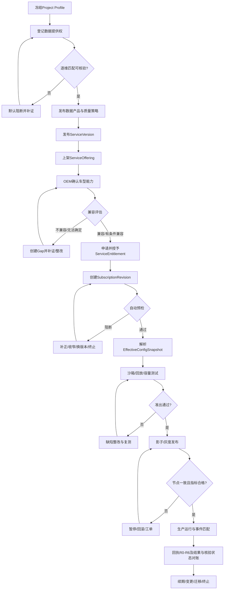
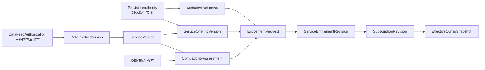
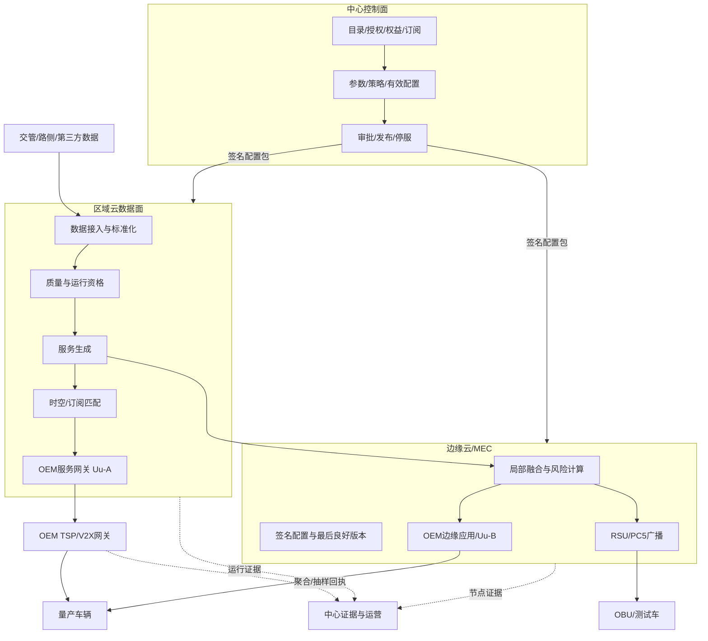
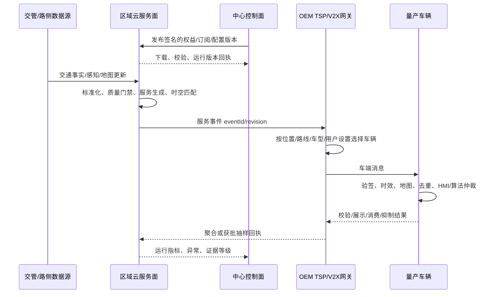
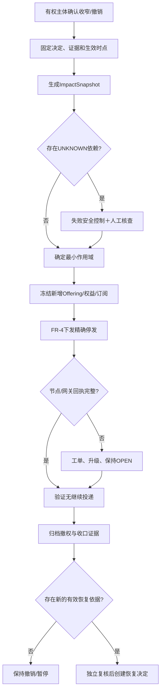
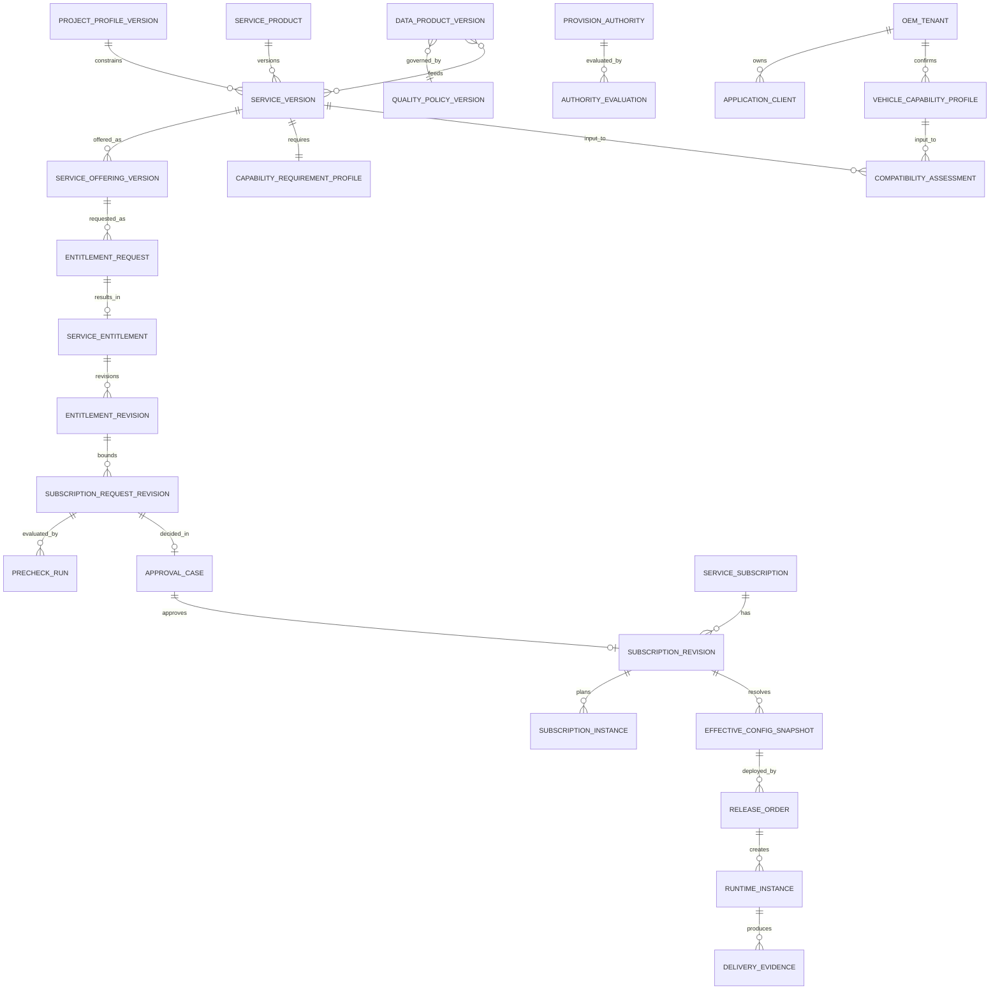
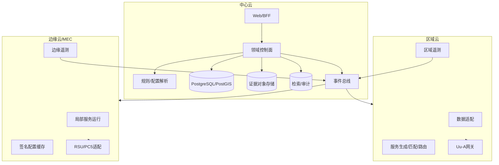

# 济南车路云数据上车服务运营平台产品说明书

> 文档版本：V0.10-R2 开发前终审稿  
> 修订日期：2026-09-17  
> 产品阶段：整体产品定义＋S1 建议切片；非研发开工批准文件  
> 适用终端：平台 Web 端；OEM 系统通过接口协同  
> 编制方法：product-spec-generator（产品说明书）＋requirements-spec-generator（四层需求差异复核）  
> 已核对输入：V0.1 整体规划、V0.2 功能深化、V0.3 功能审查、V0.4 FR-1 详细规格、V0.5 FR-1 四层规格、V0.6 产品说明书、V0.7 研发启动审查、V0.8 FR-2 四层规格，以及 FR-3/4/5 V0.1 四层评审稿。工作区未找到 V0.9；本稿不声称已纳入 V0.9。  
> 重要边界：本文不是法律意见、标准原文、接口控制文件、DVP&R、车辆量产准出文件或车端 HMI 设计稿。
> 开工复核：研发启动结论以 V0.7 为准；FR-1 研发细则以 V0.5 为准，FR-2 研发细则及切片以 V0.8 为准。FR-3/4/5 均已有 V0.1 四层评审稿但未签认，仍须完成逐故事 DoR、跨域契约与 DevelopmentStartDecision；不能仅凭本稿或评审稿全量业务编码。R2 只把开发前应有的产品交付物、服务级规格模板和页面语义收敛为统一口径，不把待确认事实伪造成已完成。

---

## 0. 阅读说明

### 0.0 本次修订结论与使用顺序

本稿保留 V0.6 的产品全景和页面说明，修正版本间容易导致错误开发的口径：①“P0 目标能力”与“S1 承诺范围”分离；②申请、预检、审批、权益、实例、控制、激活资格、发布、健康和证据分离；③ FR-2 按 Uu-A/PC5/Uu-T/Uu-B 分型，S1 仅建议 Uu-A；④正式 Revision 不覆盖；⑤暂停/终止以逐目标执行回执和退出清单收口；⑥外部事实由 FR-3/4/5 产生，FR-2 只读引用；⑦页面 ID 与四层需求映射；⑧原型演示与生产事实分离；⑨ M0、DoR、DevelopmentStartDecision 仍是开工门禁。R2 在 R1 基础上新增开发前单一交付包、服务级 Feature Spec、跨域事实与契约、页面动作语义、可重放测试基线和终审评分；不增加一级导航，也不扩大 S1。

阅读顺序：先读第 1～7 章确定产品问题、范围、对象与旅程，再看第 8 章页面；研发拆单须回到第 18 章权威来源和第 19 章未决项。本文中的“必须”是**产品目标约束**，不等于项目组织已经签认，也不等于现有原型已经实现。

### 0.1 产品说明书回答什么

本文用于让产品、设计、研发、测试、OEM 和项目管理人员快速形成一致理解，重点回答：

- 产品为谁解决什么问题；
- 数据上车服务如何从“数据与依据”变成“车企可申请、可订阅、可配置、可发布、可验证”的产品；
- 不同角色在什么页面完成什么任务；
- 正常流程、异常流程和高风险退出如何闭环；
- 首期做什么、后续做什么、哪些坚决不做；
- 界面应呈现什么、状态如何表达、推荐使用什么技术架构。

### 0.2 事实、建议与待确认标识

| 标识 | 含义 | 使用原则 |
|---|---|---|
| 🟢 已确认基线 | 已在前序方案中形成稳定结论 | 可作为本轮产品设计输入 |
| 🟡 产品建议 | 基于行业与产品逻辑给出的推荐 | 需在评审会上确认后冻结 |
| 🔵 待项目确认 | 缺少真实主体、接口、阈值或合同输入 | 不得伪造成已确认事实 |
| 🔴 上线阻断 | 未满足会导致越权、安全或闭环失败 | 未关闭不得进入生产 |

### 0.3 产品对象的七段事实链

```text
ServiceVersion
  → ServiceOfferingVersion
  → ServiceEntitlementRevision
  → SubscriptionRevision
  → EffectiveConfigSnapshot
  → Release/RuntimeInstance
  → DeliveryEvidence R0-R6 ＋ deliveryOutcome ＋ verificationStatus
```

这七段分别回答“服务是什么、当前向谁开放、应用获准什么、订阅什么、最终使用什么配置、部署在哪里、最高能证明到哪一步”，任何两段都不能用一个“已开通”状态合并。FR-2 在 `ServiceEntitlementRevision` 与 `SubscriptionRevision` 之间还需保留 `SubscriptionRequestRevision → PrecheckRun/ApprovalCase`，在后者之后保留 `ServiceSubscription → SubscriptionInstance`；七段图是跨域概览，不是完整物理模型。

---

## 1. 产品介绍

### 1.1 【产品介绍】

济南车路云数据上车服务运营平台，是面向城市车路云运营方、交通数据提供方、OEM/TSP 和安全监管角色的企业级 Web 产品。平台将信号灯、绿波车速引导、前方拥堵、超视距弱势交通参与者、异常停车等交通数据能力，治理为可定义、可授权、可申请、可订阅、可配置、可灰度发布、可撤销和可验证的服务产品。

产品解决的不是“有没有把数据推到一个 Topic”，而是以下核心问题：

- 当前服务究竟是什么版本、依赖什么数据、输出什么语义；
- 城市是否有权向特定 OEM、应用、用途和区域提供；
- 某车型能力是否满足，不能满足时差距在哪里；
- 某个应用最终获得了什么权益、订阅了什么范围；
- 参数经继承和覆盖后，生产实际生效值是什么；
- 配置是否完整部署到区域云、边缘云和服务网关；
- 平台最多能证明消息到达网关、车辆、HMI 还是车载算法；
- 授权撤销、质量异常或配置错误时，能否精确停止并保留证据。

### 1.2 产品定位

| 维度 | 定位 |
|---|---|
| 产品类别 | 车路云数据服务控制面、运营面与证据面 |
| 核心用户 | 城市服务运营、数据/合规、OEM 接入、联合测试、发布运维、安全审计 |
| 核心价值 | 把“项目式接口接通”升级为“可规模化运营的服务产品闭环” |
| 主要载体 | 平台 Web 工作台＋标准化接口＋事件协同 |
| 默认量产链路 | 区域云 → OEM TSP/V2X 网关 → OEM 车端代理 → 量产车辆 |
| 测试/示范链路 | 测试车直连、Uu-T、PC5 或经批准的 Uu-B，按环境隔离管理 |
| 产品原则 | 默认拒绝、版本不可变、最小权限、状态分离、证据分级、精确退出 |

### 1.3 北极星任务

在不扩大城市与 OEM 责任边界的前提下，让一个有权 OEM 应用完成：

```text
发现服务 → 声明车型能力 → 获得服务权益 → 创建订阅
→ 解析有效配置 → 通过联合测试 → 灰度发布
→ 获得可核验回执 → 可安全变更/暂停/终止
```

### 1.4 核心成功指标

| 指标 | 口径 | 当前目标 |
|---|---|---|
| 首次可执行订阅达成率 | 首次提交后，在约定办理 SLA 内形成已批准且 `activationReadiness=READY` 的订阅申请数 ÷ 首次提交数；审批决定和 READY 分段统计，补正等待单列 | 🔵 M0 建基线后签认 |
| 阻断可行动率 | 含规则、事实、证据、Owner 和下一动作的阻断数 ÷ 全部阻断数 | 100% |
| 有效订阅证据完整率 | 可追溯到授权、服务、能力、权益、配置、发布和证据版本的有效订阅数 ÷ 有效订阅数 | 100% |
| 无有效提供权生产订阅数 | 提供权非允许而进入生产的订阅数量 | 0 |
| 越范围发布数 | 发布作用域超出权益、订阅或配置交集的数量 | 0 |
| 人工篡改兼容结论数 | 未改变输入/规则而直接改变结果的数量 | 0 |
| 撤权未收口对象数 | 撤权时限后仍未成功处置且无有权例外的对象数 | 0 |
| 最高证据等级分布 | 按服务/OEM/通道统计 R0—R6；异常结果与核验状态分列 | 分层统计，不虚构 R3+ |

---

## 2. 产品目标、范围与边界

### 2.1 产品目标

1. 建立统一服务目录、数据产品、空间模型和项目 Profile；
2. 将数据提供权、车型能力、兼容结论和服务权益转化为机器可执行门禁；
3. 支持 OEM 应用完成订阅申请、预检、审批、生效、变更、续期和终止；
4. 管理参数定义、继承、有效配置、变更影响、审批、灰度、回滚和紧急停服；
5. 建立从数据源到区域/边缘/OEM 网关及车端最高可证明状态的证据链；
6. 支持测试车与量产车采用不同链路、反馈和数据最小化策略；
7. 为多 OEM、多区域、多服务规模化运营提供可复用产品能力。

### 2.2 平台负责

- 服务、场景、输出、质量、空间、计算、交付和能力要求的产品化；
- 合作方、ApplicationClient、环境、端点、证书和车型能力资料管理；
- 数据提供权、服务权益、订阅、配置、发布和退出的流程与门禁；
- 提供权、兼容性、运行资格和有效配置的可解释计算；
- 区域云、边缘云、OEM 网关等目标节点的配置发布与回执管理；
- 数据质量、服务运行、事件追踪、回执对账、告警工单和审计证据；
- 权限、职责分离、敏感证据访问、数据保留与 Legal Hold 管理。

### 2.3 平台不负责

- 不替有权主体作出数据授权或法律合规结论；
- 不替 OEM 声明车型能力、完成量产准出或决定车内 HMI/算法实现；
- 不默认保存量产车逐 VIN 主档、全量实时位置、私钥或未授权精确轨迹；
- 不把网关 ACK 推断为车辆收到、展示或算法消费；
- 不把服务建议升级为车辆控制命令；
- 不直接修改交管源系统、信号控制器、OEM 车端策略或 CAN/执行器；
- 不在首期建设价格、账单、结算、跨城市权益互认和服务交易市场。

### 2.4 测试车与量产车策略

| 维度 | 测试/示范车辆 | 量产车辆 |
|---|---|---|
| 身份 | 测试任务＋伪名车辆/设备，可短期精细追踪 | OEM 应用＋稳定车型能力组，VIN 映射由 OEM 管理 |
| 通道 | Uu-T、PC5、经批准 Uu-B 或工程 TSP | 默认 Uu-A 经 OEM TSP；PC5 为广播能力 |
| 配置 | 可按测试任务/车辆组细化，严格绑定期限 | 以服务、OEM、车型能力组、区域和应用为主 |
| 回执 | 可按批准目的提供 R3—R6 详细证据 | 默认 F1 聚合；抽样/诊断另行授权 |
| 数据保留 | 按测试目的和任务到期清理 | 采用最小化、聚合和合同约定保留 |
| 准出 | 沙箱、回放、实车和异常注入 | OEM 量产准出＋联合验证，平台结论不替代 OEM 责任 |

### 2.5 政策与标准使用原则

- 截至 2026-09-15 的政策与标准状态沿用 V0.5 总索引的官方核验结果；
- 外部标准状态与济南项目采用状态分开；
- `UPCOMING` 标准进入迁移评估，不冒充当前已实施门禁；
- 标准条款必须映射为 ProjectProfileVersion、ICD、规则或 DVP&R，标准名称本身不能替代实现口径；
- 来源或适用条款无法核验时显示 `UNVERIFIABLE` 并由有权 Owner 处理。

---

## 3. 用户画像

### 3.1 【用户画像总览】

本产品面向城市交通与数据运营、合规审批、OEM/TSP 接入、联合测试、发布运维和审计等**岗位**，不以未经调研的年龄、学历或技术熟练度假设定义用户。主要任务是在 PC 端跨组织处理高信息密度、可追责的服务准入与运营事务；核心痛点是对象/版本/责任分散、接口与业务状态混杂，以及异常后难确认“影响谁、谁处理、是否真正恢复”。这些画像为设计假设，需由首批 OEM 与城市侧访谈/任务观察验证。

### 3.2 核心 Persona

| Persona | 典型角色 | 核心目标 | 当前痛点 | 使用特点 |
|---|---|---|---|---|
| P-A 城市服务产品与运营负责人 | 服务产品经理、服务运营经理 | 发布可运营服务并管理版本、Offering、迁移和效果 | 服务定义散落在接口文档；发布和运营脱节 | 高频使用工作台、差异、依赖图和运行全景 |
| P-B 数据授权与合规负责人 | 数据经办、合规签认、安全复核 | 确保对外提供有依据且撤销可收口 | 附件多、结构化范围少、影响不清 | 低频高风险，重视证据、审批和审计 |
| P-C 数据产品与质量负责人 | 数据产品、数据治理、质量 Owner | 保证来源、语义、血缘和质量可追溯 | 质量阈值无统一依据，备源可能越权 | 关注字段、血缘、质量、异常影响 |
| P-D OEM 接入与车型能力负责人 | OEM/TSP 产品、车云平台、车端技术 | 以稳定能力组接入服务并减少重复适配 | 城市要求不一致，能力声明与兼容结论混淆 | 使用 OEM 工作区、Profile、沙箱和差距任务 |
| P-E 权益与订阅审批人 | 服务权益审批、业务审批、安全会签 | 只批准最小必要范围且可解释 | 申请、授权、协议、能力证据分散 | 待办驱动，重视交集、风险和职责分离 |
| P-F 配置与发布负责人 | 参数治理、发布经理、SRE | 知道最终生效配置并安全灰度/回滚 | 多层覆盖导致值来源不明，节点状态不一致 | 高频使用有效配置、影响预览、拓扑和回滚 |
| P-G 联合测试与接入工程师 | 接口、沙箱、DVP&R、容量测试 | 用一致输入复现问题并完成准出 | 只验证连通，缺少异常和撤销语义 | 使用 ICD、回放、兼容矩阵、缺陷和报告 |
| P-H 运行保障与审计人员 | 值班、告警、工单、审计/监管只读 | 精确止损、证明过程、验证恢复 | ACK 被当成功，事件与工单无法闭环 | 事件驱动，关注时间线、证据等级和责任人 |

### 3.3 Persona 的权限边界

- 城市运营角色不得修改 OEM 已确认能力；
- OEM 角色不得查看其他 OEM 的申请、证据和运行数据；
- 授权经办、最终签认、服务发布、紧急执行和恢复按风险进行职责分离；
- 审计角色默认只读，敏感导出需单独授权并留水印；
- 前端隐藏不构成权限控制，所有动作均由服务端执行 RBAC＋ABAC；
- Break-glass 只允许最小范围止损，不能扩大提供权、授予新权益或人工改变兼容结果。

---

## 4. 场景故事

### 4.1 场景一：信号灯服务首次面向量产车型开放

济南服务产品经理周晨准备把某示范走廊的信号灯提醒服务开放给一家 OEM。她先确认当前 Project Profile、信号灯数据产品、Movement/车道映射和输出更新/撤销语义，再创建不可变 ServiceVersion。合规负责人确认数据可向该 OEM、为驾驶信息提醒用途、在指定走廊和期限内提供；运营负责人据此发布 ServiceOfferingVersion。OEM 提交车型能力版本，联合测试人员发现一款车型缺少可核验的 Movement 映射能力，平台将结果标为 `INCONCLUSIVE` 并生成差距任务，而不是人工判兼容。OEM 补证并确认新能力版本后，服务才进入权益和订阅申请。

### 4.2 场景二：OEM 完成最小必要订阅申请

OEM 接入经理李岩为生产环境的 V2X 应用申请 GLOSA。他从对其可见的 Offering 进入向导，选择应用、用途、区域、车型能力组、Uu-A 通道、期限和 F1 聚合反馈。系统逐步校验提供权、服务权益、兼容性、协议、端点和重复订阅。申请区域有一小段超出开放范围，平台展示原申请与可允许交集，李岩明确接受收窄并形成新 RequestRevision。订阅审批通过后生成获批 SubscriptionRevision 与 `PENDING_ACTIVATION` 的原子 SubscriptionInstance，不会新授予或扩大 FR-1 权益；FR-3 配置、FR-4 测试/逐目标执行等事实满足后，`activationReadiness` 才可能成为 `READY`。`APPROVED`、`READY` 和 `ACTIVE` 必须分别展示。

### 4.3 场景三：参数变化经过仿真和灰度发布

数据质量负责人发现拥堵预警的新鲜度策略需要调整。配置负责人从参数注册表进入变更中心，看到该参数的单位、允许范围、上层安全包络、当前生效值和受影响 OEM/区域。系统解析继承链，生成新旧 EffectiveConfigSnapshot 差异。变更通过回放、异常注入和容量检查后，发布经理按区域、OEM 和车型能力组建立影子与灰度批次。一个边缘节点未验证新配置哈希，平台将发布显示为“部分生效”并自动暂停晋级，不用全局回滚掩盖单节点问题。

### 4.4 场景四：授权紧急撤销触发精确停发

合规负责人收到有权主体的紧急撤销决定，影响特定数据产品、接收 OEM 和生产用途。平台固定撤销证据与生效时间，计算受影响 Offering、权益、订阅、发布实例和运行节点，同时把未知依赖单列。预授权值班人执行最小范围停发，FR-4 向区域云和相关网关下发控制并回传节点结果。某不可达节点形成高优先级工单，事件保持开放。恢复时必须基于新的有效依据并由另一名有权人员复核，原撤销记录不被覆盖。

### 4.5 场景五：回答“数据是否真正上车”

项目复盘会上，运营人员输入 `eventId` 查看一次异常停车预警。时间线显示数据源产生事实、区域云生成服务、路由命中订阅、OEM 网关接受、部分车辆完成验签并触发展示。对只到 OEM 网关的事件，平台最高显示 R2；没有车辆回执的 PC5 广播显示节点发送与 `UNVERIFIABLE`，不显示“车辆已收到”。运营人员按服务、区域、OEM、车型能力和软件版本对账，把差异转为工单并保留可控范围的证据包。

---

## 5. 产品功能结构与优先级

### 5.1 功能结构图

```mermaid
graph TB
    P[数据上车服务运营平台]

    P --> A[治理与服务产品]
    P --> B[合作方、权益与订阅]
    P --> C[参数、策略与变更]
    P --> D[开发、沙箱与验证]
    P --> E[发布、运行与证据]
    P --> F[安全、审计与平台支撑]

    A --> A1[标准与Project Profile]
    A --> A2[数据提供权]
    A --> A3[数据产品与质量]
    A --> A4[服务产品与Offering]
    A --> A5[空间模型与生命周期]

    B --> B1[OEM/TSP与应用环境]
    B --> B2[车型能力与兼容]
    B --> B3[Service Entitlement]
    B --> B4[订阅申请与审批]
    B --> B5[订阅实例与运行兴趣]

    C --> C1[参数注册表与安全包络]
    C --> C2[参数集与策略]
    C --> C3[有效配置解析]
    C --> C4[变更与审批]

    D --> D1[ICD与Schema]
    D --> D2[沙箱与回放]
    D --> D3[DVP&R与容量准出]
    D --> D4[端点、通道与证书]

    E --> E1[配置编译与发布]
    E --> E2[发布拓扑与漂移]
    E --> E3[紧急停服与恢复]
    E --> E4[运行资格与质量]
    E --> E5[事件追踪与回执对账]
    E --> E6[告警工单与效果]

    F --> F1[RBAC与ABAC]
    F --> F2[信任与凭证]
    F --> F3[审计与证据]
    F --> F4[数据生命周期]
```



### 5.2 核心功能优先级

| 功能域 | P0 最小闭环 | P1 规模化 | P2 探索/暂缓 |
|---|---|---|---|
| 服务治理 | 标准/Profile、提供权、数据产品、ServiceVersion、Offering、生命周期 | Bundle、多区域模板、批量迁移 | 价格套餐、服务交易市场 |
| OEM 与权益 | 合作方、应用环境、能力版本、兼容评估、Entitlement | 批量能力矩阵、多 TSP 代理 | 跨城市权益互认 |
| 订阅 | 申请、预检、审批、不可变 Revision、续期/暂停/终止 | 运行兴趣、批量变更、高级调试器 | 自动商业计费 |
| 配置 | 参数注册表、安全包络、参数集、有效配置、变更 Diff | 实验分组、批量仿真、复杂策略编排 | AI 自动生成并直接发布策略 |
| 验证发布 | Schema、安全、异常、容量测试；影子、灰度、暂停、回滚 | 多区域并行 Campaign、自动化迁移 | 未经复核自动晋级高风险服务 |
| 运行证据 | 质量、资格、拓扑、追踪、R0—R6＋交付结果/核验状态、工单 | 效果归因、UsageFact、跨方日账 | 无证据的驾驶行为/交通效果归因 |
| 安全支撑 | 租户隔离、最小权限、职责分离、审计、证据访问 | 自动访问复核、策略模拟 | 保存量产私钥或默认逐 VIN 主档 |

> **优先级口径**：本表的 `P0` 表示“完成首个可运营版本前不可缺失的目标能力”，不表示 S1 要一次性完整交付所有 P0 页面的全部功能。S1 以第 5.3 节的 13 个门禁为范围，各页仅实现第 5.4 节定义的最小深度；未进入 S1 的 P0 能力不得因页面存在而默认纳入开发。

### 5.3 S1 Walking Skeleton

首期目标闭环必须选择一个真实服务和一个真实 OEM/应用，贯穿以下 13 个门禁；FR-3/4/5 四层评审稿、目标故事 DoR 和外部契约未签认前，M10～M13 是待解阻目标，不是当前工程交付声明：

```text
M1 项目Profile冻结
→ M2 数据提供权有效
→ M3 数据产品与质量策略发布
→ M4 ServiceVersion发布
→ M5 Offering上架
→ M6 OEM能力确认
→ M7 兼容评估CURRENT
→ M8 ServiceEntitlement ACTIVE+ENABLED
→ M9 SubscriptionRevision批准
→ M10 EffectiveConfigSnapshot固定
→ M11 沙箱/回放/容量测试通过
→ M12 灰度发布并节点对账
→ M13 事件追踪达到双方约定证据等级
```

建议 S1 选择信号灯提醒或 GLOSA 二选一。VRU 等高治理等级服务进入 S4，不作为唯一首期验证场景。

### 5.4 S1 页面与能力的最小交付深度

S1 不按菜单横向铺开，而是对一个真实服务、一家 OEM、一个应用、一个区域和一条通道建立纵向闭环。下表是研发启动的**建议基线**，需在 M0 评审中签认后才转为承诺：

| 页面/能力组 | S1 交付深度 | S1 必须完成 | 不在 S1 完整展开 |
|---|---|---|---|
| PG01、PG02 | 最小工作台＋Profile 只读基线 | 待办/阻断深链，当前 Profile 版本与影响可见 | 通用低代码决策平台、全标准库运营 |
| PG03、PG03-I | 单服务提供权建立及只读影响骨架 | 创建/送审/生效、核对有效范围；为 FR-2 控制演练提供固定的有效授权事实 | 授权到期/收窄/撤销的真实跨域影响与收口属于 FR-1 S2；S1 可用演练夹具验证订阅精确控制，但不得标记“授权撤销闭环已交付” |
| PG04、PG04-O、PG05、PG06 | 单服务契约闭环 | 一个 DataProduct、ServiceVersion、Offering、Coverage 及更新/撤销语义 | Bundle、多区域模板、批量迁移 |
| PG07、PG08、PG09 | 单 OEM/应用/能力组闭环 | 主体和环境、OEM 确认能力版本、兼容评估、权益申请与生效 | 多 TSP 委托、批量能力矩阵 |
| PG10—PG12 | 可执行订阅闭环 | 创建不可变 Revision、五层预检、审批、生效/暂停/终止 | 批量订阅、高级调试器和运行兴趣编排 |
| PG13—PG15 | 单参数链最小闭环 | 定义、包络、一组覆盖关系与 EffectiveConfigSnapshot 可解释 | 复杂实验分组、批量策略编排 |
| PG16—PG18 | 一次测试、一次变更、一次灰度 | 回放/异常用例、固定 Diff/回滚目标、单批次发布与节点哈希对账 | 多区域 Campaign 和自动晋级 |
| PG19—PG22 | 最小运行证据与退出闭环（以 FR-4/5 独立 DoR 为前提） | 一次 FR-2 精确暂停/恢复或终止演练、逐目标执行事实、一条事件链、一个非成功回执工单 | FR-1 撤权级联、效果归因、UsageFact、复杂 RCA 分析 |
| PG23 | 服务端安全基线＋最小管理视图 | 租户隔离、RBAC+ABAC、SoD、审计查询与敏感证据控制 | 自动访问复核和完整数据生命周期运营 |

S1 内未完整展开的能力必须在页面上隐藏、禁用并说明原因，或明确标记“本期不实现”；不得留空按钮或静态成功假状态。

### 5.5 FR-2 切片与产品全景的衔接

第 5.3～5.4 节是**跨 FR 的目标闭环**，不是 FR-2 单模块全部交付承诺。FR-2 的权威切片以 V0.8-00 第 8.3～8.4 节为准，待 U01/U02 签认；同一页面可同时含 S1、S1-F、S2 功能，不能按“页面已上线”推断子功能已交付。

| 交付层级 | FR-2 具体边界 | 对平台页面的要求 |
|---|---|---|
| S1 | 单服务、单 OEM 应用、单能力组、单区域、Uu-A 的申请—预检—审批—待激活—资格/逐目标事实—一次精确暂停/恢复或终止演练 | PG10、PG11、PG12 仅开放对应动作；PG01 有订阅待办；PG12 提供五层只读诊断 |
| S1-F | Uu-A `matchingOwner`/兴趣责任声明、后继 Revision 与基础 Diff 等扩展骨架 | 只读展示或明确禁用；不得宣称已实现逐车匹配、完整迁移或短会话 |
| S2 | 完整变更、续期、服务/空间/通道迁移及新旧 Revision 切换 | PG12 的变更与迁移入口经独立 DoR 后开放 |
| S3 | PC5 广播策略、Uu-T 测试短会话 | 与 Uu-A 分型表单/规则，不复制量产逐车订阅语义 |
| P1 | Uu-B 试点、完整 PG25 跨域调试器及复杂运行兴趣 | OEM/运营商、安全、隐私、容量条件另行签认 |

未进入当前切片的能力，前端、API、事件消费与定时任务入口均应拒绝；“菜单隐藏”不是切片隔离。FR-3/4/5 的四层评审稿均已形成但未签认；目标故事 DoR 未完成前，不把第 5.4 节相关页面列为“正式业务编码已就绪”。

### 5.6 FR-3 从产品目标到需求评审的衔接

[FR-3 V0.1 四层评审稿](济南车路云数据上车服务平台端-FR3需求规格-V0.1-四层评审稿-20260916.md)把 PG13～PG15 和 PG17 的配置子流程下沉为用户故事、产品功能、常规研发与页面验收。S1 建议仅交付一个真实服务/订阅作用域内的参数定义与硬包络、获批参数集、确定性有效配置快照、一次变更决定和 FR-4 交接；临时覆盖、批量实验和跨区域自动切换留后续切片。

配置批准、EffectiveConfigSnapshot、联合测试、ReleaseOrder、节点运行哈希和车端交付证据是**六个不同事实**。FR-3 拥有配置定义、候选/审批及有效快照；联合测试、发布单和节点执行归 FR-4，车辆交付证据归 FR-5。PG15 可并列展示期望与实际哈希，但绝不从期望配置推断节点已应用。现有配置原型仅有列表/详情和会话内变更申请意图，不等于 FR-3 的正式实现。

### 5.7 FR-4/FR-5 从产品目标到需求评审的衔接

[FR-4 V0.1 四层评审稿](济南车路云数据上车服务平台端-FR4需求规格-V0.1-四层评审稿-20260916.md)把 PG16、PG18、PG19 及 PG17 发布子流程下沉为测试准出、发布批次、逐目标节点应用/漂移和精确控制需求。发布批准、下发成功、节点应用成功与车辆交付是不同事实；S1 建议只验证一个真实服务/OEM/区域的 Uu-A 链路、一次小范围灰度与一次精确控制演练。非成功或未知的必要节点结果不能汇总为发布/停发完成。

[FR-5 V0.1 四层评审稿](济南车路云数据上车服务平台端-FR5需求规格-V0.1-四层评审稿-20260916.md)把 PG20～PG22 下沉为健康投影、事件证据评估、工单和恢复复核。最高证据等级 R0～R6、交付结果及核验状态应分列；网关 ACK 不推断 R3+，UNKNOWN 不伪装健康，恢复备注不代替独立证据。两稿均为待评审输入，不替代 OEM 能力确认、ICD、DVP&R、安全/隐私签认或逐故事开工决定。

### 5.8 S1 开发基线包：一个切片、八项版本化交付物

S1 不再按“哪个菜单先做”拆分，而以同一个服务、OEM 应用、车型能力组、区域、环境和 Uu-A 链路贯穿 FR-1～FR-5。下列交付物使用同一组对象 ID、Revision、状态与期望结果；任何一项缺失，均不能由其他文档、页面原型或口头结论替代。

| 交付物 | 最小内容 | 唯一 Owner / 会签 | 对研发门禁的作用 |
|---|---|---|---|
| `ProjectProfileVersion` | 采用标准、项目扩展、主体、治理等级、术语、时间/空间基线 | 项目负责人；合规、架构、服务 Owner 会签 | 决定什么规则在本项目生效 |
| `S1ScopeBaseline` | 服务/OEM/应用/车型组/区域/环境/通道/数据源/用途/证据目标/非目标 | 产品负责人；OEM、服务 Owner 会签 | 冻结纵向切片和禁止项 |
| `ServiceFeatureSpecVersion` | 第 9.6 节全部服务专属语义、边界、异常与验证 | 服务产品 Owner；数据、OEM、测试、安全会签 | 决定“该服务具体如何上车” |
| `StateDictionaryVersion` | 跨 FR 对象状态、状态族、合法迁移、组合约束、Owner | 产品＋架构 | 阻止各页面自造“已开通/已生效” |
| `ReasonCodeVersion` | 机器码、用户文案、严重度、是否可重试、责任方、下一动作 | 产品＋架构＋测试 | 保证页面、接口、事件和审计同义 |
| `ContractPackVersion` | OpenAPI、AsyncAPI、ViewModel、权限 Scope、幂等、并发、事件顺序和 Mock | 架构负责人；前后端、集成、安全会签 | 契约测试通过后才允许并行编码 |
| `FixturePackVersion` | 正常、阻断、越权、冲突、重复、迟到、过期、部分成功、撤销、恢复数据及期望证据 | 测试负责人；产品、OEM、运维会签 | 让需求、联调和回归可重放 |
| `DevelopmentStartDecision` | StoryId、代码范围、仓库/分支、允许动作、依赖、验收人、截止条件 | 项目负责人＋研发负责人 | 对单个 Story 明确 GO / NO-GO |

#### 5.8.1 基线包状态规则

- 每项交付物具有 `documentId`、`version`、`status`、`owner`、`approvedBy`、`effectiveFrom`、`supersedes` 和内容哈希；正式版不可原地覆盖；
- 产品说明书、需求规格、接口契约、测试夹具引用固定版本，不使用“最新版”这种不可重放引用；
- 状态只允许 `DRAFT → IN_REVIEW → APPROVED → EFFECTIVE → SUPERSEDED/WITHDRAWN`，被撤回或替代不删除历史；
- `APPROVED` 表示文档已批准，`EFFECTIVE` 表示在指定范围和时点生效，二者不推导业务对象已激活；
- 任何版本发生语义性变化，应生成后继版本并触发影响分析；拼写修正也需保留审计，但可按文档策略判定是否重做会签；
- S1 业务编码只读取 `DevelopmentStartDecision=GO` 且引用的前七项均为允许状态的 Story；页面壳层、UX 原型和替换性 Spike 继续按 V0.7 边界管理。

---

## 6. 产品信息架构

### 6.1 三个角色化工作区

1. **城市服务运营工作区**：服务、数据、订阅、配置、发布、运行和工单；
2. **OEM/合作方接入工作区**：服务发现、主体应用、车型能力、申请、沙箱、测试、回执和运行报告；
3. **安全审批与审计工作区**：待办、差异、影响、审批、紧急操作、证据、权限和数据生命周期。

三个工作区共享同一领域对象和 Revision，不各自复制状态。

### 6.2 导航结构

```text
工作台
治理与授权
  标准与决策 / Project Profile / 数据提供权 / 撤销影响
服务产品
  服务目录 / 产品工作室 / Service Offering / 数据产品与质量 / 场景与输出 / 空间模型
合作方与能力
  OEM/TSP / 协议 / 应用与环境 / 车型能力 / 兼容评估 / 端点与证书
权益与订阅
  服务权益 / 订阅申请 / 自动预检 / 订阅审批 / 生效订阅 / 运行兴趣 / 订阅调试器
参数与策略
  参数注册表 / 安全包络 / 参数集 / 策略工作区 / 有效配置 / 仿真评估
变更与发布
  变更中心 / 审批中心 / 发布计划 / 发布拓扑与漂移 / 紧急停服与恢复
开发与验证
  ICD与Schema / 兼容矩阵 / 沙箱与回放 / 符合性测试 / 容量测试 / 开发者门户
运行与运营
  服务全景 / 数据质量与资格 / 事件链路 / 回执对账 / 告警事件工单 / 效果与计量
安全与平台
  身份权限 / 凭证信任 / 审计证据 / 数据生命周期 / 通知值班 / 系统设置
```

### 6.3 页面清单

| ID | 页面 | 页面类型 | 核心任务 | 优先级 |
|---|---|---|---|---|
| PG01 | 我的工作台 | 复杂 Web 工作台 | 处理待办、临期、异常和发布风险 | P0 |
| PG02 | 标准与 Project Profile | 后台管理＋内容详情 | 核验规则并冻结项目基线 | P0 |
| PG03 | 数据提供权详情 | 分步向导＋工作台 | 结构化授权、匹配与撤销 | P0 |
| PG03-I | 影响分析中心 | 复杂 Web 工作台 | 固定授权/服务/能力/权益变化影响并跟踪收口 | P0 |
| PG04 | 服务产品工作室 | 复杂 Web 工作台 | 定义并发布不可变服务版本 | P0 |
| PG04-O | Service Offering | 后台管理＋分步配置 | 管理当前向谁、在哪、按什么条件开放 | P0 |
| PG04-L | 服务生命周期与迁移 | 复杂 Web 工作台 | 管理弃用、迁移、例外和退役 | P0 |
| PG05 | 数据产品与依赖 | 复杂 Web 工作台 | 管理来源、血缘、质量与备源 | P0 |
| PG06 | 场景、输出与空间 | 工作台＋地图 LBS | 定义资格、输出和 Coverage | P0 |
| PG07 | OEM/TSP、应用与环境 | 后台管理 | 建立主体、协议、应用和环境 | P0 |
| PG08 | 车型能力与兼容 | 复杂 Web 工作台 | OEM 确认能力并关闭差距 | P0 |
| PG09 | 服务权益 | 分步向导＋审批工作台 | 申请并授予最小权益 | P0 |
| PG10 | 订阅申请向导 | 分步向导 | 形成可执行订阅申请 | P0 |
| PG11 | 订阅预检与审批 | 工作台 | 解释阻断并完成准入决定 | P0 |
| PG12 | 生效订阅详情 | 内容详情＋工作台 | 管理 Revision、配置、发布与退出 | P0 |
| PG13 | 参数注册表与安全包络 | 后台管理 | 管理参数定义和不可覆盖边界 | P0 |
| PG14 | 参数集与策略工作区 | 复杂 Web 工作台 | 配置继承、覆盖、策略和冲突 | P0 |
| PG15 | 有效配置浏览器 | 工作台＋地图 LBS | 回答最终值、来源和作用域 | P0 |
| PG16 | 回放与联合测试 | 复杂 Web 工作台 | 运行正常、异常和容量用例 | P0 |
| PG17 | 变更与审批中心 | 工作台 | 管理 Diff、影响、测试、回滚和会签 | P0 |
| PG18 | 灰度发布、拓扑与回滚 | 数据可视化＋工作台 | 控制批次并识别部分生效/漂移 | P0 |
| PG19 | 紧急停服与恢复 | 工作台＋地图 LBS | 最小范围止损并有权恢复 | P0 |
| PG20 | 服务运行全景与质量 | 数据可视化＋地图 LBS | 查看服务×区域×OEM×节点健康 | P0 |
| PG21 | 事件链路与回执对账 | 复杂 Web 工作台 | 证明一次事件最高到达等级 | P0 |
| PG22 | 告警、工单与 RCA | 工作台 | 认领、处置、验证、关闭异常 | P0 |
| PG23 | 权限、审计与数据生命周期 | 后台管理＋内容详情 | 最小权限、证据、保留与删除 | P0 |
| PG24 | ServiceBundle | 复杂 Web 工作台 | 组合申请、逐项授权与兼容 | P1 |
| PG25 | 订阅调试器 | 复杂 Web 工作台 | 五层诊断订阅无数据原因 | P1 |
| PG26 | 效果与计量 | 数据分析 | 分离技术达成、交通效果和 UsageFact | P1 |

### 6.4 跨页面单一事实原则

- 一个业务对象只有一个稳定 ID 和一套正式状态；
- 列表、详情、审批、发布和运行页面引用同一 Revision，不复制本地状态；
- 申请状态、权益状态、订阅状态、发布状态、节点状态、健康状态和证据等级分别展示；
- 所有阻断统一返回：`规则编码＋预期要求＋实际事实＋证据状态＋Owner＋下一动作`；
- 所有详情页显示：`对象ID＋Version/Revision＋状态＋内容哈希＋Owner＋更新时间＋审计入口`；
- `UNKNOWN / INCONCLUSIVE / STALE / UNVERIFIABLE` 不得用空白、0、灰色成功态或“正常”替代。

---

## 7. 产品整体流程

### 7.1 端到端业务流程图



### 7.2 授权、权益与订阅关系



### 7.3 控制面、数据面与证据面数据流



### 7.4 量产 Uu-A 交互时序



### 7.5 撤权与精确停发流程



---

## 8. 功能描述与页面交互

### 8.1 全局交互规范

#### 【平台框架】页面功能描述

##### 1. 页面布局

- 顶部栏：产品名称、当前租户、当前环境、全局检索、消息/待办、帮助和个人信息；
- 左侧栏：按第 6.2 节组织一级/二级导航，支持折叠，但高风险环境标识始终可见；
- 内容区：面包屑、页面标题、对象版本/状态、主操作、筛选/视图和主体内容；
- 右侧上下文区：仅在详情、校验、影响和审批场景展开，用于显示阻断、证据、Owner 和下一动作；
- 平台以 1440px 及以上桌面宽度为主要设计基线，1280px 保持可用；不将复杂配置页压缩为移动端操作。

##### 2. 全局检索与上下文

- 可按 `服务编码`、`Offering ID`、`OEM`、`ApplicationClient`、`Entitlement ID`、`Subscription ID`、`eventId`、`traceId` 搜索；
- 搜索结果按对象类型分组，显示版本、状态、租户、环境、Owner 和更新时间；
- 从告警、审批或影响对象进入详情时保留来源上下文，返回后恢复原筛选与分页；
- 当前租户/环境切换后，清理不适用的页面缓存和选择状态，避免跨租户误操作。

##### 3. 状态与反馈

- 加载中：使用骨架屏；局部数据失败时保留已成功区域，不使用全页空白；
- 空状态：说明“为什么为空”，并根据权限提供 `创建`、`申请` 或 `查看前置条件`；
- 无权限：显示缺少的权限作用域和申请/联系 Owner 入口；
- 并发冲突：展示当前版本、用户基于版本和字段差异，提供 `基于最新版本重新处理`；
- 规则阻断：统一展示规则编码、预期、事实、证据、Owner、下一动作；
- 操作成功：返回业务对象 ID/Revision 和下一步，不以 Toast 作为唯一反馈。

##### 4. 高风险操作

- `发布`、`退役`、`收窄`、`撤销`、`暂停`、`回滚`、`恢复`、`导出敏感证据`均先展示影响预览；
- 确认区必须包含对象、版本、作用域、生效时点、原因和恢复条件；
- 二次确认只防误触，不替代审批、会签和职责分离；
- Break-glass 使用专用入口，显示预授权范围、事件等级、第二复核人和事后复核期限。

##### 5. 可访问性与效率

- 状态不能只用颜色区分，需同时使用文本、图标和可读说明；
- 键盘可完成筛选、表单、步骤切换、对话框确认和数据表格核心操作；
- 关键表单离开前提示未保存内容，分步向导自动保存草稿；
- 大列表采用服务端分页/虚拟化，筛选条件可生成可分享但不含敏感信息的视图链接；
- 时间同时显示项目业务时区，Hover 展示原始时间戳和来源时间质量。

##### 6. 页面动作语言与结果语义

- 按钮使用可验证的业务动作：`保存草稿`、`运行预检`、`提交审批`、`创建控制请求`、`发起发布`、`请求恢复复核`；不得以 `确定`、`处理`、`开通`、`生效` 等模糊词承担关键动作；
- 动作名称只描述本系统当前能完成的事实。创建请求后显示“已提交，待执行”，收到执行 ACK 后显示“已受理，待逐目标确认”，不得直接显示“暂停成功/恢复成功”；
- 每次写操作在成功页或对象时间线中返回 `对象ID/Revision`、`动作结果`、`下一状态或等待条件`、`reasonCode`、`下一责任人` 和 `traceId`；
- 拒绝、阻断、不可核验和部分成功不是普通错误 Toast，必须在页面主体保留可回访的问题卡和修复入口；
- 高风险动作的主按钮文案包含作用对象，例如 `暂停 3 个订阅实例`，并在确认页再次显示环境、范围和不可逆影响。

##### 7. 六态页面契约

每个进入 S1 的页面或独立数据区块必须逐项说明以下六态，且由真实 ViewModel 字段驱动：

| 状态 | 最低表达要求 | 禁止做法 |
|---|---|---|
| Loading | 骨架结构、加载对象和可取消/重试条件 | 用假数据闪现后替换 |
| Empty | 空的业务原因、前置条件、可执行下一步 | 只显示“暂无数据” |
| Error | 错误码、影响范围、是否可重试、traceId | 把服务端拒绝改写为“网络异常” |
| Partial | 已成功/失败/未知项数量，缺失数据和聚合口径 | 以多数成功显示全绿 |
| No Permission | 缺少的 Scope、数据范围和申请/联系入口 | 隐藏按钮后不解释 |
| Conflict | 当前 Revision、用户基于版本、字段 Diff 和重试方式 | 后写覆盖前写 |

##### 8. 运营工作台与展示大屏边界

- PG01、PG20～PG22 是可操作的运营工作台，优先保证筛选、下钻、证据、责任人和处置效率；不得为追求“驾驶舱视觉”牺牲字段密度与可追溯性；
- 如建设展示大屏，应作为 PG20 的只读投影而非新的事实源：仅展示批准的聚合指标，保留口径、更新时间、数据完整性和 UNKNOWN；
- 大屏不承载审批、发布、停服、恢复或证据导出，不使用轮播代替异常处置，不把无数据绘制为 100%；
- 工作台和大屏共享指标定义与查询服务，但分别维护组件布局、刷新策略和权限；大屏数据不得反向写入业务状态。

##### 9. 跨页上下文与深链

- 从待办、告警、影响分析或事件追踪跳转时，深链至少携带 `tenantId`、`environment`、`objectType`、`objectId`、`revision` 和允许的来源标识；敏感筛选不进入 URL；
- 目标页以服务端权限和对象最新事实重新校验上下文，不能信任 URL 直接执行动作；
- 返回来源页时恢复筛选、分页和展开行；若对象版本已变化，显示变化提示，不静默替换用户正在审阅的 Revision；
- 对跨域只读对象提供 `查看唯一事实源`，不在当前页面复制可编辑表单。

### 8.2 工作台与治理授权

#### 【PG01 我的工作台】页面功能描述

##### 1. 页面综述

- 页面类型：复杂 Web 工作台；
- 核心用户：城市运营、OEM 接入、审批、发布、SRE 和审计；
- 目标：让用户按风险和时限处理与其相关的事项，不要求先理解完整导航；
- 权限：只显示当前租户、环境、角色和数据范围内的事项。

##### 2. 顶部概览区

- 指标卡：`我的待办`、`临期对象`、`阻断申请`、`异常服务`、`部分发布`、`开放工单`；
- 每张卡显示当前数量、最高风险、最早到期和数据更新时间；
- 点击卡片直接筛选下方事项，不以环比颜色暗示安全好坏；
- 无数据时显示“当前范围内无事项”，不显示虚构的 0 成功率。

##### 3. 主工作区

- 我的待办：`事项类型`、`对象`、`版本`、`风险`、`发起人`、`当前节点`、`剩余时间`、`Owner`；
- 临期与变化：授权、协议、证书、能力、权益、订阅、配置和服务版本；
- 运行风险：服务降级、质量失败、节点漂移、回执差异和安全事件；
- 支持 `按风险`、`按截止时间`、`按对象` 三种视图；
- 行内操作 `查看并处理` 打开对应单一事实页面，不在首页复制完整业务操作。

##### 4. 交互与异常

- 默认按“🔴阻断 → 高风险 → 超时 → 临期 → 普通待办”排序；
- 切换租户或环境后重新加载，不沿用上一上下文勾选项；
- 某一数据源失败时对应卡片显示“部分不可用”和最后成功时间，其余区域继续可用；
- 无权事项不可见；曾被转交但已失权的事项显示只读转交记录；
- 待办处理成功后从当前视图移除，并显示下一业务状态和关联对象。

##### 5. 验收要点

- 每类待办可一跳到达对象、责任人、证据和操作入口；
- `UNKNOWN/UNVERIFIABLE` 不计入正常；
- 首页统计与各业务列表在同一版本口径下对账一致；
- 部分失败不会显示整个平台正常或整页不可用；
- 不提供绕过正式审批的“快速通过”。

#### 【PG02 标准与 Project Profile】页面功能描述

##### 1. 页面综述

- 页面类型：后台管理＋内容详情；
- 核心用户：标准/Profile 管理员、服务产品、联合测试和审计；
- 目标：区分外部标准事实和项目采用决定，冻结可追溯规则基线。

##### 2. 筛选与列表区

- 筛选：`标准编号/名称`、`发布机构`、`外部状态`、`实施日期`、`项目采用状态`、`核验状态`、`Owner`；
- 按钮：`登记标准`、`新建Project Profile`、`比较版本`、`导出证据摘要`；
- 列表：`标准`、`版本`、`发布/实施日`、`外部状态`、`项目采用`、`核验状态`、`引用数量`、`更新时间`；
- 默认按风险和实施日期排序，`UPCOMING`、`UNKNOWN`、`WITHDRAWN`单独标识。

##### 3. 详情与版本区

- 摘要：`来源`、`核验时间`、`适用条款`、`项目采用范围`、`偏差/扩展`、`决定人`、`有效期`；
- Profile：`版本`、`内容哈希`、`未决项`、`生效时间`、`替代关系`、`引用对象`；
- 差异：新增、变化、删除、未决和 Breaking Change；
- 影响：服务、能力要求、兼容评估、ICD、测试和生产对象；
- 操作：`补证`、`送审`、`冻结`、`创建新版本`、`查看影响`。

##### 4. 交互与业务规则

- `冻结`前展示未决项、Breaking Change 和迁移方案；
- 来源不可访问时选择 `UNVERIFIABLE` 并分配核验 Owner，不能填“有效”；
- 已冻结版本全部只读，`变更`进入新版本并预填差异；
- 从阻断卡进入时定位到具体条款，返回后保持业务上下文；
- 无权用户可查看获准的摘要，但不能改变项目采用状态。

##### 5. 异常出口

- 来源冲突 → `创建DecisionRecord`；
- 标准即将实施 → `发起迁移评估`；
- 引用对象无法识别 → `创建影响核查任务`；
- 并发冲突 → 展示内容差异并基于最新版本重放；
- 证据无访问权限 → 显示证据元数据和申请权限入口。

#### 【PG03 数据提供权详情】页面功能描述

##### 1. 页面综述

- 页面类型：分步向导＋复杂工作台；
- 核心用户：授权经办、有权签认、合规、安全、运行保障和审计；
- 目标：把线下决定转为可计算的 ProvisionAuthority Revision，并管理到期、收窄和撤销。

##### 2. 创建/变更向导

- 步骤：`主体` → `用途` → `数据/服务/字段` → `Coverage与环境` → `时间与条件` → `证据` → `影响预览` → `提交`；
- 底部操作：`上一步`、`保存草稿`、`下一步`、`退出`；
- `保存草稿`允许业务必填不完整，但必须通过格式与敏感内容检查；
- `下一步`定位本步骤第一个错误；
- 提交前生成“人类可读范围摘要＋机器可计算范围摘要＋证据清单”。

##### 3. 详情工作台

- 页头：`Authority ID`、`Revision`、`生命周期`、`决定结果`、`核验状态`、`有效期`、`Owner`；
- 页签：`范围`、`条件`、`证据`、`匹配结果`、`下游影响`、`审批`、`审计`；
- 匹配结果：逐维显示 `规则`、`预期`、`事实`、`证据`、`结果`、`原因码`、`Owner`、`下一动作`；
- 主操作：`送审`、`补证`、`续期`、`收窄`、`暂停`、`撤销`；
- 高风险操作（弹窗）展示新旧 Scope Diff、生效时间、已知/未知影响和恢复条件。

##### 4. 交互与业务规则

- 附件上传成功不取消主体、接收方、用途、范围、期限和外部提供条件缺项；
- 经办人与最终签认人冲突时，`批准`不可用并说明职责分离规则；
- `ALLOW_WITH_CONDITIONS` 必须显示条件将由哪个下游对象承接；
- `DENY`和`INCONCLUSIVE`均阻断生产，但用不同标签与修复说明；
- 已生效 Revision 只读，续期/变更创建新 Revision。

##### 5. 异常出口

- 主体或证据不明 → `创建补证任务`；
- 空间映射失败 → `进入空间校准`；
- 多份依据冲突 → `提交有权决策`；
- 撤权影响含 UNKNOWN → `进入影响中心`并按失败安全策略处理；
- 中心不可用的紧急撤权 → `转FR-4预授权停发`，后续补审。

#### 【PG03-I 影响分析中心】页面功能描述

##### 1. 页面综述

- 页面类型：复杂 Web 工作台；
- 核心用户：合规、服务、OEM 接入、订阅运营、发布运维、安全与审计；
- 目标：对提供权、数据产品、服务、车型能力或权益的变化固定影响快照，并跟踪每个必处置对象到收口。

##### 2. 列表与影响快照

- 筛选：`影响ID`、`触发对象/版本`、`变化类型`、`风险`、`状态`、`Owner`、`生效时点`、`环境`；
- 列表：`触发摘要`、`已知影响数`、`UNKNOWN数`、`待处置`、`失败/超时`、`例外`、`最后重算时间`；
- 快照固定 `triggerRef`、变化前后 Diff、依赖版本、计算时点、已知/未知对象和内容哈希；
- 对象视图至少覆盖 Offering、Entitlement、Subscription、EffectiveConfig、Release、运行节点和 OEM 接入 Scope。

##### 3. 操作与交互

- 操作：`计算影响`、`固定快照`、`重算`、`创建续期/迁移/核查/停发任务`、`导出`、`申请例外`、`确认收口`；
- `重算`创建新 Snapshot，不覆盖原快照；执行任务必须引用明确 Snapshot ID/Hash；
- 长任务使用 `QUEUED / RUNNING / PARTIAL / FAILED / CANCELLED / COMPLETED` 运行状态，与影响业务结论分开；
- 批量建任务前展示每个对象的建议动作、Owner、截止时间和失败安全方式；
- 从源页进入时携带 `sourcePage`、`objectId`、`revision`、`reasonCode`和`returnUrl`，返回后恢复原筛选与页签。

##### 4. 业务规则

- `UNKNOWN` 不得计入“未受影响”或“已完成”；
- 通知或命令送达不等于处置成功，必须根据所需回执等级判定；
- 只有所有必处置对象成功，或具备有权、有期限的例外决定，才能确认收口；
- 紧急撤权优先进入最小作用域停发，不等待普通迁移窗口；
- 导出遵循数据分类、用途、脱敏、水印和审计要求。

##### 5. 异常出口

- 依赖图不完整 → `保持阻断并创建人工核查任务`；
- 计算部分失败 → `保留已知结果，单列未完成维度和Owner`；
- 下游无回执/不可达 → `创建高优先级WorkItem，影响案例保持OPEN/PARTIAL`；
- 例外到期 → `自动回到待处置并重新评估`；
- 无权或跨租户访问 → `服务端拒绝并留不含敏感正文的审计`。

### 8.3 服务产品、数据与空间

#### 【PG04 服务产品工作室】页面功能描述

##### 1. 页面综述

- 页面类型：复杂 Web 工作台；
- 核心用户：服务产品、数据、算法、接口、安全、运营和测试；
- 目标：创建 ServiceProduct，并固化不可变 ServiceVersion 的 13 类最小契约。

##### 2. 页面布局

- 左侧契约树：身份/JTBD、治理等级、输入、场景、输出、Coverage、计算、交付、质量、能力要求、反馈、安全审计、依赖迁移、DVP&R；
- 中部工作区：当前内容、来源对象、引用版本、Owner 和变更说明；
- 右侧检查区：完整度、阻断、警告、建议、责任人和修复入口；
- 底部证据区：版本 Diff、依赖图、提供权覆盖、车型兼容样本、DVP&R 与审批；
- 页头：`服务编码`、`版本`、`治理等级`、`状态`、`Owner`、`内容哈希`。

##### 3. 操作与交互

- `新建服务`先创建稳定 ServiceProduct 身份，再创建 ServiceVersion 草稿；
- `运行校验`按契约完整性、依赖、提供权、能力、安全和测试分组返回结果；
- 点击阻断项定位到内容和引用对象；
- `生成Diff`可与任一历史版本比较，并标识 Breaking Change；
- `送审/发布`前展示 13 类契约摘要、会签人、DVP&R 和未决项；
- 已发布版本的 `变更`操作转为创建新版本。

##### 4. 业务规则

- Service、Scene、Output、Delivery、Offering 是不同对象；
- 输出必须定义首次、更新、撤销、过期和不可用语义；
- 信息、建议、预警和算法消费按不同治理等级执行门禁；
- 关键依赖 UNKNOWN、提供权 INCONCLUSIVE 或 DVP&R 不完整时阻断发布；
- 页面文案不得弱化禁用用途和责任边界。

##### 5. 异常出口

- 数据产品无效 → `进入PG05`；
- 提供权不足 → `进入PG03`；
- 输出语义冲突 → `创建DecisionRecord`；
- 车型门槛无法满足 → `进入PG08差距`；
- 退役仍有活跃关系 → `进入迁移/影响视图`。

#### 【PG04-O Service Offering】页面功能描述

##### 1. 页面综述

- 页面类型：后台管理＋分步配置；
- 核心用户：服务运营、服务产品、合规、安全和 OEM 服务申请人；
- 目标：在不改变 ServiceVersion 语义的前提下，管理当前向哪些对象、用途、区域、环境和通道开放申请。

##### 2. 列表与筛选

- 筛选：`Offering编码`、`ServiceVersion`、`目标对象`、`用途`、`Coverage`、`环境`、`状态`、`有效期`、`Owner`；
- 列表：`Offering/版本`、`服务版本范围`、`可见对象`、`用途`、`区域`、`环境`、`通道`、`开放期`、`状态`；
- 操作：`新建Offering`、`比较版本`、`上架`、`暂停`、`弃用`、`下架`、`查看影响`；
- 目录预览支持模拟 OEM、ApplicationClient 类别和环境。

##### 3. 配置向导

- 步骤：`选择ServiceVersion` → `目标对象/可见性` → `用途/Coverage/环境` → `通道/期限/配额` → `协议/能力要求` → `提供权校验` → `上架确认`；
- 依据区展示 ProvisionAuthority、协议模板、CapabilityRequirementProfile 和 ProjectProfile 的具体版本；
- 校验区展示逐维允许交集、越界、条件、证据、Owner 和下一动作；
- 存量区展示暂停/下架可能影响的权益、订阅和 OEM。

##### 4. 交互与业务规则

- 目录可见、可以申请和最终获权分别表达；
- Offering 范围必须同时是 ServiceVersion 和 ProvisionAuthority 的子集；
- Offering 不承载价格、折扣、账单，也不修改服务契约；
- 已上架范围变化创建新版本；
- 暂停默认停止新申请，不自动删除存量权益。

##### 5. 异常出口

- 提供权越界 → `收窄到交集或进入PG03补证`；
- 服务未发布/已退役 → 阻断；
- 依赖临期 → 允许保存草稿但禁止上架；
- 暂停影响存量 → `进入PG17/PG19影响处置`；
- OEM 不符合可见条件 → 不展示 Offering，不泄露其他租户信息。

#### 【PG04-L 服务生命周期与迁移】页面功能描述

##### 1. 页面综述

- 页面类型：复杂 Web 工作台；
- 核心用户：服务产品、运营、OEM 协同、权益订阅和审计；
- 目标：管理 ServiceVersion/Offering 的弃用、迁移、例外和退役，确保每个存量使用关系有结论。

##### 2. 迁移视图

- 摘要：`原版本`、`替代版本`、`停止新申请时间`、`迁移截止`、`兼容窗口`、`退役条件`；
- 漏斗：未开始、已通知、处理中、已迁移、已终止、获批例外、失败、UNKNOWN；
- 对象：OEM、Offering、权益、订阅、发布/运行对象、Owner、期限和证据；
- 例外：原因、范围、批准人、有效期、缓解和退出计划；
- 操作：`发起弃用`、`创建迁移计划`、`提醒`、`申请例外`、`执行退役`。

##### 3. 交互与业务规则

- 弃用时必须选择替代版本或明确无替代的终止计划；
- 迁移可以分批，但每个对象保留独立状态和证据；
- DEPRECATED 与 RETIRED 分离，弃用默认停止新增引用；
- 活跃关系无迁移、终止或有权例外时，`执行退役`不可用；
- 授权紧急撤销时转入紧急收口，不等待兼容窗口。

##### 4. 状态与反馈

- 统计与清单联动，UNKNOWN 不计入“未影响”或“已完成”；
- 通知送达只显示已通知，不自动转为已迁移；
- 例外到期自动回到待处置并通知 Owner；
- 退役检查逐项显示硬阻断、警告和只读历史；
- 部分服务不可用时保留已知对象并显示最后计算时间。

##### 5. 异常出口

- 无替代版本 → `创建终止计划`；
- OEM 未迁移 → `升级工单/申请例外`；
- 依赖图不完整 → `进入影响核查`；
- 授权已撤销 → `进入PG19紧急停服`；
- 退役失败 → 保持原状态并记录原因，不伪装完成。

#### 【PG05 数据产品与依赖】页面功能描述

##### 1. 页面综述

- 页面类型：复杂 Web 工作台；
- 核心用户：数据产品、质量、服务、算法、安全和运行保障；
- 目标：管理 DataProductVersion 的来源、Schema、语义、血缘、质量、备源和服务引用。

##### 2. 筛选与概览

- 筛选：`数据产品`、`类型`、`来源`、`状态`、`质量等级`、`授权状态`、`Owner`、`引用服务`；
- 列表：`编码/版本`、`来源`、`Schema哈希`、`质量策略`、`备源`、`引用数`、`状态`、`更新时间`；
- 操作：`新建版本`、`运行校验`、`送审`、`发布`、`弃用`、`影响分析`；
- 质量实时状态与产品定义状态分栏展示。

##### 3. 详情工作区

- 页签：`来源与获取依据`、`Schema/语义`、`字段血缘`、`分类治理`、`QualityPolicy`、`备源`、`引用与影响`；
- 血缘图选择任一输出字段后展开原始来源、处理步骤、算法/地图版本；
- 质量策略显示 `指标`、`单位`、`窗口`、`测量点`、`阈值依据`、`UNKNOWN动作`、`失败/恢复动作`；
- 备源显示授权、语义、质量三项资格和优先级；
- 依赖图边显示具体版本、关系、有效性和 Owner。

##### 4. 交互与业务规则

- Schema、语义或关键加工变化创建新版本；
- `运行校验`同时检查来源依据、血缘、分类、质量与备源；
- 备源任一资格不通过，不允许设为 `ELIGIBLE`；
- 实时质量变化生成新的 QualityAssessment，不修改 QualityPolicyVersion；
- 已发布且被引用版本不能物理删除。

##### 5. 异常出口

- 血缘断点 → `创建数据治理任务`；
- 上游依据临期 → `发起续期并查看影响`；
- 空间/时间语义冲突 → `进入PG06校准`；
- 无合格备源 → `采用已批准抑制/降级并建工单`；
- 部分校验服务不可用 → 保留成功结果并标记无法完成项。

#### 【PG06 场景、输出与空间】页面功能描述

##### 1. 页面综述

- 页面类型：复杂工作台＋地图 LBS；
- 核心用户：服务产品、算法、地图、交通工程、OEM 联合验证；
- 目标：分别定义 SceneCapability、EligibilityPolicy、OutputProduct 和 CoverageSelector，并验证 Movement/车道/道路映射。

##### 2. 页面层级

- 左侧：场景、输出、资格、空间对象及版本树；
- 中部：地图容器，展示区域、道路、走廊、路口、方向、车道、停止线、Movement 和不确定区；
- 右侧：选中对象属性、映射关系、版本、来源、校准证据和问题；
- 底部：输出 Schema、更新/撤销语义、地图兼容和服务引用；
- 地图图层：基础路网、信号映射、数据覆盖、服务 Coverage、UNKNOWN 区域和影响对象。

##### 3. 操作与交互

- `新建空间版本`、`导入`、`绘制`、`校验映射`、`比较版本`、`发布`；
- 点击地图对象联动属性和服务引用；框选区域只创建草稿 Selector，不直接生效；
- 图层开关保留当前视角，版本切换显示差异和未映射对象；
- 输出配置中 `首次/更新/撤销/过期`使用独立规则组；
- 发布前预览对服务、Offering、能力和订阅的影响。

##### 4. 业务规则

- Coverage 必须携带类型、空间版本和方向性；
- 车道、Movement 和信号组映射无法核验时为 UNKNOWN，不按最近几何对象推断；
- 场景资格与服务身份分离，输出版本与 Topic 名称分离；
- 地图不确定区不得以透明图层隐藏；
- 已发布空间版本不可覆盖。

##### 5. 异常出口

- 映射冲突 → `创建校准任务`；
- 导入坐标系不明 → 阻断并要求选择/补证；
- 数据覆盖不足 → `进入数据产品质量`；
- 版本影响过大 → `进入变更中心`；
- 地图服务失败 → 提供对象列表和只读属性，不允许盲目发布。

### 8.4 合作方、能力与权益

#### 【PG07 OEM/TSP、应用与环境】页面功能描述

##### 1. 页面综述

- 页面类型：后台管理；
- 核心用户：合作方运营、OEM/TSP 管理员、安全和接入工程师；
- 目标：建立可验证的组织、协议、ApplicationClient、环境、端点、证书和值班关系。

##### 2. 筛选与列表

- OEM/TSP 筛选：`主体名称`、`统一标识`、`协议状态`、`准入状态`、`Owner`；
- 应用筛选：`ApplicationClient`、`用途`、`环境`、`端点状态`、`证书状态`；
- 列表字段：主体/应用、角色、协议版本、环境、Scope、端点、证书到期、配额、状态和更新时间；
- 操作：`新建主体`、`新建应用`、`补件`、`连接测试`、`轮换证书`、`冻结`、`恢复`。

##### 3. 详情与表单

- 主体：法人/运营关系、数据处理角色、联系人、紧急值班、协议、有效期；
- 应用：Client ID、用途、环境、Endpoint、网络白名单、认证方式、Scope 和配额；
- 证书：仅显示标识、用途、签发方、有效期、状态和 KMS/HSM 引用，不显示私钥；
- 环境：开发、测试、预生产、生产完全分栏；
- 冻结影响：Offering 可见性、权益、订阅、发布和通道。

##### 4. 交互与业务规则

- 主体准入按基础信息 → 协议/角色 → 联系人/值班 → 安全资料 → 审批；
- 应用创建必须绑定主体、用途和单一环境；
- `连接测试`只证明端点连通与认证结果，不等于订阅或服务可用；
- 生产环境证书/端点变化需进入变更审批；
- 协议到期或主体冻结时停止新增权益和订阅，存量进入影响评估。

##### 5. 异常出口

- 主体身份无法核验 → `补件任务`；
- 协议角色冲突 → `合规复核`；
- 端点异常 → `接入工单`；
- 证书临期/吊销 → `轮换或精确暂停`；
- 其他 OEM 数据请求 → 拒绝并记录越权审计。

#### 【PG08 车型能力与兼容】页面功能描述

##### 1. 页面综述

- 页面类型：复杂 Web 工作台；
- 核心用户：OEM 能力经办/确认人、城市联合验证、服务产品和权益审批；
- 目标：由 OEM 维护不可变能力版本，并用规则生成可解释兼容结论和 Gap。

##### 2. 能力版本区

- 范围：`OEM`、`品牌`、`车型`、`年款`、`配置组`、`销售区域`、`T-Box/座舱/ADAS软件范围`；
- 能力：通信/Profile、时间同步、地图/坐标/Movement、HMI、算法消费/仲裁/降级、验签/防重放、反馈等级；
- 证据：来源、证据标识、限制、核验状态、有效期和提交人；
- 状态：DRAFT、SUBMITTED、OEM_CONFIRMED、SUPERSEDED、EXPIRED、WITHDRAWN；
- 操作：`导入`、`校验`、`提交确认`、`OEM确认`、`创建新版本`、`撤回`。

##### 3. 兼容评估区

- 比较头：`ServiceVersion`、`RequirementProfile`、`VehicleCapabilityVersion`、`ProjectProfile`、`规则版本`；
- 总体栏：`runStatus`、`result`、`validity`、`硬性UNKNOWN数`、`Gap数`；
- 逐项表：要求、hard/soft、OEM 事实、证据、比较规则、结果、原因、严重度、Owner、下一动作；
- Gap：责任域、动作、期限、补证、复检和有权例外；
- 操作：`运行评估`、`取消`、`指派Gap`、`补证`、`复检`。

##### 4. 交互与业务规则

- 导入前预览成功、UNKNOWN、格式错误和超范围项；
- 能力范围重叠时要求调整或明确优先级；
- OEM 确认前展示完整快照、差异、未知、限制和有效期；
- 城市角色无能力事实编辑入口，服务端同样拒绝写入；
- 不提供“改为兼容”，例外只记录有权决定，不改变机器结果；
- 任一输入变化后旧评估显示 STALE 并提供复检范围。

##### 5. 异常出口

- 证据缺失 → `请求OEM补证`；
- 服务要求不合理 → `发起ServiceVersion/RequirementProfile变更`；
- Profile 冲突 → `进入标准决策`；
- 需要道路验证 → `创建联合测试任务`；
- 到期/撤回影响权益 → `进入影响中心`。

#### 【PG09 服务权益】页面功能描述

##### 1. 页面综述

- 页面类型：分步向导＋审批工作台；
- 核心用户：OEM 权益申请、服务权益审批、合规、安全和审计；
- 目标：把 Offering、数据提供权、协议、兼容与申请交集固化为 ServiceEntitlementRevision。

##### 2. 申请向导

- 步骤：`应用/环境` → `Offering` → `用途/Coverage` → `车型能力/期限/配额` → `预检` → `确认提交`；
- 申请摘要：应用、环境、服务版本范围、用途、Coverage、车型能力、通道、期限、数量和证据目标；
- 预检：供给资格、提供权、协议、Compatibility、重复权益和期限；
- 交集：原申请、可授予范围、越界维度、条件和差异；
- 操作：`保存草稿`、`运行预检`、`提交`、`撤回`、`接受受限范围`。

##### 3. 审批与权益详情

- 证据列：ProvisionAuthority、Offering、协议、Compatibility、治理等级和安全会签；
- 决定：`批准`、`条件批准`、`退回`、`拒绝`；
- 条件：限制、激活前提、持续义务；每项含 Owner、期限、证据和违约动作；
- 生效区：`Entitlement ID/Revision`、`lifecycleStatus`、`controlStatus`、有效范围、期限和下游引用；
- 生命周期操作：`续期`、`收窄`、`暂停`、`撤销`、`终止`。

##### 4. 交互与业务规则

- 只展示当前 OEM 可见且可申请的 Offering，并提示“可申请不等于已获权”；
- 可授予范围小于申请时，必须由申请人确认新 Revision；
- 条件批准必须选择条件类型，激活前提未满足时保持 PENDING_ACTIVATION；
- 最终权益不超过申请、Offering、ProvisionAuthority、协议和 Compatibility 的交集；
- 只有 ACTIVE+ENABLED 且依赖 CURRENT 才交给订阅。

##### 5. 异常出口

- 依据无法核验 → `补证`；
- 存在等价权益 → `查看/续期/变更现有权益`；
- 兼容结果失效 → `复检`；
- 权益暂停/撤销 → `进入影响与停发`；
- 审批越权/自审 → 拒绝并记录审计。

### 8.5 订阅申请、审批与生效

#### 【PG10 订阅申请向导】页面功能描述

##### 1. 页面综述

- 页面类型：分步流程/向导；
- 核心用户：OEM/TSP 接入人员、城市服务运营；
- 目标：从有效 ServiceEntitlement 创建可执行、可测试的 SubscriptionRevision。

##### 2. 顶部步骤条

- 步骤：`选择权益` → `选择服务与版本` → `车型/范围` → `通道/端点` → `质量/反馈` → `期限/配额` → `自动预检` → `合同摘要`；
- 已完成步骤可返回修改，修改后将后续预检和摘要置为 STALE；
- 顶部持续显示 `OEM`、`ApplicationClient`、`环境`、`EntitlementRevision`、完成度和阻断数；
- 自动保存草稿，并显示最近保存时间与本地/服务端版本冲突。

##### 3. 步骤内容

- 权益：只允许 ACTIVE+ENABLED 且在有效期内的 Revision；
- 申请初始上下文应固定当前租户、ApplicationClient、EntitlementRevision、车型能力组、服务/Offering、CoverageSelector 和环境的结构化 ID/Revision；不能从展示用摘要字符串反解析资格，也不能仅凭 Coverage ID 存在判定其落在权益允许范围；
- 服务：ServiceVersion 范围、Offering、治理等级、禁用用途和迁移窗口；
- 车型/范围：VehicleCapabilityProfile、CoverageSelector、运营时段和运行兴趣模式；
- 通道：依据已启用切片展示分型契约。建议 S1 仅可选 Uu-A，填写 OEM 端点、Topic/Profile、主备、配额和 OEM 域匹配责任；PC5/Uu-T/Uu-B 仅显示未开放原因和前置条件，不复用 Uu-A 必填项；
- 质量/反馈：QualityPolicy、SLA 边界、FeedbackProfile F0—F3、期望证据 R0—R6；
- 合同摘要：人类可读范围、机器执行策略、配置来源、测试要求和退出义务。

##### 4. 交互与业务规则

- 每一步即时预检，错误在当前上下文给出修复入口；
- 高治理等级、算法消费、精确位置或 F2/F3 反馈会动态增加会签和测试；
- `保存草稿`只更新可编辑 DraftRevision；`提交申请`要求固定 inputHash、当前有效预检、摘要和二次确认，形成不可变 RequestRevision；审批不原位修改申请；
- 预检分别显示 `runStatus`、`outcome`、`validity`；上游权益、Offering、能力或端点变化只使旧结果的 `validity=STALE`，不得把 `STALE` 当作业务结论；
- 新建草稿默认“尚未检查”；只有本草稿的固定输入与规则执行形成新 `PrecheckRun` 才可出现通过结论。复制示例 Run、跨服务复用 Finding 或复制条件通过结论均属阻断缺陷；提交必须重新核对 `inputHash`、`ruleSetVersion`、时效和无硬阻断；
- FR-2 订阅表达长期/计划关系；建议 S1 的 Uu-A 逐车相关性由 OEM 域负责，PC5 不建立逐车网络会话，获准的 Uu-T 短会话在 S3 再建设；
- 日期按 UTC 传输、项目时区展示，有效期采用 `[validFrom, validTo)`；空 Coverage 不等于全部，续期已提交不自动延长旧 Revision。

##### 5. 中断与异常

- 离开未保存页面 → 提示 `保存草稿并退出`；
- 权益过期/撤销 → 阻断并进入权益详情；
- Coverage 不可映射 → 进入空间校准；
- 通道或端点不可用 → 进入接入工单；
- 系统依赖失败 → 保留草稿，标识未完成预检项，不允许提交。

#### 【PG11 订阅预检与审批】页面功能描述

##### 1. 页面综述

- 页面类型：复杂 Web 工作台；
- 核心用户：订阅审批、合规、安全、联合测试、发布和 OEM 申请人；
- 目标：用固定快照完成授权、订阅、质量、访问和连接五层诊断与准入决定。

##### 2. 页面布局

- 左侧：申请摘要、Revision、风险等级、当前审批节点和会签人；
- 中部：五层预检矩阵——`授权/权益`、`订阅契约`、`数据质量/服务资格`、`访问权限/证书`、`连接/容量`；
- 右侧：选中规则的预期、事实、证据、Owner、下一动作和历史结果；
- 底部：与上一 Revision Diff、DVP&R、回滚目标、未决项和审计时间线；
- 操作：`重新预检`、`指派补正`、`批准`、`条件批准`、`退回`、`拒绝`、`升级会签`。

##### 3. 预检结果

- 预检执行状态：QUEUED、RUNNING、COMPLETED、FAILED、CANCELLED、TIMED_OUT；业务结果：PASS、PASS_WITH_CONDITIONS、BLOCKED、INCONCLUSIVE；有效性：CURRENT、STALE、EXPIRED、INVALIDATED。三者在界面分列，`STALE` 不是第五种业务结果；
- 每层显示通过数、阻断数、未知数、证据到期和最后评估时间；
- 规则结果可按责任域过滤，不允许只显示一条总错误；
- 补正区分“材料/复检请求已登记”“材料经独立核验”“新预检已完成”三个事实；已有证据引用的选择并不等于新材料上传或缺陷已经关闭；新 Run 必须由当前输入和证据重新计算；
- 同一输入可导出确定性预检摘要供双方对照；
- 重跑产生新结果，不覆盖审批当时引用的旧结果。

##### 4. 审批交互与业务规则

- 审批前重新确认所有关键输入仍为 CURRENT；
- 条件批准必须明确限制、激活前提或持续义务，并指定 Owner/期限；
- 编辑人自审、越租户或超治理等级权限时拒绝；
- 材料不足使用 `退回补充`，不得线下口头通过；
- 审批通过只形成准入结论；获批 SubscriptionRevision 和 `PENDING_ACTIVATION` 实例不等于 `activationReadiness=READY`，更不等于已部署或已运行；
- `运行预检`、`审批决定`、`条件核验`由不同 permissionCode 和职责分离守卫控制。条件批准须将候选条件映射为可执行 ExecutionCondition；不可豁免硬门禁不得被条件批准绕过。

##### 5. 异常出口

- 授权阻断 → PG03/PG09；
- 服务或质量问题 → PG04/PG05；
- 车型问题 → PG08；
- 端点/容量问题 → PG07/PG16；
- 依赖变化 → 将审批输入标为 STALE 并返回影响摘要。

#### 【PG12 生效订阅详情】页面功能描述

##### 1. 页面综述

- 页面类型：内容详情＋复杂工作台；
- 核心用户：OEM 接入、服务运营、配置发布、运行保障和审计；
- 目标：作为订阅生命周期的单一事实页面，串联权益、配置、测试、发布、运行和退出。

##### 2. 页头与主体页签

- 页头：`Subscription ID`、`currentApprovedRevisionId`、`targetRevisionId`、按原子实例收敛形成的 `currentEffectiveRevisionId`、`申请状态`、`实例生命周期`、`controlStatus`、`activationReadiness`、`发布/逐节点状态`、`运行健康`、`最高证据等级`、`有效期`；混跑时不得用一个“当前 Revision”遮蔽不同实例；
- 页签：`概览`、`权益`、`服务/车型`、`Coverage`、`通道`、`有效配置`、`测试`、`发布`、`运行`、`变更`、`审计`；
- 每个页签引用相同 SubscriptionRevision，不创建独立“当前状态”；
- 右侧动作按切片和权限显示：S1 可进入`暂停/恢复或终止影响预览`、`五层只读诊断`、`建工单`；`变更`、`续期`、`迁移`及完整切换为 S2；FR-4 `回滚`只通过发布域深链进入，不由 FR-2 直接改节点事实。

##### 3. 核心信息

- 概览：人类可读合同摘要、机器策略摘要、关键 Owner 和下一里程碑；
- 权益：EntitlementRevision、允许用途/范围/期限/条件及有效性；
- 有效配置：Snapshot ID/Hash、最终值来源、发布版本与节点漂移；
- 运行：最后事件、质量、端点、匹配、投递和最高证据等级；
- 时间线：申请、审批、激活、测试、发布、变更、暂停和恢复。

##### 4. 交互与业务规则

- 各状态分别显示，禁止合并为一个绿色“运行中”；
- `变更`在 S2 基于获批 Revision 建后继 Revision 和固定影响快照；S1 只提供基础比较，不承诺完整切换；
- `暂停`区分业务暂停、控制暂停和运行自动抑制；
- `暂停/恢复/终止`先创建带 `operationEpoch` 的 ControlRequest，再只读展示 FR-4 逐原子目标 ControlExecutionReceipt；请求接受或网关 ACK 不等于停发完成；
- `终止`必须有 ExitChecklist，包含端点、凭证、会话、发布与证据等必要资源；共享资源默认只解绑本订阅，独立核验后才可收口；
- 配置漂移、证据不足或运行 UNKNOWN 不得被健康聚合掩盖。

##### 5. 异常出口

- 权益临期/失效 → `续期或停止新增发布`；
- 配置冲突 → `进入有效配置浏览器`；
- 部分发布/漂移 → `进入发布拓扑`；
- 无数据 → S1 在本页展开`权益→订阅→有效配置→运行资格→投递证据`五层只读诊断摘要，完整调试能力待 PG25；
- 回执差异 → `进入事件链路与对账`。

##### 6. PG10—PG12 交付单元与权限来源

PG10 对应 FR2-P01～P03（申请列表、向导、提交确认）；PG11 对应 FR2-P04～P08（预检、Finding、补正、审批及决定）；PG12 对应 FR2-P09～P14（实例列表、详情、Revision/变更、控制退出、诊断）；PG01 的订阅待办组件对应 FR2-P15。页面字段、`visibleWhen/enabledWhen/denyReason`、六态差异与逐项验收以 V0.8-04 为准；状态迁移、幂等、迟到事件和跨 FR 事实 Owner 以 V0.8-03 为准。

### 8.6 参数、策略与有效配置

#### 【PG13 参数注册表与安全包络】页面功能描述

##### 1. 页面综述

- 页面类型：后台管理；
- 核心用户：参数治理、服务产品、算法、安全、测试和配置负责人；
- 目标：建立参数的唯一语义、类型、单位、边界、责任和测试依据，区分可配置值与不可突破的安全包络。

##### 2. 筛选与列表

- 筛选：`参数编码/名称`、`服务`、`参数域`、`数据类型`、`单位`、`风险等级`、`状态`、`Owner`；
- 列表：`编码`、`版本`、`含义`、`类型`、`单位`、`默认值`、`允许范围`、`安全包络`、`计算位置`、`风险`、`引用数`；
- 操作：`新建定义`、`创建新版本`、`比较`、`送审`、`批准`、`弃用`、`查看影响`；
- 默认按风险等级和引用数量排序，搜索结果突出匹配词与版本状态。

##### 3. 新建/版本表单

- 基础：`parameterCode`、`名称`、`描述`、`Owner`、`适用服务/场景`；
- 类型：`dataType`、`unit`、`precision`、`enum/schema`、`null/unknown语义`；
- 边界：`defaultValue`、`allowedRange`、`hardEnvelope`、`是否允许下层收紧`；
- 执行：`computePlacement`、`生效粒度`、`兼容策略`、`依赖参数`；
- 证据：`依据`、`测试方法`、`风险等级`、`失败动作`、`恢复条件`。

##### 4. 交互与业务规则

- 参数编码一经发布保持稳定；语义、类型或单位变化必须新建不兼容版本；
- `安全包络`由有权角色批准，下层配置只能收紧不能突破；
- 无依据、无单位、无测试方法或无 Owner 的参数不能进入生产；
- 已发布定义只读，弃用前显示所有引用配置与订阅；
- `默认值`不是兜底授权，无法解析时是否可用由参数风险策略决定。

##### 5. 异常出口

- 定义冲突 → `进入标准/Profile决策`；
- 引用仍活跃 → `创建迁移计划`；
- 安全包络越界 → `阻断并发起有权变更`；
- 测试依据缺失 → `创建验证任务`；
- 批量导入部分失败 → 分项展示，不覆盖已发布定义。

#### 【PG14 参数集与策略工作区】页面功能描述

##### 1. 页面综述

- 页面类型：复杂 Web 工作台；
- 核心用户：配置负责人、服务产品、算法、安全、运营和测试；
- 目标：配置 ParameterSetVersion 及资格、路由、反馈和降级策略，管理作用域、继承、临时覆盖和冲突。

##### 2. 页面布局

- 左侧树：全局 → 服务 → 区域 → OEM → 车型能力组 → 订阅 → 临时覆盖；
- 中部配置区：参数名、当前值、继承值、来源层、允许范围、单位、有效期和风险；
- 右侧规则区：冲突、越界、未决、影响对象、审批要求和修复入口；
- 底部：与当前生产/上一版本 Diff、作用域地图、依赖图、仿真结果和回滚目标；
- 视图切换：`参数表`、`规则树`、`作用域地图`、`原始快照`。

##### 3. 操作与交互

- `新建参数集`、`复制版本`、`添加覆盖`、`设置有效期`、`运行校验`、`仿真`、`送审`；
- 每个值显示来源，用户修改覆盖值时实时显示与继承值和安全包络的关系；
- 临时覆盖必须填写开始/结束时间和自动恢复目标；
- 策略条件采用结构化条件组，同时生成自然语言解释；
- 修改高风险参数后强制刷新影响与测试要求，旧校验置 STALE。

##### 4. 业务规则

- 生效优先级按项目冻结的继承层级解析，不允许页面自行改变顺序；
- 下层只能在允许范围内覆盖，不得突破上层安全包络；
- 同优先级、同作用域、同时间的冲突必须阻断；
- 临时覆盖到期自动恢复到已批准目标，不保留无期限临时值；
- 规则变化生成新版本，不能原位修改生产策略。

##### 5. 异常出口

- 越界 → `回到参数定义或收窄值`；
- 冲突 → `进入冲突比较并选择唯一来源`；
- 作用域不确定 → `进入空间校准`；
- 仿真失败 → `创建缺陷并回到草稿`；
- 无回滚目标 → 阻断送审。

#### 【PG15 有效配置浏览器】页面功能描述

##### 1. 页面综述

- 页面类型：复杂工作台＋地图 LBS；
- 核心用户：配置、发布、运行、OEM 接入、测试和审计；
- 目标：回答“某服务、区域、OEM、车型、订阅和时间最终使用什么值，为什么”。

##### 2. 查询条件

- 必选：`环境`、`ServiceVersion`、`时间点`；
- 组合：`区域/Coverage`、`OEM`、`ApplicationClient`、`车型能力版本`、`SubscriptionRevision`、`通道`；
- 操作：`解析配置`、`与生产比较`、`与另一时点比较`、`导出快照`；
- 查询条件生成只含对象 ID 的可分享链接，不携带敏感值或凭证。

##### 3. 结果区

- 摘要：`EffectiveConfigSnapshot ID`、`hash`、`解析时点`、`输入版本`、`总体有效性`；
- 参数表：最终值、类型、单位、来源层、来源版本、允许范围、是否覆盖、有效期和冲突；
- 来源链：从全局/服务/区域/OEM/车型/订阅到临时覆盖的完整路径；
- 地图区：Coverage、空间版本、不确定区和节点覆盖；
- 影响区：该快照关联订阅、发布批次、节点、服务和证据。

##### 4. 交互与业务规则

- 选择参数可展开来源链和每层被采用/被遮蔽原因；
- `UNKNOWN`、`CONFLICT`、`OUT_OF_ENVELOPE`使用独立状态并阻断生产发布；
- 相同输入版本和解析时点产生相同快照哈希；
- 导出包含来源与版本，不导出密钥/Token/私钥；
- 生产实际运行哈希与期望哈希并列，漂移不被聚合为正常。

##### 5. 异常出口

- 来源缺失/冲突 → `进入PG14`；
- 空间映射失败 → `进入PG06`；
- 节点漂移 → `进入PG18`；
- 订阅权益失效 → `进入PG09/PG12`；
- 解析服务部分失败 → 保留已解析项并标记未完成维度与 Owner。

PG13～PG15 的 S1 页面字段、动作、六态和验收以 FR-3 V0.1 的 FR3-P01～P03 为待评审输入；PG17 的配置变更子流程对应 FR3-P04。其状态/解析/跨域交接以 FR3-RD-01～04 为待评审输入，未经联合签认不替代 Project Profile、ICD 或 V0.7 故事级门禁。当前原型没有参数定义编辑、真实有效值解析或节点生效功能。

### 8.7 联合测试、变更与发布

#### 【PG16 回放与联合测试】页面功能描述

##### 1. 页面综述

- 页面类型：复杂 Web 工作台；
- 核心用户：联合测试、接口、算法、OEM、数据质量、安全和发布负责人；
- 目标：在生产前验证 Schema、语义、安全、性能、异常、更新/撤销、降级、恢复和回执。

##### 2. 测试任务与输入

- 列表：`测试任务`、`服务/版本`、`订阅Revision`、`配置快照`、`数据集`、`用例集`、`环境`、`状态`、`有效期`；
- 创建字段：目标版本、测试范围、合成/历史数据、时钟模式、异常注入、期望结果、责任人；
- 操作：`创建任务`、`运行`、`暂停`、`取消`、`复测`、`生成报告`、`提交签认`；
- 默认优先使用合成数据；历史数据回放需验证用途和授权。

##### 3. 运行与结果

- 运行视图：步骤、已执行用例、通过/失败/无法核验、资源使用和实时日志摘要；
- 用例类型：正常、边界、过期、乱序、重复、撤销、断链、证书失效、地图冲突、容量和恢复；
- 结果：预期、实际、差异、证据、缺陷、Owner 和复测入口；
- 报告：输入版本哈希、环境、用例、结果、未决风险、签认人和有效期；
- 失败用例不能从汇总中隐藏或手工改为通过。

##### 4. 交互与业务规则

- 输入任一版本变化后历史报告保留但标记 STALE；
- `通过`必须由机器结果或有权人工证据支持；
- S2/算法消费类服务强制包含安全与失效用例；
- 测试任务取消与测试失败分开；
- 生产准出引用固定报告版本和未决风险决定。

##### 5. 异常出口

- 用例失败 → `创建缺陷`；
- 数据授权不足 → `切换合成数据或补授权`；
- 环境/端点不可用 → `创建接入工单`；
- 容量不足 → `阻断生产并进入扩容/限流方案`；
- 报告过期 → `发起复测`。

#### 【PG17 变更与审批中心】页面功能描述

##### 1. 页面综述

- 页面类型：复杂 Web 工作台；
- 核心用户：变更发起、服务/配置/发布、审批、安全、测试和审计；
- 目标：统一管理为什么改、改了什么、影响谁、如何验证、如何回滚和谁批准。

##### 2. 列表与筛选

- 筛选：`变更ID`、`对象类型`、`服务`、`环境`、`风险等级`、`状态`、`发起人`、`Owner`、`时间窗`；
- 列表：`标题`、`目标版本`、`风险`、`影响对象数`、`UNKNOWN数`、`测试状态`、`回滚目标`、`审批节点`、`计划时间`；
- 操作：`新建变更`、`补证`、`重新计算影响`、`送审`、`撤回`、`复制`；
- 批量操作只允许指派/导出，不允许批量批准高风险变更。

##### 3. 详情工作台

- 页签：`目的与范围`、`字段/空间Diff`、`影响`、`风险`、`测试`、`发布计划`、`回滚`、`审批`、`审计`；
- 影响维度：服务、区域/路口、OEM、车型、订阅、通道、节点、数据源和证书；
- 审批矩阵根据治理等级、数据分类、算法消费和影响范围动态生成；
- 条件批准显示条件 Owner、期限、证据和未满足时动作；
- 操作：`批准`、`条件批准`、`退回`、`拒绝`、`升级会签`。

##### 4. 交互与业务规则

- 送审前必须有固定 Diff、ImpactSnapshot、测试证据、维护窗、观察指标和回滚目标；
- 影响 UNKNOWN 不能按零处理；
- 编辑人与最终审批人按风险执行职责分离；
- 关键输入变化使已有审批 STALE，并按变化重算所需会签；
- 批准不直接触发生产发布，需进入独立 ReleaseOrder。

##### 5. 异常出口

- 缺回滚目标 → 阻断送审；
- 测试失败/过期 → PG16；
- 影响无法计算 → 人工核查并保持阻断；
- 审批超时 → 按升级链通知与委托；
- 委托到期或越权 → 拒绝决定并记录审计。

#### 【PG18 灰度发布、拓扑与回滚】页面功能描述

##### 1. 页面综述

- 页面类型：数据可视化＋复杂工作台；
- 核心用户：发布经理、SRE、区域/边缘运维、OEM 联合值班和审计；
- 目标：按原子作用域执行影子、灰度、晋级、暂停和回滚，并准确呈现节点真实状态。

##### 2. 发布计划区

- 基础：`ReleaseOrder ID`、`变更ID`、`目标配置Hash`、`环境`、`计划窗口`、`Owner`；
- 批次作用域：区域、道路/路口、服务、OEM、车型能力组、通道、节点和时间；
- 观察：指标、测量位置、阈值依据、观察窗、暂停条件、人工接管人；
- 回滚：已验证的最后良好配置、兼容窗口和恢复前提；
- 操作：`影子`、`开始灰度`、`暂停`、`继续`、`晋级`、`回滚`。

##### 3. 拓扑与状态区

- 拓扑矩阵：区域/边缘节点、目标版本、下载版本、验证版本、运行版本、最近心跳；
- 状态：未下发、下发中、已下载、已验证、运行中、部分生效、失败、不可达、已回滚、漂移；
- 地图显示发布范围和节点，但表格保留精确版本/哈希；
- 选择节点展开日志摘要、失败原因、重试、最后成功版本和工单；
- 汇总必须以全部必需节点结果计算，不以平均值隐藏失败。

##### 4. 交互与业务规则

- `晋级`前重新校验观察指标、节点一致性、授权、证书和订阅有效性；
- 任一必需节点失败或未知时不得显示全量成功；
- S2 服务可按规则自动暂停，默认不自动晋级；
- 回滚生成新的 ReleaseOrder、签名、时间线和回执；
- 中心失联时节点仅按未过期最后良好配置有限运行。

##### 5. 异常出口

- 部分生效 → `暂停后续批次并创建节点任务`；
- 配置漂移 → `对账并修复/隔离节点`；
- 指标越界 → `自动暂停或回滚`；
- 证书/数据源问题 → 不以回滚配置伪装恢复；
- 发布中心不可用 → 按区域预案运行并补传证据。

#### 【PG19 紧急停服与恢复】页面功能描述

##### 1. 页面综述

- 页面类型：工作台＋地图 LBS；
- 核心用户：预授权值班、运行保障、合规、安全、第二复核和审计；
- 目标：因授权撤销、错误数据、安全事件或高风险质量异常实施最小范围止损并受控恢复。

##### 2. 影响与作用域

- 输入：`原因类型`、`触发证据`、`服务/版本`、`区域/路口`、`OEM`、`车型能力组`、`通道`、`数据源`、`发布批次`、`生效时点`；
- 影响卡：权益、订阅、节点、网关、当前事件量、UNKNOWN 依赖和预计动作；
- 地图：停发范围、邻接但不受影响区域、不可达节点和数据覆盖；
- 恢复条件：新依据、质量连续合格、配置一致、证书有效、联合确认；
- 操作：`预览`、`执行停服`、`扩大/收窄作用域`、`请求复核`、`发起恢复`。

##### 3. 执行与回执

- 执行前展示最小作用域摘要和不可逆/可恢复影响；
- 回执按节点列出：收到、验证、停止新投递、清理积压、失败、不可达；
- 失败或不可达自动创建工单，事件保持 OPEN；
- `恢复`由不同有权角色批准，并新建独立恢复记录；
- 事后复核显示预授权范围、实际动作、偏差和改进任务。

##### 4. 业务规则

- Kill Switch 至少支持服务、版本、区域、数据源、OEM、车型能力组、通道和批次维度；
- Break-glass 只能止损，不能授予权利或改变服务契约；
- 未取得必要回执不得显示已完成；
- 过期安全事件不因恢复链路而补发；
- 恢复不覆盖原停服和撤权证据。

##### 5. 异常出口

- 依赖 UNKNOWN → 失败安全＋人工核查；
- 节点不可达 → 本地预案＋高优先级工单；
- 作用域过大 → 回到影响分析收窄；
- 恢复依据不足 → 阻断并列缺项；
- 审计写入失败 → 按安全策略阻断或受控执行并告警。

### 8.8 运行、追踪与事件闭环

#### 【PG20 服务运行全景与质量】页面功能描述

##### 1. 页面综述

- 页面类型：数据可视化＋地图 LBS；
- 核心用户：服务运营、数据质量、SRE、OEM 联合值班和管理人员；
- 目标：按服务×区域×OEM×车型×通道×节点观察健康、质量、资格、容量和临期风险。

##### 2. 全局筛选与概览

- 筛选：`时间`、`环境`、`服务/版本`、`区域`、`OEM`、`车型能力组`、`通道`、`节点`；
- 指标：可用服务、降级、暂停、UNKNOWN、事件量、过期/抑制、节点漂移、证据等级分布；
- 健康状态：HEALTHY、DEGRADED、PAUSED、FAILED、UNKNOWN；
- 每项指标显示口径、测量位置、更新时间和数据完整性；
- 不用“在线率”一项代替业务资格、质量与证据。

##### 3. 主工作区

- 地图：区域/路口服务状态、数据覆盖、质量和节点；
- 矩阵：服务、区域、OEM、车型、通道、节点的交叉健康；
- 质量：新鲜度、完整性、一致性、时钟、空间映射、置信度和备源资格；
- 下钻：订阅、有效配置、ReleaseOrder、最近异常、事件样本和工单；
- 操作：`查看影响`、`隔离数据源`、`切换合格备源`、`暂停服务`、`创建工单`。

##### 4. 交互与业务规则

- 地图与矩阵双向联动，任何聚合状态可下钻到决定它的事实；
- UNKNOWN 不计入 HEALTHY；
- 质量策略和当前 QualityAssessment 分开展示；
- 切备源前显示授权、语义、质量三项资格；
- 自动刷新不显示全屏遮罩，数据延迟显示最后成功时间。

##### 5. 异常出口

- 数据质量失败 → PG05/PG19；
- 配置漂移 → PG18；
- 订阅无资格 → PG12 的五层诊断摘要；已进入 P1 的环境再深链 PG25；
- 端点/证书异常 → PG07；
- 无法解释的聚合异常 → PG21 事件追踪。

#### 【PG21 事件链路与回执对账】页面功能描述

##### 1. 页面综述

- 页面类型：复杂 Web 工作台；
- 核心用户：运营、OEM 接入、测试、SRE、争议处理和审计；
- 目标：用 eventId/revision/traceId 还原一次事件每一跳的版本、时间、原因和最高证据等级。

##### 2. 检索与结果

- 检索：`eventId`、`traceId`、`serviceVersion`、`subscriptionRevision`、`时间范围`、`区域`、`OEM`、`通道`、`最高证据等级`、`reasonCode`；
- 结果：事件版本、源时间、服务生成、匹配、路由、网关、车辆回执、终态和耗时；
- 同一 eventId 的不同 revision 并列，突出更新/撤销关系；
- PC5 与 Uu 多通道关系显示去重键和权威来源；
- 操作：`查看时间线`、`比较Revision`、`发起对账`、`导出证据`、`创建工单`。

##### 3. 时间线与证据

- R0 PRODUCED：服务事件生成；
- R1 ROUTED：完成目标和通道路由；
- R2 GATEWAY_ACCEPTED：RSU 网关或 OEM TSP 接受；
- R3 VEHICLE_RECEIVED：车辆通信终端收到；
- R4 VEHICLE_VALIDATED：车端验签、时效、版本与基本语义通过；
- R5 PRESENTED：座舱实际触发展示/语音/触觉；
- R6 CONSUMED：获准车载算法纳入本地决策；
- 交付结果：SUPPRESSED、EXPIRED、REJECTED、FAILED、UNKNOWN 等；核验状态：VERIFIED、PARTIAL、UNVERIFIABLE、DISPUTED。历史稿所称 RX 只是这两维异常/未知情况的简写，不是 R0～R6 的第八个等级。

##### 4. 对账交互与业务规则

- 选择任一节点显示输入/输出版本、时间戳、时钟质量、配置哈希、证据和原因码；
- ACK 只映射到其能证明的等级，HTTP 200/MQ ACK 不得显示 R3+；
- 无车端反馈的 PC5 最多展示节点发送证据和 UNVERIFIABLE；
- 对账按 FeedbackProfile F0—F3 限制可见粒度；
- 敏感证据导出前校验用途、脱敏、水印和审批。

##### 5. 异常出口

- 某跳缺证据 → 明确 `UNVERIFIABLE`、Owner 和补证方向；
- 重复/乱序 → 展示去重与顺序决定；
- 过期仍投递 → 高风险事件并进入停服/工单；
- OEM 对账差异 → `创建争议单/工单`；
- 证据访问受限 → 显示元数据，不泄露正文。

#### 【PG22 告警、工单与 RCA】页面功能描述

##### 1. 页面综述

- 页面类型：复杂 Web 工作台；
- 核心用户：服务运营、SRE、数据、OEM 联合值班、安全和管理者；
- 目标：将监控信号归并为可处置事件，以工单承接责任、动作、期限和恢复验证。

##### 2. 事件与工单列表

- 筛选：`事件等级`、`服务`、`区域`、`OEM`、`对象类型`、`状态`、`Owner`、`SLA`、`时间`；
- 事件字段：标题、触发规则、事实、影响、证据、首次/最近时间、重复数和关联对象；
- 工单字段：负责人、下一动作、到期、升级、处置状态、恢复证据和 RCA；
- 状态分栏：原始告警为 `NEW / ACKNOWLEDGED / CLEARED / SUPPRESSED`；Incident 为 `OPEN / TRIAGED / MITIGATING / MONITORING / RESOLVED / CLOSED`；WorkItem 为 `OPEN / IN_PROGRESS / PENDING_VERIFY / COMPLETED / CANCELLED`；
- 操作：`认领`、`指派`、`升级`、`关联事件`、`提交处置`、`验证恢复`、`关闭`。

##### 3. 详情工作区

- 时间线：信号、归并、影响、控制动作、回执、恢复和复发；
- 影响：服务、订阅、区域、OEM、节点和证据等级；
- 处置：负责人、动作、截止、协同方、执行证据和失败原因；
- 恢复验证：质量、配置、证书、通道、异常用例和观察窗；
- RCA：直接原因、促成因素、逃逸控制、纠正/预防措施和 Owner。

##### 4. 交互与业务规则

- 重复告警可归并，但保留原始信号和每次时间；
- 告警确认不等于事件解决，工单完成不等于事件关闭；
- 非成功回执必须创建或关联 WorkItem；
- 无负责人、下一动作、期限或恢复证据时不能关闭；
- 恢复证据应为可核验的证据对象引用、采集时点、范围、验证人和观察窗结果；备注出现“已恢复”等词语、意图回执或单条 ACK 不可代替恢复验证；
- 安全/授权事件的恢复必须满足额外复核。

##### 5. 异常出口

- 超时 → 按升级链通知下一责任层；
- 责任不明 → 指派领域 Owner，事件保持开放；
- 恢复验证失败 → 回到处理中并记录失败证据；
- 重复复发 → 强制 RCA 与问题管理；
- 跨组织协同未回执 → 标记外部等待但不暂停内部 SLA 口径。

### 8.9 权限、审计与数据生命周期

#### 【PG23 权限、审计与数据生命周期】页面功能描述

##### 1. 页面综述

- 页面类型：后台管理＋内容详情；
- 核心用户：安全管理员、数据治理、审计/监管只读和各领域 Owner；
- 目标：管理身份、角色、ABAC 作用域、委托、职责分离例外、证据访问、保留、Legal Hold 和到期删除。

##### 2. 权限与访问复核

- 筛选：`用户/服务账号`、`租户`、`角色`、`环境`、`资源`、`动作`、`数据分类`、`状态`、`到期日`；
- 权限详情：授权来源、作用域、目的、条件、授予人、有效期、最近使用和复核结果；
- 操作：`申请授权`、`批准/拒绝`、`收窄`、`撤销`、`委托`、`发起访问复核`；
- SoD 视图：冲突角色、涉及对象、例外批准人、缓解措施和到期；
- 服务账号与自然人账号分开管理。

##### 3. 审计与证据

- 检索：操作者、动作、对象 ID/Revision、时间、结果、reasonCode、traceId 和 Break-glass；
- 详情：前后内容哈希、输入版本、授权决策、审批链、执行回执和证据引用；
- 导出：选择用途、范围、脱敏模板、水印和审批；
- 审计记录追加写，普通管理员不能修改或删除；
- 审计写入异常单独告警并关联受影响业务动作。

##### 4. 数据生命周期

- 策略：数据分类、用途、保存期、到期动作、Legal Hold、销毁证明和 Owner；
- 对象：授权附件、能力证据、测试数据、事件明细、车端回执、导出文件和审计记录；
- 操作：`预览到期对象`、`申请Legal Hold`、`解除Hold`、`执行删除`、`验证删除`；
- 删除前显示引用和法规/合同阻断，删除后保留不含敏感正文的证明；
- 删除失败自动生成安全工单。

##### 5. 业务规则与异常

- 前端隐藏不替代服务端权限；默认拒绝、最小权限、租户隔离；
- 临时授权、委托和 SoD 例外必须有期限；
- Break-glass 不得用于扩大权利，执行人与恢复批准人分离；
- 敏感附件、精确轨迹、逐车回执按目的和数据分类控制；
- 无权导出、审计链不完整、Legal Hold 冲突和删除失败均明确阻断并留痕。

---

## 9. 核心对象、状态与场景模板

### 9.1 领域对象关系



此图只表达主要引用关系。`SubscriptionInstance` 是 FR-2 的业务执行实例，`RuntimeInstance` 是 FR-4/区域或边缘运行域的节点运行事实，二者不能合并；`ControlExecutionReceipt` 由 FR-4 产生，`SubscriptionRemediationCase` 由 FR-2 产生，FR-5 的 RuntimeIncident/RuntimeWorkItem 另有唯一事实源。

### 9.2 核心对象字典

| 对象 | 业务含义 | 唯一事实 Owner | 关键不变量 |
|---|---|---|---|
| StandardRecord | 外部标准/政策事实 | 标准/Profile 管理 | 外部状态与项目采用分开 |
| ProjectProfileVersion | 项目实际采用规则 | Profile 决策 Owner | 冻结后不可覆盖 |
| ProvisionAuthority | 对外提供依据 | 有权数据/合规主体 | 范围、期限、条件和证据可计算 |
| DataProductVersion | 可复用服务输入 | 数据产品 Owner | 来源、Schema、血缘、授权、质量版本化 |
| QualityPolicyVersion | 可用/降级/抑制规则 | 数据质量 Owner | 策略与实时质量事实分离 |
| ServiceProduct | 稳定服务身份 | 服务产品 Owner | 编码与业务身份稳定 |
| ServiceVersion | 服务契约版本 | 服务产品＋跨职能审批 | 发布后不可变 |
| ServiceOfferingVersion | 当前开放范围 | 服务运营主体 | 可见、可申请、可获权分离 |
| VehicleCapabilityProfileVersion | OEM 能力事实 | OEM 有权确认人 | 城市不可代改，默认按能力组 |
| CompatibilityAssessment | 服务—车型适配结论 | 规则执行＋联合验证 | 输入、规则、结果和有效性可追溯 |
| ServiceEntitlementRevision | 应用最终服务权益 | 权益审批角色 | 不超过五方交集 |
| SubscriptionRequestRevision | 提交审批的申请快照 | FR-2 | 正式提交后不可变；审批引用固定申请 |
| PrecheckRun / Finding | 固定输入与规则版本的准入评估 | FR-2 | 执行、结论、有效性分别建模；结果可复现 |
| ApprovalCase / Decision | 准入决定与会签 | FR-2 | 决定不改写申请，也不等于激活 |
| ServiceSubscription / SubscriptionRevision | 稳定订阅关系与获批长期契约 | FR-2 | 正式 Revision 不覆盖；获批、目标与实际生效指针分离 |
| SubscriptionInstance | 应用×服务谱系×环境×原子 Coverage×通道的执行实例 | FR-2 | 身份键变化创建后继实例；按实例保留实际生效 Revision |
| ControlRequest / ExitChecklist | 暂停、恢复、终止意图与资源退出收口 | FR-2 | 只保存 FR-4 执行回执引用；ACK 不等于完成 |
| ParameterDefinitionVersion | 参数语义与边界 | 参数治理 Owner | 类型/单位/包络稳定 |
| ParameterSetVersion | 某作用域配置 | 配置 Owner | 发布后不可覆盖 |
| EffectiveConfigSnapshot | 某时点最终配置 | 确定性解析服务 | 输入版本固定、可重放 |
| ChangeRequest | 变更目的与证据包 | 变更发起/审批 | Diff、影响、测试、回滚缺一不可 |
| ReleaseOrder | 一次发布或回滚命令 | 发布负责人 | 批次和目标哈希固定 |
| RuntimeInstance | 节点实际运行事实 | 区域/边缘运行域 | 期望、下载、验证、运行版本分开 |
| DeliveryEvidence | 服务事件链路证据 | 各节点证据源＋审计 | 只证明实际到达等级 |
| Incident/WorkItem | 异常与处置任务 | 运行保障 Owner | 非成功回执必须有责任、动作和期限 |

### 9.3 状态族分离

| 状态族 | 示例 | 禁止合并为 |
|---|---|---|
| 提供权评估 | ALLOW、ALLOW_WITH_CONDITIONS、DENY、INCONCLUSIVE | 授权生命周期 |
| OEM 能力版本 | DRAFT、SUBMITTED、OEM_CONFIRMED、EXPIRED、WITHDRAWN | 兼容结论 |
| 兼容评估运行 | QUEUED、RUNNING、COMPLETED、FAILED、CANCELLED | 业务兼容结果 |
| 兼容结果 | COMPATIBLE、CONDITIONAL、INCOMPATIBLE、INCONCLUSIVE | 结果有效性 |
| 结果有效性 | CURRENT、STALE、EXPIRED、INVALIDATED | 成功/失败 |
| 权益生命周期 | PENDING_ACTIVATION、ACTIVE、SUSPENDED、EXPIRED、REVOKED | 当前运行控制 |
| 订阅流程 | DRAFT、SUBMITTED、IN_REVIEW、APPROVED、REJECTED | 订阅实例状态 |
| 预检执行/结果/有效性 | QUEUED/RUNNING/COMPLETED；PASS/PASS_WITH_CONDITIONS/BLOCKED/INCONCLUSIVE；CURRENT/STALE/EXPIRED/INVALIDATED | 一个“预检状态” |
| 订阅实例生命周期 | PENDING_ACTIVATION、ACTIVE、EXPIRING、EXPIRED、REVOKED、TERMINATED、SUPERSEDED | 控制状态或激活资格 |
| 订阅控制/激活资格 | ENABLED/PAUSE_REQUESTED/PAUSED/RESUME_REQUESTED/STOP_REQUESTED/STOPPED；NOT_EVALUATED/EVALUATING/READY/BLOCKED/STALE | 订阅实例生命周期或节点执行结果 |
| 发布状态 | PLANNED、DEPLOYING、PARTIAL、SUCCEEDED、FAILED、ROLLED_BACK | 节点实际版本 |
| 运行健康 | HEALTHY、DEGRADED、PAUSED、FAILED、UNKNOWN | 消息交付证据 |
| 证据等级/交付结果/核验状态 | R0—R6；SUPPRESSED/EXPIRED/REJECTED/FAILED/UNKNOWN；VERIFIED/PARTIAL/UNVERIFIABLE/DISPUTED | 服务健康或交通效果；RX 非证据等级 |
| 原始告警状态 | NEW、ACKNOWLEDGED、CLEARED、SUPPRESSED | Incident或WorkItem是否已关闭 |
| Incident状态 | OPEN、TRIAGED、MITIGATING、MONITORING、RESOLVED、CLOSED | WorkItem是否完成或告警是否消失 |
| WorkItem状态 | OPEN、IN_PROGRESS、PENDING_VERIFY、COMPLETED、CANCELLED | Incident是否已关闭 |

FR-2 完整 17 类状态对象/维度及合法迁移以 V0.8-00 第 5 节、V0.8-03 FR2-RD-02 为准；本表只是产品阅读索引。外部 EffectiveConfigSnapshot、QualificationRun、ReleaseOrder/NodeApplication、RuntimeHealth、DeliveryEvidence 均只读引用其唯一事实 Owner，不能在 FR-2 页面“补写”为成功。

### 9.4 代表性服务模板

| 服务 | 治理等级建议 | 必要输入 | 主要输出 | 车型能力重点 | 失效安全重点 |
|---|---|---|---|---|---|
| 信号灯上车提醒 | 信息/预警，按用途确认 | 灯态、相位、信号组、Movement/车道、停止线、时间质量 | 当前/预测灯态、适用方向/车道、有效期、更新/撤销 | Movement 映射、验签、时效、HMI 优先级和抑制 | 映射或时效未知时抑制确定性提示 |
| 绿波车速引导 GLOSA | 建议 | SPAT、道路/车道、限速、走廊、行驶方向、算法版本 | 建议速度区间、适用路段/方向、有效期、失效原因 | 地图匹配、速度建议展示、时钟同步 | 不能表达为控制命令；超限或信息过期时撤销 |
| 前方拥堵预警 | 信息/预警 | 交通运行、事件、道路拓扑、方向、聚合窗口 | 位置、方向、等级、预计影响、更新/解除 | 路段匹配、重复抑制、HMI | 解除语义、跨源一致性和时效不足时降级 |
| 超视距 VRU 碰撞预警 | 高治理预警/算法消费需单列 | 感知目标、轨迹、道路拓扑、时空同步、置信度 | 对象类别、冲突区、风险等级、时效、更新/撤销 | 低时延处理、安全、HMI 仲裁、算法消费、反馈 | DVP&R、安全会签、隐私最小化、失效安全与严格准出 |
| 异常停车预警 | 信息/预警 | 停车事件、道路属性、方向、影响车道、置信度 | 位置、占道关系、等级、有效期、更新/解除 | 地图/车道匹配、提示抑制、反馈 | 区分停车事实与影响判断，不输出事故责任 |

上表只是产品模板，**不是五类服务的可执行 Feature Spec**；若首批选择信号灯基础数据服务，应与“信号灯上车提醒”另立服务关系、输出语义和覆盖范围。每个实际 ServiceVersion 的第 9.5 节十三项须分别实例化，并补充权威/备源、时空预算、UNKNOWN 与抑制、跨通道去重/迟到撤销、异常测试和 OEM 展示/消费边界；缺一不能因平台共用订阅流程已存在而上线。GLOSA 与 VRU 尤须分开评审治理等级、失败安全和 DVP&R。

### 9.5 服务契约最小内容

每个 ServiceVersion 至少包含：

1. 服务编码、版本、Owner 和目标用户；
2. JTBD、治理等级、允许用途、禁用用途与责任边界；
3. 输入 DataProductVersion 及 ProvisionAuthority 关系；
4. SceneCapability 与 EligibilityPolicy；
5. OutputProduct、Schema、事件更新/撤销语义和原因码；
6. CoverageSelector 类型、空间版本和方向；
7. ComputePlacement 与端到端测量边界；
8. DeliveryProfile、通道、TTL、质量、降级和恢复；
9. 最低车型能力及兼容规则；
10. FeedbackProfile 和最高可要求证据等级；
11. 安全、数据分类、保留和审计；
12. 依赖、兼容窗、迁移和退役；
13. DVP&R 用例、报告版本和发布门禁。

### 9.6 服务级 Feature Spec：从通用平台能力到可验证服务

平台通用的订阅、配置、发布和证据能力不能替代具体服务定义。每个准备进入 S1 的 `ServiceVersion` 必须单独完成以下规格；本节是产品交付模板，未填值保持 `TBD`，不得由研发用经验值补齐。

| 规格域 | 必填问题 | 主要产物 / 验收点 |
|---|---|---|
| 01 身份与 JTBD | 谁在何种驾驶任务中需要什么信息，若没有会产生什么后果 | 稳定服务编码、版本、目标用户、Job、成功结果、非目标 |
| 02 治理与责任 | 是信息、建议、预警还是算法消费；允许/禁止用途和责任边界是什么 | `governanceClass`、用途矩阵、免责声明、人工/车端最终责任 |
| 03 权威输入 | 每个字段来自哪个 DataProduct/主体，主备源如何判定资格 | 输入版本、ProvisionAuthority、血缘、主备切换和 UNKNOWN 规则 |
| 04 场景与触发 | 何时生成、更新、撤销、结束；同一现实事件如何识别 | Scene、触发条件、`eventId`/`revision` 规则、解除与迟到策略 |
| 05 空间语义 | 适用路口/Movement/车道/路段/走廊/方向如何表达 | Coverage 类型、空间版本、映射置信度、越界和地图不匹配处理 |
| 06 时间语义 | 源时刻、生成时刻、发送时刻、TTL、时钟质量如何使用 | 时间字段、预算分段、过期/未来时钟/乱序处理、测量位置 |
| 07 输出契约 | 输出字段、单位、枚举、可空性、Schema 兼容策略是什么 | OutputProduct、Schema、reasonCode、示例与反例、兼容窗 |
| 08 决策与算法 | 哪些判断由城市服务面完成，哪些留给 OEM/车辆 | 规则/算法版本、阈值 Owner、输入完整性、可解释结果；不越权下发控制命令 |
| 09 质量与失败安全 | 缺失、冲突、低置信、过期、漂移时降级还是抑制 | QualityPolicy、`DEGRADED/UNKNOWN/SUPPRESSED` 条件、恢复观察窗 |
| 10 目标能力 | 车型、软件、地图、验签、HMI/算法能力最低要求是什么 | CapabilityRequirementProfile、兼容规则、证据有效期、差距任务 |
| 11 通道与投递 | Uu-A/PC5/Uu-T/Uu-B 中用哪种，主备和去重如何处理 | DeliveryProfile、端点、配额、重试、幂等、跨通道去重和回落 |
| 12 车端呈现边界 | 在何种状态展示、抑制、排序、合并或交给算法 | OEM HMI/算法约束、驾驶分心要求、反馈码；城市平台不代替车端 HMI 设计 |
| 13 反馈与证据 | 需要 R0～R6 哪一级，粒度、采样、保留与隐私限制是什么 | FeedbackProfile、最高可声称等级、deliveryOutcome、verificationStatus |
| 14 运行控制 | 哪些对象可暂停/恢复/终止，最小作用域和失败安全是什么 | ControlScope、逐目标回执、退出清单、恢复条件和补偿规则 |
| 15 DVP&R | 如何验证正常、边界、误报/漏报、异常和联合链路 | 用例、数据集、环境、阈值、期望证据、报告版本和准出结论 |
| 16 运营与 RCA | 运营看什么、异常由谁接、如何复盘和持续改进 | 指标口径、告警、SLA、WorkItem/RCA 模板、运行手册 |
| 17 生命周期 | 兼容、迁移、退役、数据删除与证据保留如何执行 | 迁移计划、替代版本、存量订阅处置、销毁/保留证明 |

#### 9.6.1 S1 首服务实例化卡

| 必填项 | 冻结值 | 状态 | Owner | 证据/版本 |
|---|---|---|---|---|
| ServiceProduct / ServiceVersion | TBD | 🔵 待确认 | 服务产品 Owner | `ServiceFeatureSpecVersion` |
| 首个 OEM/TSP / ApplicationClient | TBD | 🔵 待确认 | OEM 接入 Owner | 主体、协议、应用版本 |
| VehicleCapabilityProfileVersion | TBD | 🔵 待确认 | OEM 有权确认人 | 能力证据与有效期 |
| Coverage / 空间版本 / 方向 | TBD | 🔵 待确认 | 空间数据 Owner | Coverage 与地图/Movement 版本 |
| 环境 / 主通道 / Endpoint | TBD / Uu-A 建议 / TBD | 🔵 待确认 | 集成 Owner | DeliveryProfile / ICD |
| 输入 DataProductVersion / Authority | TBD | 🔵 待确认 | 数据产品＋合规 Owner | 数据血缘与授权依据 |
| 治理等级 / 允许用途 / 禁止用途 | TBD | 🔵 待确认 | 产品＋安全/合规 | Project Profile 决定 |
| 质量、时延、TTL、降级和恢复阈值 | TBD | 🔵 待确认 | 服务＋测试 Owner | QualityPolicy / DVP&R |
| 目标证据等级 / 反馈粒度 | TBD | 🔵 待确认 | 产品＋OEM＋安全 | FeedbackProfile |
| S1 验收环境与 FixturePackVersion | TBD | 🔵 待确认 | 测试负责人 | 可重放夹具与期望结果 |

冻结规则：只有签认后的实例化卡才能替换 `TBD`；示例数据、原型 Mock、行业常见值和其他城市参数不得直接成为济南项目事实。若首服务选“信号灯基础数据”而非“信号灯上车提醒”，必须使用不同 `ServiceProduct`/输出契约；GLOSA 和 VRU 不允许复用其治理等级与 DVP&R 结论。

---

## 10. 产品设计风格

### 10.1 【视觉参考分析】

已存在 `vehicle-road-cloud-platform` 平台原型，其导航、表格、状态、申请和工作台可作为**可用性核查对象**，但不是已签认的品牌设计系统或高保真视觉基线。以下 Token 与布局仍属产品建议；应以真实角色完成典型任务的可理解性、误操作率、无障碍、窄屏和品牌规范复核后冻结，不按“参考大厂”直接照搬视觉样式。

### 10.2 设计风格定位

- 风格：现代商务、数据驱动、克制科技感；
- 关键词：可信、清晰、可追溯、低误操作、状态可解释；
- 避免：大面积霓虹、玻璃拟态、无意义动效、只靠颜色表达状态、领导驾驶舱式“数字装饰”；
- 工作台采用浅色为默认主题，运行中心可提供深色模式，但两种主题必须使用同一语义和组件层级；
- 视觉重点不是“酷炫”，而是帮助用户区分版本、作用域、状态、风险、证据与下一动作。

### 10.3 布局规范

| 区域 | 建议 |
|---|---|
| 顶部栏 | 高度 56px；租户与环境始终可见；生产环境使用明确文字标签 |
| 左侧导航 | 展开宽 224px、折叠宽 64px；最多三级导航，避免无限树 |
| 主内容 | 12 栅格；常规最大宽度 1600px；工作台允许全宽 |
| 详情工作台 | 左侧对象/步骤 240—280px，中部主区自适应，右侧问题/证据 320—400px |
| 表格 | 表头固定、关键列固定、服务端分页；高密度模式仍保证 36px 行高和键盘焦点 |
| 表单 | 8px 间距基线；同一语义分组；长流程使用 Stepper 和自动保存 |
| 地图 | 地图为主时控件悬浮，但必须保留可访问的对象列表和版本信息 |
| 抽屉 | 仅用于上下文详情/快速处理；复杂跨步骤流程使用独立页面 |

### 10.4 【产品色配色方案】

#### 产品色分析

- 推荐主色：`#0B5CAB`，深蓝，表达政企可信、交通科技与稳健；
- 辅助色：`#0F766E`，青绿，用于已验证数据与可持续运行信息；
- 主体页面采用“中性色 60%＋浅蓝/浅青区域 30%＋功能强调色 10%”；
- 不让主色承担成功、错误、未知等多种业务语义。

#### 功能色

| 语义 | 色值 | 白底对比度 | 使用 |
|---|---|---:|---|
| 主色/主要动作 | `#0B5CAB` | 6.70:1 | 主按钮、选中导航、关键链接 |
| 辅助/已验证 | `#0F766E` | 5.47:1 | 验证信息、辅助图表 |
| 成功/当前有效 | `#237804` | 5.59:1 | 已完成且证据充分 |
| 警告/临期 | `#8A4B08` | 6.79:1 | UPCOMING、临期、需注意 |
| 错误/阻断 | `#B42318` | 6.57:1 | DENY、失败、越权、危险操作 |
| 信息/处理中 | `#175CD3` | 5.99:1 | 处理中、普通信息 |
| 失效/STALE | `#6941C6` | 6.62:1 | 旧结论、需复检 |
| 未知/不可核验 | `#475467` | 7.69:1 | UNKNOWN、UNVERIFIABLE，配问号/虚线图标 |

#### 中性色

- 文字主色：`#1D2939`；
- 文字次色：`#475467`；
- 禁用文字：`#98A2B3`，不用于白底普通正文；
- 边框：`#D0D5DD`；
- 页面背景：`#F2F4F7`；
- 卡片背景：`#FFFFFF`；
- 深色运行主题背景：`#101828`，内容表面 `#1D2939`。

### 10.5 字体、图标与组件

- 中文字体：`PingFang SC / Microsoft YaHei / Noto Sans CJK SC`；数字和代码可使用 `Inter / JetBrains Mono`；
- 页标题 24px/600，区块标题 18px/600，正文 14px/400，辅助文字 12px/400；
- 正文行高 1.6，表格和表单标签行高不低于 1.4；
- 图标采用一致的 1.5—2px 线性图标，危险操作可使用填充警示图标；
- 卡片以 1px 边框和 6—8px 圆角为主，减少重阴影；
- 状态 Tag 必须包含文本，风险高低不能只靠颜色深浅；
- 表格、树、时间线、步骤条、差异视图、地图图层、证据链和拓扑节点形成统一组件库。

### 10.6 交互动效

- 普通过渡 150—220ms，高风险确认不使用夸张动画；
- 页面加载使用骨架屏，局部更新不闪烁整页；
- 图表与地图自动更新时保持用户当前筛选和视角；
- 支持 `prefers-reduced-motion`，核心信息不依赖动效理解；
- 发布、停服、回滚等动作展示实时进度，但最终结果必须来自业务回执。

---

## 11. 推荐技术栈与架构

### 11.1 【场景识别】

产品属于“企业级应用＋数据可视化＋地图 LBS＋异步事件运营”的复合场景，具有多角色权限、复杂状态机、高风险审批、版本化配置、跨云部署和大量可追溯证据。首期不建议从大量微服务起步，推荐“领域模块化控制面＋独立事件/遥测数据管道”，在边界稳定和负载证据出现后再拆分。

### 11.2 前端技术栈

| 层级 | 建议 | 用途 |
|---|---|---|
| 语言/框架 | TypeScript＋React 19 | 企业级 SPA、组件化和类型安全 |
| 构建 | Vite | 内网部署友好、无需 SSR/SEO 复杂度 |
| UI | Ant Design 6＋项目主题 Token | 中文企业组件、表单、表格、步骤、抽屉、可访问性 |
| 路由 | React Router | 多工作区路由、对象深链和权限路由 |
| 服务端状态 | TanStack Query | 缓存、失效、重试和异步状态管理 |
| 客户端状态 | Zustand 或 Redux Toolkit | 仅管理跨页 UI/草稿上下文，不复制服务端业务事实 |
| 表单/校验 | React Hook Form＋Zod | 复杂向导、条件表单和 Schema 校验 |
| 表格 | Ant Design Table；超大数据量场景评估 TanStack Table/虚拟化 | 管理列表、固定列、筛选和大数据量 |
| 图表 | ECharts | 运行全景、漏斗、拓扑、质量和时序图 |
| 地图 | MapLibre GL JS＋项目合规地图服务 | Coverage、空间版本、路口/道路/节点图层 |
| 测试 | Vitest＋React Testing Library＋Playwright | 单元、组件、权限和端到端交互 |

以上是目标技术建议，不是新增依赖清单。现有原型已采用 React 19、TypeScript、Vite、Ant Design 与 TanStack Query；具体版本以仓库锁文件为准。React Router、React Hook Form、Zod、地图或图表等仅在有签认页面/契约需求时引入，不能因为本表出现就认定已实现。实际项目须锁定依赖、安全补丁与 ADR，不使用漂移的 `latest`。[React Versions](https://react.dev/versions)、[Ant Design Changelog](https://ant.design/changelog/)

### 11.3 后端与集成技术栈

| 层级 | 推荐 | 说明 |
|---|---|---|
| 应用框架 | Java 21＋Spring Boot 3.5.x | 优先考虑成熟生态和政企团队兼容性；确认为绿地且依赖兼容后可评估 4.1.x |
| 架构形态 | 领域模块化单体起步＋明确事件边界 | 降低早期分布式事务和运维复杂度 |
| API | REST/OpenAPI＋统一错误/原因码；批量任务异步化 | 管理面读写、对接和契约文档 |
| 事件 | Kafka＋Transactional Outbox＋消费幂等 | 授权撤销、版本变化、发布、回执和影响闭环 |
| 关系/空间库 | PostgreSQL 17＋PostGIS | 版本对象、审批、配置、空间选择器和审计索引 |
| 缓存 | Redis | 目录/规则缓存、短期锁、幂等结果；不作为唯一事实源 |
| 对象存储 | S3 兼容对象存储 | 授权附件、测试数据、报告和证据包，保存哈希与访问策略 |
| 检索 | OpenSearch/Elasticsearch 兼容服务 | eventId/traceId、审计和跨字段检索 |
| 身份 | OIDC/OAuth2＋企业身份源；服务间 mTLS | 人员、服务账号和跨域身份 |
| 密钥 | KMS/HSM 引用 | 私钥不进入业务数据库、配置包或日志 |
| 可观测性 | OpenTelemetry＋Prometheus＋Grafana＋集中日志 | trace、指标、日志和业务事件关联 |

后端框架、数据库与消息设施尚未形成项目 ADR；本表只给目标架构候选，不能把具体版本、数据库、事件总线或部署拓扑视为现有原型能力。选择前须核对现网、国产化、团队能力、运维和安全要求，并冻结兼容性与支持期。[Spring Boot 官方文档](https://docs.spring.io/spring-boot/spring-projects.html)、[PostgreSQL 版本策略](https://www.postgresql.org/support/versioning/)

### 11.4 数据与消息契约

- 管理 API 使用 OpenAPI，并冻结鉴权、幂等键、ETag、分页、错误码和字段分类；
- 异步事件使用 AsyncAPI 或等价契约，固定 eventId、aggregateId、revision、occurredAt、effectiveAt、traceId 和 contentHash；
- 服务输出根据 Project Profile 选择 JSON Schema、Protobuf 或行业消息 Profile，不在产品说明书直接指定唯一格式；
- 车辆服务事件必须具备 eventId、revision、服务/订阅/配置版本、时空范围、TTL、更新/撤销和 reasonCode；
- PC5、Uu-A、Uu-B、Uu-T 的 QoS、最大报文、频控、重试和顺序在 ICD 中冻结；
- 接口成功只代表该接口处理结果，不越级映射为业务生效、节点运行或车辆使用。

#### 11.4.1 ContractPack 最小结构

| 契约层 | 必须冻结 | 验证方式 |
|---|---|---|
| OpenAPI | 资源与 Revision、Scope、请求/响应、分页、ETag、幂等键、错误与原因码 | Schema 校验、消费者契约、并发/重试测试 |
| AsyncAPI | Topic/路由键、生产者/消费者、事件版本、顺序键、重放、重复、迟到、死信 | 事件契约测试与故障注入 |
| ViewModel | 页面字段、可见/可编辑条件、动作资格、六态、脱敏、数据新鲜度 | 组件/页面测试，逐字段追溯到 API |
| Domain Event | 事件事实、聚合 ID、Revision、前后状态、有效时点、原因、证据引用 | Outbox 与消费幂等测试 |
| External ICD | 城市/OEM/区域/边缘协议、Schema、时空基准、证书、QoS、回执 | Mock＋沙箱＋联合回放 |
| Mock / Fixture | 固定对象链、输入、期望输出、异常、权限、部分成功、恢复证据 | CI 可重放，Mock 与正式契约同源生成或校验 |

#### 11.4.2 跨 FR 单一事实与写边界

| 事实 | 唯一写入域 | 其他域允许行为 | 禁止行为 |
|---|---|---|---|
| ServiceVersion / Offering / Entitlement | FR-1 | 引用固定 Revision、展示有效性 | FR-2～FR-5 复制或补写授权成功 |
| Request / Precheck / Approval / SubscriptionInstance / ControlRequest | FR-2 | FR-3～FR-5 读取作用域与关联 ID | 用节点 ACK 改写订阅审批状态 |
| ParameterDefinition / ParameterSet / EffectiveConfigSnapshot | FR-3 | FR-4 绑定已批准快照，页面展示期望哈希 | FR-4 在发布时静默改参数 |
| QualificationRun / ReleaseOrder / NodeApplication / ControlExecutionReceipt | FR-4 | FR-2/3/5 只读回执并形成各自投影 | 以“命令已发”写成逐目标成功 |
| RuntimeHealth / DeliveryEvidence / Incident / WorkItem / RecoveryVerification | FR-5 | 其他域按证据引用展示，不逆向升级等级 | 从备注、聚合健康或网关 ACK 推导 R3+ |

跨域引用包含 `objectType/objectId/revision/sourceDomain/sourceEventId/occurredAt/contentHash`。消费者可维护可重建投影，但不可成为第二写源；事件乱序时按业务 Revision 与有效时点处理，不能用接收时间覆盖事实时间。

### 11.5 部署建议



- 中心云承载全局治理、目录、租户、授权、权益、订阅、配置、发布和长期证据；
- 区域云承担区域数据、质量、服务生成、匹配、Uu-A 输出和区域追踪；
- 边缘云承担局部低时延、PC5/Uu-B、签名配置缓存和失联降级；
- 中心管理面不成为每条低时延事件的同步必经点；
- 区域/边缘只在配置未过期、证书有效且处于允许范围时使用最后良好配置。

### 11.6 技术选型约束

- 版本必须固定并进入 SBOM、漏洞扫描和升级计划；
- 地图底图、坐标转换和空间服务须满足项目数据合规与部署条件；
- 精确 RTO/RPO、吞吐、P95/P99、留存和容量目标由 M0 现状测量与合同签认，不在本稿虚构；
- 规则引擎可先采用可测试的领域规则模块，不因“可配置”过早引入无法治理的通用低代码规则平台；
- 微服务拆分以独立伸缩、隔离、安全或团队边界证据为依据，不按页面数量拆服务；
- 任何原型 Mock、localStorage 或静态夹具不得成为生产事实源。

---

## 12. 非功能、安全与数据治理要求

### 12.1 非功能要求

| NFR | 要求 | 验证方式 |
|---|---|---|
| 一致性 | 相同输入版本、规则版本和评估时点生成相同结果与内容哈希 | 重放测试、属性测试 |
| 幂等 | 提交、批准、确认、撤销、发布和回滚均支持幂等键 | 重复请求/事件测试 |
| 并发 | 草稿写入使用 ETag/Revision；冲突返回 Diff，不静默覆盖 | 并发写入测试 |
| 事件顺序 | 撤销、失效和更高 Revision 优先于迟到批准/确认 | 乱序与迟到注入 |
| 审计 | 创建、敏感读取、导出、审批、发布、停服和恢复可还原 | 审计链完整性测试 |
| 权限 | 服务端 RBAC＋ABAC、租户/环境/对象/数据分类隔离 | 横向/纵向越权测试 |
| 数据最小化 | 默认不接收逐 VIN 主档、私钥、未经批准精确轨迹和不必要车端明细 | Schema 负面测试、DLP 检查 |
| 可信时间 | 有效期、TTL、事件顺序使用可信时间和明确时区 | 时钟漂移/失联测试 |
| 可解释性 | 所有阻断返回规则、事实、证据、Owner 和下一动作 | UI/API 契约检查 |
| 版本保留 | 已发布、确认、批准和运行版本不可原位覆盖 | 数据完整性测试 |
| 降级安全 | 规则、授权、质量、时间或影响不可核验时默认拒绝生产放行 | 依赖故障与恢复测试 |
| 灾备 | 授权、权益、配置、停服和审计事实跨故障域持久化 | 灾备演练；RTO/RPO 待签 |
| 性能 | 列表、评估、配置解析、影响计算、事件检索分别定义规模与 P95/P99 | M0 基准与容量测试 |
| 可访问性 | 关键文字/组件达到 WCAG AA，键盘可操作，状态不只靠颜色 | 自动＋人工无障碍测试 |
| 浏览器 | 支持项目批准的企业浏览器版本和 1280px 以上主流分辨率 | 兼容矩阵测试 |

### 12.2 安全控制

- 身份：人员使用组织身份源与多因素认证；服务账号使用短期凭证或证书；
- 传输：管理面 HTTPS，跨域服务 mTLS，消息签名和防重放规则由 Project Profile 冻结；
- 密钥：私钥仅存在 KMS/HSM 或终端安全域，平台保存引用和状态；
- 权限：默认拒绝，按租户、应用、环境、服务、Coverage、数据分类、治理等级和动作风险授权；
- 职责分离：经办/批准、发布/审计、停服/恢复按风险分离；
- 证据：敏感附件分级访问，导出脱敏、水印并审批；
- 审计：高风险动作审计失败时安全阻断或按已批准机制受控执行并告警；
- 供应链：固定依赖版本、SBOM、签名制品、漏洞扫描和补丁流程；
- 边缘：配置包签名、版本、有效期、防回退和最后良好版本；
- 安全事件：提供最小范围暂停、证书吊销、证据保全和独立恢复复核。

### 12.3 数据生命周期

```text
识别与分类 → 明确用途和合法依据 → 最小采集/接收
→ 访问与加工控制 → 对外提供/反馈控制 → 留存与Legal Hold
→ 到期删除/匿名化 → 删除验证与证据
```

- 不以“不含 VIN”自动判断为匿名数据；
- 精确位置、轨迹、设备标识、车端详细回执应按实际可识别性分类；
- 原始、派生、聚合和统计数据分别记录来源、用途和保留规则；
- 生产日志不得记录 Token、私钥、完整授权附件正文和无必要的精确轨迹；
- 删除失败、证据链断裂或 Legal Hold 冲突必须形成安全工单。

---

## 13. 前置条件、外部输入与联合对接

### 13.1 城市侧必须准备

| 类别 | 必须交付 | 未完成影响 |
|---|---|---|
| 权责 | 主管单位、数据提供方、授权单位、运营方、服务方、安全责任方 RACI | 无法冻结 ProvisionAuthority 与审批矩阵 |
| 服务 | 首批目录、编码、治理等级、允许/禁用用途、版本策略和责任边界 | 无法形成 ServiceVersion |
| 数据 | 权威源、上游授权、字段、质量基线、血缘、备源、覆盖和联系人 | 无法发布 DataProduct/QualityPolicy |
| 时空 | 时间/坐标基准、道路/路口/方向/车道/信号组编码、地图版本和更新机制 | 无法完成 Coverage 和 MAP/SPAT 映射 |
| 契约 | Project Profile、Schema、API/Topic、原因码、幂等、更新/撤销和兼容策略 | 无法完成 ICD 与联调 |
| 基础设施 | 中心/区域/边缘节点、RSU、网络边界、DMZ、证书和监控 | 无法发布与验证运行 |
| 运营 | 审批、变更、灰度、停服、恢复、工单、SLA 和联合值班 | 无法闭环高风险动作 |
| 测试 | 合成数据、授权回放、异常注入、性能环境、真值设备、DVP&R | 无法生产准出 |

### 13.2 OEM/TSP 必须提供

| 类别 | OEM/TSP 输入 | 平台用途 |
|---|---|---|
| 主体与协议 | 法人/运营主体、TSP/V2X 服务方、数据处理角色、联系人、值班与协议 | 租户、授权、审批和协同 |
| 应用与环境 | ApplicationClient、开发/测试/预生产/生产、Endpoint、白名单、限流 | 接入身份与环境隔离 |
| 车型能力 | 车型/年款/配置、软硬件、地图、定位、PC5/Uu、消息 Profile、HMI、算法消费 | 能力版本和兼容评估 |
| 安全能力 | 证书体系、验签、防重放、时间同步、OTA/回滚和安全监控 | 安全准入与发布门禁 |
| 车端策略 | 城市/服务白名单、地图匹配、TTL、去重、冲突仲裁、HMI、用户设置和失败安全 | 冻结责任接口，不由城市代改 |
| 反馈能力 | R0—R6 支持、F0—F3、聚合、抽样、诊断、reasonCode 和保留期 | 确定可核验证据边界 |
| 测试与准出 | 仿真/HIL/实车能力、软件版本、车群引用、灰度/全量准出 | 联合测试和运营 |
| 容量与 SLA | 峰值吞吐、连接、延迟、重试、维护窗和故障升级 | 容量、限流和联合 SLA |

量产车 VIN 与能力组映射默认由 OEM 管理；城市侧只保存必要的能力组和灰度车群引用。

### 13.3 接口分组

| 接口组 | 典型能力 | 建议形式 | 业务完成边界 |
|---|---|---|---|
| 服务目录 | 查询服务、Offering、版本、覆盖、等级、最低能力 | HTTPS/OpenAPI | 返回目录不代表获权 |
| 合作方/能力 | OEM、应用、车型、软件、地图、通道、HMI 能力 | HTTPS/OpenAPI＋审批 | 保存草稿不代表 OEM 确认 |
| 权益与订阅 | 草稿、预检、提交、审批、暂停、续期、撤销、终止 | HTTPS/OpenAPI＋事件 | 批准不代表节点运行 |
| 配置与发布 | Diff、校验、审批、灰度、节点回执、回滚 | API＋签名配置分发 | 发布命令不代表全节点生效 |
| 服务事件流 | 区域向边缘、OEM TSP、测试车发布事件 | 项目冻结的异步协议 | 网关 ACK 不代表车辆展示 |
| 回执与反馈 | 聚合、抽样、诊断回执和原因码 | 异步流/批量 API | 只提升到实际证据等级 |
| 健康与事件 | 端点、证书、数据源、服务健康、告警和工单 | API＋事件总线 | 告警确认不代表恢复 |
| 审计与证据 | 发布清单、操作、事件时间线、证据导出 | 受控 API/导出 | 导出需目的、脱敏和审计 |

### 13.4 联合对接六阶段

| 阶段 | 核心活动 | 完成证据 | 退出条件 |
|---|---|---|---|
| 1 权责准入 | 主体、用途、数据角色、协议、责任和联系人 | 有效依据、协议、RACI、申请范围 | 主体/用途不明则暂停 |
| 2 能力与 Profile | 能力画像、接口、地图、证书、回执和 SLA | 双方签认 Profile、兼容矩阵、DVP&R 计划 | 未确认关键 Profile 不进入沙箱 |
| 3 沙箱接入 | 证书、端点、Schema、样例、Mock、错误处理 | 自动测试报告和缺陷清单 | 认证/Schema 不通过则整改 |
| 4 集成与回放 | 真实/脱敏数据、乱序、重复、更新、撤销、故障、容量 | 联调报告、证据链、风险关闭 | 硬性缺陷不进入预生产 |
| 5 预生产/道路验证 | 目标软件/地图/节点、限定 ODD、真值对比、运维演练 | 预生产验收、停服/回滚演练、准出签认 | 未通过则复测 |
| 6 生产灰度与运营 | 小范围发布、观察、晋级、SLA、事件、续期/退役 | Release Manifest、运行报告、联合复盘 | 指标越界则暂停/回滚 |

---

## 14. 建设路线图与发布切片

### 14.1 M0：事实和决策基线

- 确认项目主体、数据角色、首批服务、OEM、通道和环境；
- 核验并冻结标准/Profile、空间基线、原因码和证据词典；
- 盘点源数据质量、当前接口、基础设施、团队栈和容量基线；
- 签认审批矩阵、职责分离、Break-glass、SLA、RTO/RPO 和留存；
- 形成 S1 服务的端到端 DVP&R 和双方 RACI。

### 14.2 S1：单服务单 OEM 最小闭环

- 按第 5.4 节的交付深度，仅建设支撑第 5.3 节 13 个门禁的页面、子页或内嵌面板，不将 PG01—PG23 的全量功能默认纳入 S1；
- 服务优先选择信号灯提醒或 GLOSA；
- FR-2 S1 的范围是单服务、单 OEM 应用、单能力组、单区域、Uu-A；经批准的测试链路可作为独立演练输入，不能替代 Uu-A 的 S1 验收；
- 在 FR-3/4/5 对应故事通过 DoR 且外部契约签认后，至少完成一次正常发布、一次配置回滚、一次 FR-2 精确暂停/恢复或终止演练及一次事件证据对账；配置回滚和权益暂停不应被解释为 FR-2 需求已直接赋予的本期完整能力；
- 不要求首期同时做 ServiceBundle、跨城市、计费和高级效果归因。

### 14.3 S2：上游撤权级联、完整变更与可运营性

- 授权到期/收窄/撤销、数据源失效、能力撤回、服务弃用、权益暂停/撤销；
- FR-2 的完整变更、续期、服务/空间/通道迁移与新旧 Revision 切换；S1 的基础 Diff 或演示意图回执不能替代本项；
- 精确影响、节点不可达、迟到事件、回执差异、告警工单和恢复验证；
- 建立运行值班、SLA、RCA 和审计证据包机制。

### 14.4 S3：多 OEM、多区域规模化

- 多区域 Offering、能力模板、批量兼容、批量迁移、Subscription Campaign；
- ServiceBundle、运行兴趣、订阅调试器、区域/边缘容量与多通道去重；
- 运营指标、效果与 UsageFact 分层分析。

### 14.5 S4：高治理等级服务

- VRU 等高风险服务的 DVP&R、安全会签、算法消费边界和失效安全；
- F2/F3 回执在合法目的、抽样、期限和隐私评估下启用；
- 未经明确审批和 OEM 量产准出，不形成自动车辆控制闭环。

路线图按“门禁完成”而不是未经估算的固定周数承诺。产品、研发、测试和外部 Owner 完成 M0 后再形成迭代计划。

---

## 15. 产品验收标准

### 15.1 S1 业务验收

- 一个真实服务、真实数据产品、真实 ProvisionAuthority 和真实 OEM 应用完整跑通；
- OEM 能力由有权角色确认，兼容结论由规则产生且可复现；
- Entitlement、Subscription、EffectiveConfig、Release 和 Evidence 各有独立 ID/Revision/状态；
- 订阅预检的每个阻断都有规则、事实、证据、Owner 和下一动作；
- 配置最终值可解释来源链，越界/冲突/UNKNOWN 阻断生产；
- 发布能区分计划、下发、下载、验证、运行、部分生效和漂移；
- 至少一条事件可追溯到双方约定最高证据等级；
- 没有 R3+ 时明确显示无法核验，不推断车辆收到或展示；
- S1 的订阅暂停/恢复或终止演练能精确影响必要目标并取得执行回执；FR-1 授权撤销级联与权益撤销属于 S2 独立验收，不计入 S1 完成率；
- 无有效提供权生产订阅、越范围发布、人工篡改兼容结论均为 0。

### 15.2 页面验收

每个 P0 页面必须具备：

- 明确入口、页面目标、核心角色和权限边界；
- 可执行主操作及操作后的业务对象/状态反馈；
- Loading、Empty、Error、Partial、No Permission、Conflict 至少六类状态；
- 阻断原因、责任人、下一动作和可返回路径；
- 详情、版本、状态、内容哈希、时间线和审计入口；
- 高风险操作的影响预览、生效时点、恢复条件和职责分离；
- 跨租户、跨环境、跨对象越权由服务端阻断；
- 不存在只有导航、空按钮、静态成功 Toast 或不可操作假数据的交付。

### 15.3 技术与质量验收

- API、事件、界面、日志、指标使用相同状态、原因码和版本语义；
- 正常、异常、权限、并发、重复、乱序、迟到、到期、撤销、回滚和恢复用例通过；
- 版本/Revision 不可覆盖，历史引用可读取，内容哈希可验证；
- 事件 Outbox、消费幂等和死信处置可演练；
- 审计能还原操作者、输入版本、决定、条件、输出和执行回执；
- 敏感证据访问、导出、保留和删除符合用途与权限；
- 性能、容量、RTO/RPO 和浏览器目标按 M0 冻结口径验证；
- 运行手册、告警、工单、回滚、停服和联合值班说明同步完成。

### 15.4 证据验收门槛

| 声称 | 最低证据 | 禁止替代证据 |
|---|---|---|
| 服务已发布 | ServiceVersion/Offering 固化＋审批 | 页面可见 |
| 应用已获权 | ACTIVE+ENABLED EntitlementRevision | 申请已批准或目录可申请 |
| 订阅可发布 | SubscriptionRevision＋CURRENT 依赖＋测试通过 | 表单提交成功 |
| 配置已生效 | 目标节点运行哈希对账 | 发布命令成功 |
| 网关已接受 | R2 回执 | HTTP 请求发出 |
| 车辆已收到 | R3 回执 | OEM 网关 ACK |
| 车辆已展示 | R5 回执 | 车辆收到或 HMI 功能声明 |
| 算法已消费 | R6 且用途获准 | R5 或平台推测 |
| 异常已关闭 | 工单处置＋恢复验证＋必需回执 | 告警消失或已通知 |

### 15.5 可重放验收与追溯门槛

每个进入开发的 Story 必须形成同一条可机器检查或人工复核的追溯链：

```text
JTBD / 风险
  → StoryId + Gherkin AC
  → ProductFunctionId
  → BackendRequirementId + PageRequirementId
  → OpenAPI/AsyncAPI/ViewModel/权限/状态/原因码版本
  → FixtureId + TestCaseId + Environment
  → EvidenceId + Defect/Decision + DoD
```

最低用例集不得只覆盖 Happy Path，至少包含：正常完成、必要字段缺失、无权限/跨租户、并发冲突、重复请求、乱序/迟到、依赖过期、部分执行、控制撤销、恢复复核失败。每个用例固定输入对象及 Revision、前置状态、操作者与 Scope、动作、期望状态变化、reasonCode、审计事件和证据等级。

验收结果遵循以下规则：

- 页面截图只证明 UI 呈现，不证明接口、权限、业务状态或车辆交付；
- HTTP 2xx、异步任务已创建、事件已投递、节点已确认和车辆已使用分别验收；
- 契约、fixture 或状态字典版本变化后，受影响用例必须重放；
- 测试失败不得通过修改 Mock 期望值“对齐实现”，应回到已签认需求/契约决定是实现缺陷还是变更请求；
- 需求、代码、测试、证据任一环无法追溯时，对应 Story 不满足 DoD。

---

## 16. Vibe Coding 与原型实施约束

### 16.1 实施顺序

1. 盘点已存在的公共壳层、路由、Mock、六态、权限骨架和页面演示切片，标注“已实现交互/仅意图回执/只读示例/未建设”，不要用页面存在作为业务完成率；
2. 冻结 S1 对象实例、FR-1/FR-2 适用 StoryId、字段/动作/权限/路由矩阵、状态与原因码字典、OpenAPI/AsyncAPI/Mock 契约和测试夹具；
3. 对目标故事逐条完成 DoR 与 DevelopmentStartDecision，再把 FR-1/FR-2 原型切片接到有权服务端事实源；
4. 联合评审并依次冻结 FR-3/4/5 四层评审稿、Owner、接口/事件与验收，再按 S1 纵向闭环建设配置、测试发布、证据和退出，不按菜单批量宣称完成；
5. 用同一 S1 fixture 走通 M1～M13，并对正常、阻断、权限、冲突、迟到、部分执行、撤销和恢复分别留证；
6. S1 达到 DoD 后，再启用 S2 变更迁移、S3 PC5/Uu-T、多 OEM/多区域与 P1 Uu-B/完整调试器。

### 16.2 原型数据要求

- 演示数据必须显式标注 `Mock/示例`，不能与真实生产状态混用；
- 至少准备一个完整成功案例、一个授权 INCONCLUSIVE、一个能力 STALE、一个部分发布和一个回执 UNVERIFIABLE；
- 所有页面引用同一组 ID/Revision，避免列表与详情状态不一致；
- Mock 数据需覆盖信号灯/GLOSA、拥堵、VRU、异常停车中的代表对象，但不得虚构真实政策决定或质量阈值；
- 浏览器 `sessionStorage`（现有工程采用）或其他本地存储仅可承载演示草稿，必须明确生命周期；不得描述为生产持久化、审计或权限实现。

### 16.3 代码与交付边界

- 用户已要求建设平台端原型，现有工程包含页面骨架、Mock 网关和会话内意图回执；这仅证明原型迭代已获授权，**不代表**真实后端裁决、OEM 联调、生产发布或对应 StoryId 的 DevelopmentStartDecision 已签认；
- 后续代码仍限平台端工程；移动端、车端、OEM 系统和既有演示工程不因本稿获得修改授权；
- 每个按钮必须有真实交互、禁用原因或明确的“本期不实现”说明，不允许空点击；
- 前端不得自行生成成功状态、审批结论、兼容结论或车辆证据；
- 构建通过、HTTP 200、页面渲染、接口 ACK 与业务验收分别验证；
- 原型通过后仍需服务端契约、真实权限、数据库、事件和外部联调才能进入生产。

### 16.4 当前原型能力与目标产品的差距（2026-09-16 盘点）

| 当前工程范围 | 实际可演示的能力 | 生产差距及阻断口径 |
|---|---|---|
| FR-1 服务目录/权益及 FR-2 P01～P15 | 统一路由、只读示例；P02 可创建仅在浏览器会话保留的演示草稿；P03～P08 及 P12/P13 有受控意图/回执；P09/P10/P11/P14/P15 以事实投影或只读示例为主 | Mock 动态草稿沿用示例预检通过/条件通过及 Finding，未对本草稿真实计算；不能把该结果用于正式提交/审批，更不能宣称有生产订阅。补正仅登记已知材料引用/复检意图，尚无真实上传、独立核验、新 Run 和关闭链 |
| FR-3 配置、FR-4 测试/发布、FR-5 证据/事件、权限审计 | 配置/测试/发布的审批前意图、静态节点及证据示例、运行事件处置意图和查询工作台 | 无真实配置入库、节点执行、车端回执与可核验恢复证据。恢复字样的文本检查是 Mock 便利逻辑，不属于生产证据验证；FR-3/4/5 四层评审稿虽已形成，但评审、故事级 DoR 与跨域契约未关闭 |
| 共享框架 | React 19/TypeScript/Vite/Ant Design/TanStack Query、Mock 网关、状态字典、路由/角色演示守卫、单元与边界检查 | 无服务端 RBAC/ABAC、不可变数据库、真实 Outbox、真实审计、可信时钟、OEM/城市侧联调和生产准出 |

现有功能核验应以工程 `README.md` 与实际代码/测试为准；此表是修订时的文档盘点，不代替逐故事验收。浏览器会话中的草稿或意图回执必须标明演示数据；即使刷新后仍能读取会话数据，清理会话或跨浏览器也不具备生产持久性。详见第 19 章的缺口处置。

---

## 17. 风险、待确认项与产品决策

### 17.1 主要风险

| 风险 | 可能后果 | 当前措施 |
|---|---|---|
| 新草稿复用跨服务示例预检/条件通过 | 未验证的服务、范围或端点进入申请/审批 | 🔴 演示结果只供页面联动；正式链路要求当前输入固定、新 Run、交集校验与服务端提交门禁 |
| 补正或恢复仅凭现有引用/文字作结论 | 任务、事件被虚假关闭 | 🔴 独立证据核验、新预检/观察窗与唯一事实 Owner；旧材料和备注不能提升结果等级 |
| 法律主体和数据角色不清 | 授权链不可执行 | 🔴 M0 确认 RACI 与实际文件 |
| 服务与接口/Topic 混同 | 无法版本化运营 | ServiceVersion、Output、Offering 分离 |
| 车端能力由城市代填 | 责任越界 | OEM 确认版本，城市只做差距 |
| 空值被解释为全部/通过 | 越权或误判 | UNKNOWN/INCONCLUSIVE 默认阻断 |
| 参数多层覆盖不可解释 | 生产值不明 | EffectiveConfigSnapshot＋来源链 |
| 发布平均成功掩盖单节点失败 | 部分区域错误运行 | 节点哈希对账＋PARTIAL 状态 |
| ACK 被视为上车 | 运营效果虚假 | R0—R6 证据分级，交付结果与核验状态分列 |
| 紧急停服只有全局开关 | 影响过大或止损不足 | 八维最小作用域＋影响快照 |
| 首期范围过大 | 无法形成真实闭环 | 单服务单 OEM Walking Skeleton |
| 技术栈先于组织能力确定 | 建设/运维成本失控 | M0 架构 PoC 与 ADR 冻结 |

### 17.2 必须确认的产品决策

1. 🔵 济南项目中提供主体、运营主体、决定主体和接收主体分别是谁；
2. 🔵 首批服务选择信号灯提醒还是 GLOSA，覆盖哪些路口/走廊；
3. 🔵 信息、建议、预警、算法消费的治理等级和禁用用途；
4. 🔵 首个 OEM/TSP、ApplicationClient、环境和 Uu-A/测试链路条件；
5. 🔵 OEM 能力模板、确认权限、证据有效期和允许的回执等级；
6. 🔵 Project Profile、Schema、地图/Movement、原因码和更新/撤销规则；
7. 🔵 每项服务的数据质量、时延、空间精度、失效动作和恢复条件；
8. 🔵 参数继承优先级、安全包络和临时覆盖规则；
9. 🔵 订阅、配置、发布、停服和恢复的审批矩阵与职责分离；
10. 🔵 FR-2/FR-4 与区域/边缘/OEM 侧的事件、回执和补偿契约；
11. 🔵 性能、容量、SLA、RTO/RPO、审计和数据留存指标；
12. 🔵 现有技术栈、国产化环境、地图服务和基础组件兼容性。

### 17.3 已形成的产品决策

| 决策 | 结论 |
|---|---|
| 产品形态 | 一套逻辑平台，中心/区域/边缘分布部署，控制/数据/证据/安全四平面 |
| 服务对象 | ServiceVersion、Offering、Entitlement、Subscription 分层 |
| 授权对象 | 上游获取、对外提供、应用权益分层 |
| 量产车辆 | 默认 OEM 能力组与聚合反馈，不默认逐 VIN 主档 |
| 兼容结论 | 规则生成、输入版本化、UNKNOWN 不通过、人工不可直接改结果 |
| 配置 | 定义、参数集、有效快照、发布包、运行哈希分层 |
| 运行证据 | R0—R6＋交付结果/核验状态，不越级推断 |
| 高风险异常 | 最小范围暂停、失败安全、独立恢复、完整审计 |
| 首期切片 | 单服务＋单 OEM＋全链路证据，不按菜单横向铺开 |
| Bundle | P1 规模化能力，不与计费套餐混同 |

---

## 18. 文档追溯与参考依据

### 18.1 与历版规划及四层需求的关系

| 本说明书内容 | 需求输入 |
|---|---|
| 第一性原理、行业边界、JTBD、控制/数据/证据关系 | V0.1 整体规划；V0.2 对比深化；V0.3 功能合理性复核 |
| FR-1 领域规则与决策背景 | V0.4 详细规格；冲突时不覆盖 V0.5 的直接研发口径 |
| FR-1 用户价值、产品功能、后端与页面验收 | V0.5-01～04；00 为切片/追溯索引 |
| 统一产品叙事、Persona、信息架构、页面原型与设计规范 | V0.6 产品说明书，经本稿修订 |
| 开工阶段结论、阻断项、DoR 与 DevelopmentStartDecision | V0.7 研发启动就绪度审查 |
| FR-2 用户价值、产品功能、后端与页面验收，S1/S1-F/S2/S3/P1 切片及状态字典 | V0.8-01～04；00 为当前 FR-2 研发口径与评审索引 |
| V0.9 | 工作区未找到对应文件；不假定其内容、状态或对 V0.8 的覆盖关系 |
| FR-3 | [V0.1 四层评审稿](济南车路云数据上车服务平台端-FR3需求规格-V0.1-四层评审稿-20260916.md)已形成；须经跨域 Owner、产品、架构、安全和测试联合签认后才能成为研发基线 |
| FR-4 | [V0.1 四层评审稿](济南车路云数据上车服务平台端-FR4需求规格-V0.1-四层评审稿-20260916.md)已形成；测试判据、发布/节点和控制跨域契约未签认，不能直接作为研发基线 |
| FR-5 | [V0.1 四层评审稿](济南车路云数据上车服务平台端-FR5需求规格-V0.1-四层评审稿-20260916.md)已形成；来源证据、反馈粒度、恢复判据和合规边界未签认，不能直接作为研发基线 |

本说明书没有替代上述需求验收；它将产品全貌、界面形态和技术建议组织为一个可快速理解的入口。补强条目另见 [《需求差异补强》](济南车路云数据上车服务运营平台需求差异补强-V0.10-R1-20260916.md)，是待纳入对应领域规格的评审输入，不因附在说明书旁边自动获得研发放行。

#### 文档适用优先级

1. 已签认的项目决策记录、Project Profile、ICD、DVP&R 和数据/权限决定高于本稿；
2. V0.7 的项目级开工门禁和已签认的故事级 DevelopmentStartDecision，决定当前允许开发到什么程度；
3. V0.5 是 FR-1 用户价值、功能、后端处理与页面验收的直接研发基线；V0.8 是 FR-2 的对应直接研发基线及分切片来源；
4. 本 V0.10-R2 说明书修订 V0.6 的统一定位、信息架构和页面表达，并在 R1 基础上补强开发前交付约束，但不改写 V0.5/V0.8 的状态机与领域验收；V0.4 保留建模与决策背景；V0.1～V0.3 为上游问题/策略输入；
5. FR-3/4/5 在各自评审稿签认、目标 StoryId DoR 和跨域契约通过前，只能做产品规划、UX、可替换 Spike/Mock；不将本稿页面交互直接视为完整的业务实现授权；
6. 同一对象在多稿名称或页码不一致时，先更新映射和统一字典，不能由研发任选一个口径。V0.9 缺失，不参与优先级排序。

#### FR-1 页面 ID 对照

| V0.5 交付单元 | 本稿统一页面/子页 | 处理方式 |
|---|---|---|
| FR1-P01 标准与 Profile | PG02 | 同一业务页，对外统一使用 PG02 |
| FR1-P02 数据提供权 | PG03 | 同一业务页 |
| FR1-P03 数据产品与质量 | PG05 | 同一业务页 |
| FR1-P04 服务产品 | PG04＋PG06 | 服务契约在 PG04；场景、输出、Coverage 细化在 PG06 |
| FR1-P05 Service Offering | PG04-O | PG04 下独立子路由，状态与 ServiceVersion 分开 |
| FR1-P06 生命周期与迁移 | PG04-L | PG04 下独立子路由 |
| FR1-P07 ServiceBundle | PG24 | P1，不进入 S1 |
| FR1-P08 OEM 车型能力 | PG08 能力页签 | 与兼容评估共用上下文，事实状态独立 |
| FR1-P09 兼容评估与差距 | PG08 兼容页签 | 不复制能力事实或手工改结果 |
| FR1-P10 权益申请 | PG09 申请子页 | 与已授权益状态分开 |
| FR1-P11 权益审批与详情 | PG09 审批/详情子页 | 申请流程与 Entitlement 生命周期分开 |
| FR1-P12 影响分析中心 | PG03-I | 跨授权、服务、能力、权益的共享子路由 |

PG10—PG12 与 PG01 的订阅待办须参照 V0.8-00 第 7.1 节：FR2-P01～P03 → PG10，P04～P08 → PG11，P09～P14 → PG12，P15 → PG01。FR3-P01～P03 → PG13～PG15，FR3-P04 → PG17 的配置子流程；FR4-P01～P03 → PG16、PG18、PG19，FR4-P04 → PG17 的发布子流程；FR5-P01～P03 → PG20～PG22。PG07 及其余非 FR-1/FR-2/FR-3/FR-4/FR-5 的部分仍是产品级设计。FR-3/4/5 评审稿均需签认并补目标故事 DoR。

### 18.2 政策与标准参考

| 依据 | 截至 2026-09-15 的使用方式 | 来源 |
|---|---|---|
| 车路云一体化应用试点 | 作为规模化应用、跨主体协同和示范闭环背景 | [五部门试点通知](https://ythxxfb.miit.gov.cn/ythzxfwpt/hlwmh/tzgg/xzxk/clsczr/art/2024/art_0fc5e3e8d8bd42a4a5c788b09999c44b.html) |
| 公共数据资源授权运营实施规范（试行） | 作为公共数据授权运营、退出与安全职责输入 | [国家数据局](https://www.nda.gov.cn/sjj/xxgk/zc/xzgfxwj/0120/20250120175648588490013_pc.html) |
| 济南市公共数据授权运营办法 | 用于结合济南实际确认主体、范围和运营责任 | [济南市政府令第286号](https://www.jinan.gov.cn/api-gateway/jpaas-jpolicy-web-server/front/info/detail?iid=111435_7325) |
| 汽车数据安全管理若干规定（试行） | 数据最小化、重要数据和个人信息处理边界 | [国家网信办等五部门](https://www.cac.gov.cn/2021-08/20/c_1631049984897667.htm) |
| 网络数据安全管理条例 | 全生命周期、委托/共同处理、安全事件和重要数据要求 | [国务院条例](https://www.cac.gov.cn/2024-09/30/c_1729384452307680.htm) |
| GB/T 46998-2025 | 道路交通管理车路协同信息交互的 Project Profile 输入 | [全国标准信息公共服务平台](https://std.samr.gov.cn/gb/search/gbDetailed?id=473EBB99D791455EE06397BE0A0ABB9A) |
| GB/T 44286.1-2024《合作式智能运输系统应用集 第1部分：车辆辅助驾驶应用集》 | 信号灯、绿波、拥堵、VRU、异常停车等辅助驾驶类服务的场景、基本性能与数据交互 Profile 输入 | [全国标准信息公共服务平台](https://std.samr.gov.cn/gb/search/gbDetailed?id=nFojQwfWTWA%3D&mode=p) |
| GB/T 44286.2-2024《合作式智能运输系统应用集 第2部分：车辆协同驾驶应用集》 | 真正的协同驾驶典型应用、场景、基本性能与数据交互 Profile 输入；不泛化为所有告警场景或通用车云接口 | [全国标准信息公共服务平台](https://std.samr.gov.cn/gb/search/gbDetailed?id=208E903AB72979F3E06397BE0A0AB2B9) |
| GB/T 44417-2024《车路协同系统智能路侧协同控制设备技术要求和测试方法》 | 智能路侧协同控制设备能力与测试输入，不替代信号控制机发布接口 | [全国标准信息公共服务平台](https://std.samr.gov.cn/gb/search/gbDetailed?id=208E903AB66A79F3E06397BE0A0AB2B9) |
| GA/T 2151-2024《道路交通车路协同信息服务通用技术要求》 | 道路交通车路协同信息服务通用要求的 Project Profile 输入 | [全国标准信息公共服务平台](https://std.samr.gov.cn/hb/search/stdHBDetailed?id=29ABD5EFA3EC9CE1E06397BE0A0A2756) |
| GA/T 1743-2020《道路交通信号控制机信息发布接口规范》 | 信号控制机面向车联网的信息发布通信、信息格式与内容输入；项目仍需冻结 Movement/车道映射、时效与失效语义 | [全国标准信息公共服务平台](https://std.samr.gov.cn/hb/search/stdHBDetailed?id=B62CEA48F6BF3753E05397BE0A0A1046) |
| GB/T 45315-2025《基于 LTE-V2X 直连通信的车载信息交互系统技术要求及试验方法》 | PC5/LTE-V2X 直连车载能力与试验输入；不作为 Uu-A、Uu-B、Uu-T 通用接口标准 | [全国标准信息公共服务平台](https://std.samr.gov.cn/gb/search/gbDetailed?id=2FF37940EB79D753E06397BE0A0A413F) |
| GB 47955-2026、GB 44721-2026 | 均已发布但截至核验日尚未实施；实施日期分别为 2027-01-01、2027-07-01，作为 `UPCOMING` 进入迁移评估 | [GB 47955-2026](https://std.samr.gov.cn/gb/search/gbDetailed?id=aXiuG5lN6q4%3D&mode=p)、[GB 44721-2026 官方检索](https://std.samr.gov.cn/search/stdPage?q=44721) |

具体采用条款、项目扩展、字段、阈值和测试口径必须由 ProjectProfileVersion、ICD 与 DVP&R 冻结。

### 18.3 文档评审结论标准

本说明书可进入下一阶段的条件：

- 产品名称、目标用户、边界、三类工作区和整体信息架构获得确认；
- 七段事实链和核心对象命名不再存在实质异议；
- S1 首批服务、OEM、区域、环境、通道和证据等级获得明确选择；
- 第 5.4 节 S1 交付深度、PG03-I/PG04-O/PG04-L 子路由及其他页面的合并/拆分关系获得确认；
- M0 十二项产品决策均有 Owner、截止时间和阻断规则；
- 技术栈被标记为“建议基线”，架构团队完成兼容性评估后再形成 ADR；
- 未把尚未核验的数据、接口、阈值和 OEM 能力写成已确认事实。

---

## 19. 跨版本终审结论与开发交付门禁（R2）

### 19.1 复核范围和结论

本轮逐项对照 V0.1～V0.8、FR-3/4/5 V0.1 四层评审稿、工程 `README.md`、FR-2 订阅 Mock/页面实现及 R1 说明书；V0.9 在工作区缺失，无法审读。R2 是开发前产品终审，不是外部评审通过、项目开工批准或合同准出。结论是：业务域、对象、页面和主旅程已完整，**不建议再增加一级菜单或横向铺页面**；剩余高价值工作应围绕真实 S1 实例、服务专属语义、跨域契约、页面动作、fixture 和证据闭环。

| 来源 | 本稿吸收的稳定判断 | R2 处置或保留条件 |
|---|---|---|
| V0.1 | 控制/数据/证据分面，测试车与量产 Uu-A 分型，JTBD 与“上车”证据边界 | 保留为整体规划，不以早期合并状态机覆盖 FR-2 独立状态族 |
| V0.2 | 需求发现→领域模型→切片→功能→页面→验收的产品经理顺序 | 保留纵向 Walking Skeleton，不以页数估算完成度 |
| V0.3 | 纠正功能/页面/技术能力层级混用、P0 假取舍、R0—R6 证据口径 | 保留业务能力树和技术能力并列视图；“P0”仅代表目标版关键能力 |
| V0.4 | FR-1 的权利、服务版本、兼容与权益领域语义 | 与 V0.5 不一致时先追溯决策，不逆向覆盖正式需求 |
| V0.5 | FR-1 四层需求及 S1 单服务准入、S2 撤权级联 | 更正第 5.4/14 章的撤权切片；按 StoryId 进入 DoR |
| V0.6 | 产品全景、角色画像、页面和视觉/技术建议 | 本 R2 修订其易造成误解的交付语句，不作为 FR-3～FR-5 研发规格 |
| V0.7 | Conditional Go、B01～B10、U01～U08、逐故事启动 | 产品文档完成、页面存在、`npm run check` 通过都不关闭项目级门禁 |
| V0.8 | FR-2 四层需求、独立状态族、Uu-A S1 与 S1-F/S2/S3/P1 边界 | 第 5.5、8.5、14 章引用为权威切片；待联合评审、契约与 DevelopmentStartDecision |
| FR-3/4/5 V0.1 | 配置、测试发布、运行证据和事件闭环已形成四层草案 | 纳入页面/对象/写边界映射；只有评审签认后的目标 Story 才进入开发基线 |
| V0.9 | 未见文件 | 若补交，需另行对照追溯表、记录决策冲突后再调整本稿 |

### 19.2 产品问题、实现缺陷和未决事项分账

| ID / 等级 | 核验发现 | 目标口径与验收证据 | Owner / 关闭位置 |
|---|---|---|---|
| G-01 / 🔴 原型缺陷 | Mock 新建不同服务的草稿时复用固定信号灯申请的 `PASS_WITH_CONDITIONS`、层结果和 Finding；仅换请求/发现 ID | 新草稿为“未预检”；基于其固定输入与规则版本得到新 Run，跨服务 Finding 不可出现；无当前结果不得正式提交或审批 | FR-2 产品＋后端＋测试；V0.8 FR2-RD-03/FR2-P02～P04 的实例级回归 |
| G-02 / 🔴 原型缺陷 | 草稿用权益展示摘要字符串识别能力组，Coverage 只核对 ID 存在，日期按权益开始时间比较 | 结构化引用与租户/应用绑定、类型化范围交集、`[from,to)` 与当前时点校验；超范围、未知、过期分别有稳定原因码 | FR-1/FR-2 产品＋架构；V0.8 FR2-RD-04、FR2-P02 |
| G-03 / 🔴 实现差距 | 补正 Mock 只接受既有证据引用和意图回执，未形成上传/独立核验/重新预检链 | 新证据有独立 ID、来源/时点/权限；处理人与验证人分离；复检产生新 Run，不原位改旧结果 | FR-2 规则/审核 Owner；V0.8 FR2-P06、FR2-RD-03 |
| G-04 / 🔴 实现差距 | 运行事件 Mock 使用恢复说明包含“已恢复”等词判断可解决 | 恢复证据需有证据引用、范围、采集时点、观察窗与有权验证人；文字说明不能替代真实恢复及独立签认 | FR-5 产品＋SRE＋测试；FR-5 四层评审稿已形成，仍待评审/实现 |
| G-05 / 🟡 文档冲突 | 本稿旧版把 FR-1 授权收窄/撤销列为 S1 必做，把 FR-2 S1 的精确控制演练混成“权益暂停/撤权完成” | FR-1 S1 只建有效提供权；FR-1 S2 才交撤权级联；FR-2 S1 必须在冻结范围中完成一次精确暂停/恢复或终止演练，不越权声称上游完成 | 产品负责人；本稿第 5.4/14 章已修正，U02 还需签认 |
| G-06 / 🔵 外部决策 | 首批服务、OEM、Profile/ICD、阈值、容量、测试夹具与证据等级未见签认事实 | U01～U08 对目标故事各有 Owner、版本、决定、期限和可重现证据；缺项按 V0.7 阻断 | 项目负责人及跨组织 Owner；M0/DoR |
| G-07 / 🟡 产品规格 | 五类服务在第 9.4 节仍是模板，未逐项形成 Service Feature Spec；“信号灯基础数据”与“上车提醒”也需区分 | R2 已在第 9.6 节补齐 17 域模板和实例化卡；仍须用首批服务真实值签认，VRU 保留独立高风险评审 | 服务产品 Owner＋OEM＋测试；`ServiceFeatureSpecVersion`/ICD/DVP&R |
| G-08 / 🟡 跨域一致性 | FR-1～FR-5 可能各自维护状态、原因码或外部回执投影 | R2 第 5.8、11.4 节固定版本化字典、写入 Owner、跨域引用字段与禁止反向推断 | 产品＋架构＋测试；`StateDictionaryVersion`/`ReasonCodeVersion` |
| G-09 / 🟡 页面可实现性 | 页面描述较完整，但动作文案、六态、深链和 ViewModel 未形成统一工程约束 | R2 第 8.1 节补齐动作语义、六态和深链；仍须在 U04 中逐页绑定真实字段、Scope 与 API | 产品＋UX＋前端＋安全；UI 研发规格包 |
| G-10 / 🔴 契约与测试 | 文档之间可追溯，但尚无签认的 OpenAPI/AsyncAPI/ViewModel、完整 fixture 与契约测试 | R2 第 11.4、15.5 节定义结构与追溯链；实际包仍是 U06/U07 阻断项 | 架构＋测试＋集成；`ContractPackVersion`/`FixturePackVersion` |

以上 G-01～G-04 的差异细化见配套 [《需求差异补强》](济南车路云数据上车服务运营平台需求差异补强-V0.10-R1-20260916.md)。其中 V0.8 已有的要求并非新定义；它们是把当前工程的失配补成可执行回归。G-04 已纳入 FR-5 V0.1 评审稿，但仍非已批准的正式规格。G-07～G-10 在 R2 中完成了**产品模板和约束补齐**，不代表项目真实值、契约文件和测试结果已经形成。

### 19.3 从产品文档到开发的交付顺序

1. **产品决策**：签认 U01/U02 与 S1 fixture；固定首个服务、OEM 应用、区域、车型组、Uu-A、反馈级别和验收证据。缺输入即保持 `待决`，不得造样本阈值。
2. **需求规格**：把 G-01～G-03 回写 V0.8 对应 FR2 功能/研发/页面及测试追溯；联合评审 FR-3/4/5 V0.1 四层评审稿，冻结对象 Owner、状态/原因码、正常和异常 AC 及跨域引用；不得把“草案已形成”视为已签认。
3. **接口与安全**：冻结 U03～U07 的 OpenAPI/AsyncAPI、证据字典、权限矩阵、跨域回执、环境和 DVP&R；服务端执行租户隔离、ABAC、SoD、ETag、幂等与迟到事件门禁。
4. **逐故事开发**：按 V0.7 U08 的 DevelopmentStartDecision 放行对应 StoryId；先修可产生假通过的演示流程，再接权威事实源。原型可继续做 UX/Mock 验证，但不能被计算为生产功能完成。
5. **验收发布**：在真实输入下验证 M1～M13，并分别留存订阅准入、配置哈希、逐目标执行、最高真实证据等级及暂停/终止退出清单；未达到 R3+ 时明确显示不可核验。

### 19.4 开发前终审评分

该评分用于识别下一步投入，不是合同验收、合规结论或质量认证；“文档成熟度”与“项目开工就绪度”分开计算。

| 维度 | 评分 | 终审判断 | 下一步唯一重点 |
|---|---:|---|---|
| 产品定位、JTBD 与责任边界 | 9.5/10 | 平台、OEM、车辆、城市职责和“上车”证据边界清楚 | 用 M0 真实主体签认替换角色占位 |
| 功能架构与端到端旅程 | 9.4/10 | FR-1～FR-5、页面与 Walking Skeleton 闭环；无需新增大模块 | 锁定 S1，不横向铺全量页面 |
| 领域对象、状态和业务规则 | 9.2/10 | 关键对象及状态族分离专业 | 发布版本化状态/原因码单一事实源 |
| 页面产品化与运营可用性 | 8.9/10 | 页面任务、异常、动作语义、六态和运营/大屏边界已明确 | 逐页绑定 ViewModel、权限和真实 fixture |
| 四层需求与可追溯性 | 9.0/10 | FR-1/2 已有直接基线，FR-3/4/5 已有草案；追溯结构完整 | 签认目标 Story，补契约/用例实际链接 |
| 服务专属 Feature Spec | 7.8/10 | 模板完整，但五类服务尚未逐项实例化 | 只先完成首批服务，不批量写空泛规格 |
| 接口、测试与证据可执行性 | 7.6/10 | 方法与门槛完整，真实契约、环境和可重放夹具未冻结 | 交付 ContractPack/FixturePack 并在 CI/沙箱验证 |
| 项目开工就绪度 | 7.2/10 | 仍是 Conditional Go；不能全量业务编码 | 关闭 U01～U08 的首批 Story 子集 |

**综合判断：**产品说明书本身已达到可进入研发准备与故事级评审的成熟度；不建议继续扩写通用功能。下一步的产品工作应从“写更多说明”转为“把一个真实 S1 对象链填进现有说明、四层需求、契约和测试”，否则文档分数提高不会改善交付风险。

### 19.5 本稿的验收边界

本稿完成的是**产品说明书的一致性与可读性修订**。只有当对应四层需求评审通过、跨组织决策和契约签认、真实服务端/外部回执贯通，并且逐条 AC 在有权环境通过时，才能宣称对应功能“可开发/可验收/可上线”；三者不能互相代替。
